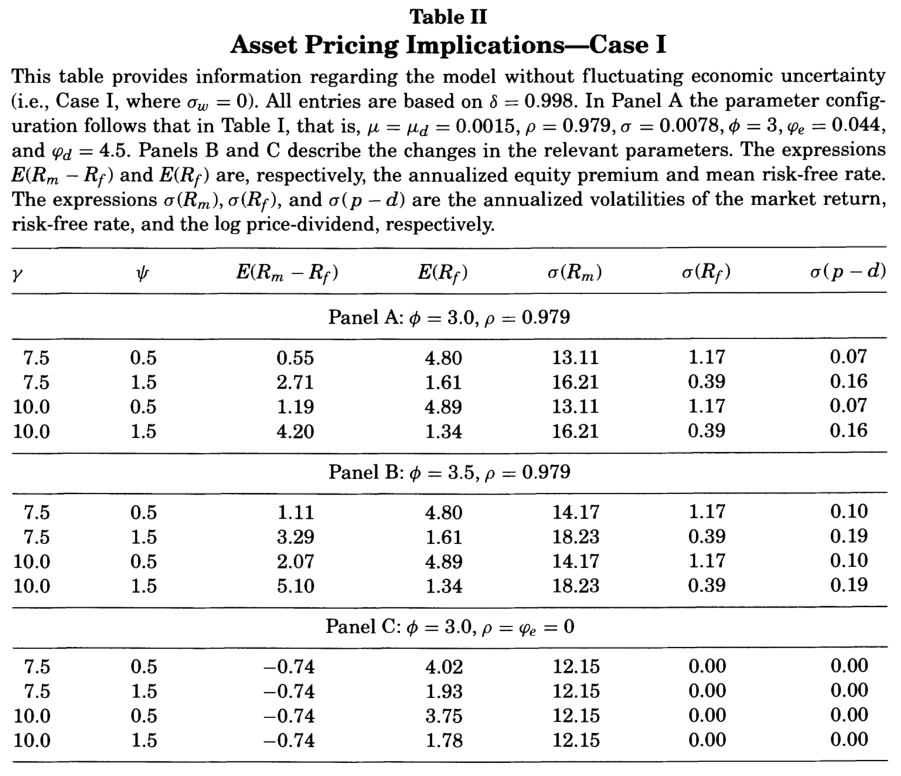
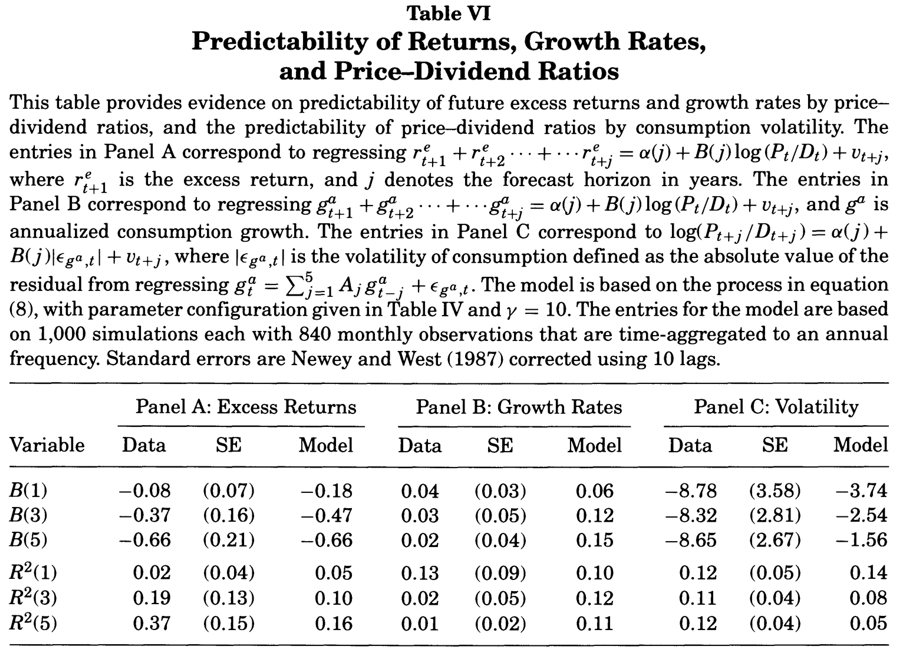

# A detour through structural approaches {#Structural}

## Basics of Structural Approaches: C-CAPM

*Structural models* link the stochastic discount factor (SDF) to investor behavior through assumptions about preferences. Investors make portfolio decisions to obtain a desired time and risk profile of consumption. Loosely speaking, the SDF $\mathcal{M}_{t,t+1}$ captures the aspects of utility that matter for valuing the assets. A seminal example is that of the consumption capital asset pricing model, or CCAPM (see, e.g., @Merton_1973 and @BREEDEN1979265). The CCAPM extends the CAPM framework by providing a consumption-based theory of the determinants of the valuation of the market portfolio.

In the basic CCAPM version, a representative investor with time-additive preferences operates in a complete market. It has been extended in several directions to account for more complex investor preferences (e.g., Epstein-Zin see XXX), investor heterogeneity, incomplete markets, borrowing restrictions.

Consider a representative agent maximizing her expected utility:
$$
U_t = \mathbb{E}_t \left[ \sum_{j=0}^\infty \delta^j u(C_{t+j}) \right],
$$
where $u$ is a utility function of consumption and $\delta$ is the subjective time discount factor ($\ne$ SDF). The budget constraint of the agent is
$$
C_t + \sum_i w_{i,t} P_{i,t} \le \sum_i w_{i,t-1}\underbrace{(P_{i,t}+D_{i,t})}_{x_{i,t}} + Y_t,
$$
where $Y_t$ is her labor income at date $t$. The first-order condition (FOC) for intertemporal utility optimization yields, for asset $i$:^[This FOC states that the agent indifferent between investing an additional infinitesimal amount of asset $i$ or not.]
\begin{equation}
P_{i,t} = \mathbb{E}_t \left[ \delta \frac{u'(C_{t+1})}{u'(C_{t})} x_{i,t+1} \right] = \mathbb{E}_t \left[ \mathcal{M}_{t,t+1} x_{i,t+1} \right],(\#eq:pricingcapm)
\end{equation}
where $\mathcal{M}_{t,t+1}$ is the stochastic discount factor:
$$
\boxed{\mathcal{M}_{t,t+1}=\delta \dfrac{u'(C_{t+1})}{u'(C_{t})}.}
$$
Since $u'$ is a decreasing function, the lower $C_{t+1}$, the higher the SDF. Formula \@ref(eq:pricingcapm} implies that those assets whose payoffs are high during recessions (low $C_{t+1}$) are more expensive. As @Cochrane_2005 puts it, the SDF can be seen as a measure of hunger: "Good" assets pay off well in bad times, when investors are hungry. Investors all want them, which drive up their price, and thereby lower their average returns.

The CCAPM is a simple model; it is easy to test once a form for $u$ has been posited. It turns out it is difficult to reconcile with the data. In particular:

* Fitting average excess return implies implausible risk aversions (*equity puzzle*).
* The resulting risk-free short-term rate is too large unless risk aversion is small (*interest-rate puzzle*).
* It suggests maximum Sharpe ratios that are far too low [@Hansen_Jagannathan_1991].


:::{.example #powerU name="Power utility function"}

A power utility function is defined as follows:
$$
u(C_t) = \frac{C_t^{1-\gamma}}{1 - \gamma}.
$$
In that case $\gamma$ has two interpretations:

* *Relative Risk Aversion (RRA)* (see Definition \@ref(def:RAmeasures)): aversion to variability *across states of nature*.
* *Intertemporal Elasticity of Substitution*  (see Definition \@ref(def:IES)): aversion to variability *across time*.

This is illustrated by Figure \@ref(fig:RRAIESCCAPM), that can concern two situations:

* Consider an agent whose consumption (on next period) can take two values $C_l= 0.8$ or $C_h= 1.2$, each with a probability of 0.5. Figure \@ref(fig:RRAIESCCAPM) shows the associated *expected* utility.
* Consider a case with no uncertainty, and with $\delta=1$. There are two periods: 0 and 1. One consumes $C_l=0.8$ at date 0 and  $C_h=1.2$ at date 1. Figure \@ref(fig:RRAIESCCAPM) shows the associated *intertemporal* utility.

```{r RRAIESCCAPM, echo=FALSE, fig.cap="Power utility situation. Illustration of the RRA or the IES.", fig.asp = .6, out.width = "95%", fig.align = 'left-aligned', message=FALSE}

C.l <- .8
C.h <- 1.2
cc <- c(C.l,C.h)

par(mfrow=c(1,2))
par(plt=c(.25,.9,.2,.85))

C <- seq(.7,1.5,by=.01)

gamma <- 2
E.u <- mean(cc^(1-gamma)/(1-gamma))
c.CE <- (E.u*(1-gamma))^(1/(1-gamma))
U <- C^(1-gamma)/(1-gamma)
plot(C,U,type="l",lwd=2,
     xlab="Consumption",ylab="Utility",
     main=expression(paste(gamma,"=2",sep="")))
points(cc,cc^(1-gamma)/(1-gamma),pch=19,col="blue",cex=1.5)
lines(cc,cc^(1-gamma)/(1-gamma),col="blue")
lines(c(c.CE,mean(cc)),c(E.u,E.u),lty=1,col="dark grey",lwd=1)
lines(c(c.CE,c.CE),c(-1000,E.u),lty=1,col="dark grey",lwd=1)
lines(c(mean(cc),mean(cc)),c(-1000,1/(1-gamma)),lty=1,col="dark grey",lwd=1)
points(c(1,1),c(mean(cc^(1-gamma)/(1-gamma)),1/(1-gamma)),col="red",pch=19)
lines(c(1,1),c(mean(cc^(1-gamma)/(1-gamma)),1/(1-gamma)),col="red")
rp <- - mean(cc^(1-gamma)/(1-gamma)) + 1/(1-gamma)
text(x = 1.2,y=1/(1-gamma) - .2,
     labels = paste("Risk premium = ",toString(round(mean(cc)-c.CE,2)),sep=""),
     col="red")
lines(c(mean(c(c.CE,1)),1.2),c(C[1]^(1-gamma)/(1-gamma),1/(1-gamma) - .22),col="red")

gamma <- 10
E.u <- mean(cc^(1-gamma)/(1-gamma))
c.CE <- (E.u*(1-gamma))^(1/(1-gamma))
U <- C^(1-gamma)/(1-gamma)
plot(C,U,type="l",lwd=2,
     xlab="Consumption",ylab="Utility",
     main=expression(paste(gamma,"=10",sep="")))
points(cc,cc^(1-gamma)/(1-gamma),pch=19,col="blue",cex=1.5)
lines(cc,cc^(1-gamma)/(1-gamma),col="blue")
lines(c(c.CE,mean(cc)),c(E.u,E.u),lty=1,col="dark grey",lwd=1)
lines(c(c.CE,c.CE),c(-1000,E.u),lty=1,col="dark grey",lwd=1)
lines(c(mean(cc),mean(cc)),c(-1000,1/(1-gamma)),lty=1,col="dark grey",lwd=1)
points(c(1,1),c(mean(cc^(1-gamma)/(1-gamma)),1/(1-gamma)),col="red",pch=19)
lines(c(1,1),c(mean(cc^(1-gamma)/(1-gamma)),1/(1-gamma)),col="red")
rp <- - mean(cc^(1-gamma)/(1-gamma)) + 1/(1-gamma)
text(x = 1.2,y=1/(1-gamma) - 1,
     labels = paste("Risk premium = ",toString(round(mean(cc)-c.CE,2)),sep=""),
     col="red")
lines(c(mean(c(c.CE,1)),1.2),c(C[1]^(1-gamma)/(1-gamma),1/(1-gamma) - 1.05),col="red")

```
:::

:::{.definition #RAmeasures name="Risk aversion measures"}
Consider a utility function $u$.

* The *absolute risk aversion* is defined by:
$$
ARA = - \frac{u''(C)}{u'(C)}.
$$
* The *relative risk aversion* is defined by:
$$
RRA = - \frac{C u''(C)}{u'(C)}.
$$
If $u$ is concave, both measures are positive.
:::

:::{.definition #IES name="Intertemporal Elasticity of Substitution"}
The *Intertemporal Elasticity of Substitution (IES)* is defined as the change in consumption growth per change in the interest rate, that is:
$$
IES = \frac{d \log\left( \dfrac{C_{t+1}}{C_{t}}\right)}{d r} = - \frac{d \log\left( \dfrac{C_{t+1}}{C_{t}}\right)}{d\log\left(\dfrac{u'(C_{t+1})}{u'(C_{t})}\right)}.
$$
:::

Case of the isoelastic, or power, utility function. The isoelastic, or power, utility function defined by: $u:$ $C \rightarrow \dfrac{C^{1 - \gamma}-1}{1-\gamma}$ has a constant RRA of $\gamma$.

Consider an agent whose wealth is $W$. She can invest in an asset whose price is 1 and whose payoff is $1+\varepsilon$ with probability $1/2$ and $1/(1+\varepsilon)$ with probability $1/2$. Her utility function is denoted by $u(.)$.

We want to compute the optimal share of wealth, denoted by $\alpha$, invested in the asset. The expected utility is:
$$
\frac{1}{2}u\left(C(1-\alpha)+C\alpha(1+\varepsilon)\right) + \frac{1}{2}u\left(C(1-\alpha)+C\alpha/(1+\varepsilon)\right).
$$
Taking the second-order Taylor expansion of the previous expression and letting $\varepsilon$ tend to zero, it appears that one has to maximize the following expression:
$$
\alpha u'(C) + \frac{1}{2}C \alpha^2 u''(C).
$$
Hence, the utility is maximized for:
$$
\alpha = - \frac{u'(C)}{C u''(C)} = \frac{1}{RRA}.
$$


Using Eq. \@ref(eq:MRCov)---that also applies in the present context---we get the following average excess return:
\begin{eqnarray*}
\mathbb{E}_t(R_{i,t+1} - R_{f,t}) &=& - (1 + R_{f,t}) \mathbb{C}ov_t\left(\delta \dfrac{u'(C_{t+1})}{u'(C_{t})},R_{i,t+1}\right)\\
&\approx& (1 + R_{f,t}) \delta \gamma  \mathbb{C}ov_t\left(\Delta c_{t+1},R_{i,t+1}\right),
\end{eqnarray*}
where $\Delta c_{t+1} = \log(C_{t+1}/C_t)$.
Because consumption is smooth, the covariance $\mathbb{C}ov_t\left(\Delta c_{t+1},R_{i,t+1}\right)$ is relatively small.
Hence, in order to replicate large average excess return, $\gamma$ has to be big (see last two columns of the following table, from @Campbell_1999).


```{r Campbell1, fig.align = 'center', out.width = "100%", fig.cap = "Source: Campbell (1999).", echo=FALSE}
knitr::include_graphics("figures/table_campbell1999_eqpuzzle.png")
```


For sake of comparison: microeconomic study points to estimates of $\gamma$ in $[1,3]$ (e.g., @Hartley_Lanot_Walker_2014).
**Equity premium puzzle** put forward by @Mehra_Prescott_1985.
@Kandel_Stambaugh_1991: Maybe that risk aversion is very high indeed?
But then, another substantial problem arise: If people are very risk averse, they want to transfer consumption from high levels to low levels.
In order to allow for a 2\% average increase in $C_t$, the model predicts that average short-term rate should be high (to prevent people from borrowing too much). Such high interest rates are at odds with the data.
**Risk-free rate puzzle**.


In the case of the power utility function, the risk aversion is the inverse of the Intertemporal Elasticity of Substitution (Def. \@ref(def:IES)):
$$
\mbox{High risk aversion} \Leftrightarrow \mbox{Low IES}.
$$
For given values of the risk-free rates $R_{f,t}$, a decrease in the IES (increase in $\gamma$) leads people to make consumption smoother (see Example \@ref(exm:IESsmooth)).
$$
\frac{1}{1+R_{f,t}} \approx \mathbb{E}_t(\delta (1 - \gamma \Delta c_{t+1}))
$$
Hence, for the very large values of $\gamma$ necessary to fit average equity excess returns, agents strongly want to smoothen consumption.
To reconcile a high risk aversion this with the observed low real interest rate observed on average, it must be that investors are infinitely patients (*risk-free rate puzzle*):
If $\gamma=10$, $R_{f,t} \approx 0\%$ and $\Delta c_{t+1} \approx 2\%$, then $\delta \approx 1.25$, which is not reasonable.


:::{.example #IESsmoothing name="IES and smoothing behavior"}

The agents have a wealth of 1 unit that they consume over two periods. If they consume $C_1$ in period, they consume $(1+R)(1-C_1)$ in period 2. They feature power-utility time-separable preferences with $\delta=1$ and $R=5\%$.

The optimization of the intertemporal utility of the agents imply that $1/(1+R)=(C_2/C_1)^{-\gamma}$. Hence, the lower the IES, the smoother the consumption path.

```{r IESsmooth, echo=FALSE, fig.cap="Power utility situation. IES and consumption smoothing.", fig.asp = .6, out.width = "95%", fig.align = 'left-aligned', message=FALSE}

par(mfrow=c(1,1))
par(plt=c(.2,.8,.2,.95))

# Illustration of IES and smoothing
W <- 1
delta <- 1
R <- .05

gamma <- 1.5
C1 <- W * (1 + R) / ((1/delta * 1/(1+R))^(-1/gamma) + (1+R))
C2 <- (W - C1) * (1 + R)
plot(c(C1,C2),pch=19,xlab="Period",ylab="Consumption",ylim=c(.50,.53))
lines(c(C1,C2))
gamma <- 5
C1 <- W * (1 + R) / ((1/delta * 1/(1+R))^(-1/gamma) + (1+R))
C2 <- (W - C1) * (1 + R)
points(c(C1,C2),pch=19,col="red")
lines(c(C1,C2),col="red")
gamma <- 50
C1 <- W * (1 + R) / ((1/delta * 1/(1+R))^(-1/gamma) + (1+R))
C2 <- (W - C1) * (1 + R)
points(c(C1,C2),pch=19,col="blue")
lines(c(C1,C2),col="blue")

legend("topright", # places a legend at the appropriate place c("Health","Defense"), # puts text in the legend
       c(expression(paste(gamma,"=1.5"," (IES=2/3)",sep="")),
         expression(paste(gamma,"=5"," (IES=1/5)",sep="")),
         expression(paste(gamma,"=50"," (IES=1/50)",sep=""))
       ),
       pt.bg = c("black","red","blue"),
       lty=c(1,1), # gives the legend appropriate symbols (lines)
       lwd=c(2,2), # line width
       pch=c(19,19,19),
       col=c("black","red","blue"), # gives the legend lines the correct color and width
       seg.len = 4
)
```

:::


A third problem pertains to the volatility of the SDF

XXX We have
\begin{eqnarray*}
P_{i,t} = \underbrace{\frac{1}{1 + R_{f,t}} \mathbb{E}_t(x_{i,t+1})}_{\mbox{Discount.  expect. payoff}} + \mathbb{V}ar_t(M_{t,t+1}) \underbrace{\frac{\mathbb{C}ov_t(M_{t,t+1},x_{i,t+1})}{\mathbb{V}ar_t(M_{t,t+1})}}_{\mbox{Risk exposure}}
\end{eqnarray*}
or
\begin{equation}
\boxed{\mathbb{E}_t(R_{i,t+1} - R_{f,t}) = - (1 + R_{f,t}) \mathbb{C}ov_t(M_{t,t+1},R_{i,t+1}).}(\#eq:MRCov)
\end{equation}

@Grossman_Shiller_1981 and @Hansen_Jagannathan_1991: Sharpe ratios give lower bounds to the volatility of SDF:
$$
\frac{\sigma_t(\mathcal{M}_{t,t+1})}{\mathbb{E}_t(\mathcal{M}_{t,t+1})} \ge \underbrace{\frac{\mathbb{E}_t(R_{i,t+1}-R_{f,t})}{\sigma_t(R_{i,t+1})}}_{\mbox{Sharpe ratio of asset $i$.}}
$$
(results from Eq. \@ref(eq:MRCov), using the fact that $\mathbb{C}ov(X,Y) \le \sigma(X)\sigma(Y)$)
For postwar U.S. stock market, the Sharpe ratio is about 50\% [Table \@ref(fig:Campbell1)]. Given that $\mathbb{E}_t(\mathcal{M}_{t,t+1}) \approx 1$, this implies that the volatility of the SDF should be at least 50\%.
For a power utility function [Def. \@ref(def:RAmeasures)]:
$$
\mathcal{M}_{t,t+1}=\delta (C_t/C_{t+1})^\gamma \approx (1 - \gamma \Delta c_{t+1}).
$$
Given the small volatility of $\Delta c_{t+1}$ [column $\sigma(\Delta c)$ in Table \@ref(fig:Campbell1)], $\gamma$ should be very high for the SDF volatility to be equal to 50\%.


Econometric Test of the C-CAPM: GMM


@Hansen_Singleton_1982 have developed and used the General Method of Moments to test the C-CAPM.
This approach is based on the equation [Eq. \@ref(eq:pricingcapm)]:
\begin{equation}
1 = \color{red}{\mathbb{E}_t}\left( \delta \left(\frac{C_t}{C_{t+1}}\right)^\gamma (1+R_{i,t+1})\right).(\#eq:momentcondi)
\end{equation}
For this to be verified, we must have, for any variable $z_t$:
\begin{equation}
\color{red}{\mathbb{E}}\left( \underbrace{\left[\delta \left(\frac{C_t}{C_{t+1}}\right)^\gamma (1+R_{i,t+1}) - 1\right] z_t}_{h_{t+1}}\right) = 0,(\#eq:GMM)
\end{equation}
If this is not the case, one can use $z_t$ to predict $\delta \left(\frac{C_t}{C_{t+1}}\right)^\gamma (1+R_{i,t+1})$ and Eq. \@ref(eq:momentcondi) is not valid. Moment condition: $\mathbb{E}(h_{t+1})=0$.


Empirical counterpart of the moment condition \@ref(eq:GMM):
\begin{equation}
\frac{1}{T}\sum_{t=1}^{T} \left[\hat\delta \left(\frac{C_t}{C_{t+1}}\right)^{\hat\gamma} (1+R_{i,t+1}) - 1\right] \times\underbrace{z_{j,t}}_{\mbox{instrument}} = 0.
\end{equation}
In order to identify $\delta$ and $\gamma$, one need at least two such equations (with some $z_{1,t}$ and $z_{2,t}$).
@Hansen_Singleton_1982 used lagged values of $R_{i,t+1}$ as instruments. [New York Stock Exchange indexes + indexes for different industries]

If we have more than 2 equations, we are in a situation of over-identification. One can use over-identifying restrictions to test for the model.

Economically meaningful estimates with $\gamma$ ($=-\hat\alpha$ in the table below) close to unity (although with a large standard error) and $\delta$ ($=\hat\beta$ in the table below) slightly smaller than unity.
However, when applied to more than one stock index, the over-identifying restrictions are generally rejected. The data reject the simple version of CCAPM.

```{r HansenSinfgleton1982, fig.align = 'center', out.width = "100%", fig.cap = "Source: Hansen and Singleton (1982).", echo=FALSE}
knitr::include_graphics("figures/tableHansenSingleton82A.png")
```


[Web interface](https://jrenne.shinyapps.io/APModels)


Long-run horizon

Stocks and consumption are more correlated at low frequencies (see, e.g., this [web interface](https://jrenne.shinyapps.io/APModels)). Hence equity-premium puzzle a little less strong for longer horizons (e.g., @DANIEL_MARSHALL_1997).
@Jagannathan_Wang_2007: CAPM not so bad when using fourth-quarter over fourth-quarter non-durable and service consumption [see next slide].

Explanation?: A lot of purchases happen at Christmas, with an annual planning horizon (monthly horizon is maybe not relevant).

Time aggregation = Spurious effect [Slide \@ref(slide:spuriousXS}]? Maybe. But average excess returns line up  $\Rightarrow$ there is something here.

@Parker_Julliard_2005: study whether the 25 Fama-French portfolios can be priced when considering their exposure to "long-run" consumption risk. Formally, they study the condition:
$$
1 = \mathbb{E}_t \left( \beta \left(\frac{C_{t+k}}{C_t}\right)^{- \gamma} (1 + R_{i,t+1})(1 + R_{f,t+1})\times (1 + R_{f,t+k-1}) \right).
$$


C-CAPM: That bad?


*Should we completely discard C-CAPM and the likes?*

@Cochrane_2005: The failure of the C-CAPM models is quantitative, not qualitative. In particular:

* Signs are consistent: since stock returns are positively correlated to consumption growth, the premiums have to be positive (which they are).
* The decrease in bond term premiums over the last decades is consistent with decrease in the correlation between long-term bond excess returns and consumption [e.g.,[web interface](https://jrenne.shinyapps.io/APModels)].
* In terms of signs, the CAPM is also consistent with currency risk premiums [see SLIDE FX]:

@Lustig_Verdelhan_2007 show that high interest rate currencies depreciate on average when domestic consumption growth is low $\Rightarrow$ the CAPM predicts higher average return for investments in foreign high-interest rate currencies.


```{r fredCorrel, echo=FALSE, fig.cap="Consumption-Inflation correlation. Growth rates are 2-year growth rates. Dynamic correlation is computed using a 7-year rolling window.", fig.asp = .6, out.width = "95%", fig.align = 'left-aligned', message=FALSE}
library(fredr)
fredr_set_key("df65e14c054697a52b4511e77fcfa1f3")
start_date <- as.Date("1959-01-01"); end_date <- as.Date("2023-10-01")
f <- function(ticker){
  fredr(series_id = ticker,
        observation_start = start_date,observation_end = end_date,
        frequency = "m",aggregation_method = "avg")
}
CONSO <- f("PCE")
CPI   <- f("CPIAUCSL")
vec_dates <- as.Date(CONSO$date)
CONSO <- CONSO$value
CPI   <- CPI$value

h <- 24
T <- length(CPI)
conso     <- 100*(12/h)*log(CONSO[(h+1):T]/CONSO[1:(T-h)])
inflation <- 100*(12/h)*log(CPI[(h+1):T]/CPI[1:(T-h)])

# Compute rolling correlations
correla <- NaN*inflation
rwindow <- 12*7
for(t in (rwindow+1):(T-h)){
  correla[t] <- cor(conso[(t-rwindow+1):t],inflation[(t-rwindow+1):t])
}

par(mfrow=c(2,1))
par(plt=c(0.1,0.9,0.3,0.95))
layout(matrix(c(1,2)), heights=c(2, 1))

plot(vec_dates[(h+1):T],conso,type='l',
     ylim=c(-2,12),col="black",lty=1,lwd=2,cex.axis=.8,cex=.8,las=1,
     ylab="",xlab="")
lines(vec_dates[(h+1):T],inflation,col="red",lwd=2)

legend("topright",
       c("Consumption growth","Inflation rate"),
       lty=c(1,1), # gives the legend appropriate symbols (lines)
       lwd=c(2,2), # line width
       col=c("black","red"), # gives the legend lines the correct color and width
       cex=.8# size of the text
)
plot(vec_dates[(h+1):T],correla,col="blue",type="l",lwd=2,ylim=c(-1,1)
     ,ylab="",xlab="",cex.axis=.8,cex=.8,las=1,
     main="Correlation between consumption growth and inflation")
abline(h=0,lty=2)
text(vec_dates[120],-.25,labels="Supply shocks prevail",cex=.9)
text(vec_dates[120],+.25,labels="Demand shocks prevail",cex=.9)

```


## Recursive Utilities and Epstein-Zin Preferences

Given the problems of the consumption-based models, one has questioned the utility function (e.g., @Cochrane_2005). The functional form is not really an issue: in the time-separable framework, linearized and non-linearized models behave relatively similarly. (Utility functions are monotonously increasing with negative second order derivatives.) What about the arguments of the utility function?

**Idea**: The marginal utility of consumption may not depend only on today's consumption. Pricing implications are very different when the marginal utility of consumption depends past or (expected) future consumption.


:::{.definition #EUTSpref name="Expected Utility Time-Separable Preferences"}

In the context of *expected utility time-separable preferences*, the intertemporal utility $U_t$ is defined as:
$$
U_t = \mathbb{E}_t\left(\sum_{i=0}^{\infty} \delta^{i}u(C_{t+i})\right),
$$
or, equivalently, as:
$$
U_t = u(C_t) + \delta \mathbb{E}_t\left(U_{t+1}\right).
$$
:::

Implications of expected utility time-separable preferences:

* No premium for early resolution of uncertainty.
* As of date $t$, the promise to know $C_{t+h}$ at date $t+1$ has no value.
* No utility effect of potential autocorrelation in $C_t$.
* Each stream of consumption intervenes independently from the others in the utility computation.


What does *non-separability over time* means?

That the marginal utility of today's consumption depends on past consumption. In other words, what you consumed yesterday can have an impact on how you feel about more consumption today.^[As @Cochrane_2005 puts it: "*Yesterday's pizza lowers the marginal utility for another pizza today.*")]

A first example is that of *habit formation* [@Campbell_Shiller_1999]
\begin{equation}
U_t = \sum_{s=t}^{\infty} \delta^{s-t} u(C_s - X_s) \quad where \quad X_t = \rho X_{t-1} + \lambda C_t.(\#eq:Uhabit_nonstoch)
\end{equation}

The date-$t$ utility associated with a level of consumption $C_t$, that is $u(C_t - X_t)$, is lower is you already had a high level of consumption at date $t-1$ (high $X_t$).
$$
U_t = \sum_{h=0}^{\infty} \delta^{h}u\left(C_{t+h} - \lambda \sum_{j=0}^\infty \rho^j C_{t+h-j}\right).
$$

A fall in consumption hurts after a few years of good times (even if the same level of consumption would have been very pleasant if it arrived after a few bad years).

Without the external habit assumption, the Euler equation (equilibrium relationship between risk-free short-term rate and marginal utilities) is far less tractable:
\begin{eqnarray*}
&& 0 = \Delta U_t / \varepsilon =\\
&& \underbrace{ - u'\left(C_{t} - \lambda \sum_{j=0}^\infty \rho^j C_{t-j}\right) + \lambda  \sum_{h=0}^{\infty} \rho^h \delta^{h}u'\left(C_{t+h} - \lambda \sum_{j=0}^\infty \rho^j C_{t+h-j}\right)}_{\mbox{decrease in utility stemming from lower consumption at date $t$}} +\\
&& \underbrace{\delta(1+R_{f,t}) u'\left(C_{t+1} - \lambda \sum_{j=0}^\infty \rho^j C_{t+1-j}\right) - \lambda (1+R_{f,t}) \sum_{h=1}^{\infty} \rho^h \delta^{h}u'\left(C_{t+h} - \lambda \sum_{j=0}^\infty \rho^j C_{t+h-j}\right)}_{\mbox{increase in utility stemming from higher consumption at date $t+1$}}
\end{eqnarray*}

(Formula derived in the context where we decrease $C_t$ by $\varepsilon$ and increase $C_{t+1}$ by $\varepsilon(1+R_{f,t})$.)


If one assumes that $X_t$ is exogenous (external habits) and if $u(Z)=Z^{1-\gamma}/(1-\gamma)$ (Def. \@ref(def:power)) then:
\begin{equation}
\mathcal{M}_{t,t+1} = \delta \left( \frac{C_{t+1}}{C_t} \right)^{-\gamma}\left( \frac{S_{t+1}}{S_t} \right)^{-\gamma},(\#eq:Mhabit)
\end{equation}
where $S_t = (C_t - X_t)/C_t$.
This extends the standard power utility case by adding an additional state variable ($X_t$).
In this model, recessions are periods where consumption is closer to habits (otherwise it is higher).
Specification of the SDF as in Eq. \@ref(eq:Mhabit) can arise in more general contexts (not necessarily habits); $S_t$ may for instance reflect a business-cycle-related variable.


:::{.example #habit name="Comparisons of situations according to habit preferences"}

To illustrate, consider the following context (with no uncertainty):
$$
\delta = 1,\quad \gamma = 3, \quad \rho = 0.5, \quad \lambda = 0.49.
$$
Let's define two sequences of interest rates (A and B):
\begin{eqnarray*}
R^{(A)}_1 &=&R^{(A)}_2 =\dots=R^{(A)}_5 =  7\% \\
R^{(A)}_6 &=&R^{(A)}_7 =R^{(A)}_8 =  -20\%
\end{eqnarray*}
and
$$
R^{(B)}_1 =R^{(B)}_2 =\dots=R^{(B)}_{10} =  2.5\%.
$$
For each sequence, we compute the resulting sequence of consumption, with $C_1=1$.
Results on next slide.

```{r Habits1, echo=FALSE, fig.cap="Comparison of scenarios A and B using habit-based preferences.", fig.asp = .6, out.width = "95%", fig.align = 'left-aligned', message=FALSE}

delta <- 1
lambda <- .49
rho <- .5
gamma <- 3

r.f <- c(rep(0.07,5),c(-.2,-.2,-.2))

T <- length(r.f)
C <- 1
C.t <- C
X <- lambda * C /(1-rho)
#X <- lambda
X.t <- X
U <- delta * (C.t - X.t)^(1 - gamma)/(1 - gamma)
U.no.habit <- delta * (C.t)^(1 - gamma)/(1 - gamma)
for(t in 1:(T)){
  C.t <- 1/(1-lambda) * ((1/delta * 1/(1+r.f[t]))^(-1/gamma) * (C.t - X.t) + rho * X.t)
  C <- c(C,C.t)
  X.t <- rho * X.t + lambda * C.t
  X <- c(X,X.t)
  U <- U + delta * (C.t - X.t)^(1 - gamma)/(1 - gamma)
  U.no.habit <- U.no.habit + delta * (C.t)^(1 - gamma)/(1 - gamma)
  #print(c(t, delta * (C.t)^(1 - gamma)/(1 - gamma)))
}
U1 <- U
U1.no.habit <- U.no.habit
C1 <- C
X1 <- X
R.f.1 <- r.f

r.f <- c(rep(0.025,8))

T <- length(r.f)
C <- 1
C.t <- C
X <- lambda * C /(1-rho)
#X <- lambda
X.t <- X
U <- delta * (C.t - X.t)^(1 - gamma)/(1 - gamma)
U.no.habit <- delta * (C.t)^(1 - gamma)/(1 - gamma)
for(t in 1:(T)){
  C.t <- 1/(1-lambda) * ((1/delta * 1/(1+r.f[t]))^(-1/gamma) * (C.t - X.t) + rho * X.t)
  C <- c(C,C.t)
  X.t <- rho * X.t + lambda * C.t
  X <- c(X,X.t)
  U <- U + delta * (C.t - X.t)^(1 - gamma)/(1 - gamma)
  U.no.habit <- U.no.habit + delta * (C.t)^(1 - gamma)/(1 - gamma)
  #print(c(t, delta * (C.t)^(1 - gamma)/(1 - gamma)))
}
U2 <- U
U2.no.habit <- U.no.habit
C2 <- C
X2 <- X
R.f.2 <- r.f

par(mfrow=c(1,3))
par(plt=c(.15,.9,.15,.85))

plot(R.f.1,col="blue",lwd=2,pch=19,ylim=c(-.25,.13),
     main=expression(paste("Short-term interest rate ",R[f*","*t],sep="")),xlab="time",ylab="")
lines(R.f.1,col="blue")
points(R.f.2,col="red",pch=19)
lines(R.f.2,col="red")

legend("topright", # places a legend at the appropriate place c("Health","Defense"), # puts text in the legend
       c("Scenario A","Scenario B"),
       lty=c(1,1), # gives the legend appropriate symbols (lines)
       lwd=c(2,2), # line width
       pch=c(19,19),
       col=c("blue","red"), # gives the legend lines the correct color and width
       seg.len = 4
)

plot(C1,col="blue",lwd=2,pch=19,ylim=c(1,1.01),
     main=expression(paste("Consumption ",C[t],sep="")),xlab="time",ylab="")
lines(C1,col="blue")
points(C2,col="red",pch=19)
lines(C2,col="red")

plot(C1-X1,col="blue",lwd=2,pch=19,ylim=c(0.01,0.025),
     main=expression(C[t]-X[t]),xlab="time",ylab="")
lines(C1-X1,col="blue")
points(C2-X2,col="red",pch=19)
lines(C2-X2,col="red")

```

The utility associated to Scenario A ($-10779$) is lower than that associated to Scenario B ($-10542$).
Without the $X_t$ term, the utility of Scenario A would be higher than that of Scenario B.

:::


### Limitations of the Habit Models for Long-Horizons


The models based on Eq. \@ref(eq:Mhabit) generally works well in the short-run but not in the long-run. Let us consider the horizon-$h$ SDF:
$$
\mathcal{M}_{t,t+h} = \delta \left( \frac{C_{t+h}}{C_t} \right)^{-\gamma}\left( \frac{S_{t+h}}{S_t} \right)^{-\gamma},
$$
In order to generate a high maximum Sharpe ratio for long horizons, we need a high conditional volatility of $\mathcal{M}_{t,t+h}$.
If $c_t$ follows a random walk, the volatility of $\left( \frac{C_{t+h}}{C_t} \right)^{-\gamma}$ is approximately linear in $h$.
By contrast, if $S_t^{-\gamma}$ is stationary, then the conditional volatility of $\left( \frac{S_{t+h}}{S_t} \right)^{-\gamma}$ does not increase indefinitely with $h$ (though this term may substantially contribute to the short-run SDF volatility).
[$\Rightarrow$] For long-run horizons, these models do not solve the problems pertaining to the standard power utility time-separable model.


@Epstein_Zin_1989 have proposed a framework where

* there is a premium for early resolution and
* the time composition of risk matters.

:::{.definition #EZ name="Epstein and Zin (1989) Preferences"}

Epstein-Zin preferences are defined recursively over current (known) consumption and a certainty equivalent
$R_t(U_{t+1})$ [Def. \@ref(def:CE)] of future utility:
$$
U_{t} = F(C_t,R_t(U_{t+1})),
$$
where $R_t(U_{t+1})$, the certainty equivalent of $U_{t+1}$, is:
$$
R_t(U_{t+1}) = G^{-1}[\mathbb{E}_t(G(U_{t+1}))],
$$
where $F$ and $G$ are increasing and concave functions, and where $F$ is homogenous of degree one.
:::


> We have $R_t(U_{t+1})=\mathbb{E}_t(U_{t+1})$ if $G$ is linear.

> We have $R_t(U_{t+1})=U_{t+1}$ if $U_{t+1}$ is not random.

Standard functions $F$ and $G$ (with $\rho$ and $\gamma$ $>0$):
$$
F(c,v) = \left((1-\delta)c^{1-\rho} + \delta v^{1-\rho}\right)^{\frac{1}{1-\rho}}, \quad G(x)=\frac{x^{1-\gamma}}{1-\gamma},
$$
In this case:
\begin{equation}
\boxed{	U_t = \left((1-\delta)C_t^{1-\rho}+\delta \left[\underbrace{ \mathbb{E}_t\left(U_{t+1}^{1-\gamma}\right)^{\frac{1}{1-\gamma}} }_{\mbox{certainty equivalent}}\right] ^{1-\rho}\right)^{\frac{1}{1-\rho}}.}(\#eq:EZpreferences)
\end{equation}
or
$$
U_t = \left((1-\delta)C_t^{1-\rho} + \delta R_t(U_{t+1})^{1-\rho}\right)^{\frac{1}{1-\rho}}.
$$
where $R_t(U_{t+1})=\mathbb{E}_t(U_{t+1}^{1-\gamma})^{\frac{1}{1-\gamma}}$.

> **Case $\gamma = \rho$**. If $\gamma = \rho$, $U_t^{1-\rho}=(1-\delta)C_t^{1-\rho} + \delta \mathbb{E}_t(U_{t+1}^{1-\rho})$.
Divide by $1-\rho$ and replace $U_t^{1-\rho}/(1-\rho)$ by $W_t$
[$\Rightarrow$] Back to the expected utility case [see Def. \@ref(def:EUTSpref)].


### Epstein-Zin Preferences and Risk Aversion


$\gamma$ is the *relative risk aversion* [Def. \@ref(def:RAmeasures)] parameter.
Consider the following context:

* At date 0, the agent consumes $C_0$.
* At date 1, he consumes $C_h$ (high) with probability $1/2$ and $C_l$ (low) with probability $1/2$.
* In the subsequent periods, he consumes 0.

We have $U_2 = 0$ and
$$
U_1 = U_h = (1-\delta)^{\frac{1}{1-\rho}}C_h \mbox{ with probability 1/2}
$$
and
$$
U_1 = U_l = (1-\delta)^{\frac{1}{1-\rho}}C_l \mbox{ with probability 1/2}.
$$
Therefore
$$
U_0 =  \left((1-\delta)C_0^{1-\rho} + \delta \left(\frac{1}{2}U_h^{1-\gamma}+\frac{1}{2}U_l^{1-\gamma}\right)^{\frac{1-\rho}{1-\gamma}}\right)^{\frac{1}{1-\rho}}.
$$


What is the certainty equivalent $C_1$ to the period-1 gamble? $C_1$ solves:
$$
U_0 = \left((1-\delta)C_0^{1-\rho} + \delta (1-\delta) C_1^{1-\rho}\right)^{\frac{1}{1-\rho}},
$$
that is:
$$
C_1 = \left(\frac{1}{2}C_h^{1-\gamma}+\frac{1}{2}C_l^{1-\gamma}\right)^{\frac{1}{1-\gamma}}.
$$
This certainty equivalent is the same as the one that one would get if the utility function was the standard (time-separable) power utility function (with RRA $= \gamma$).
[$\Rightarrow$] $\gamma$ measures agents' relative risk aversion.

Consider the case with two periods ($0$ and $1$) and where $C_0=0$. We have (up to a multiplicative factor):
$$
U_0 = \left\{\mathbb{E}_0(C_{1}^{1-\gamma})\right\}^{\frac{1}{1-\gamma}}.
$$
At date 1, the agent will consume $C_1 = \kappa(1+X)$, where $X \sim \mathcal{N}(0,\sigma^2)$ and $\sigma^2<<1$. We have
\begin{eqnarray*}
U_0 &=& \left\{\mathbb{E}_0(C_{1}^{1-\gamma})\right\}^{\frac{1}{1-\gamma}}\\
&=& \left\{\mathbb{E}_0(\exp([1-\gamma]\ln(C_1)))\right\}^{\frac{1}{1-\gamma}}\\
&\approx& \left\{\mathbb{E}_0(\exp([1-\gamma][\ln(\kappa) + X - X^2/2 + o(X^2)]))\right\}^{\frac{1}{1-\gamma}}\\
&\approx& \kappa \left\{\mathbb{E}_0(\exp([1-\gamma][X-X^2/2 + o(X^2)]))\right\}^{\frac{1}{1-\gamma}}\\
&\approx& \kappa (1-\gamma\sigma^2/2).
\end{eqnarray*}
[$\Rightarrow$] $\gamma$: measure of risk aversion.


### Epstein-Zin Preferences and IES


In the deterministic context,
$$
U_t = \left((1-\delta)C_t^{1-\rho} + \delta U_{t+1}^{1-\rho}\right)^{\frac{1}{1-\rho}}.
$$
And, setting $W_t = U_t^{1-\rho}/(1-\rho)$, we have:
$$
W_t = (1-\delta)\frac{C_t^{1-\rho}}{1-\rho} + \delta W_{t+1} = (1-\delta)\frac{C_t^{1-\rho}}{1-\rho} + \delta(1-\delta)\frac{C_{t+1}^{1-\rho}}{1-\rho} + \delta^2 W_{t+2}.
$$
Maximizing $U_t$ is equivalent to maximizing $W_t$. In that context, one can show that:
$$
\frac{1}{1+ R_{f,t}}=\delta \left(\frac{C_{t+1}}{C_t}\right)^{-\rho}.
$$
Hence, as for the standard power utility case, one obtains that $IES = 1/\rho =: \psi$ [IES Def. \@ref(def:IES)].


> Crucially, with Epstein-Zin preferences, the risk aversion ($\gamma$) and the IES ($\psi=1/\rho$) are controlled by two independent parameters.


### Epstein-Zin Preferences and the Time Composition of Risk

Let's compare two lotteries:

* **Lottery A**: There is single draw at $t=1$. It pays starting at t = 1 either $C_h$ at all future dates (probability of 1/2), or $C_l$ at all future dates (probability of 1/2).
* **Lottery B**: In each period $t = 1, 2, \dots$, this lottery pays $C_h$ with probability 1/2 or $C_l$ with probability 1/2, the outcomes ($t = 1, 2, \dots$) are i.i.d.

We also assume that $C_0=0$.

Intuitively, plan A looks more "risky" than plan B.
Plan A: all eggs in one basket; Plan B: more diversified.
If all payoffs were realized at the same time, risk aversion would imply a preference for plan B (even in the standard time-separable expected utility model).
However, if the payoffs arrive at different dates, the standard time-separable expected utility model implies indifference between A and B.


With time-separable utility functions, agents would be indifferent between playing the two lotteries. The reason is that the time-separable model evaluates risks at different dates in isolation [@Piazzesi_Schneider_2007]. From the perspective of time zero, random consumption at any given date---viewed in isolation---does have the same risk (measured, for example, by the variance.) For Epstein-Zin preferences (and other recursive preference schemes), the *time-composition of risk* matters.


Let's first consider Lottery A. At date $t=1$, there will be no uncertainty any more. It is easily seen that, if one draws $C_i$ ($i \in \{l,h\}$) at date 1, then $U_1^A = C_i$. Hence
\begin{equation}
U_0^A =  \left(\delta \left(\frac{1}{2}C_h^{1-\gamma}+\frac{1}{2}C_l^{1-\gamma}\right)^{\frac{1-\rho}{1-\gamma}}\right)^{\frac{1}{1-\rho}}= \delta^{\frac{1}{1-\rho}} \left(\frac{1}{2}C_h^{1-\gamma}+\frac{1}{2}C_l^{1-\gamma}\right)^{\frac{1}{1-\gamma}}.(\#eq:U0A)
\end{equation}
For lottery B, at each period ($t\ge1$), there are two possible utility outcomes: $V_h$ or $V_l$.
Specifically, if, at date 1, we get $C_i$ ($i \in \{l,h\}$), the utility is:
\begin{equation}
U_1^B = V_i = \left((1-\delta)C_i^{1-\rho} + \delta \left(\frac{1}{2}V_h^{1-\gamma}+\frac{1}{2}V_l^{1-\gamma}\right)^{\frac{1-\rho}{1-\gamma}}\right)^{\frac{1}{1-\rho}}(\#eq:ABCD)
\end{equation}
and, for date 0:
$$
U_0^B =  \left(\delta \left(\frac{1}{2}V_h^{1-\gamma}+\frac{1}{2}V_l^{1-\gamma}\right)^{\frac{1-\rho}{1-\gamma}}\right)^{\frac{1}{1-\rho}}= \delta^{\frac{1}{1-\rho}}\left(\frac{1}{2}V_h^{1-\gamma}+\frac{1}{2}V_l^{1-\gamma}\right)^{\frac{1}{1-\gamma}}.
$$


Let's compare $U_0^A$ and $U_0^B$, i.e.,
$$
\left(\frac{1}{2}C_h^{1-\gamma}+\frac{1}{2}C_l^{1-\gamma}\right)^{\frac{1}{1-\gamma}}
\overset{?}{\ge \le}
\left(\frac{1}{2}V_h^{1-\gamma}+\frac{1}{2}V_l^{1-\gamma}\right)^{\frac{1}{1-\gamma}}.
$$
Consider the case $\gamma > 1$. We have then:
\begin{eqnarray*}
U_0^A \le U_0^B &\Leftrightarrow& \left(\frac{1}{2}C_h^{1-\gamma}+\frac{1}{2}C_l^{1-\gamma}\right)^{\frac{1}{1-\gamma}} \le \left(\frac{1}{2}V_h^{1-\gamma}+\frac{1}{2}V_l^{1-\gamma}\right)^{\frac{1}{1-\gamma}}\\
&\Leftrightarrow& \frac{1}{2}C_h^{1-\gamma}+\frac{1}{2}C_l^{1-\gamma} \ge \frac{1}{2}V_h^{1-\gamma}+\frac{1}{2}V_l^{1-\gamma},
\end{eqnarray*}
which is verified because $C_l \le V_l \le V_h \le C_h$ and because, when $\gamma > 1$, then $x\rightarrow x^{1-\gamma}$ is convex.


### Epstein-Zin Preferences and Early Resolution Uncertainty

Two new lotteries: C and D; 3 periods are involved: 0, 1 and 2.
The consumption of dates 1 and 2 are determined by independent tosses of a fair coin: either $C_l$ or $C_h$.
The difference between Lotteries C and D pertains to the date on which the information about the tosses is revealed: in Lottery C, the outcomes of the two tosses are revealed at date 1. in Lottery D, the $2$nd toss is not revealed before date $2$.
In both cases, we have $U_2 = (1-\delta)^{\frac{1}{1-\rho}}C_{2}$.
At date 1, we have:
\begin{eqnarray*}
U_1^C &=& \left((1-\delta)C_1^{1-\rho} + \delta U_2^{1-\rho}\right)^{\frac{1}{1-\rho}}\\
U_1^D &=& \left((1-\delta)C_1^{1-\rho} + \delta \mathbb{E}(U_2^{1-\gamma})^{\frac{1-\rho}{1-\gamma}}\right)^{\frac{1}{1-\rho}}.
\end{eqnarray*}
And, therefore:
\begin{eqnarray*}
U_0^C &=& \delta^{\frac{1}{1-\rho}} \mathbb{E}({U_1^C}^{1-\gamma})^{\frac{1}{1-\gamma}}\\
U_0^D &=& \delta^{\frac{1}{1-\rho}} \mathbb{E}({U_1^D}^{1-\gamma})^{\frac{1}{1-\gamma}}.
\end{eqnarray*}

Lottery C: *early resolution of uncertainty* (compared to D).
The difference between $U_0^C$ and $U_0^D$ measures the preference for early resolution of uncertainty.
One can show that agents prefer early resolution of uncertainty iff $RRA = \gamma > 1/IES = \rho$ (e.g., @Epstein_Fahri_Strzalecki_2014 or @Duffie_Epstein_1992).
Simulations: $C_l = 0.8$, $C_h = 1.2$, $\delta = 0.5$.

```{r EZresolution, echo=FALSE, fig.cap="Comparison of scenarios C and D illustrating the preference for early resolution of uncertainty.", fig.asp = .6, out.width = "95%", fig.align = 'left-aligned', message=FALSE}

par(mfrow=c(1,3))
par(plt=c(.15,.9,.2,.8))

for(rho in c(.5,.9,1.5)){

all.gamma.values <- seq(.1001,6,by=.1)
all.C.minus.D.values <- NULL

for(gamma in all.gamma.values){
  c.h <- 1.2
  c.l <- .8
  beta <- .5

  U.2.h <- (1 - beta)^(1/(1-rho)) * c.h
  U.2.l <- (1 - beta)^(1/(1-rho)) * c.l

  U.1.C.hh <- ((1-beta)*c.h^(1-rho) + beta * U.2.h^(1-rho))^(1/(1-rho))
  U.1.C.hl <- ((1-beta)*c.h^(1-rho) + beta * U.2.l^(1-rho))^(1/(1-rho))
  U.1.C.lh <- ((1-beta)*c.l^(1-rho) + beta * U.2.h^(1-rho))^(1/(1-rho))
  U.1.C.ll <- ((1-beta)*c.l^(1-rho) + beta * U.2.l^(1-rho))^(1/(1-rho))

  U.0.C <- (1 - beta)^(1/(1-rho)) * (.25 * U.1.C.hh^(1-gamma) +.25 * U.1.C.hl^(1-gamma) +
                                       .25 * U.1.C.lh^(1-gamma) +.25 * U.1.C.ll^(1-gamma)
  )^(1/(1-gamma))

  E.U2gamma <- .5 * U.2.h^(1 - gamma) + .5 * U.2.l^(1 - gamma)

  U.1.D.h <- ((1-beta)*c.h^(1-rho) + beta * E.U2gamma^((1-rho)/(1-gamma)))^(1/(1-rho))
  U.1.D.l <- ((1-beta)*c.l^(1-rho) + beta * E.U2gamma^((1-rho)/(1-gamma)))^(1/(1-rho))

  U.0.D <- (1 - beta)^(1/(1-rho)) * (.5 * U.1.D.h^(1-gamma) +.5 * U.1.D.l^(1-gamma))^(1/(1-gamma))

  all.C.minus.D.values <- c(all.C.minus.D.values,U.0.C-U.0.D)
}

if(rho==.5){
  plot(all.gamma.values,all.C.minus.D.values,type="l",lwd=2,
       xlab=expression(gamma),ylab="",
       main=expression(paste("Diff. betw. ",U[0]^C," and ",U[0]^D," for ",rho,"=0.50",sep=""))
  )
}
if(rho==.9){
  plot(all.gamma.values,all.C.minus.D.values,type="l",lwd=2,
       xlab=expression(gamma),ylab="",
       main=expression(paste("Diff. betw. ",U[0]^C," and ",U[0]^D," for ",rho,"=0.90",sep=""))
  )
}
if(rho==1.5){
  plot(all.gamma.values,all.C.minus.D.values,type="l",lwd=2,
       xlab=expression(gamma),ylab="",
       main=expression(paste("Diff. betw. ",U[0]^C," and ",U[0]^D," for ",rho,"=1.50",sep=""))
  )
}
abline(v=rho,col="red")
abline(h=0,col="blue",lty=2)
}

```


### The SDF with Epstein-Zin preferences

Consider an asset that provides the payoff $x_{t+1}$ at date $t+1$.
The equilibrium price $\pi_t(x_{t+1})$ of this asset is such that agents are indifferent between buying or not an additional unit $\varepsilon$ of this asset.
That is, $U_t = F(C_t,R_t(U_{t+1}))$ is also equal to:
\begin{eqnarray}
&&  F(C_t,R_t(\color{blue}{U_{t+1}})) \nonumber \\
&=&F(C_t-\varepsilon \pi_t(x_{t+1}),R_t(\color{blue}{F(C_{t+1}+\varepsilon x_{t+1},R_{t+1}(U_{t+2}))})).(\#eq:SDFV)
\end{eqnarray}
This implies:
$$
\pi_t(x_{t+1}) = \mathbb{E}_t \left( x_{t+1} \mathcal{M}_{t,t+1} \right),
$$
where $\mathcal{M}_{t,t+1}$ is given by:
\begin{equation}
\mathcal{M}_{t,t+1}= \delta \left(\frac{C_{t+1}}{C_t}\right)^{-\rho}  \left(\frac{U_{t+1}}{R_{t}(U_{t+1})}\right)^{\rho-\gamma}.(\#eq:SSS)
\end{equation}
:::{.proof}
See Appendix \@ref(SDFEZ).
:::

$\mathcal{M}_{t,t+1}$ is the SDF, or pricing kernel [Def. \@ref(def:sdf)].


Recall that, for all asset $i$ (whose return is $R_{i,t}$), we have (Eq. \@ref(eq:MRCov)):
$$
\mathbb{E}_t(R_{i,t+1} - R_{f,t}) = - (1 + R_{f,t}) \mathbb{C}ov_t(\mathcal{M}_{t,t+1},R_{i,t+1}).
$$
Hence, with Eq. \@ref(eq:SSS), expected returns depend not only on covariances between returns and consumption growth (as in the C-CAPM) but also on covariances between returns and the next period utility index, which captures news about the investor's future prospects.
To make the formula operational, one has to find a proxy for the utility. One can show that this utility is proportional to the value of the "wealth portfolio".
Before looking into it, let's look at the implication of Eq. \@ref(eq:SSS) in the simplified context where $\rho = 1$.


### Pricing Information on Future Consumption Path


Consider the case where $\rho = 1$ and log-normal conditionally homoskedastic consumption (see Appendix XXX of  @Cochrane_2005).

Using $v_t = \log(U_t)$, we have:
$$
v_t = (1 - \delta) c_t + \delta \frac{1}{1 - \gamma} \log \mathbb{E}_t \left(\exp((1-\gamma)v_{t+1})\right).
$$
If $c_t$ is log-normal, one can show that $v_t$ is log-normal as well. Hence:
\begin{eqnarray}
v_t &=& (1 - \delta) c_t + \delta \mathbb{E}_t(v_{t+1}) + \frac{1}{2}\delta (1-\gamma) \sigma^2(v_{t+1})\nonumber \\
&=& (1 - \delta) \left( \sum_{j=0}^{\infty}  \delta^j \mathbb{E}_t (c_{t+j}) \right) + \frac{1}{2}\delta \frac{1-\gamma}{1-\delta} \sigma^2(v_{t+1}) (\#eq:v_rho1).
\end{eqnarray}

Besides, Eq. \@ref(eq:SSS) gives:
\begin{eqnarray*}
m_{t,t+1} &=& \log(\delta) - \rho \Delta c_{t+1} + (\rho - \gamma) \left(v_{t+1} - \frac{1}{1 - \gamma} \log \mathbb{E}_t \left(\exp((1-\gamma)v_{t+1})\right)\right)\\
&=& \log(\delta) - \rho \Delta c_{t+1} + (\rho - \gamma) \left(v_{t+1} - \mathbb{E}_t(v_{t+1}) - \frac{1}{2} \frac{1-\gamma}{1-\delta} \sigma^2(v_{t+1})\right).
\end{eqnarray*}
Therefore ($\mathbb{E}_{t+1} - \mathbb{E}_t$ = "expectation updating" operator):
$$
(\mathbb{E}_{t+1} - \mathbb{E}_t) m_{t,t+1} = - \rho(\mathbb{E}_{t+1} - \mathbb{E}_t) c_{t+1} + (\rho - \gamma) (\mathbb{E}_{t+1} - \mathbb{E}_t) v_{t+1},
$$
which gives, when $\rho = 1$ (using Eq. \@ref(eq:v_rho1)):
\begin{eqnarray}
(\mathbb{E}_{t+1} - \mathbb{E}_t) m_{t,t+1} &=& - (\mathbb{E}_{t+1} - \mathbb{E}_t) c_{t+1} +  \\
&& (1 - \gamma)(1 - \delta) (\mathbb{E}_{t+1} - \mathbb{E}_t) \left(  \sum_{j=1}^{\infty}  \delta^j c_{t+j}  \right).\nonumber
\end{eqnarray}

The previous equation can be rewritten as:
\begin{eqnarray}
&& (\mathbb{E}_{t+1} - \mathbb{E}_t) m_{t,t+1} \nonumber \\
&=& - \gamma(\mathbb{E}_{t+1} - \mathbb{E}_t)\Delta c_{t+1} +  (\#eq:sdfAbc)\\
&&  (1 - \gamma) \times \underbrace{ (\mathbb{E}_{t+1} - \mathbb{E}_t) \left(  \sum_{j=1}^{\infty}  \delta^j \Delta c_{t+1+j}  \right).}_{\mbox{innovation in long-run consumption growth}}\nonumber
\end{eqnarray}
News about future consumption growth affect current SDF (marginal rate of substitution).
[$\Rightarrow$] Shocks that correlate with updates of future consumption growth are "priced".

Assets are priced by covariance with current *and* future consumption growth.


> If consumption is a random walk, then EZ preferences are observationally equivalent to power utility [@Kocherlakota_1990].


Consider the case where $C_0 = C_1 = 1$.
At date $t=1$, one get information about future consumption levels:

* [Case I] With probability 0.50, one will have $C_t=\exp(\omega)$ for $t\ge2$
* [Case II] With probability 0.50, one will have $C_t=\exp(-\omega)$ for $t\ge2$

where $\omega \ge 0$.
Eq. \@ref(eq:sdfAbc) implies that:
$$
m_{0,1} = \mathbb{E}_0(m_{0,1}) + (1 - \gamma)\delta \Delta c_{2}.
$$
(using that $\mathbb{E}_0(\Delta c_{2})=0$ and that $\mathbb{E}_1(\Delta c_{2})=\Delta c_{2}$.)
Assume that $\mathbb{E}_0(m_{0,1})$ is such that $\mathbb{E}_0(\mathcal{M}_{0,1})=\mathbb{E}_0(\exp(m_{0,1}))=1$ (i.e. the risk-free rate is 0).
We consider the price of an asset that provides 1 at date 1 under Case II and 0 under Case I.
The price of this asset is:
$$
\mathbb{E}_t(\mathcal{M}_{t,t+1}\mathbb{I}_{\{Case II\}}) = \frac{1}{2} \times e^{\mathbb{E}_0(m_{0,1}) - (1 - \gamma)\delta \omega} \times 1.
$$


The plots below show the price of this asset for different values of $\gamma$ and $\omega$ ($\delta=0.9$).
With expected utility time-separable preferences [Def. \@ref(def:EUTSpref)] the price of such an asset would be 0.50 (blue dashed line).


```{r EZresolution2, echo=FALSE, fig.cap="Price of an asset that pays 1 under Case II.", fig.asp = .6, out.width = "95%", fig.align = 'left-aligned', message=FALSE}

beta <- .9
gamma <- seq(0.5001,10,by=.1)

par(mfrow=c(1,2))
par(plt=c(.15,.9,.2,.85))

omega <- .05
E.m.0 <- - log(0.5 * exp(beta*(1-gamma)*omega) + 0.5 * exp(-beta*(1-gamma)*omega))
P <- .5 * exp(E.m.0 - beta*(1-gamma)*omega)
P.check <- .5 * exp(E.m.0 + beta*(1-gamma)*omega) + .5 * exp(E.m.0 - beta*(1-gamma)*omega) # should be equal to 1
plot(gamma,P,type="l",lwd=2,
     xlab=expression(gamma),ylab="",
     main=expression(paste(omega," = 0.05",sep="")))
abline(v=1,col="red")
abline(h=0.5,col="blue",lty=2)

omega <- .2
E.m.0 <- - log(0.5 * exp(beta*(1-gamma)*omega) + 0.5 * exp(-beta*(1-gamma)*omega))
P <- .5 * exp(E.m.0 - beta*(1-gamma)*omega)
P.check <- .5 * exp(E.m.0 + beta*(1-gamma)*omega) + .5 * exp(E.m.0 - beta*(1-gamma)*omega) # should be equal to 1
plot(gamma,P,type="l",lwd=2,
     xlab=expression(gamma),ylab="",
     main=expression(paste(omega," = 0.2",sep="")))
abline(v=1,col="red")
abline(h=0.5,col="blue",lty=2)

```


### Rewriting the SDF with Epstein-Zin Preferences


Because $F$ is homogenous of degree one in its arguments ($C_t$ and $R_t(U_{t+1})$), the Euler's theorem yields [@HANSEN20073967]:
\begin{equation}
U_t = C_t \frac{\partial U_t}{\partial C_t} +  R_t(U_{t+1}) \frac{\partial U_t}{\partial R_t(U_{t+1})}.(\#eq:XXYXX)
\end{equation}
Taking the current consumption as numeraire, the wealth $W_t$ is defined by:
\begin{equation}
W_t = 	U_t \frac{\partial U_t}{\partial C_t}.(\#eq:WWWWW)
\end{equation}
Interpretation of $W_t$?

$F$ homogeneous of order 1 $\Rightarrow$ if all future consumption streams are multiplied by $1+\epsilon$, then the utility becomes $(1+\epsilon)U_t$.
Consider the asset that provides $\epsilon C_{t+h}$ at all future periods (if one purchases $\epsilon$ units of it).
Expressed in consumption units, the equilibrium unit price $W_t$ of this asset must satisfy $-\epsilon U_t + \epsilon W_t (\partial U_t / \partial C_t)=0$ $\Rightarrow$ Eq. \@ref(eq:WWWWW).

[$\Rightarrow$] If you want to trade all your future consumption against current consumption, you will consume $W_t$ at date $t$.


$W_t$ can be seen as a consumption-priced virtual asset that delivers aggregate consumption as its dividends on each time period. This asset is called wealth portfolio.
After computation [using Eq. \@ref(eq:XXYXX)]:
\begin{equation}
W_t = \frac{U_t^{1-\rho}C_t^\rho}{1 - \delta}.(\#eq:WWW)
\end{equation}
Let's denote by $R_{a,t+1}$ the return on the wealth portfolio. We have:
\begin{equation}
1+R_{a,t+1} := \frac{W_{t+1}}{W_t - C_t} = \frac{P_{a,t+1}+C_{t+1}}{P_{a,t}},(\#eq:Ra)
\end{equation}
where $P_{a,t} := W_t - C_t$.

Using Eq. \@ref(eq:WWW), it can be shown that:
$$
1+R_{a,t+1} = \left[ \delta \left( \frac{C_{t+1}}{C_t} \right)^{-\rho} \left( \frac{R_t(U_{t+1})}{U_{t+1}} \right)^{1-\rho} \right]^{-1},
$$
which is equivalent to:
$$
\frac{U_{t+1}}{R_t(U_{t+1})} = \left[ \delta (1+ R_{a,t+1}) \left( \frac{C_{t+1}}{C_t} \right)^{-\rho}  \right]^{\frac{1}{1-\rho}}.
$$
Substituting in Eq. \@ref(eq:SSS) gives:
\begin{equation}
\mathcal{M}_{t,t+1} =  \delta^{\theta} (1+R_{a,t+1})^{\theta - 1} \left( \frac{C_{t+1}}{C_t} \right)^{- \frac{\theta}{\psi}}
\end{equation}
where
$$
\theta = \frac{1-\gamma}{1-\rho} \quad and \quad \psi = \frac{1}{\rho}.
$$
Therefore (using $\exp(r_{a,t+1})=1+R_{a,t+1}$):
\begin{equation}
\boxed{\log(\mathcal{M}_{t,t+1}) = \theta \log \delta - \frac{\theta}{\psi} \Delta \log(C_{t+1}) - (1-\theta) r_{a,t+1}.}(\#eq:sdfEZ)
\end{equation}


Let's take the log of Eq. \@ref(eq:Ra):
\begin{eqnarray*}
r_{a,t+1} &=& \log(P_{a,t+1}+C_{t+1}) - \log(P_{a,t})\\
&=& z_{t+1} - z_t + g_{t+1} + \log(1 + C_{t+1} / P_{a,t+1}).
\end{eqnarray*}
where $z_t = \log(P_{a,t}/C_t)$ is the log price-consumption ratio.
Let's denote by $\bar{z}$ the unconditional mean of $z_t$. If $z_t - \bar{z}$ is small, we have:
\begin{eqnarray*}
\log[1 + C_{t+1} / P_{a,t+1}] &=& \log[1 + \exp(-z_{t+1})]\\
&\approx& \log[1 + \exp(-\bar{z})\{1 - (z_{t+1}- \bar{z})\}]\\
&\approx& \log[1 + \exp(-\bar{z}) - \exp(-\bar{z})(z_{t+1}- \bar{z})]\\
&\approx& \log[1 + \exp(-\bar{z})] - \frac{z_{t+1}- \bar{z}}{1 + \exp(\bar{z})}.
\end{eqnarray*}
Therefore:
\begin{equation}
\boxed{r_{a,t+1} \approx \kappa_0 + \kappa_1 z_{t+1} - z_t + g_{t+1},}(\#eq:approxRa)
\end{equation}
where $\kappa_1= \dfrac{\exp(\bar{z})}{1 + \exp(\bar{z})}$ and $\kappa_0 = \log(1 + \exp(\bar{z})) + \kappa_1 \bar{z}$.


For any asset $i$, whose return is $1+R_{i,t+1}$, we have:
\begin{equation}
1 = \mathbb{E}_t(\mathcal{M}_{t,t+1}(1+R_{i,t+1})). \quad \mbox{(Euler equation)}(\#eq:Euler)
\end{equation}
For $1+R_{i,t+1} = 1+R_{a,t+1} = \exp(r_{a,t+1})$, we get:
\begin{equation}
1 = \mathbb{E}_t \left[ \exp\left(\theta \log \delta - \frac{\theta}{\psi} \Delta \log(C_{t+1}) + \theta r_{a,t+1} \right) \right].(\#eq:sdfRa)
\end{equation}
We can substitute the approximation \@ref(eq:approxRa) into the previous equation.

**Solution procedure** @Bansal_Yaron_2004

Conjecture that the log price-consumption ratio $z_t$ is linear in the sate vector.
Use the fact that the Euler equation has to hold for all values of the state variables to solve for $z_t$.

Same methodology can apply to any asset $i$:
\begin{equation}
1 = \mathbb{E}_t \left[ \exp\left(\theta \log \delta - \frac{\theta}{\psi} \Delta \log(C_{t+1}) - (1 - \theta) r_{a,t+1} + r_{i,t+1} \right) \right].(\#eq:sdfRi)
\end{equation}

@Bansal_Yaron_2004 consider the market portfolio ($r_{m,t}$).

If $R_{f,t}$ is the return of the risk-free asset, we have:
$$
\frac{1}{1+R_{f,t}} = \mathbb{E}_t(\mathcal{M}_{t,t+1}).
$$
Taking logs of the Euler equation \@ref(eq:Euler) leads to:
\begin{eqnarray*}
0 &=& \log \left( \mathbb{C}ov_t(\mathcal{M}_{t,t+1},R_{i,t+1}) + \frac{\mathbb{E}_t(1+R_{i,t+1})}{1+R_{f,t}} \right)\\
0 &=& \log \left(  \frac{\mathbb{E}_t(1+R_{i,t+1})}{1+R_{f,t}} \right) + \log \left( 1 + \frac{\mathbb{C}ov_t(\mathcal{M}_{t,t+1},R_{i,t+1})}{\frac{\mathbb{E}_t(1+R_{i,t+1})}{1+R_{f,t}}} \right).
\end{eqnarray*}
If $1+R_{f,t}=\exp(r_{i,t+1})$ and $1+R_{i,t+1}=\exp(r_{i,t+1})$ are close to one:
$$
\mathbb{E}_t(R_{i,t+1}-R_{f,t}) \approx\log \left(  \frac{\mathbb{E}_t(1+R_{i,t+1})}{1+R_{f,t}} \right).
$$
Then
\begin{eqnarray*}
\mathbb{E}_t(R_{i,t+1}-R_{f,t}) &\approx& - \mathbb{C}ov_t \left(
\log(\mathcal{M}_{t,t+1}),
\log(1+R_{i,t+1}) \right)\\
&\approx& \underbrace{\frac{\theta}{\psi} \mathbb{C}ov_t( \Delta c_{t+1},r_{i,t+1})}_{\mbox{CCAPM-like}} + \underbrace{(1-\theta) \mathbb{C}ov_t( r_{a,t+1},r_{i,t+1})}_{\mbox{CAPM-like}}.
\end{eqnarray*}

As mentioned before, in the case where consumption is i.i.d., E-Z preferences and expected time-separable utility are observationally equivalent [@Kocherlakota_1990].

But expectations of consumption growth do substantially fluctuate over time [see next slides].

$\Rightarrow$ Necessary condition for E-Z preferences to be relevant.


> Several studies provide evidence of the superiority of survey over other---statistical or market-data-based---methods [e.g.@Ang_Bekaert_Wei_2007 or @Croushore_2010]. @Clements_2010: Survey forecasts are superior over purely model-based forecasts because consensus forecasts incorporate the effects of perceived changes in the long-run outlook.


An Additional Implication of the Epstein-Zin Preferences


We have shown that the CCAPM had difficulties in generating large average excess returns without implying unreasonable risk aversion parameters.
As will be shown later (notably in the @Bansal_Yaron_2004's framework), E-Z preferences can address this problem.
With time-separable utilities, average excess returns (i.e. risk premiums) had to be accounted by the sole correlation between stock returns and current consumption.
With E-Z preferences, another key correlation is that between stock returns and updates about future consumption growth [second term in Eq. \@ref(eq:sdfAbc)].
For this second channel to be relevant, observed excess returns should positively correlate to the updates of expectations of long-term consumption. See Figure \@ref(fig:SPF10yrStock).


```{r SPF10yrStock, fig.align = 'center', out.width = "100%", fig.cap = "Source: Survey of Professional Forecasters (Philadelphia Fed).", echo=FALSE}

```

### Long Run Risk Model


In this section, we present the model and approach proposed by @Bansal_Yaron_2004.
A [web interface](https://jrenne.shinyapps.io/LRRModels) present outputs of the approach. It also allows to simulate the model dynamics and to assess the influence of the parameterization. @Bansal_Yaron_2004 have proposed two models: an homoskedastic one and an heteroskedastic one. Three risk sources in the aggregate consumption dynamics:

* Short-run risk risks in consumption (high frequency),
* Long-run risk risks in consumption (low frequency),
* Fluctuations in consumption uncertainty (heteroskedastic model).

Another key ingredient: Epstein-Zin preferences.

Let's begin with the homoskedastic model.


**Bansal and Yaron (2004), homoskedastic**

@Bansal_Yaron_2004 postulate the following dynamics for the economy:
\begin{eqnarray*}
x_{t+1} &=& \rho_x x_t + \phi_e \sigma e_{t+1}\\
\Delta c_{t+1} = g_{t+1} &=& \mu + x_t + \sigma \eta_{t+1}\\
g_{d,t+1} &=& \mu_d + \phi x_t + \phi_d \sigma u_{t+1},
\end{eqnarray*}
where $e_{t+1},\eta_{t+1},u_{t+1} \sim i.i.d. \mathcal{N}(0,1)$.
$\mu + x_t$: conditional expectation of consumption growth ($g_t$);

$g_{d,t}$: dividend growth rate ($\log(D_{t+1}/D_t)$).
Processes $g_t$ and $g_{d,t}$ are exogenous. The model is solved by finding associated processes $r_{a,t}$ and $r_{m,t}$ that make the model internally consistent:
These returns have to satisfy both Eqs. \@ref(eq:approxRa) and \@ref(eq:sdfRa).
$z_t$ and $z_{m,t}$ are the log price-consumption and price-dividend ratios, respectively, i.e.:
$$
z_t = \log\left(\frac{P_{a,t}}{C_t}\right) \quad and \quad z_{m,t} = \log\left(\frac{P_{m,t}}{C_t}\right).
$$
%(Eq. \@ref(eq:sdfRi) with $r_{i,t}=r_{m,t}$ for $z_{m,t}$)
The price of a claim on aggregate consumption is not observable (return: $R_{a,t}$), contrary to the price of the market portfolio (return: $R_{m,t}$).

Approach:

* Posit that $z_t = A_0 + A_1 x_t$;
* substitute the last expression into Eq. \@ref(eq:approxRa) and
* inject $r_{a,t+1}$ in Eq. \@ref(eq:sdfRa).

This yields to:
\begin{equation}
A_1 = \frac{1- \dfrac{1}{\psi}}{1 - \kappa_1 \rho_x} \quad and \quad A_{1,m} = \frac{\Phi- \dfrac{1}{\psi}}{1 - \kappa_{1,m} \rho_x}.(\#eq:solABY1)
\end{equation}
If the IES $\psi > 1$, then $A_1 > 0$. The price-consumption ratio increases with long-term growth.
In this context, we have (from Eq. \@ref(eq:sdfEZ)):
\begin{eqnarray}
m_{t,t+1} - \mathbb{E}_t(m_{t,t+1}) &=& \left[  - \frac{\theta}{\psi} + \theta - 1\right] \sigma \eta_{t+1} \nonumber\\
&&- (1 - \theta)\left[ \kappa_1 \left( 1 - \frac{1}{\psi}\right) \frac{\phi_e}{1 - \kappa_1 \rho_x} \right]\sigma e_{t+1}\nonumber\\
&=& \lambda_{\eta} \sigma \eta_{t+1} - \lambda_{e} \sigma e_{t+1}.(\#eq:mBY1)
\end{eqnarray}
(Note that $\lambda_{\eta} = -\gamma$.)
The higher $\rho_x$, the higher $\lambda_{e}$.

Consider any asset whose return is $r_{i,t}$, that is: $P_{i,t+1} = \exp(r_{i,t+1})P_{i,t}$. We must have:
$$
P_{i,t} = \mathbb{E}_t(\exp(m_{t,t+1})P_{i,t+1})= \mathbb{E}_t(\exp(m_{t,t+1}+r_{i,t+1})).
$$
Because the dynamics of the state vector is conditionally Gaussian, $m_{t,t+1}+r_{i,t+1}$ is conditionally Gaussian. Hence:
\begin{eqnarray*}
1&=&\mathbb{E}_t\left(e^{m_{t,t+1}+r_{i,t+1}}\right)\\
&=&  \exp\left(\mathbb{E}_t(m_{t,t+1}+r_{i,t+1}) + \frac{1}{2}\mathbb{V}ar_t(m_{t,t+1}+r_{i,t+1})\right)\\
&=&  \exp\left(-r_{f,t}+\mathbb{E}_t(r_{i,t+1}) + \mathbb{C}ov_t(m_{t,t+1},r_{i,t+1}) + \frac{1}{2}\mathbb{V}ar_t(r_{i,t+1})\right).
\end{eqnarray*}
Therefore (particular case of  Eq. \@ref(eq:MRCov)):
\begin{equation}
\mathbb{E}_t(r_{i,t+1}) -r_{f,t} = - \mathbb{C}ov_t(m_{t,t+1},r_{i,t+1}) - \frac{1}{2}\mathbb{V}ar_t(r_{i,t+1}).(\#eq:rpcond)
\end{equation}
The risk premium results from the conditional covariance between $m_{t,t+1}$ and $r_{i,t+1}$, i.e. by the covariance of their innovations $m_{t,t+1} - \mathbb{E}_t(m_{t,t+1})$ and $r_{i,t+1} - \mathbb{E}_t(r_{i,t+1})$.

> **About the solution procedure**. Eq. \@ref(eq:solABY1) shows that the $A_i$s depends on the $\kappa_i$s. Eq. \@ref(eq:approxRa) shows that the $\kappa_i$s depend on $\bar{z}$.
Hence, in particular, $A_0 = f(\bar{z})$. But, in turn, since $z_t = A_0 + A_1 x_t$, we have $\bar{z}=A_0 + A_1 \bar{x}=A_0$. For the model to be internally consistent, we should have $\bar{z}=f(\bar{z})$. Hence, there is a fixed-point problem ($\bar{z}$ cannot be chosen arbitrarily).

:::{.example #PrRiskEZ name="Prices of risk"}
Let us consider an asset whose log return is $\beta\sigma\eta_{t+1}$ at date $t+1$, i.e. $r_{i,t+1}=\beta\sigma\eta_{t+1}$.
Then Eq. \@ref(eq:rpcond) gives:
$$
\mathbb{E}_t(r_{i,t+1}) -r_{f,t} + \frac{1}{2}\beta^2\sigma^2 = - \lambda_{\eta}\beta\sigma^2.
$$
Because $\lambda_{\eta}=-\gamma<0$, $ - \lambda_{\eta}\beta\sigma^2$ is positive if $\beta\ge0$.
$\lambda_\eta$ (resp. $\lambda_{e}$) measures the price of the "$\eta$ risk" (resp. the "$e$ risk").
$\beta$ measures the exposure of stock $i$ to the shock $\eta_{t}$.

:::

Exploiting Eqs. \@ref(eq:approxRa) (for $r_{m,t}$), \@ref(eq:solABY1) and the model dynamics, we get:
\begin{equation}
r_{m,t+1} - \mathbb{E}_t(r_{m,t+1}) = \phi_d  \underbrace{\sigma u_{t+1}}_{\mbox{not "priced"}} + \beta_{m,e}  \underbrace{ \sigma e_{t+1}}_{\mbox{"priced"}},(\#eq:rmErm)
\end{equation}
where $\beta_{m,e} = \kappa_{1,m}\left(\phi - \dfrac{1}{\psi}\right)\dfrac{\phi_e}{1 - \kappa_{1,m} \rho_x}$.
Then, using Eq. \@ref(eq:mBY1), Eq. \@ref(eq:rpcond) gives, for $r_{i,t+1}=r_{m,t+1}$:
\begin{equation}
\mathbb{E}_t(r_{m,t+1} - r_{f,t}) = \beta_{m,e}\lambda_{e} \sigma^2 - 0.5 \mathbb{V}ar_t(r_{m,t}),(\#eq:xsBYhomo)
\end{equation}
where, by Eq. \@ref(eq:rmErm), we have $\quad\mathbb{V}ar_t(r_{m,t})=(\beta_{m,e}^2+\phi_d^2)\sigma^2$.
$\beta_{m,e}$ measure the exposure of stocks to the long-run risk shock $e_t$.
The risk premium increases with $\rho_x$. Similarly, BY show that the volatility of the market return increases with $\rho_x$. [web interface](https://jrenne.shinyapps.io/LRRModels).

**Remnark**: constant $\sigma$ $\Rightarrow$ constant risk premium.


**Bansal and Yaron (2004), heteroskedastic**

@Bansal_Yaron_2004 then introduce conditional volatility in the model:
\begin{eqnarray}
x_{t+1} &=& \rho_x x_t + \phi_e \sigma_t e_{t+1} \nonumber\\
g_{t+1} &=& \mu + x_t + \sigma_t \eta_{t+1} \nonumber\\
g_{d,t+1} &=& \mu_d + \phi x_t + \phi_d \sigma_t u_{t+1} \nonumber\\
\sigma_{t+1}^2 &=& \sigma^2 + \nu_1(\sigma^2_t -\sigma^2) + \sigma_w w_{t+1}, (\#eq:BYheteroscked)
\end{eqnarray}
where $e_{t+1},\eta_{t+1},u_{t+1},w_{t+1} \sim i.i.d. \mathcal{N}(0,1)$.
Here, the posited solution for $z_t$ is:
$$
z_t = A_0 + A_1 x_t + {\color{red}A_2 \sigma^2_t}.
$$
$A_1$ is unchanged. $A_2$ is given by (similar form for $A_{2,m}$):
$$
A_2 = \frac{0.5 \left[ \left(\theta - \dfrac{\theta}{\psi}\right)^2 + (\theta A_1 \kappa_1 \phi_e)^2 \right]}{\theta(1 - \kappa_1 \nu_1)}.
$$
Remark ??? also applies in this context.

The innovation of the SDF is:
\begin{eqnarray}
m_{t,t+1} - \mathbb{E}_t(m_{t,t+1}) = \lambda_{\eta} \sigma_t \eta_{t+1} - \lambda_{e} \sigma_t e_{t+1} - \lambda_{w} \sigma_w w_{t+1},(\#eq:mBY2)
\end{eqnarray}
where $ \lambda_{w} = (1-\theta)A_2 \kappa_1$ and $\lambda_e$ and $\lambda_\eta$ are as in Eq. \@ref(eq:sdfEZ).
In the case of power utility ($\theta = 1$), the third term vanishes.
The innovation of the market return is:
\begin{equation}
r_{m,t+1} - \mathbb{E}_t(r_{m,t+1}) = \phi_d  \underbrace{\sigma_t u_{t+1}}_{\mbox{not "priced"}} + \beta_{m,e}  \underbrace{ \sigma_t e_{t+1}}_{\mbox{"priced"}} + \beta_{m,w}  \underbrace{ \sigma_w w_{t+1}}_{\mbox{"priced"}}.(\#eq:rmErmHetero)
\end{equation}
Then Eq. \@ref(eq:rpcond) gives, for $r_{i,t+1}=r_{m,t+1}$:
\begin{equation}
\mathbb{E}_t(r_{m,t+1} - r_{f,t}) = \beta_{m,e}\lambda_{e} \sigma_t^2 + \beta_{m,w}\lambda_{w} \sigma_t^2 - 0.5 \mathbb{V}ar_t(r_{m,t}).(\#eq:xsBYhetero)
\end{equation}
Increase in volatility $\Rightarrow$ augments excess returns. But this does not reflect increases in dividends $\Rightarrow$ equity prices decrease [Eq. \@ref(eq:dp2)].


Increase in uncertainty $\Rightarrow$ Decrease in prices.


Compared the homoskedastic case [Eq. \@ref(eq:xsBYhomo)], (a) the expected excess return is time-varying and (b) additional term = compensation for stochastic volatility risk in consumption.

ratio of conditional risk premium to the conditional volatility of the market portfolio is time-varying (TV) $\Rightarrow$ TV Sharpe ratio.
Maximal Sharpe ratio $\approx$ conditional volatility of the SDF innovations. It is TV.

The same kind of computation can be carried out for the return of the consumption claim ($r_{a,t}$). We get:
\begin{equation}
r_{a,t+1} - \mathbb{E}_t(r_{a,t+1}) = \sigma_t \eta_{t+1} + \beta_{a,e}  \sigma_t e_{t+1} + \beta_{a,w}  \sigma_w w_{t+1},(\#eq:raEraHetero)
\end{equation}
where $\beta_{a,e}=\kappa_1 A_1 \phi_e$ and $\beta_{a,w}=\kappa_1A_2$.
Eq. \@ref(eq:rpcond) then gives:
\begin{equation}
\mathbb{E}_t(r_{a,t+1} - r_{f,t}) = -\lambda_{\eta} \sigma_t^2 + \beta_{a,e}\lambda_{e} \sigma_t^2 + \beta_{a,w}\lambda_{w} \sigma_t^2 - 0.5 \mathbb{V}ar_t(r_{a,t}).(\#eq:xsaBYhetero)
\end{equation}


The short term rate $r_{f,t}$ is such that $\exp(-r_{f,t})=\mathbb{E}_t(\exp(m_{t,t+1}))$.
Using Eq. \@ref(eq:sdfEZ), we get:
$$
\exp(-r_{f,t})=\mathbb{E}_t\left(\exp\left[\theta \log \delta - \frac{\theta}{\psi} g_{t+1} - (1-\theta) r_{a,t+1}\right]\right).
$$
We have:
\begin{equation}
r_{f,t} = - \theta \log (\delta) + \mathbb{E}_t\left(\frac{\theta}{\psi} g_{t+1}+ (1-\theta)r_{a,t+1} \right) - \frac{1}{2}\mathbb{V}ar_t\left(\frac{\theta}{\psi} g_{t+1} + (1-\theta) r_{a,t+1}\right),
\end{equation}
which, after computation, gives:
\begin{equation}
r_{f,t} = - \log (\delta) + \frac{1}{\psi}\mathbb{E}_t(g_{t+1})+ \frac{1-\theta}{\theta} \mathbb{E}_t(r_{a,t+1}-r_{f,t}) - \frac{1}{2\theta}\mathbb{V}ar_t\left(m_{t,t+1}\right),(\#eq:rfBY)
\end{equation}
where $\mathbb{V}ar_t\left(m_{t,t+1}\right)$ is easily obtained from Eq. \@ref(eq:mBY2) and $\mathbb{E}_t(r_{a,t+1}-r_{f,t})$ is given by Eq. \@ref(eq:xsaBYhetero).

Regressing $r_{f,t}$ on $g_{t+1}$ may give an estimate of $1/\psi$. BY: Time-varying intercept implies a downward bias on $\hat\psi$.


The model-implied time-series properties are consistent with the data.

With persistent expected growth, the model is able to generate sizeable risk premiums, market volatility and fluctuations in price-dividend ratios [Slide XXX].
Larger risk aversion increases the equity premium  [Slide XXX].
In order to match data features, the IES has to be $>1$.

Lowering the IES reduces the elasticity of asset prices to dividends, namely $A_{1,m}$ [Eq. \@ref(eq:solABY1)], which reduces risk premia [web interface](https://jrenne.shinyapps.io/LRRModels).

If the IES is too small, this elasticity becomes negative: rise in dividend growth rate $\Rightarrow$ decreases in prices.

Lower part of the table in Slide XXX: i.i.d. growth rates. Then no correlation between dividend growth and consumption, and $\mathbb{E}_t(r_{m,t+1}-r_{f,t})=-1/2 \mathbb{V}ar_t(r_{m,t+1}) < 0$.

While the time series properties of the model with small persistent expected growth are difficult to distinguish from a pure i.i.d. model, its asset-pricing implications are drastically different.
Evidence in favor of the heteroskedastic model: In particular, relationship between the absolute values of innovations in consumption and the log price-dividend ratio (Table III in @Bansal_Yaron_2004).
Moments implied by the heteroskedastic model are shown in Table IV of @Bansal_Yaron_2004.
[$\Rightarrow$] Good fit of the data first and second moments.
Volatility of the SDF: the persistency of the expected growth rate is key (divided by two when $\rho_x$ is set to 0).
The model replicates the way price-dividend ratios predict excess returns [Slide XXX].


```{r BY1, fig.align = 'center', out.width = "100%", fig.cap = "Source: Bansal and Yaron (2004).", echo=FALSE}

```

```{r BY2, fig.align = 'center', out.width = "100%", fig.cap = "Source: Bansal and Yaron (2004).", echo=FALSE}

```

```{r BY3, fig.align = 'center', out.width = "100%", fig.cap = "Source: Bansal and Yaron (2004).", echo=FALSE}
knitr::include_graphics("figures/table_BY4.png")
```

```{r BY4, fig.align = 'center', out.width = "100%", fig.cap = "Source: Bansal and Yaron (2004).", echo=FALSE}

```


{Empirics of the LRR model: Bansal, Kiku and Yaron (2007)}


@Bansal_Kiku_Yaron_2016 show that their model is supported by cross-section data.
Specifically, they want to see whether their model is able to reproduce the differences in excess returns for small/large and value/growth stocks [Slide XXX].
The model is slightly modified. The process followed by the dividend growth rate associated to stock $i$ is:
$$
g^{(i)}_{d,t+1} = \mu_d^{(i)} + \phi^{(i)} x_t + \pi^{(i)}\sigma_t \eta_{t+1} +  \phi^{(i)} \sigma u_{i,t+1}.
$$
Therefore, in this model, stock prices are also exposed to the short-run consumption growth rate $\eta_t$.

Starting point: $r_{f,t}$ and $z_{m,t}$ are observable.
Both variables are linear in $X_t=[x_t,\sigma_t^2]'$ [SlideXXX} for $r_{f,t}$].
Hence, if one regress $\Delta c_{t+1}$ on $Y_t=[r_{f,t},z_t]$, the residuals are the same as those obtained when regressing $\Delta c_{t+1}$ on $X_t$, i.e. $\sigma_t \eta_{t+1}$.


Besides, $\mathbb{E}_t(\sigma_t^2 \eta_{t+1}^2)=\sigma_t^2$ is also a linear function of $X_t$. Therefore, the fitted values in the regression of $\sigma_t^2 \eta_{t+1}^2$ on $X_t$ provide estimates of $\sigma_t^2$.
Once we have estimates of $x_t$ and $\sigma^2_t$, one can easily get estimates of their respective innovations, $e_t$ and $w_t$.
For stock (or portfolio) $i$, BKY regress $r_{i,t+1}$ on $Y_t$. This provide them with estimates of the expected returns $\mathbb{E}_t(r_{i,t+1})$. The beta's of stock $i$ are then measured as the covariances between $r_{i,t+1}-\mathbb{E}_t(r_{i,t+1})$ and the estimates of the shocks $\eta_t$, $e_t$ and $w_t$ (divided by the variance of these shocks).
100 Fama-French porfolio (10 sizes and 10 book-to-market values); average excess returns are regressed on the beta's.
[$\Rightarrow$] The three beta's explain about 84\% of the cross-sectional variation in mean returns.
Macroeconomic interpretation of the Fama-French pricing factors (change of basis).


```{r BKY1, fig.align = 'center', out.width = "100%", fig.cap = "Source: Bansal, Kiku, and Yaron (2016).", echo=FALSE}
knitr::include_graphics("figures/table_BKY1.png")
```


```{r BKY2, fig.align = 'center', out.width = "100%", fig.cap = "Source: Bansal, Kiku, and Yaron (2016).", echo=FALSE}
knitr::include_graphics("figures/table_BKY2.png")
```


## Appendix

### SDF in the CES Epstein-Zin Context {#SDFEZ}

We denote by $\pi_t(x_{t+1})$ the price of an asset that provides the payoff $x_{t+1}$ at date $t+1$ (as of date $t$, this payoff may be random). If one purchases $\varepsilon$ units of this asset and consumes them at date $t+1$, the intertemporal utility becomes $F(C_t\color{blue}{ - \varepsilon \pi_t(x_{t+1})},R_t(F(C_{t+1}+\color{blue}{\varepsilon x_{t+1}},R_{t+1}(U_{t+2}))))$.

If $\pi_t(x_{t+1})$ is the equilibrium price of the asset, then agents should be indifferent between buying a small amount of this asset and not. That is, we should have:
$$
F(C_t,R_t(F(C_{t+1},R_{t+1}(U_{t+2})))) =
F(C_t {\color{blue} - \varepsilon \pi_t(x_{t+1})},R_t(F(C_{t+1}+{\color{blue}\varepsilon x_{t+1}},R_{t+1}(U_{t+2})))).
$$
Let's compute the first-order Taylor expansion of right-hand side term w.r.t. $\varepsilon$. To begin with, we have:
$$
F(C_{t+1}+{\color{blue}\varepsilon x_{t+1}},R_{t+1}(U_{t+2})) = U_{t+1} + \varepsilon x_{t+1} (1-\beta) C_{t+1}^{-\rho}U_{t+1}^\rho + o(\varepsilon).
$$
Now,
$$
F(C_{t+1}+{\color{blue}\varepsilon x_{t+1}},R_{t+1}(U_{t+2}))^{1-\gamma} = U_{t+1}^{1-\gamma} + \varepsilon x_{t+1}  (1-\beta) C_{t+1}^{-\rho}U_{t+1}^{\rho-\gamma} + o(\varepsilon).
$$
Then,
$$
\mathbb{E}_t \left( F(C_{t+1}+{\color{blue}\varepsilon x_{t+1}},R_{t+1}(U_{t+2}))^{1-\gamma} \right)^{\frac{1}{1-\gamma}}=R_t(U_{t+1}) + \varepsilon R_t(U_{t+1})^{\gamma} \mathbb{E}_t \left(  x_{t+1} (1-\beta) C_{t+1}^{-\rho} U_{t+1}^{\rho-\gamma} \right).
$$
Therefore, $F(C_t{\color{blue} - \varepsilon \pi_t(x_{t+1})},R_t(F(C_{t+1}+{\color{blue}\varepsilon x_{t+1}},R_{t+1}(U_{t+2}))))$ is equal to $F(C_t,R_t(U_{t+1}))+$
$$
\varepsilon R_t(U_{t+1})^{\gamma - \rho} \mathbb{E}_t \left(  x_{t+1} (1-\beta) C_{t+1}^{-\rho} U_{t+1}^{\rho-\gamma} \right) U_t^{\rho}
- \varepsilon \pi_t(x_{t+1}) (1-\beta) C_t^{-\rho} U_t^{\rho} + o(\varepsilon),
$$
which gives \@ref(eq:SS).


