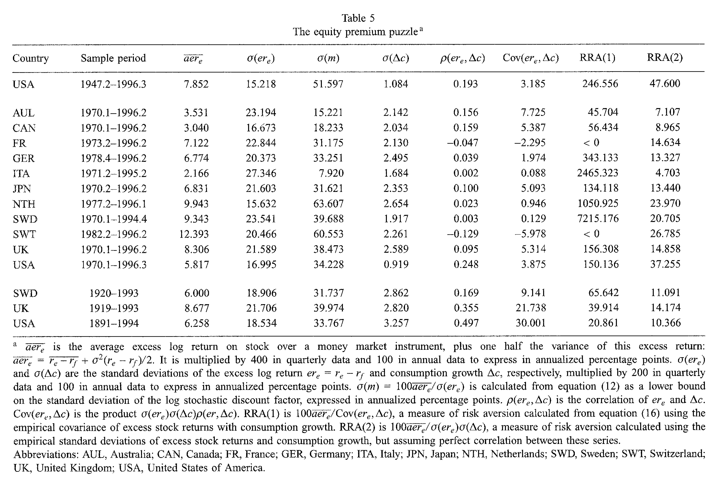
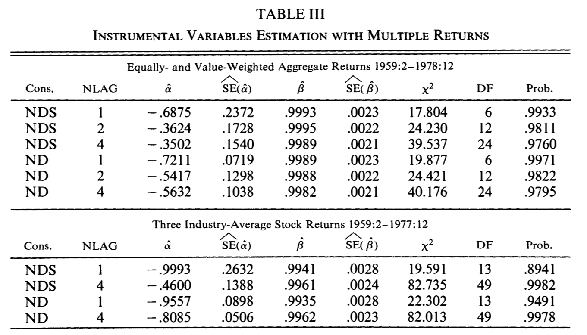
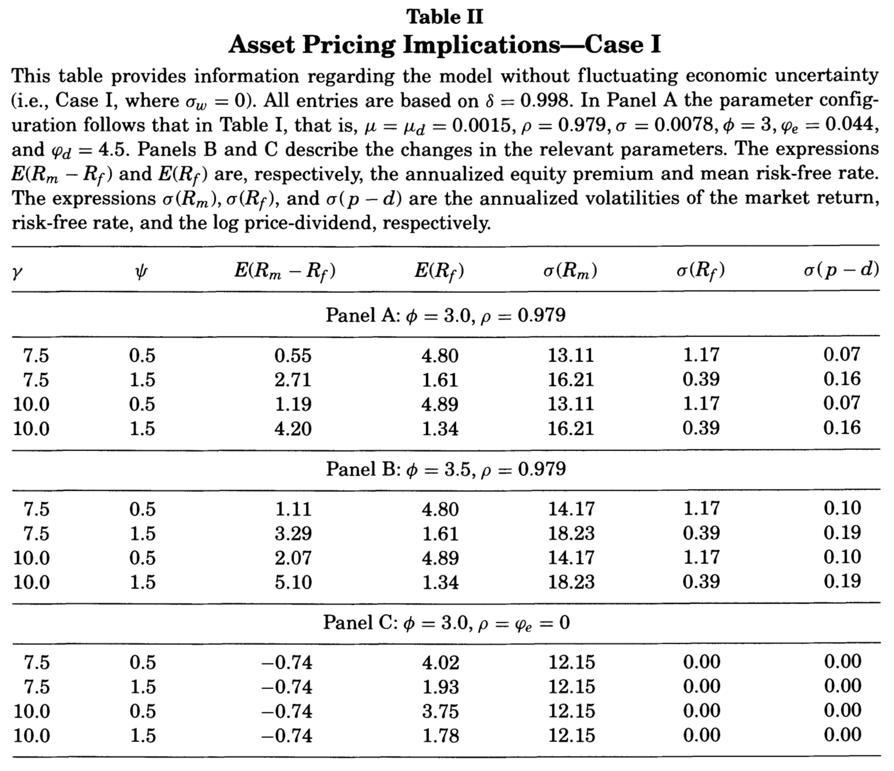
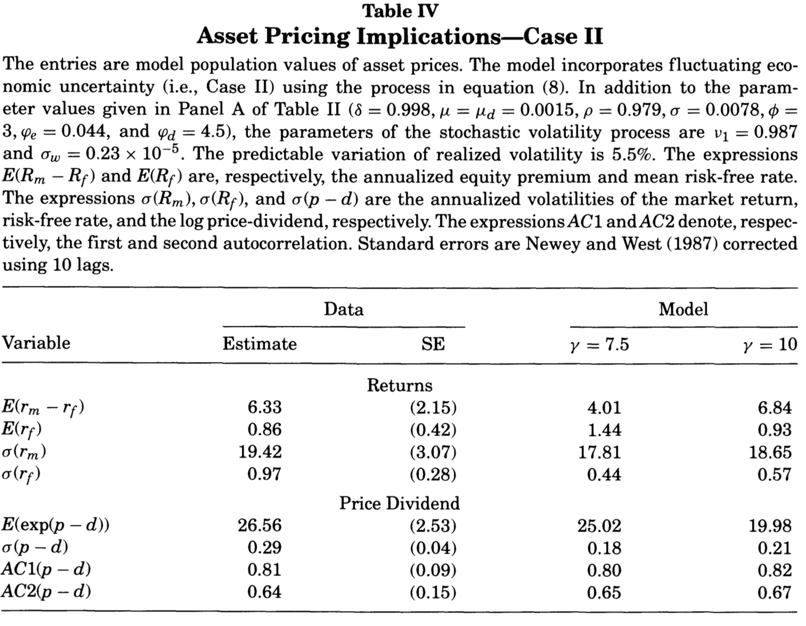
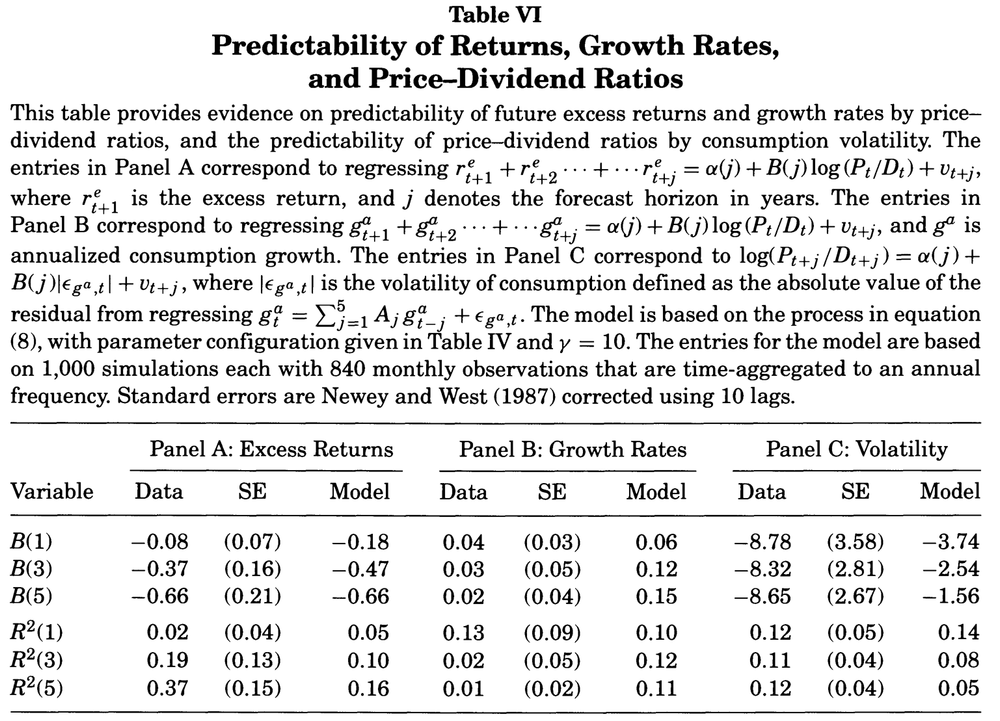
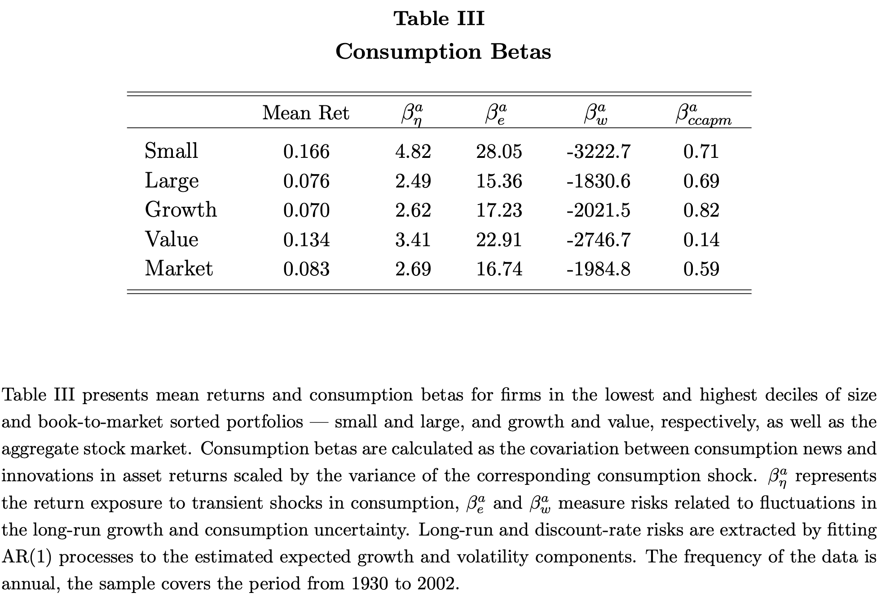
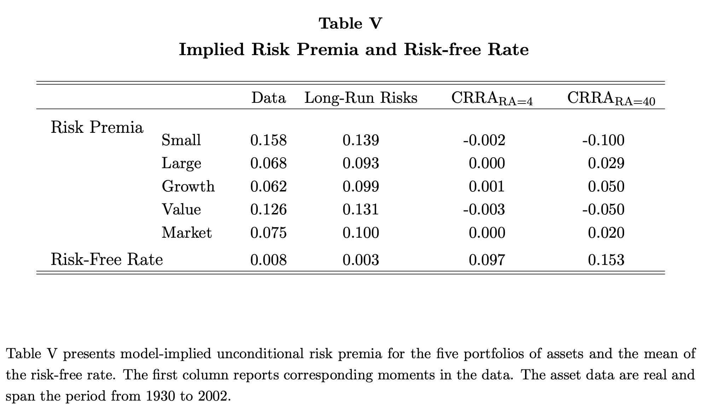

# A detour through structural approaches {#Structural}

This section introduces structural asset-pricing approaches, wherein agents or investors strategically make portfolio decisions to achieve a specific time and risk profile for consumption. We delve into various preference structures, including expected-utility time-separable and recursive models (Subsections \@ref(PricingEquilibrium) and \@ref(PricingEquilibrium), respectively), and analyze their implications. The discussion emphasizes how these preferences play a crucial role in asset pricing, underscoring the significance of the stochastic discount factor (SDF) derived from these distinct preference frameworks. We also discuss an other type of semi-structural approach, based on preferred-habitat theory (Subsection \@ref(PHabitat))

## Consumption-based Capital Asset Pricing Model (CCAPM) and stochastic discount factor (SDF) {#PricingEquilibrium}

An influential illustration of a structural asset-pricing model is the Consumption Capital Asset Pricing Model, commonly referred to as C-CAPM (refer to, for instance, @Merton_1973 and @BREEDEN1979265). Distinguishing itself from the traditional CAPM, the CCAPM offers a consumption-based perspective on the factors influencing the valuation of assets.

### The SDF when agents feature expected-utility time-separable preferences

Consider an economy featuring a single good, whose date-$t$ price is $q_t$. There is a representative agent with an external income $Y_t$ at $t$, and a portfolio of assets, with an allocation vector $\alpha_{t-1}$ (decided at $t-1$). The vector of date-$t$ prices is $p_t$. At any date $t+j$, $j=0,1,\dots$, the agent will face the budget constraint:
\begin{equation}
q_{t+j}C_{t+j}+\alpha'_{t+j}p_{t+j} = Y_{t+j} +
\alpha'_{t+j-1}p_{t+j},(\#eq:BConstr)
\end{equation}
where $C_{t+j}$is her consumption on date $t+j$.

In the standard CCAPM, agents maximize their intertemporal utility that is of the Expected-Utility Time-Separable type (see Def. \@ref(def:EUTSpref)).

:::{.definition #EUTSpref name="Expected-utility time-separable preferences"}
In the context of *expected-utility time-separable preferences*, the intertemporal utility $U_t$ is defined as:
$$
U_t = \mathbb{E}_t\left(\sum_{i=0}^{\infty} \delta^{i}u(C_{t+i})\right),
$$
or, equivalently, as:
$$
U_t = u(C_t) + \delta \mathbb{E}_t\left(U_{t+1}\right).
$$
$U$ is the utility function and $\delta$ is the pure preference for present, or subjective discount factor.
:::

> Importantly, the pure preference for present ($\delta$) is different from the stochastic discount factor (SDF).

The representative agent maximizes her expected utility time-separable preferences (see Definition \@ref(def:EUTSpref)) subject to the budget constraints at $t+j$, $j \ge 0$, see  \@ref(eq:BConstr).

Replacing $C_{t+j}$ with $[Y_{t+j}-(\alpha'_{t+j}-\alpha'_{t+j-1})p_{t+j}]/q_{t+j}$, the objective function becomes:
$$
\mathbb{E}_t  \sum^\infty_{j=0} \delta^j U
[Y_{t+j}/q_{t+j}-(\alpha'_{t+j}-\alpha'_{t+j-1})p_{t+j}/q_{t+j}].
$$
The vector of allocation $\alpha_t$ appears in the first two terms only:
$$
U[Y_t/q_t-(\alpha'_t-\alpha'_{t-1})p_t/q_t] + \delta \mathbb{E}_t
U[Y_{t+1}/q_{t+1}-(\alpha'_{t+1}-\alpha'_t)p_{t+1}/q_{t+1}].
$$
As a result, the first order condition associated with vector $\alpha_t$ reads
$$
\frac{p_t}{q_t}  \frac{d U(C_t)}{dC} = \delta \mathbb{E}_t \left[
\frac{p_{t+1}}{q_{t+1}}  \frac{dU(C_{t+1})}{dC}
\right],
$$
or
\begin{equation}
p_t = \mathbb{E}_t(p_{t+1} \mathcal{M}_{t,t+1}),(\#eq:SDF100)
\end{equation}
where $\mathcal{M}_{t,t+1}$ is a strictly positive scalar called *stochastic discount factor (SDF)* between dates $t$ and $t+1$. We have:
\begin{equation}
\boxed{\mathcal{M}_{t,t+1} \equiv \delta  \frac{q_t}{q_{t+1}}
\frac{  \frac{dU(C_{t+1})}{dC}} {
\frac{dU(C_t)}{dC}}.}(\#eq:SDFCCAPM)
\end{equation}

According to \@ref(eq:SDF100), for any asset $j$:
\begin{equation}
p_{j,t} = \mathbb{E}_t(\mathcal{M}_{t,t+1} p_{j,t+1}).(\#eq:Mbasicpricing)
\end{equation}
Using that $p_{j,t+1} = \mathbb{E}_t(\mathcal{M}_{t+1,t+2} p_{j,t+2})$, we get:
\begin{eqnarray*}
p_{j,t} &=& \mathbb{E}_t[\mathbb{E}_{t+1}(p_{j,t+2}\mathcal{M}_{t+1,t+2})\mathcal{M}_{t,t+1}] \\
&=& \mathbb{E}_t(\mathcal{M}_{t,t+1} \mathcal{M}_{t+1,t+2}p_{j,t+2}).
\end{eqnarray*}
This can be generalized as follows, for $h \ge 1$:
$$
p_{j,t} = \mathbb{E}_t[\mathcal{M}_{t,t+1} \dots \mathcal{M}_{t+h-1,t+h}p_{j,t+h}] = \mathbb{E}_t[\mathcal{M}_{t,t+h}p_{j,t+h}].
$$

Since $u'$ is a decreasing function, \@ref(eq:SDFCCAPM) implies that, the lower $C_{t+1}$, the higher the SDF. Moreover, \@ref(eq:Mbasicpricing) shows that those assets whose payoffs are high during recessions (low $C_{t+1}$) are more valuable. As @Cochrane_2005 puts it, the SDF can be seen as a measure of hunger: "Good" assets pay off well in bad times, when investors are hungry. Investors all want them, which drive up their price, and thereby lower their average returns.

Eq. \@ref(eq:Mbasicpricing) rewrites:
\begin{equation}
p_{j,t} = \mathbb{C}ov_t(\mathcal{M}_{t,t+1},p_{j,t+1}) +\mathbb{E}_t(\mathcal{M}_{t,t+1})\mathbb{E}_t(p_{j,t+1}).(\#eq:covpM1)
\end{equation}

Consider the one-period risk-free bond, whose payoff, on date $t+1$, is 1 unit. The price of this asset, on the current date ($t$) is $\frac{1}{1+R_{f,t}}$---by definition of the short-term risk free rate $R_{f,t}$. Eq. \@ref(eq:Mbasicpricing) gives, for this specific asset:
$$
\frac{1}{1+R_{f,t}} = \mathbb{E}_t(\mathcal{M}_{t,t+1}).
$$
Using this in \@ref(eq:covpM1) gives:
\begin{equation}
p_{j,t} = \mathbb{C}ov_t(\mathcal{M}_{t,t+1},p_{j,t+1}) +\frac{1}{1+R_{f,t}}\mathbb{E}_t(p_{j,t+1}),(\#eq:covpM2)
\end{equation}
that also rewrites:
\begin{equation}
\boxed{\mathbb{E}_t(R_{j,t+1} - R_{f,t}) = - (1 + R_{f,t}) \mathbb{C}ov_t(\mathcal{M}_{t,t+1},R_{j,t+1}),}(\#eq:MRCov)
\end{equation}
where $R_{j,t+1}$ is asset $j$'s return, i.e., $R_{j,t+1} = (p_{j,t+1} - p_{j,t})/p_{j,t}$. The previous formula says that the expected excess return, $\mathbb{E}_t(R_{j,t+1} - R_{f,t})$, is higher for those assets whose returns are low when the SDF is high (and vice versa). In other words, for investors to hold them, assets that are exposed to bad states of the world (i.e., that lose value in bad states of the world) should provide an average excess return.

Another way to look at formula \@ref(eq:covpM2) is:
\begin{eqnarray*}
p_{j,t} = \underbrace{\exp(-i_t) \mathbb{E}_t(p_{j,t+1})}_{\mbox{Discount.  expect. payoff}} + \underbrace{\mathbb{V}ar_t(\mathcal{M}_{t,t+1})}_{\mbox{Price of risk}} \underbrace{\frac{\mathbb{C}ov_t(\mathcal{M}_{t,t+1},p_{j,t+1})}{\mathbb{V}ar_t(\mathcal{M}_{t,t+1})}}_{\mbox{Risk exposure}}.
\end{eqnarray*}

Note that the SDF $\mathcal{M}_{t,t+1}$ that is introduced above is the nominal SDF. This is the SDF that one has to use to evaluate the present value of nominal payoffs ($p_{t+1}$ is a vector of prices expressed in nominal terms, here). One can also define a real SDF. The latter is linked to the former by the following relationship:^[Indeed, if $p_t^*$ is the real price of a given asset, we need to have $p_t^* = \mathbb{E}_t(\mathcal{M}^*_{t,t+1} p^*_{t+1})$, as well as $p_t^* = \mathbb{E}_t\left(\mathcal{M}_{t,t+1} p^*_{t+1}\frac{q_{t+1}}{q_t}\right)$ since the nominal payoff of the considered asset is $p^*_{t+1}\frac{q_{t+1}}{q_t}$.]
\begin{equation}
\mathcal{M}^*_{t,t+1} = \mathcal{M}_{t,t+1}\frac{q_{t+1}}{q_{t}} = \mathcal{M}_{t,t+1}\exp(\pi_{t+1}), (\#eq:NomiRealSDF)
\end{equation}
where $\pi_{t+1}$ denotes the (log) inflation rate between dates $t$ and $t+1$, i.e., $q_{t+1}/q_t=\exp(\pi_{t+1})$.

One can check that, if inflation was deterministic, we would have the Fisher relationship since the real short term rate $r_t$ would satisfy $r_t := -\log \mathbb{E}_t(\mathcal{M}^*_{t,t+1}) = i_t - \pi_{t+1}$ (using that $i_t = -\log \mathbb{E}_t(\mathcal{M}_{t,t+1})$). When inflation is stochastic and if inflation is correlated to the real SDF, then an inflation risk premium arises (even for the one-period maturity).

In the context of the CCAPM, \@ref(eq:SDFCCAPM) and \@ref(eq:NomiRealSDF) give the following real SDF:
\begin{equation}
\boxed{\mathcal{M}_{t,t+1}^* \equiv \delta
\frac{  \frac{dU(C_{t+1})}{dC}} {
\frac{dU(C_t)}{dC}}.}(\#eq:realSDFCCAPM)
\end{equation}


### Risk aversion and intertemporal elasticity of substitution

At that stage, let us introduce the defintion of two metrics that characterize agents' preferences regarding risky income (Def. \@ref(def:RAmeasures)) and intertemporal substitution (Def. \@ref(def:IES)).

:::{.definition #RAmeasures name="Risk aversion measures"}
Consider a utility function $u$.

* The *absolute risk aversion* is defined by:
$$
ARA = - \frac{u''(C)}{u'(C)}.
$$
* The *relative risk aversion* is defined by:
$$
RRA = - \frac{C u''(C)}{u'(C)}.
$$
If $u$ is concave, both measures are positive.
:::

:::{.definition #IES name="Intertemporal Elasticity of Substitution"}
The *Intertemporal Elasticity of Substitution (IES)* is defined as the change in consumption growth per change in the interest rate, that is:
$$
IES = \frac{d \log\left( \dfrac{C_{t+1}}{C_{t}}\right)}{d r} = - \frac{d \log\left( \dfrac{C_{t+1}}{C_{t}}\right)}{d\log\left(\dfrac{u'(C_{t+1})}{u'(C_{t})}\right)}.
$$
:::


### The case of the power utility function

In the standard CCAPM, the utility function is a power utility function:

:::{.definition #CCAPM name="Power utility function"}
A standard utility function is the power utility $u(C) =  \frac{C^{1-\gamma}-1}{1-\gamma}$, where  $\gamma>0$ is the coefficient of relative risk aversion.
:::

The power utility function is such that $u'(C) = C^{-\gamma} > 0$ and $u''(C) = - \gamma C^{-\gamma-1} < 0$. Eq. \@ref(eq:SDFCCAPM) then results in the following stochastic discount factor:
\begin{eqnarray}
\mathcal{M}_{t,t+1} &=&  \frac{q_t}{q_{t+1}} \delta \left(
\frac{C_{t+1}}{C_t} \right)^{-\gamma} \nonumber\\
&=& \exp(\log
\delta + \log q_t + \gamma \log  C_t - \log  q_{t+1} - \gamma
\log  C_{t+1}) (\#eq:powerutilSDF)\\
&=& \exp(\log
\delta - \gamma \Delta  c_{t+1} - \pi_{t+1}),\nonumber
\end{eqnarray}
where $\Delta c_t$ and $\pi_{t}$ denote the (log) consumption growth and inflation rate, respectively.

The vector of asset prices $p_t$ satisfies:
$$
p_t = \delta q_t C^\gamma_t \mathbb{E}_t \left(
\frac{C^{-\gamma}_{t+1}}{q_{t+1}} p_{t+1}
\right),
$$
or (Euler equation):
\begin{eqnarray}
&&\mathbb{E}_t\left[
\delta\left(
\frac{C_{t+1}}{C_t}
\right)^{-\gamma}  \frac{q_t}{q_{t+1}}
\frac{p_{t+1}}{p_t} - 1
\right] = 0 (\#eq:EulerCCAPM)\\
&\Leftrightarrow& \mathbb{E}_t\left[
\delta \exp(-\gamma \Delta c_{t+1} - \pi_{t+1})
\frac{p_{t+1}}{p_t} - 1
\right] = 0. \nonumber
\end{eqnarray}

Here, $\gamma$ has two interpretations:

* It corresponds to the *Relative Risk Aversion (RRA)* (see Def. \@ref(def:RAmeasures)), which measures the aversion to variability *across states of nature*.
* It is the inverse of the *Intertemporal Elasticity of Substitution*  (see Definition \@ref(def:IES)), which measures the aversion to variability *across time*.

This is illustrated by Figure \@ref(fig:RRAIESCCAPM); this figure does indeed correspond to two distinct situations:

* *Situation 1*: an agent faces uncertain consumption (for the next period); she will consume either $C_l= 0.8$ ($50\%$ probability)or $C_h= 1.2$ (same probability). Figure \@ref(fig:RRAIESCCAPM) shows the associated *expected* utility.
* *Situation 2*:  There are two periods: 0 and 1, and $\delta=1$; the agent consumes $C_l=0.8$ at date 0 and  $C_h=1.2$ at date 1. Figure \@ref(fig:RRAIESCCAPM) shows the associated *intertemporal* utility.

```{r RRAIESCCAPM, echo=FALSE, fig.cap="Power utility situation. Illustration of the RRA (left-hand plot) or the IES (right-hand plot).", fig.asp = .6, out.width = "95%", fig.align = 'left-aligned', message=FALSE}

C.l <- .8
C.h <- 1.2
cc <- c(C.l,C.h)

par(mfrow=c(1,2))
par(plt=c(.25,.9,.2,.85))

C <- seq(.7,1.5,by=.01)

gamma <- 2
E.u <- mean(cc^(1-gamma)/(1-gamma))
c.CE <- (E.u*(1-gamma))^(1/(1-gamma))
U <- C^(1-gamma)/(1-gamma)
plot(C,U,type="l",lwd=2,
     xlab="Consumption",ylab="Utility",
     main=expression(paste(gamma,"=2",sep="")))
points(cc,cc^(1-gamma)/(1-gamma),pch=19,col="blue",cex=1.5)
lines(cc,cc^(1-gamma)/(1-gamma),col="blue")
lines(c(c.CE,mean(cc)),c(E.u,E.u),lty=1,col="dark grey",lwd=1)
lines(c(c.CE,c.CE),c(-1000,E.u),lty=1,col="dark grey",lwd=1)
lines(c(mean(cc),mean(cc)),c(-1000,1/(1-gamma)),lty=1,col="dark grey",lwd=1)
points(c(1,1),c(mean(cc^(1-gamma)/(1-gamma)),1/(1-gamma)),col="red",pch=19)
lines(c(1,1),c(mean(cc^(1-gamma)/(1-gamma)),1/(1-gamma)),col="red")
rp <- - mean(cc^(1-gamma)/(1-gamma)) + 1/(1-gamma)
text(x = 1.2,y=1/(1-gamma) - .2,
     labels = paste("Risk premium = ",toString(round(mean(cc)-c.CE,2)),sep=""),
     col="red")
lines(c(mean(c(c.CE,1)),1.2),c(C[1]^(1-gamma)/(1-gamma),1/(1-gamma) - .22),col="red")

gamma <- 10
E.u <- mean(cc^(1-gamma)/(1-gamma))
c.CE <- (E.u*(1-gamma))^(1/(1-gamma))
U <- C^(1-gamma)/(1-gamma)
plot(C,U,type="l",lwd=2,
     xlab="Consumption",ylab="Utility",
     main=expression(paste(gamma,"=10",sep="")))
points(cc,cc^(1-gamma)/(1-gamma),pch=19,col="blue",cex=1.5)
lines(cc,cc^(1-gamma)/(1-gamma),col="blue")
lines(c(c.CE,mean(cc)),c(E.u,E.u),lty=1,col="dark grey",lwd=1)
lines(c(c.CE,c.CE),c(-1000,E.u),lty=1,col="dark grey",lwd=1)
lines(c(mean(cc),mean(cc)),c(-1000,1/(1-gamma)),lty=1,col="dark grey",lwd=1)
points(c(1,1),c(mean(cc^(1-gamma)/(1-gamma)),1/(1-gamma)),col="red",pch=19)
lines(c(1,1),c(mean(cc^(1-gamma)/(1-gamma)),1/(1-gamma)),col="red")
rp <- - mean(cc^(1-gamma)/(1-gamma)) + 1/(1-gamma)
text(x = 1.2,y=1/(1-gamma) - 1,
     labels = paste("Risk premium = ",toString(round(mean(cc)-c.CE,2)),sep=""),
     col="red")
lines(c(mean(c(c.CE,1)),1.2),c(C[1]^(1-gamma)/(1-gamma),1/(1-gamma) - 1.05),col="red")
```

<!-- In the basic CCAPM version, a representative investor with time-additive preferences operates in a complete market. It has been extended in several directions to account for more complex investor preferences (e.g., Epstein-Zin see XXX), investor heterogeneity, incomplete markets, borrowing restrictions. -->

<!-- Consider a representative agent maximizing her expected utility: -->
<!-- $$ -->
<!-- U_t = \mathbb{E}_t \left[ \sum_{j=0}^\infty \delta^j u(C_{t+j}) \right], -->
<!-- $$ -->
<!-- where $u$ is a utility function of consumption and $\delta$ is the subjective time discount factor ($\ne$ SDF). The budget constraint of the agent is -->
<!-- $$ -->
<!-- C_t + \sum_i w_{i,t} P_{i,t} \le \sum_i w_{i,t-1}\underbrace{(P_{i,t}+D_{i,t})}_{x_{i,t}} + Y_t, -->
<!-- $$ -->
<!-- where $Y_t$ is her labor income at date $t$. The first-order condition (FOC) for intertemporal utility optimization yields, for asset $i$:^[This FOC states that the agent indifferent between investing an additional infinitesimal amount of asset $i$ or not.] -->
<!-- \begin{equation} -->
<!-- P_{i,t} = \mathbb{E}_t \left[ \delta \frac{u'(C_{t+1})}{u'(C_{t})} x_{i,t+1} \right] = \mathbb{E}_t \left[ \mathcal{M}_{t,t+1} x_{i,t+1} \right],(\#eq:pricingcapm) -->
<!-- \end{equation} -->
<!-- where $\mathcal{M}_{t,t+1}$ is the stochastic discount factor: -->
<!-- $$ -->
<!-- \boxed{\mathcal{M}_{t,t+1}=\delta \dfrac{u'(C_{t+1})}{u'(C_{t})}.} -->
<!-- $$ -->

:::{.example #CCAPMRRAinvestment name="A practical interpretation of the RRA"}

Consider an agent whose wealth is $W$. She will consumes only on date $1$, and features a power utility function $u$ (see Def. \@ref(def:CCAPM)). She can invest, on date $0$, in an asset whose price is 1 and whose payoff is $1+\varepsilon$ with probability $1/2$ and $1/(1+\varepsilon)$ with probability $1/2$ ($\varepsilon$ being small).

Let us compute the optimal share of wealth, denoted by $\alpha$, that she will invest in the asset. The expected utility is:
$$
\frac{1}{2}u\left[C(1-\alpha)+C\alpha(1+\varepsilon)\right] + \frac{1}{2}u\left[C(1-\alpha)+C\alpha/(1+\varepsilon)\right].
$$
Taking the second-order Taylor expansion of the previous expression and letting $\varepsilon$ tend to zero, it appears that one has to maximize the following expression:
$$
\alpha u'(C) + \frac{1}{2}C \alpha^2 u''(C).
$$
Hence, the utility is maximized for:
$$
\alpha = - \frac{u'(C)}{C u''(C)} = \frac{1}{RRA}.
$$
:::

The CCAPM is a simple model; it is easy to test once a form for $u$ has been posited. It is, however, difficult to reconcile with the data (see Subsection \@ref(limitationsCCAPM)).


### The limitations of the CCAPM {#limitationsCCAPM}

Three important limitations of the CCAPM approach have been largely documented in the literature:

a. Fitting average excess return implies implausible risk aversions (*equity premium puzzle*).
b. The resulting risk-free short-term rate is too large unless risk aversion is small (*interest-rate puzzle*).
c. For reasonable risk aversion values, it implies maximum Sharpe ratios that are far too low because the SDF is not volatile enough [@Hansen_Jagannathan_1991].

Let us illustrate these three issues. Using \@ref(eq:MRCov) in the power-utility situation, we get the following average excess return:
\begin{eqnarray*}
\mathbb{E}_t(R_{i,t+1} - R_{f,t}) &=& - (1 + R_{f,t}) \mathbb{C}ov_t\left(\delta \dfrac{u'(C_{t+1})}{u'(C_{t})},R_{i,t+1}\right)\\
&\approx& (1 + R_{f,t}) \delta \gamma  \mathbb{C}ov_t\left(\Delta c_{t+1},R_{i,t+1}\right),
\end{eqnarray*}
where $\Delta c_{t+1} = \log(C_{t+1}/C_t)$.
Because consumption is smooth, the covariance $\mathbb{C}ov_t\left(\Delta c_{t+1},R_{i,t+1}\right)$ is relatively small (see column ``$Cov(er_e,\Delta c)$'' of Table \@ref(fig:Campbell1), taken from @Campbell_1999).
Hence, in order to replicate large average excess return, $\gamma$ has to be big (see last two columns of Table \@ref(fig:Campbell1)).


```{r Campbell1, fig.align = 'center', out.width = "100%", fig.cap = "Source: Campbell (1999).", echo=FALSE}

```


For sake of comparison: microeconomic study points to estimates of $\gamma$ in $[1,3]$ (e.g., @Hartley_Lanot_Walker_2014). This constitutes the *equity premium puzzle* [@Mehra_Prescott_1985].

What if one uses a high risk aversion to get high enough risk premiums? In that case, a novel problem arise [@Kandel_Stambaugh_1991]: If people are very risk averse, they want to transfer consumption from high levels to low levels.
In order to allow for a 2\% average increase in $C_t$, the model predicts that average short-term rate should be high (to prevent people from borrowing too much). Such high interest rates are at odds with the data. This is the *risk-free rate puzzle*.

In the case of the power utility function, the risk aversion is the inverse of the Intertemporal Elasticity of Substitution (Def. \@ref(def:IES)):
$$
\mbox{High risk aversion} \Leftrightarrow \mbox{Low IES}.
$$
For given values of the risk-free rates $R_{f,t}$, a decrease in the IES (increase in $\gamma$) leads people to make consumption smoother (see Example \@ref(exm:IESsmoothing)).
$$
\frac{1}{1+R_{f,t}} \approx \mathbb{E}_t(\delta (1 - \gamma \Delta c_{t+1})).
$$
Consequently, for the very large $\gamma$ values needed to adjust average excess returns on equities, agents have a strong desire to smooth consumption (see Example \@ref(exm:IESsmoothing)). To reconcile a high risk aversion this with the observed low real interest rate observed on average, it must be that investors are infinitely patients (*risk-free rate puzzle*):
If $\gamma=10$, $R_{f,t} \approx 0\%$ and $\Delta c_{t+1} \approx 2\%$, then $\delta \approx 1.25$, which is not reasonable.


:::{.example #IESsmoothing name="IES and smoothing behavior"}

The agents have a wealth of 1 unit that they consume over two periods. If they consume $C_1$ in period, they consume $(1+R)(1-C_1)$ in period 2. They feature power-utility time-separable preferences with $\delta=1$ and $R=5\%$.

The optimization of the intertemporal utility of the agents imply that $1/(1+R)=(C_2/C_1)^{-\gamma}$. Hence, the lower the IES, the smoother the consumption path.

```{r IESsmooth, echo=FALSE, fig.cap="Power utility situation. The smaller the IES (i.e., the larger $\\gamma$), the more consumer want to smooth consumption", fig.asp = .6, out.width = "95%", fig.align = 'left-aligned', message=FALSE}

par(mfrow=c(1,1))
par(plt=c(.2,.8,.2,.95))

# Illustration of IES and smoothing
W <- 1
delta <- 1
R <- .05

gamma <- 1.5
C1 <- W * (1 + R) / ((1/delta * 1/(1+R))^(-1/gamma) + (1+R))
C2 <- (W - C1) * (1 + R)
plot(c(C1,C2),pch=19,xlab="Period",ylab="Consumption",ylim=c(.50,.53))
lines(c(C1,C2))
gamma <- 5
C1 <- W * (1 + R) / ((1/delta * 1/(1+R))^(-1/gamma) + (1+R))
C2 <- (W - C1) * (1 + R)
points(c(C1,C2),pch=19,col="red")
lines(c(C1,C2),col="red")
gamma <- 50
C1 <- W * (1 + R) / ((1/delta * 1/(1+R))^(-1/gamma) + (1+R))
C2 <- (W - C1) * (1 + R)
points(c(C1,C2),pch=19,col="blue")
lines(c(C1,C2),col="blue")

legend("topright", # places a legend at the appropriate place c("Health","Defense"), # puts text in the legend
       c(expression(paste(gamma,"=1.5"," (IES=2/3)",sep="")),
         expression(paste(gamma,"=5"," (IES=1/5)",sep="")),
         expression(paste(gamma,"=50"," (IES=1/50)",sep=""))
       ),
       pt.bg = c("black","red","blue"),
       lty=c(1,1), # gives the legend appropriate symbols (lines)
       lwd=c(2,2), # line width
       pch=c(19,19,19),
       col=c("black","red","blue"), # gives the legend lines the correct color and width
       seg.len = 4
)
```
:::


The third problem pertains to the volatility of the SDF. @Grossman_Shiller_1981 and @Hansen_Jagannathan_1991 show that observed Sharpe ratios give lower bounds to the volatility of SDF:
$$
\frac{\sigma_t(\mathcal{M}_{t,t+1})}{\mathbb{E}_t(\mathcal{M}_{t,t+1})} \ge \underbrace{\frac{\mathbb{E}_t(R_{i,t+1}-R_{f,t})}{\sigma_t(R_{i,t+1})}}_{\mbox{Sharpe ratio of asset $i$.}}
$$
The previous inequality results from \@ref(eq:MRCov), using the fact that $|\mathbb{C}ov(X,Y)| \le \sigma(X)\sigma(Y)$ (Cauchy-Schwarz inequality).

For postwar U.S. stock market, the Sharpe ratio is about 50\% (see Table \@ref(fig:Campbell1)). Given that $\mathbb{E}_t(\mathcal{M}_{t,t+1}) \approx 1$, this implies that the volatility of the SDF should be at least 50\%.
However, for a power utility function:
$$
\mathcal{M}_{t,t+1}=\delta (C_t/C_{t+1})^\gamma \approx (1 - \gamma \Delta c_{t+1}).
$$
Given the small volatility of $\Delta c_{t+1}$ (see column $\sigma(\Delta c)$ in Table \@ref(fig:Campbell1), or use this [web interface](https://jrenne.shinyapps.io/APModels)), $\gamma$ should be very high for the SDF volatility to be equal to 50\%.


:::{.example #GMM name="Econometric Test of the C-CAPM: the GMM approach"}

@Hansen_Singleton_1982 have developed and used the General Method of Moments to test the C-CAPM. This approach is based on \@ref(eq:EulerCCAPM):
\begin{equation}
1 = \color{red}{\mathbb{E}_t}\left( \delta \left(\frac{C_t}{C_{t+1}}\right)^\gamma (1+R_{i,t+1})\right).(\#eq:momentcondi)
\end{equation}
For this to be verified, we must have, for any variable $z_t$:
\begin{equation}
\color{red}{\mathbb{E}}\left( \underbrace{\left[\delta \left(\frac{C_t}{C_{t+1}}\right)^\gamma (1+R_{i,t+1}) - 1\right] z_t}_{h_{t+1}}\right) = 0,(\#eq:GMM)
\end{equation}
If this is not the case, one can use $z_t$ to predict $\delta \left(\frac{C_t}{C_{t+1}}\right)^\gamma (1+R_{i,t+1})$ and \@ref(eq:momentcondi) is not valid. Moment condition: $\mathbb{E}(h_{t+1})=0$.

Empirical counterpart of the moment condition \@ref(eq:GMM):
\begin{equation}
\frac{1}{T}\sum_{t=1}^{T} \left[\hat\delta \left(\frac{C_t}{C_{t+1}}\right)^{\hat\gamma} (1+R_{i,t+1}) - 1\right] \times\underbrace{z_{j,t}}_{\mbox{instrument}} = 0.
\end{equation}
In order to identify $\delta$ and $\gamma$, one need at least two such equations (with some $z_{1,t}$ and $z_{2,t}$). @Hansen_Singleton_1982 used lagged values of $R_{i,t+1}$ as instruments. [New York Stock Exchange indexes + indexes for different industries]

If we have more than two equations, we are in a situation of over-identification. One can use over-identifying restrictions to test for the model.

THey obtained economically meaningful estimates with $\gamma$ ($=-\hat\alpha$ in the table below) close to unity (although with a large standard error) and $\delta$ ($=\hat\beta$ in the table below) slightly smaller than unity. However, when applied to more than one stock index, the over-identifying restrictions are generally rejected. The data reject the simple version of CCAPM.

```{r HansenSinfgleton1982, fig.align = 'center', out.width = "100%", fig.cap = "Source: Hansen and Singleton (1982).", echo=FALSE}

```
:::


<!-- Explanation?: A lot of purchases happen at Christmas, with an annual planning horizon (monthly horizon is maybe not relevant). -->


### C-CAPM: That bad?

Some studies show that the CCAPM-based puzzles are somehow alleviated when considering longer investment horizons. Indeed, stocks and consumption are more correlated at low frequencies (see, e.g., this [web interface](https://jrenne.shinyapps.io/APModels)). Hence equity-premium puzzle a little less strong for longer horizons (e.g., @DANIEL_MARSHALL_1997). @Jagannathan_Wang_2007 find that the CCAPM performs reasonably well when using fourth-quarter over fourth-quarter non-durable and service consumption. @Parker_Julliard_2005 study whether the 25 Fama-French portfolios can be priced when considering their exposure to "long-run" consumption risk, and find better results than in the standard situation.

According to @Cochrane_2005, the failure of the C-CAPM models is quantitative, not qualitative. In particular:

* The signs are consistent: since stock market returns are positively correlated with consumption growth, the premiums must be positive (which they are).
* The decrease in bond term premiums over the last decades is consistent with the increase in the correlation between long-term bond excess returns and consumption (see Figure \@ref(fig:fredCorrel), and this [web interface](https://jrenne.shinyapps.io/APModels)).
* In terms of signs, the CAPM is also consistent with currency risk premiums.^[@Lustig_Verdelhan_2007 show that high interest rate currencies depreciate on average when domestic consumption growth is low $\Rightarrow$ the CAPM predicts higher average return for investments in foreign high-interest rate currencies.]


```{r fredCorrel, echo=FALSE, fig.cap="Consumption-Inflation correlation. Growth rates are 2-year growth rates. Dynamic correlation is computed using a 7-year rolling window.", fig.asp = .6, out.width = "95%", fig.align = 'left-aligned', message=FALSE}
library(fredr)
fredr_set_key("df65e14c054697a52b4511e77fcfa1f3")
start_date <- as.Date("1959-01-01"); end_date <- as.Date("2023-10-01")
f <- function(ticker){
  fredr(series_id = ticker,
        observation_start = start_date,observation_end = end_date,
        frequency = "m",aggregation_method = "avg")
}
CONSO <- f("PCE")
CONSO_price <- f("PCEPI")
CPI   <- f("CPIAUCSL")
vec_dates <- as.Date(CONSO$date)
CONSO <- CONSO$value/CONSO_price$value
CPI   <- CPI$value

h <- 24
T <- length(CPI)
conso     <- 100*(12/h)*log(CONSO[(h+1):T]/CONSO[1:(T-h)])
inflation <- 100*(12/h)*log(CPI[(h+1):T]/CPI[1:(T-h)])

# Compute rolling correlations
correla <- NaN*inflation
rwindow <- 12*7
for(t in (rwindow+1):(T-h)){
  correla[t] <- cor(conso[(t-rwindow+1):t],inflation[(t-rwindow+1):t])
}

par(mfrow=c(2,1))
par(plt=c(0.1,0.9,0.3,0.95))
layout(matrix(c(1,2)), heights=c(2, 1))

plot(vec_dates[(h+1):T],conso,type='l',
     ylim=c(-2,12),col="black",lty=1,lwd=2,cex.axis=.8,cex=.8,las=1,
     ylab="",xlab="")
lines(vec_dates[(h+1):T],inflation,col="red",lwd=2)

legend("topright",
       c("Consumption growth","Inflation rate"),
       lty=c(1,1), # gives the legend appropriate symbols (lines)
       lwd=c(2,2), # line width
       col=c("black","red"), # gives the legend lines the correct color and width
       cex=.8# size of the text
)
plot(vec_dates[(h+1):T],correla,col="blue",type="l",lwd=2,ylim=c(-1,1)
     ,ylab="",xlab="",cex.axis=.8,cex=.8,las=1,
     main="Correlation between consumption growth and inflation")
abline(h=0,lty=2)
text(vec_dates[120],-.25,labels="Supply shocks prevail",cex=.9)
text(vec_dates[120],+.25,labels="Demand shocks prevail",cex=.9)

```


### The term structure of real interest rates in the CCAPM {#TSCCAPM}

This subsection shows how one can develop a term-structure model in the CCAPM context. For that, we need to specify the process followed by consumption. We assume that consumption growth ($\Delta c_{t}=\log (C_{t}/C_{t-1})$) follows a Gaussian AR(1) process. Formally:
$$
\Delta c_{t} = \mu + \phi (\Delta c_t - \mu) + \sigma_c \varepsilon_{c,t+1},\quad \varepsilon_{c,t} \sim i.i.d.\mathcal{N}(0,1).
$$

Let's denote by $r_{t}$ the one-period risk-free real interest rate. We consider the power-utility time-separable preferences context. According to \@ref(eq:realSDFCCAPM), the real SDF, between dates $t$ and $t+1$, is given by $\mathcal{M}^*_{t,t+1}:=\delta\exp(-\gamma \Delta c_{t+1})$. Applying \@ref(eq:SDF100) to the one-period risk-free real bond, we get:
\begin{eqnarray*}
\mathcal{B}_{t,1} = \exp(-r_{t}) &=& \mathbb{E}_t [ \delta \exp(-\gamma \Delta c_{t+1}) \underbrace{\times 1}_{= x_{i,t+1}} ]\\
&=& \delta \exp\left(-\gamma(\mu + \phi (\Delta c_t - \mu))+\frac{\gamma^2\sigma_c^2}{2}\right).
\end{eqnarray*}
As a result, the real short-term real is given by
\begin{equation}
r_{t} = \underbrace{- \log(\delta) + \gamma \mu (1-\phi)  - \frac{\gamma^2\sigma_c^2}{2}}_{=\eta_0} + \underbrace{\gamma \phi}_{=\eta_1} \Delta c_t.(\#eq:rCCAPM)
\end{equation}
To price longer-term real bonds, one can use \@ref(eq:SDF100) iteratively (which is equivalent to using $\mathcal{B}_{t,h} = \mathbb{E}_t(\mathcal{M}^*_{t,t+1}\times\dots\times\mathcal{M}^*_{t+h-1,t+h})$). For instance, for $h=2$:
\begin{eqnarray*}
\mathcal{B}_{t,2} &=&  \mathbb{E}_t \left[ \delta \exp(-\gamma \Delta c_{t+1}) \color{blue}{\mathcal{B}_{t+1,1}} \right]\\
&=& \mathbb{E}_t \big[ \delta \exp(-\gamma \Delta c_{t+1}) \color{blue}{\mathbb{E}_{t+1} \big[ \delta \exp(-\gamma \Delta c_{t+2}) \underbrace{\times 1}_{=\mathcal{B}_{t+2,0}} \big]} \big]\\
&=& \mathbb{E}_t \left[ \delta^2 \exp(-\gamma \Delta c_{t+1} - \gamma \Delta c_{t+2}) \right].
\end{eqnarray*}
Further, for $h>1$:
\begin{equation}
\mathcal{B}_{t,h} = \mathbb{E}_t \left[ \delta^h \exp(-\gamma \Delta c_{t+1} - \gamma \Delta c_{t+2} \dots - \gamma \Delta c_{t+h}) \right].(\#eq:PthCCAPM)
\end{equation}
It is then tempting to say that this price is also equal to
\begin{equation}
\mathcal{B}^{EH}_{t,h} = \mathbb{E}_t \left[ \exp(- r_{t} - r_{t+1} - \dots - r_{t+h-1}) \right],(\#eq:CCAPMEH)
\end{equation}
but this is not true. This would be the case under the expectation hypothesis (see Eq. \@ref(eq:stdbondRFchapterP)).

Take $\mathcal{B}_{t,2}$ again; we have:
\begin{eqnarray*}
\mathcal{B}_{t,2} &=&  \mathbb{E}_t \left[ \delta \exp(-\gamma \Delta c_{t+1}) \color{blue}{\mathcal{B}_{t+1,1}} \right]\\
&=& \mathbb{E}_t \left[ \delta \exp(-\gamma \Delta c_{t+1}) \color{blue}{\exp(- r_{t+1})}\right]\\
&=& \underbrace{\mathbb{E}_t \left[ \delta \exp(-\gamma \Delta c_{t+1}) \right]}_{=\exp(-r_{t})}\mathbb{E}_t \left[ \exp(- r_{t+1}) \right] + \mathbb{C}ov_t(\exp(-\gamma \Delta c_{t+1}),\exp(- r_{t+1}))\\
&=& \underbrace{\mathbb{E}_t \left[ \exp(- r_{t}- r_{t+1}) \right]}_{= \mathcal{B}^{EH}_{t,2}} + \mathbb{C}ov_t(\exp(-\gamma \Delta c_{t+1}),\exp(- r_{t+1})).
\end{eqnarray*}
Since $r_{t+1}$ and $\Delta c_{t+1}$ are correlated (see Eq. \@ref(eq:rCCAPM)), the covariance term is not equal to zero, which gives rise to term premiums. This is illustrated by Figure \@ref(fig:TSMCCAPM). This figure simulates a path of the real short term rate and shows, for different dates $t$, the term structures of $r_{t,h} = -1/h \log \mathcal{B}_{t,h}$ (in red) and of $r_{t,h}^{EH}= -1/h \log \mathcal{B}^{EH}_{t,h}$ (in blue). (The computation of these yields is based on \@ref(eq:PthCCAPM) and \@ref(eq:CCAPMEH), using Proposition \@ref(prp:reverseMLT),^[In particular, we have (from  \@ref(eq:CCAPMEH)):
\begin{eqnarray}
r^{EH}_{t,h} &=& -\frac{1}{h} \log \mathbb{E}_t \left[ \exp(- r_{t} - r_{t+1} - \dots - r_{t+h-1}) \right] \\
&=& \eta_0 -\frac{1}{h} \log \mathbb{E}_t \left[ \exp(  - \eta_1 \Delta c_{t+1} - \dots - \eta_1 \Delta c_{t+h-1}) \right],
\end{eqnarray}
where $\eta_0$ and $\eta_1$ are defined in \@ref(eq:rCCAPM).] exploiting that $\Delta c_t$ follows an affine process.)

Note that the (real) term premiums are negative, which is typical in the context of equilibrium term structure models [@Piazzesi_Schneider_2007]. Indeed, in these models, it is often that case that $\Delta c_{t+1}$ and $r_{t+1}$ are positively correlated, which implies here that the covariance term is positive, and therefore that $r_{t,2} < r_{t,2}^{EH}$ (where $r_{t,2}^{EH} = -1/2 \log \mathcal{B}^{EH}_{t,2}$).


```{r TSMCCAPM, echo=TRUE, fig.cap="Term structures of real rates in a small dynamic CCAPM. The parameters are as follows: $\\phi=0.6$, $\\mu = 0.01$, $\\gamma=10$, $\\delta = 0.99$, $\\sigma_c=0.008$.", fig.asp = .6, out.width = "95%", fig.align = 'left-aligned', message=FALSE}
library(AEC);library(TSModels)
phi <- 0.6;mu <- 0.01
sigma.bar <- .01 # unconditional std dev of growth
sigma2  <- sigma.bar^2 * (1 - phi^2)
sigma.c <- sqrt(sigma2)
gamma   <- 10
delta   <- 0.99
# Determine specification of real short-term rate:
eta.0 <- -log(delta) + mu * gamma * (1 - phi) - 
  gamma^2 * sigma.c^2 / 2
eta.1 <- gamma * phi
# Specify the model:
psi.parameterization <- list(
  mu = matrix(mu * (1-phi)),
  Phi = matrix(phi),
  Sigma = matrix(sigma.c^2))
# Use reverse-order multi-horizon LT to price ZC bonds:
h = 10 # maximum maturity
u2 <- matrix(-gamma)
u1 <- matrix(-gamma)
AB <- reverse.MHLT(psi.GaussianVAR,u1,u2,H=h,psi.parameterization)
a.h <- -c(AB$A)/(1:h)
b.h <- - log(delta) + -c(AB$B)/(1:h)
# Under EH:
u2 <- matrix(- eta.1)
u1 <- matrix(0)
AB <- reverse.MHLT(psi.GaussianVAR,u1,u2,H=h,psi.parameterization)
a.h.EH <- -c(AB$A - eta.1)/(1:h)
b.h.EH <- eta.0 - c(AB$B)/(1:h)
# Simulate growth:
x.sim <- sim.arma(mu*(1-phi),phi,theta=c(1),sigma.c,
                  T=100,mu,nb.sim=1)
r.t   <- (eta.0 + eta.1 * x.sim)
# Prepare plots:
par(mfrow=c(1,1));par(plt=c(.1,.95,.2,.95))
plot(r.t,type="l",xlab="time",ylab="",ylim=c(min(r.t),
                                             max(r.t)+.05),las=1)
for(t in seq(1,T,by=10)){
  lines(t+(1:h)-1,b.h    + a.h    * x.sim[t],col="red",lwd=2)
  lines(t+(1:h)-1,b.h.EH + a.h.EH * x.sim[t],col="blue",lwd=2)}
legend("topright",
       c("Short-term rate","Term structure of real yields",
         "Term structure of real yields (without risk premiums)"),
       lwd=c(2),lty=c(1,1,1),col=c("black","red","blue"),seg.len = 4)
```

Let us augment this framework with inflation. Specifically, assume that:
$$
\pi_t = \mu_\pi + \phi_\pi (\pi_{t-1} - \mu_\pi) + \sigma_\pi \varepsilon_{\pi,t} + \sigma_{\pi,c}\varepsilon_{c,t},
$$
where $\varepsilon_{\pi,t} \sim i.i.d.\,\mathcal{N}(0,1)$ is independent from $\varepsilon_{c,t+1}$. In that framework, $\pi_t$ and $\Delta c_t$ are correlated; specifically:
$$
\mathbb{C}ov_t(\Delta c_{t+1},\pi_{t+1}) = \sigma_{\pi,c}\sigma_{c},
$$
whose sign is that of $\sigma_{\pi,c}$.

The price of the nominal bond of maturity $1$ is given by:
\begin{eqnarray*}
&&\mathbb{E}_t(\exp(\log(\delta) -\gamma \Delta c_{t+1}-\pi_{t+1}))\\
&=& \mathbb{E}_t(\exp(\log(\delta)-\gamma [\mu + \phi (\Delta c_t - \mu) + \sigma_c \varepsilon_{c,t+1}] \\
&& - \mu_\pi - \phi_\pi (\pi_{t} - \mu_\pi) - \sigma_\pi \varepsilon_{\pi,t+1} - \sigma_{\pi,c}\varepsilon_{c,t+1}))\\
&=& \exp(\log(\delta)-\gamma \mu (1-\phi) - \mu_\pi(1-\phi_\pi)-\gamma \phi \Delta c_t - \phi_\pi \pi_{t}) \times \\
&& \mathbb{E}_t(\exp( - (\gamma \sigma_c+\sigma_{\pi,c}) \varepsilon_{c,t+1}  - \sigma_\pi \varepsilon_{\pi,t+1})),
\end{eqnarray*}
which leads to the following one-period nominal interest rate:
\begin{eqnarray}
i_t &=& - \log(\delta) +\gamma \mu (1-\phi) + \mu_\pi(1-\phi_\pi) - \frac{1}{2}(\gamma \sigma_c+\sigma_{\pi,c})^2 - \frac{1}{2}\sigma_\pi^2 \nonumber\\ 
&& + \gamma \phi \Delta c_t + \phi_\pi \pi_{t}. (\#eq:nominalCCAPM)
\end{eqnarray}


The price of a nominal bond of maturity $h$ is:
\begin{eqnarray*}
B_{t,h} &=& \mathbb{E}_t(\delta^{h}\exp(-\gamma (\Delta c_{t+1}+\dots+\Delta c_{t+h}) - \pi_{t+1}-\dots-\pi_{t+h})).
\end{eqnarray*}
This price is a multi-horizon Laplace transform of vector $w_t = [\Delta c_t,\pi_t]'$, which follows a Gaussian VAR process:
$$
\left[\begin{array}{c}\Delta c_t\\
\pi_t\end{array}\right] = 
\left[\begin{array}{c} \mu (1-\phi)\\
\mu_\pi(1-\phi_\pi)\end{array}\right]+
\left[\begin{array}{cc} \phi & 0\\
0 & \phi_\pi\end{array}\right]\left[\begin{array}{c}\Delta c_{t-1}\\
\pi_{t-1}\end{array}\right]+
\left[\begin{array}{cc} \sigma_c & 0\\
\sigma_{\pi c} & \sigma_\pi\end{array}\right]\left[\begin{array}{c}\varepsilon_{c,t}\\
\varepsilon_{\pi,t}\end{array}\right].
$$

In the following lines of code, we use Proposition \@ref(prp:reverseMLT) (i.e. function `reverse.MHLT`) to compute the nominal yield curve. We also determine it under the Expectation Hypothesis, using $i^{EH}_{t,h} = - \log \mathbb{E}_t [\exp(-i_t - \dots - i_{t+h-1})]$.

Figure \@ref(fig:TSMCCAPM2) shows the resulting average nominal yield curves, together with the average real yield curves. 


```{r TSMCCAPM2, echo=TRUE, fig.cap="Average yield curves (solid lines: real rates; dotted lines: nominal rates), using $\\mu_\\pi = 0.02$, $\\phi_\\pi=0.8$, $\\sigma_{\\pi,c}=-0.6$, and $\\sigma_\\pi=0.01$.", fig.asp = .6, out.width = "95%", fig.align = 'left-aligned', message=FALSE}
mu_pi <- .02;phi_pi <- .8;sigma.pi.c <- -.06;sigma.pi   <- .01
# Determine specification of nominal short-term rate:
eta.0.i <- -log(delta) + mu * gamma * (1 - phi) + mu_pi * 
  (1 - phi_pi) - (gamma*sigma.c + sigma.pi.c)^2/2 - sigma.pi^2/2
eta.1.i <- matrix(c(gamma * phi,phi_pi),2,1)
# Specify the model:
psi.parameterization <- list(
  mu = matrix(c(mu*(1-phi),mu_pi*(1-phi_pi)),2,1),
  Phi = diag(c(phi,phi_pi)),
  Sigma = matrix(c(sigma.c^2,sigma.c*sigma.pi.c,sigma.c*
                     sigma.pi.c,sigma.pi^2+sigma.pi.c^2),2,2))
# Use reverse-order multi-horizon LT to price ZC bonds:
u2 <- matrix(c(-gamma,-1),2,1);u1 <- matrix(c(-gamma,-1),2,1)
AB <- reverse.MHLT(psi.GaussianVAR,u1,u2,H=h,psi.parameterization)
a.h.i <- -matrix(AB$A,2,h)/t(matrix((1:h),h,2))
b.h.i <- -log(delta) + -c(AB$B)/(1:h)
# Under EH:
u2 <- matrix(- eta.1.i);u1 <- matrix(0,2,1)
AB <- reverse.MHLT(psi.GaussianVAR,u1,u2,H=h,psi.parameterization)
a.h.i.EH <- -(matrix(AB$A,2,h)-
                matrix(eta.1.i,2,h))/t(matrix((1:h),h,2))
b.h.i.EH <- eta.0.i - c(AB$B)/(1:h)
# Average yield curves:
avg.i.h    <- b.h.i    + matrix(c(mu,mu_pi),1,2) %*% a.h.i
avg.i.h.EH <- b.h.i.EH + matrix(c(mu,mu_pi),1,2) %*% a.h.i.EH
plot(c(avg.i.h),type="l",lwd=2,col="red",lty=3,
     ylim=c(0.08,max(avg.i.h)),
     xlab="maturity",ylab="yield",las=1);grid()
lines(c(avg.i.h.EH),type="l",lwd=2,col="blue",lty=3)
lines(b.h+a.h*mu,lwd=2,col="red")
lines(b.h.EH+a.h.EH*mu,lwd=2,col="blue")
legend("bottomleft",
       c("with risk premiums",
         "without risk premiums"),
       lwd=c(2),lty=c(1,1),col=c("red","blue"),seg.len = 3)
```


Using the notations used in Subsection \@ref(RiskFreeGaussian), the (nominal) SDF is of the form:
$$
\mathcal{M}_{t,t+1} = \exp(-i_t + \alpha_0'w_{t+1} - \psi_{t}(\alpha_0)),
$$
where $\psi_t$ denotes the conditional log-Laplace transform of $w_t$ and where $\alpha_0 = [-\gamma,-1]'$. Using the results of Subsection \@ref(RiskFreeGaussian), the risk-neutral dynamics of $w_t$ is of the form:
$$
\left[\begin{array}{c}\Delta c_t\\
\pi_t\end{array}\right] = 
\underbrace{\left[\begin{array}{c} \mu (1-\phi)\\
\mu_\pi(1-\phi_\pi)\end{array}\right]+\Sigma \lambda_0}_{=\mu^{\mathbb{Q}}}+
\left[\begin{array}{cc} \phi & 0\\
0 & \phi_\pi\end{array}\right]\left[\begin{array}{c}\Delta c_{t-1}\\
\pi_{t-1}\end{array}\right]+
\left[\begin{array}{cc} \sigma_c & 0\\
\sigma_{\pi c} & \sigma_\pi\end{array}\right]\left[\begin{array}{c}\varepsilon_{c,t}^*\\
\varepsilon_{\pi,t}^*\end{array}\right],
$$
where $\Sigma = \left[\begin{array}{cc}\sigma_c^2&\sigma_c\sigma_{\pi,c}\\
\sigma_c\sigma_{\pi,c}&\sigma_{\pi}^2
\end{array}\right]$ and $[\varepsilon_{c,t}^*,\varepsilon_{\pi,t}^*]'\sim \mathcal{N}'^{\mathbb{Q}}(0,Id)$.

> Use the risk-neutral dynamics of $w_t$ to compute the nominal yield curve, using that $i_{t,h} = - \log \mathbb{E}^{\mathbb{Q}}_t [\exp(-i_t - \dots - i_{t+h-1})]$. (This should give the same results as before.)


## Recursive Utilities

Given the limitations of consumption-based models, one has questioned the utility function. But the functional form is not really an issue: in the time-separable framework, linearized and non-linearized models behave relatively similarly. (Utility functions are monotonously increasing with negative second order derivatives, so they all have the same broad shapes.) What about the arguments of the utility function? The idea is the following: the marginal utility of consumption may not depend *only* on today's consumption. Pricing implications are very different when the marginal utility of consumption depends on past or (expected) future consumption. In particular, this will permit to address the following limitations of expected-utility time-separable preferences (Def. \@ref(def:EUTSpref)):

* No premium for early resolution of uncertainty (i.e., as of date $t$, the promise to know $C_{t+h}$ at date $t+1$ has no value).
* No utility effect of potential autocorrelation in $C_t$ (i.e., each stream of consumption intervenes independently from the others in the utility computation).

*Non-separability over time* means that the marginal utility of today's consumption depends on past consumption. In other words, what you consumed yesterday can have an impact on how you feel about more consumption today.^[As @Cochrane_2005 puts it: "*Yesterday's pizza lowers the marginal utility for another pizza today.*")]


### Habit formation

A first example of recursive utilities is that of *habit formation* [@Campbell_Shiller_1999], where
\begin{equation}
U_t = \sum_{s=t}^{\infty} \delta^{s-t} u(C_s - X_s) \quad where \quad X_t = \rho X_{t-1} + \lambda C_t.(\#eq:Uhabitnonstoch)
\end{equation}

The date-$t$ utility associated with a level of consumption $C_t$, that is $u(C_t - X_t)$, is lower is you already had a high level of consumption at date $t-1$ (high $X_t$).
$$
U_t = \sum_{h=0}^{\infty} \delta^{h}u\left(C_{t+h} - \lambda \sum_{j=0}^\infty \rho^j C_{t+h-j}\right).
$$

A fall in consumption hurts after a few years of good times (even if the same level of consumption would have been very pleasant if it arrived after a few bad years).

If one assumes that $X_t$ is exogenous---a case referred to as *external habits*---and if $u(Z)=Z^{1-\gamma}/(1-\gamma)$ (Def. \@ref(def:CCAPM)) then:^[Without the external habit assumption, the Euler equation (equilibrium relationship between risk-free short-term rate and marginal utilities) is far less tractable:
\begin{eqnarray*}
&& 0 = \Delta U_t / \varepsilon =\\
&& \underbrace{ - u'\left(C_{t} - \lambda \sum_{j=0}^\infty \rho^j C_{t-j}\right) + \lambda  \sum_{h=0}^{\infty} \rho^h \delta^{h}u'\left(C_{t+h} - \lambda \sum_{j=0}^\infty \rho^j C_{t+h-j}\right)}_{\mbox{decrease in utility stemming from lower consumption at date $t$}} +\\
&& \underbrace{\delta(1+R_{f,t}) u'\left(C_{t+1} - \lambda \sum_{j=0}^\infty \rho^j C_{t+1-j}\right) - \lambda (1+R_{f,t}) \sum_{h=1}^{\infty} \rho^h \delta^{h}u'\left(C_{t+h} - \lambda \sum_{j=0}^\infty \rho^j C_{t+h-j}\right)}_{\mbox{increase in utility stemming from higher consumption at date $t+1$}},
\end{eqnarray*}
which is obtained by considering a marginal decrease in $C_t$ by $\varepsilon$ and an increase in $C_{t+1}$ by $\varepsilon(1+R_{f,t})$.
]
\begin{equation}
\mathcal{M}_{t,t+1} = \delta \left( \frac{C_{t+1}}{C_t} \right)^{-\gamma}\left( \frac{S_{t+1}}{S_t} \right)^{-\gamma},(\#eq:Mhabit)
\end{equation}
where $S_t = (C_t - X_t)/C_t$. This extends the standard power utility case by adding an additional state variable ($X_t$). In this model, recessions are periods where consumption is closer to habits (otherwise it is higher). SDF specifications of the type of \@ref(eq:Mhabit) can arise in more general contexts (not necessarily habits); $S_t$ may for instance reflect a business-cycle-related variable.

:::{.example #habit name="Comparisons of situations according to habit preferences"}

To illustrate, consider the following context (with no uncertainty):
$$
\delta = 1,\quad \gamma = 3, \quad \rho = 0.5, \quad \lambda = 0.49.
$$
Let's define two sequences of interest rates (A and B):
\begin{eqnarray*}
R^{(A)}_1 &=&R^{(A)}_2 =\dots=R^{(A)}_5 =  7\% \\
R^{(A)}_6 &=&R^{(A)}_7 =R^{(A)}_8 =  -20\%
\end{eqnarray*}
and
$$
R^{(B)}_1 =R^{(B)}_2 =\dots=R^{(B)}_{10} =  2.5\%.
$$
For each sequence, we compute the resulting sequence of consumption, with $C_1=1$.
Results on next slide.

```{r Habits1, echo=FALSE, fig.cap="Comparison of Scenarios A and B using habit-based preferences.", fig.asp = .6, out.width = "95%", fig.align = 'left-aligned', message=FALSE}

delta <- 1
lambda <- .49
rho <- .5
gamma <- 3

r.f <- c(rep(0.07,5),c(-.2,-.2,-.2))

T <- length(r.f)
C <- 1
C.t <- C
X <- lambda * C /(1-rho)
#X <- lambda
X.t <- X
U <- delta * (C.t - X.t)^(1 - gamma)/(1 - gamma)
U.no.habit <- delta * (C.t)^(1 - gamma)/(1 - gamma)
for(t in 1:(T)){
  C.t <- 1/(1-lambda) * ((1/delta * 1/(1+r.f[t]))^(-1/gamma) * (C.t - X.t) + rho * X.t)
  C <- c(C,C.t)
  X.t <- rho * X.t + lambda * C.t
  X <- c(X,X.t)
  U <- U + delta * (C.t - X.t)^(1 - gamma)/(1 - gamma)
  U.no.habit <- U.no.habit + delta * (C.t)^(1 - gamma)/(1 - gamma)
  #print(c(t, delta * (C.t)^(1 - gamma)/(1 - gamma)))
}
U1 <- U
U1.no.habit <- U.no.habit
C1 <- C
X1 <- X
R.f.1 <- r.f

r.f <- c(rep(0.025,8))

T <- length(r.f)
C <- 1
C.t <- C
X <- lambda * C /(1-rho)
#X <- lambda
X.t <- X
U <- delta * (C.t - X.t)^(1 - gamma)/(1 - gamma)
U.no.habit <- delta * (C.t)^(1 - gamma)/(1 - gamma)
for(t in 1:(T)){
  C.t <- 1/(1-lambda) * ((1/delta * 1/(1+r.f[t]))^(-1/gamma) * (C.t - X.t) + rho * X.t)
  C <- c(C,C.t)
  X.t <- rho * X.t + lambda * C.t
  X <- c(X,X.t)
  U <- U + delta * (C.t - X.t)^(1 - gamma)/(1 - gamma)
  U.no.habit <- U.no.habit + delta * (C.t)^(1 - gamma)/(1 - gamma)
  #print(c(t, delta * (C.t)^(1 - gamma)/(1 - gamma)))
}
U2 <- U
U2.no.habit <- U.no.habit
C2 <- C
X2 <- X
R.f.2 <- r.f

par(mfrow=c(1,3))
par(plt=c(.15,.9,.15,.85))

plot(R.f.1,col="blue",lwd=2,pch=19,ylim=c(-.25,.13),
     main=expression(paste("Short-term interest rate ",R[f*","*t],sep="")),xlab="time",ylab="")
lines(R.f.1,col="blue")
points(R.f.2,col="red",pch=19)
lines(R.f.2,col="red")

legend("topright", # places a legend at the appropriate place c("Health","Defense"), # puts text in the legend
       c("Scenario A","Scenario B"),
       lty=c(1,1), # gives the legend appropriate symbols (lines)
       lwd=c(2,2), # line width
       pch=c(19,19),
       col=c("blue","red"), # gives the legend lines the correct color and width
       seg.len = 4
)

plot(C1,col="blue",lwd=2,pch=19,ylim=c(1,1.01),
     main=expression(paste("Consumption ",C[t],sep="")),xlab="time",ylab="")
lines(C1,col="blue")
points(C2,col="red",pch=19)
lines(C2,col="red")

plot(C1-X1,col="blue",lwd=2,pch=19,ylim=c(0.01,0.025),
     main=expression(C[t]-X[t]),xlab="time",ylab="")
lines(C1-X1,col="blue")
points(C2-X2,col="red",pch=19)
lines(C2-X2,col="red")

```

The utility associated to Scenario A ($-10779$) is lower than that associated to Scenario B ($-10542$).
Without the $X_t$ term, the utility of Scenario A would be higher than that of Scenario B.

:::


### Limitations of the habit model for long-horizons

The models based on \@ref(eq:Mhabit) generally works well in the short-run but not in the long-run. Let us consider the horizon-$h$ SDF:
$$
\mathcal{M}_{t,t+h} = \delta \left( \frac{C_{t+h}}{C_t} \right)^{-\gamma}\left( \frac{S_{t+h}}{S_t} \right)^{-\gamma},
$$
In order to generate a high maximum Sharpe ratio for long horizons, we need a high conditional volatility of $\mathcal{M}_{t,t+h}$.
If $c_t$ follows a random walk, the volatility of $\left( \frac{C_{t+h}}{C_t} \right)^{-\gamma}$ is approximately linear in $h$.
By contrast, if $S_t^{-\gamma}$ is stationary, then the conditional volatility of $\left( \frac{S_{t+h}}{S_t} \right)^{-\gamma}$ does not increase indefinitely with $h$ (though this term may substantially contribute to the short-run SDF volatility). As a result, these models do not solve the problems pertaining to the standard power-utility time-separable model for long-run horizons.


### Epstein-Zin preferences {#EZsection}

@Epstein_Zin_1989 have proposed a framework where there is a premium for early resolution and where the time composition of risk matters.

:::{.definition #EZ name="Epstein and Zin (1989) Preferences"}

Epstein-Zin preferences are defined recursively over current (known) consumption and a certainty equivalent
$R_t(U_{t+1})$ of future utility:
$$
U_{t} = F(C_t,R_t(U_{t+1})),
$$
where $R_t(U_{t+1})$, the certainty equivalent of $U_{t+1}$, is:
$$
R_t(U_{t+1}) = G^{-1}[\mathbb{E}_t(G(U_{t+1}))],
$$
where $F$ and $G$ are increasing and concave functions, and where $F$ is homogenous of degree one.
:::


> We have $R_t(U_{t+1})=\mathbb{E}_t(U_{t+1})$ if $G$ is linear.

> We have $R_t(U_{t+1})=U_{t+1}$ if $U_{t+1}$ is not random.

Standard functions $F$ and $G$ are (with $\rho$ and $\gamma$ $>0$):
$$
F(c,v) = \left((1-\delta)c^{1-\rho} + \delta v^{1-\rho}\right)^{\frac{1}{1-\rho}}, \quad G(x)=\frac{x^{1-\gamma}}{1-\gamma},
$$
In this case:
\begin{equation}
\boxed{	U_t = \left((1-\delta)C_t^{1-\rho}+\delta \left[\underbrace{ \mathbb{E}_t\left(U_{t+1}^{1-\gamma}\right)^{\frac{1}{1-\gamma}} }_{\mbox{certainty equivalent}}\right] ^{1-\rho}\right)^{\frac{1}{1-\rho}}.}(\#eq:EZpreferences)
\end{equation}
or
\begin{equation}
U_t = \left((1-\delta)C_t^{1-\rho} + \delta R_t(U_{t+1})^{1-\rho}\right)^{\frac{1}{1-\rho}},(\#eq:EZpreferences2)
\end{equation}
where $R_t(U_{t+1})=\mathbb{E}_t(U_{t+1}^{1-\gamma})^{\frac{1}{1-\gamma}}$.

> **Case $\gamma = \rho$**. If $\gamma = \rho$, $U_t^{1-\rho}=(1-\delta)C_t^{1-\rho} + \delta \mathbb{E}_t(U_{t+1}^{1-\rho})$.
Divide by $1-\rho$ and replace $U_t^{1-\rho}/(1-\rho)$ by $W_t$. We are then back to the expected utility case [see Def. \@ref(def:EUTSpref)].


### Epstein-Zin preferences and risk aversion

Prameter $\gamma$ is the *relative risk aversion* (Def. \@ref(def:RAmeasures)). To see that, consider the following context:

* At date 0, the agent consumes $C_0$.
* At date 1, she consumes $C_h$ (high) with probability $1/2$ and $C_l$ (low) with probability $1/2$.
* In the subsequent periods, she consumes 0.

We have $U_2 = 0$ and $U_1 = U_h = (1-\delta)^{\frac{1}{1-\rho}}C_h$ with probability 1/2, and $U_1 = U_l = (1-\delta)^{\frac{1}{1-\rho}}C_l$ with probability 1/2. Therefore
$$
U_0 =  \left((1-\delta)C_0^{1-\rho} + \delta \left(\frac{1}{2}U_h^{1-\gamma}+\frac{1}{2}U_l^{1-\gamma}\right)^{\frac{1-\rho}{1-\gamma}}\right)^{\frac{1}{1-\rho}}.
$$

What is the certainty equivalent $C_1$ to the period-1 gamble? $C_1$ solves:
$$
U_0 = \left((1-\delta)C_0^{1-\rho} + \delta (1-\delta) C_1^{1-\rho}\right)^{\frac{1}{1-\rho}},
$$
that is:
$$
C_1 = \left(\frac{1}{2}C_h^{1-\gamma}+\frac{1}{2}C_l^{1-\gamma}\right)^{\frac{1}{1-\gamma}}.
$$
This certainty equivalent is the same as the one that one would get if the utility function was the standard (time-separable) power utility function (with RRA $= \gamma$).
Hence, $\gamma$ measures agents' relative risk aversion.^[Another approach is the following: Consider the case with two periods ($0$ and $1$) and where $C_0=0$. We have (up to a multiplicative factor):
$$
U_0 = \left\{\mathbb{E}_0(C_{1}^{1-\gamma})\right\}^{\frac{1}{1-\gamma}}.
$$
At date 1, the agent consumes $C_1 = \kappa(1+X)$, where $X \sim \mathcal{N}(0,\sigma^2)$ and $\sigma^2<<1$. We have
\begin{eqnarray*}
U_0 &=& \left\{\mathbb{E}_0(C_{1}^{1-\gamma})\right\}^{\frac{1}{1-\gamma}}\\
&\approx& \kappa (1-\gamma\sigma^2/2).
\end{eqnarray*}
<!-- &=& \left\{\mathbb{E}_0(\exp([1-\gamma]\ln(C_1)))\right\}^{\frac{1}{1-\gamma}}\\ -->
<!-- &\approx& \left\{\mathbb{E}_0(\exp([1-\gamma][\ln(\kappa) + X - X^2/2 + o(X^2)]))\right\}^{\frac{1}{1-\gamma}}\\ -->
<!-- &\approx& \kappa \left\{\mathbb{E}_0(\exp([1-\gamma][X-X^2/2 + o(X^2)]))\right\}^{\frac{1}{1-\gamma}}\\ -->
Hence $\gamma$ appears as a measure of risk aversion.]


### Epstein-Zin preferences and IES

In the deterministic context,
$$
U_t = \left((1-\delta)C_t^{1-\rho} + \delta U_{t+1}^{1-\rho}\right)^{\frac{1}{1-\rho}}.
$$
And, setting $W_t = U_t^{1-\rho}/(1-\rho)$, we have:
$$
W_t = (1-\delta)\frac{C_t^{1-\rho}}{1-\rho} + \delta W_{t+1} = (1-\delta)\frac{C_t^{1-\rho}}{1-\rho} + \delta(1-\delta)\frac{C_{t+1}^{1-\rho}}{1-\rho} + \delta^2 W_{t+2}.
$$
Maximizing $U_t$ is equivalent to maximizing $W_t$. In that context, one can show that:
$$
\frac{1}{1+ R_{f,t}}=\delta \left(\frac{C_{t+1}}{C_t}\right)^{-\rho}.
$$
Hence, as for the standard power utility case, one obtains that $IES = 1/\rho =: \psi$ (see Def. \@ref(def:IES)).

> Crucially, with Epstein-Zin preferences, the risk aversion ($\gamma$) and the IES ($\psi=1/\rho$) are controlled by two independent parameters.


### Epstein-Zin Preferences and the time composition of risk

Let's compare two lotteries:

* *Lottery A*: There is single draw at $t=1$. Starting at t = 1, it pays either $C_h$ at all future dates (probability of 1/2), or $C_l$ at all future dates (probability of 1/2).
* *Lottery B*: In each period $t = 1, 2, \dots$, this lottery pays $C_h$ with probability 1/2 or $C_l$ with probability 1/2, the outcomes ($t = 1, 2, \dots$) are i.i.d.

We also assume that $C_0=0$. Intuitively, plan A looks more "risky" than plan B. Indeeed, in Plan A, all eggs are in one basket. By contrast, Plan B seems more diversified.
<!-- If all payoffs were realized at the same time, risk aversion would imply a preference for plan B (even in the standard time-separable expected utility model). -->
<!-- However, if the payoffs arrive at different dates, the standard time-separable expected utility model implies indifference between A and B. -->
However, with time-separable utility functions, agents would be indifferent between playing the two lotteries. The reason is that the time-separable model evaluates risks at different dates in isolation [@Piazzesi_Schneider_2007]. From the perspective of time zero, random consumption at any given date---viewed in isolation---does have the same risk (measured, for example, by the variance.) For Epstein-Zin preferences (and other recursive preference schemes), the *time-composition of risk* matters.

Let's first consider Lottery A. At date $t=1$, there is no uncertainty any more. It is easily seen that, if one draws $C_i$ ($i \in \{l,h\}$) at date 1, then $U_1^A = C_i$. Hence
\begin{equation}
U_0^A =  \left(\delta \left(\frac{1}{2}C_h^{1-\gamma}+\frac{1}{2}C_l^{1-\gamma}\right)^{\frac{1-\rho}{1-\gamma}}\right)^{\frac{1}{1-\rho}}= \delta^{\frac{1}{1-\rho}} \left(\frac{1}{2}C_h^{1-\gamma}+\frac{1}{2}C_l^{1-\gamma}\right)^{\frac{1}{1-\gamma}}.(\#eq:U0A)
\end{equation}
For lottery B, at each period ($t\ge1$), there are two possible utility outcomes: $V_h$ or $V_l$. Specifically, if, at date 1, we get $C_i$ ($i \in \{l,h\}$), the utility is:
\begin{equation}
U_1^B = V_i = \left((1-\delta)C_i^{1-\rho} + \delta \left(\frac{1}{2}V_h^{1-\gamma}+\frac{1}{2}V_l^{1-\gamma}\right)^{\frac{1-\rho}{1-\gamma}}\right)^{\frac{1}{1-\rho}}(\#eq:ABCD)
\end{equation}
and, for date 0:
$$
U_0^B =  \left(\delta \left(\frac{1}{2}V_h^{1-\gamma}+\frac{1}{2}V_l^{1-\gamma}\right)^{\frac{1-\rho}{1-\gamma}}\right)^{\frac{1}{1-\rho}}= \delta^{\frac{1}{1-\rho}}\left(\frac{1}{2}V_h^{1-\gamma}+\frac{1}{2}V_l^{1-\gamma}\right)^{\frac{1}{1-\gamma}}.
$$

Let's compare $U_0^A$ and $U_0^B$:
$$
\left(\frac{1}{2}C_h^{1-\gamma}+\frac{1}{2}C_l^{1-\gamma}\right)^{\frac{1}{1-\gamma}}
\overset{?}{\ge \le}
\left(\frac{1}{2}V_h^{1-\gamma}+\frac{1}{2}V_l^{1-\gamma}\right)^{\frac{1}{1-\gamma}}.
$$
Consider the case $\gamma > 1$. We have then:
\begin{eqnarray*}
U_0^A \le U_0^B &\Leftrightarrow& \left(\frac{1}{2}C_h^{1-\gamma}+\frac{1}{2}C_l^{1-\gamma}\right)^{\frac{1}{1-\gamma}} \le \left(\frac{1}{2}V_h^{1-\gamma}+\frac{1}{2}V_l^{1-\gamma}\right)^{\frac{1}{1-\gamma}}\\
&\Leftrightarrow& \frac{1}{2}C_h^{1-\gamma}+\frac{1}{2}C_l^{1-\gamma} \ge \frac{1}{2}V_h^{1-\gamma}+\frac{1}{2}V_l^{1-\gamma},
\end{eqnarray*}
which is verified because $C_l \le V_l \le V_h \le C_h$ and because, when $\gamma > 1$, then $x\rightarrow x^{1-\gamma}$ is convex.


### Epstein-Zin preferences and early resolution uncertainty

Consider two new lotteries: *Lottery C* and *Lottery D*; three periods are involved: 0, 1 and 2. The consumption of dates 1 and 2 are determined by independent tosses of a fair coin: either $C_l$ or $C_h$. The difference between Lotteries C and D pertains to the date on which the information about the tosses is revealed: in Lottery C, the outcomes of the two tosses are revealed at date 1. in Lottery D, the $2$nd toss is not revealed before date $2$.
In both cases, we have $U_2 = (1-\delta)^{\frac{1}{1-\rho}}C_{2}$.
At date 1, we have:
\begin{eqnarray*}
U_1^C &=& \left((1-\delta)C_1^{1-\rho} + \delta U_2^{1-\rho}\right)^{\frac{1}{1-\rho}}\\
U_1^D &=& \left((1-\delta)C_1^{1-\rho} + \delta \mathbb{E}(U_2^{1-\gamma})^{\frac{1-\rho}{1-\gamma}}\right)^{\frac{1}{1-\rho}}.
\end{eqnarray*}
And, therefore:
\begin{eqnarray*}
U_0^C &=& \delta^{\frac{1}{1-\rho}} \mathbb{E}({U_1^C}^{1-\gamma})^{\frac{1}{1-\gamma}}\\
U_0^D &=& \delta^{\frac{1}{1-\rho}} \mathbb{E}({U_1^D}^{1-\gamma})^{\frac{1}{1-\gamma}}.
\end{eqnarray*}

Lottery C features *early resolution of uncertainty* (unlike Lottery D).
The difference between $U_0^C$ and $U_0^D$ measures the preference for early resolution of uncertainty.
One can show that agents prefer early resolution of uncertainty iff $RRA = \gamma > 1/IES = \rho$ (e.g., @Epstein_Fahri_Strzalecki_2014 or @Duffie_Epstein_1992).

This is illustrated by Figure \@ref(fig:EZresolution), with $C_l = 0.8$, $C_h = 1.2$, and $\delta = 0.5$.

```{r EZresolution, echo=FALSE, fig.cap="Comparison of utilities associated with Scenarios C and D. In Scenario C, uncertainty is resolved earlier. Hence, we have a preference for early resolution of uncertainty when the meaasure is positive.", fig.asp = .6, out.width = "95%", fig.align = 'left-aligned', message=FALSE}

par(mfrow=c(1,3))
par(plt=c(.15,.9,.2,.8))

for(rho in c(.5,.9,1.5)){
  
  all.gamma.values <- seq(.1001,6,by=.1)
  all.C.minus.D.values <- NULL
  
  for(gamma in all.gamma.values){
    c.h <- 1.2
    c.l <- .8
    beta <- .5
    
    U.2.h <- (1 - beta)^(1/(1-rho)) * c.h
    U.2.l <- (1 - beta)^(1/(1-rho)) * c.l
    
    U.1.C.hh <- ((1-beta)*c.h^(1-rho) + beta * U.2.h^(1-rho))^(1/(1-rho))
    U.1.C.hl <- ((1-beta)*c.h^(1-rho) + beta * U.2.l^(1-rho))^(1/(1-rho))
    U.1.C.lh <- ((1-beta)*c.l^(1-rho) + beta * U.2.h^(1-rho))^(1/(1-rho))
    U.1.C.ll <- ((1-beta)*c.l^(1-rho) + beta * U.2.l^(1-rho))^(1/(1-rho))
    
    U.0.C <- (1 - beta)^(1/(1-rho)) * (.25 * U.1.C.hh^(1-gamma) +.25 * U.1.C.hl^(1-gamma) +
                                         .25 * U.1.C.lh^(1-gamma) +.25 * U.1.C.ll^(1-gamma)
    )^(1/(1-gamma))
    
    E.U2gamma <- .5 * U.2.h^(1 - gamma) + .5 * U.2.l^(1 - gamma)
    
    U.1.D.h <- ((1-beta)*c.h^(1-rho) + beta * E.U2gamma^((1-rho)/(1-gamma)))^(1/(1-rho))
    U.1.D.l <- ((1-beta)*c.l^(1-rho) + beta * E.U2gamma^((1-rho)/(1-gamma)))^(1/(1-rho))
    
    U.0.D <- (1 - beta)^(1/(1-rho)) * (.5 * U.1.D.h^(1-gamma) +.5 * U.1.D.l^(1-gamma))^(1/(1-gamma))
    
    all.C.minus.D.values <- c(all.C.minus.D.values,U.0.C-U.0.D)
  }
  
  if(rho==.5){
    plot(all.gamma.values,all.C.minus.D.values,type="l",lwd=2,
         xlab=expression(gamma),ylab="",
         main=expression(paste("Diff. betw. ",U[0]^C," and ",U[0]^D," for ",rho,"=0.50",sep=""))
    )
  }
  if(rho==.9){
    plot(all.gamma.values,all.C.minus.D.values,type="l",lwd=2,
         xlab=expression(gamma),ylab="",
         main=expression(paste("Diff. betw. ",U[0]^C," and ",U[0]^D," for ",rho,"=0.90",sep=""))
    )
  }
  if(rho==1.5){
    plot(all.gamma.values,all.C.minus.D.values,type="l",lwd=2,
         xlab=expression(gamma),ylab="",
         main=expression(paste("Diff. betw. ",U[0]^C," and ",U[0]^D," for ",rho,"=1.50",sep=""))
    )
  }
  abline(v=rho,col="red")
  abline(h=0,col="blue",lty=2)
}

```


### The SDF with Epstein-Zin preferences

Consider an asset that provides the payoff $x_{t+1}$ at date $t+1$.
The equilibrium price $\pi_t(x_{t+1})$ of this asset is such that agents are indifferent between buying or not an additional unit $\varepsilon$ of this asset.
That is, $U_t = F(C_t,R_t(U_{t+1}))$ is also equal to:
\begin{eqnarray}
&&  F(C_t,R_t(\color{blue}{U_{t+1}})) \nonumber \\
&=&F(C_t-\varepsilon \pi_t(x_{t+1}),R_t(\color{blue}{F(C_{t+1}+\varepsilon x_{t+1},R_{t+1}(U_{t+2}))})).(\#eq:SDFV)
\end{eqnarray}
Appendix \@ref(SDFEZ) shows that this implies that:
$$
\pi_t(x_{t+1}) = \mathbb{E}_t \left( x_{t+1} \mathcal{M}_{t,t+1} \right),
$$
where $\mathcal{M}_{t,t+1}$, the SDF, is given by:
\begin{equation}
\mathcal{M}_{t,t+1}= \delta \left(\frac{C_{t+1}}{C_t}\right)^{-\rho}  \left(\frac{U_{t+1}}{R_{t}(U_{t+1})}\right)^{\rho-\gamma}.(\#eq:SSS)
\end{equation}

According to \@ref(eq:MRCov), for all asset $i$ whose return is $R_{i,t}$, we have:
$$
\mathbb{E}_t(R_{i,t+1} - R_{f,t}) = - (1 + R_{f,t}) \mathbb{C}ov_t(\mathcal{M}_{t,t+1},R_{i,t+1}).
$$
As a result, under \@ref(eq:SSS), expected returns depend not only on covariances between returns and consumption growth (as in the C-CAPM) but also on covariances between returns and the next period utility index, which captures news about the investor's future prospects.
To make the formula operational, one has to make the second term more explicit. We will employ the ``wealth portfolio'' for that.

Before looking into it, Example \@ref(exm:EZpricingInfo) explores an important implication of \@ref(eq:SSS), namely the fact that, with Epstein-Zin preferences, changes in the information regarding future consumption path is priced---in the sense that it gives rise in specific risk premiums.

:::{.example #EZpricingInfo name="Pricing information on future consumption path"}

Consider the case where $\rho = 1$ and log-normal conditionally homoskedastic consumption [@Cochrane_2005]. Using $v_t = \log(U_t)$, performing a Taylor expansion of \@ref(eq:EZpreferences) around $\rho = 1$ leads to:
\begin{equation}
v_t = (1 - \delta) c_t + \delta \frac{1}{1 - \gamma} \log \mathbb{E}_t \left(\exp((1-\gamma)v_{t+1})\right).(\#eq:EZunitIES)
\end{equation}
If $C_t$ is log-normal, one can show that $v_t$ is normal. Hence:
\begin{eqnarray}
v_t &=& (1 - \delta) c_t + \delta \mathbb{E}_t(v_{t+1}) + \frac{1}{2}\delta (1-\gamma) \sigma^2(v_{t+1})\nonumber \\
&=& (1 - \delta) \left( \sum_{j=0}^{\infty}  \delta^j \mathbb{E}_t (c_{t+j}) \right) + \frac{1}{2}\delta \frac{1-\gamma}{1-\delta} \sigma^2(v_{t+1}) (\#eq:vrho1).
\end{eqnarray}
Besides, \@ref(eq:SSS) gives:
\begin{eqnarray*}
m_{t,t+1} &=& \log(\delta) - \rho \Delta c_{t+1} + (\rho - \gamma) \left(v_{t+1} - \frac{1}{1 - \gamma} \log \mathbb{E}_t \left(\exp((1-\gamma)v_{t+1})\right)\right)\\
&=& \log(\delta) - \rho \Delta c_{t+1} + (\rho - \gamma) \left(v_{t+1} - \mathbb{E}_t(v_{t+1}) - \frac{1}{2} \frac{1-\gamma}{1-\delta} \sigma^2(v_{t+1})\right).
\end{eqnarray*}
Using the *"expectation updating" operator* $\mathbb{E}_{t+1} - \mathbb{E}_t$, we obtain:
$$
(\mathbb{E}_{t+1} - \mathbb{E}_t) m_{t,t+1} = - \rho(\mathbb{E}_{t+1} - \mathbb{E}_t) c_{t+1} + (\rho - \gamma) (\mathbb{E}_{t+1} - \mathbb{E}_t) v_{t+1},
$$
which gives, when $\rho = 1$ (using Eq. \@ref(eq:vrho1)):
\begin{eqnarray}
(\mathbb{E}_{t+1} - \mathbb{E}_t) m_{t,t+1} &=& - (\mathbb{E}_{t+1} - \mathbb{E}_t) c_{t+1} +  \\
&& (1 - \gamma)(1 - \delta) (\mathbb{E}_{t+1} - \mathbb{E}_t) \left(  \sum_{j=1}^{\infty}  \delta^j c_{t+j}  \right).\nonumber
\end{eqnarray}

The previous equation can be rewritten as:
\begin{eqnarray}
&& (\mathbb{E}_{t+1} - \mathbb{E}_t) m_{t,t+1} \nonumber \\
&=& - \gamma(\mathbb{E}_{t+1} - \mathbb{E}_t)\Delta c_{t+1} +    (1 - \gamma) \times \underbrace{ (\mathbb{E}_{t+1} - \mathbb{E}_t) \left(  \sum_{j=1}^{\infty}  \delta^j \Delta c_{t+1+j}  \right).}_{\mbox{innov. in long-run cons. growth}}(\#eq:sdfAbc)
\end{eqnarray}
Hence, news about future consumption growth affect the current SDF (marginal rate of substitution). As a consequence, shocks that correlate with updates of future consumption growth are "priced". The date-$t$ prices---and more precisely their risk premium components---depend on the  covariances between their payoffs and consumption on date $t+1$, as well as future consumption growth (regarding $t+h$, $h>1$).

> If consumption is a random walk, then Epstein-Zin preferences are observationally equivalent to power utility [@Kocherlakota_1990].

Consider the case where $C_0 = C_1 = 1$.
At date $t=1$, one get information about future consumption levels:

* *Case I*: With probability 0.50, one will have $C_t=\exp(\omega)$ for $t\ge2$
* *Case II*: With probability 0.50, one will have $C_t=\exp(-\omega)$ for $t\ge2$

where $\omega \ge 0$.
Eq. \@ref(eq:sdfAbc) implies that:
$$
m_{0,1} = \mathbb{E}_0(m_{0,1}) + (1 - \gamma)\delta \Delta c_{2}.
$$
(using that $\mathbb{E}_0(\Delta c_{2})=0$ and that $\mathbb{E}_1(\Delta c_{2})=\Delta c_{2}$.)
Assume that $\mathbb{E}_0(m_{0,1})$ is such that $\mathbb{E}_0(\mathcal{M}_{0,1})=\mathbb{E}_0(\exp(m_{0,1}))=1$ (i.e. the risk-free rate is 0).
We consider the price of an asset that provides 1 at date 1 under Case II and 0 under Case I.
The price of this asset is:
$$
\mathbb{E}_t(\mathcal{M}_{t,t+1}\mathbb{I}_{\{Case II\}}) = \frac{1}{2} \times e^{\mathbb{E}_0(m_{0,1}) - (1 - \gamma)\delta \omega} \times 1.
$$

Figure \@ref(fig:EZresolution2) shows the price of this asset for different values of $\gamma$ and $\omega$ ($\delta=0.9$). With expected utility time-separable preferences (Def. \@ref(def:EUTSpref)) the price of such an asset would be 0.50 (represented by the dashed blue line).


```{r EZresolution2, echo=FALSE, fig.cap="Price of an asset that pays 1 under Case II.", fig.asp = .6, out.width = "95%", fig.align = 'left-aligned', message=FALSE}

beta <- .9
gamma <- seq(0.5001,10,by=.1)

par(mfrow=c(1,2))
par(plt=c(.15,.9,.2,.85))

omega <- .05
E.m.0 <- - log(0.5 * exp(beta*(1-gamma)*omega) + 0.5 * exp(-beta*(1-gamma)*omega))
P <- .5 * exp(E.m.0 - beta*(1-gamma)*omega)
P.check <- .5 * exp(E.m.0 + beta*(1-gamma)*omega) + .5 * exp(E.m.0 - beta*(1-gamma)*omega) # should be equal to 1
plot(gamma,P,type="l",lwd=2,
     xlab=expression(gamma),ylab="",
     main=expression(paste(omega," = 0.05",sep="")))
abline(v=1,col="red")
abline(h=0.5,col="blue",lty=2)

omega <- .2
E.m.0 <- - log(0.5 * exp(beta*(1-gamma)*omega) + 0.5 * exp(-beta*(1-gamma)*omega))
P <- .5 * exp(E.m.0 - beta*(1-gamma)*omega)
P.check <- .5 * exp(E.m.0 + beta*(1-gamma)*omega) + .5 * exp(E.m.0 - beta*(1-gamma)*omega) # should be equal to 1
plot(gamma,P,type="l",lwd=2,
     xlab=expression(gamma),ylab="",
     main=expression(paste(omega," = 0.2",sep="")))
abline(v=1,col="red")
abline(h=0.5,col="blue",lty=2)

```
:::


Because $F$ is homogenous of degree one in its arguments ($C_t$ and $R_t(U_{t+1})$), the Euler's theorem yields [@HANSEN20073967]:
\begin{equation}
U_t = C_t \frac{\partial U_t}{\partial C_t} +  R_t(U_{t+1}) \frac{\partial U_t}{\partial R_t(U_{t+1})}.(\#eq:XXYXX)
\end{equation}
Taking the current consumption as numeraire, the wealth $W_t$ is defined by:
\begin{equation}
W_t = 	U_t \big/ \frac{\partial U_t}{\partial C_t}.(\#eq:WWWWW)
\end{equation}
It can be understood as a conversion of the intertemporal utility in terms of today's consumption. It can also be seen as a consumption-priced virtual asset that delivers aggregate consumption as its dividends on each time period; this asset is called *wealth portfolio*.^[Since $F$ homogeneous of order 1, if all future consumption streams are multiplied by $1+\epsilon$, then the utility becomes $(1+\epsilon)U_t$. Consider the asset that provides $\epsilon C_{t+h}$ at all future periods (if one purchases $\epsilon$ units of it). Expressed in consumption units, the equilibrium unit price of this asset ($\mathcal{W}_t$, say) must satisfy $-\epsilon U_t + \epsilon \mathcal{W}_t (\partial U_t / \partial C_t)=0$. According to \@ref(eq:WWWWW), we have $\mathcal{W}_t = W_t$.]

Using that $\frac{\partial U_t}{\partial C_t}=(1 - \delta)(V_t^\rho)/(C_t^{\rho})$, we get (using \@ref(eq:WWWWW)):
\begin{equation}
W_t = \frac{U_t^{1-\rho}C_t^\rho}{1 - \delta}.(\#eq:WWW)
\end{equation}
Let's denote by $R_{a,t+1}$ the return on the wealth portfolio. We have:
\begin{equation}
1+R_{a,t+1} := \frac{W_{t+1}}{W_t - C_t} = \frac{P_{a,t+1}+C_{t+1}}{P_{a,t}},(\#eq:Ra)
\end{equation}
where $P_{a,t} := W_t - C_t$.

Using \@ref(eq:EZpreferences2) and \@ref(eq:WWW), it can be shown that:
$$
1+R_{a,t+1} = \left[ \delta \left( \frac{C_{t+1}}{C_t} \right)^{-\rho} \left( \frac{R_t(U_{t+1})}{U_{t+1}} \right)^{1-\rho} \right]^{-1},
$$
which is equivalent to:
$$
\frac{U_{t+1}}{R_t(U_{t+1})} = \left[ \delta (1+ R_{a,t+1}) \left( \frac{C_{t+1}}{C_t} \right)^{-\rho}  \right]^{\frac{1}{1-\rho}}.
$$
Substituting in \@ref(eq:SSS) gives:
\begin{equation}
\mathcal{M}_{t,t+1} =  \delta^{\theta} (1+R_{a,t+1})^{\theta - 1} \left( \frac{C_{t+1}}{C_t} \right)^{- \frac{\theta}{\psi}}
\end{equation}
where
$$
\theta = \frac{1-\gamma}{1-\rho} \quad and \quad \psi = \frac{1}{\rho}.
$$
Therefore (using $\exp(r_{a,t+1}):=1+R_{a,t+1}$):
\begin{equation}
\boxed{\log(\mathcal{M}_{t,t+1}) = \theta \log \delta - \frac{\theta}{\psi} \Delta \log(C_{t+1}) - (1-\theta) r_{a,t+1}.}(\#eq:sdfEZ)
\end{equation}

Let's take the log of \@ref(eq:Ra):
\begin{eqnarray*}
r_{a,t+1} &=& \log(P_{a,t+1}+C_{t+1}) - \log(P_{a,t})\\
&=& z_{t+1} - z_t + g_{t+1} + \log(1 + C_{t+1} / P_{a,t+1}).
\end{eqnarray*}
where $z_t = \log(P_{a,t}/C_t)$ is the log price-consumption ratio.
Let's denote by $\bar{z}$ the unconditional mean of $z_t$. If $z_t - \bar{z}$ is small, we have:
\begin{eqnarray*}
\log[1 + C_{t+1} / P_{a,t+1}] &=& \log[1 + \exp(-z_{t+1})]\\
&\approx& \log[1 + \exp(-\bar{z})\{1 - (z_{t+1}- \bar{z})\}]\\
&\approx& \log[1 + \exp(-\bar{z}) - \exp(-\bar{z})(z_{t+1}- \bar{z})]\\
&\approx& \log[1 + \exp(-\bar{z})] - \frac{z_{t+1}- \bar{z}}{1 + \exp(\bar{z})}.
\end{eqnarray*}
Therefore:
\begin{equation}
\boxed{r_{a,t+1} \approx \kappa_0 + \kappa_1 z_{t+1} - z_t + g_{t+1},}(\#eq:approxRa)
\end{equation}
where $\kappa_1= \dfrac{\exp(\bar{z})}{1 + \exp(\bar{z})}$ and $\kappa_0 = \log(1 + \exp(\bar{z})) + \kappa_1 \bar{z}$.

> The approximation underlying \@ref(eq:approxRa) is the same as that used by @Campbell_Shiller_1988 used to linearize stock returns.

<!-- Specifically: -->
<!-- \begin{eqnarray*} -->
<!-- && \log(P_{t+1}+D_{t+1})\\ -->
<!-- &=& \log(P_{t+1}) + \log \left(1+\frac{D_{t+1}}{P_{t+1}}\right) = p_{t+1} + \log(1+\exp(d_{t+1}-p_{t+1}))\\ -->
<!-- &=& p_{t+1} + \log\left(1+\exp(\overline{d-p}) + \exp(d_{t+1}-p_{t+1}) - \exp(\overline{d-p})\right)\\ -->
<!-- &=& p_{t+1} + \log(1+\exp(\overline{d-p})) + \log\left(1+\frac{\exp(d_{t+1}-p_{t+1}) -\exp(\overline{d-p})}{1+\exp(\overline{d-p})}\right)\\ -->
<!-- &=& p_{t+1} + \log(1+\exp(\overline{d-p})) + \log\left(1+\exp(\overline{d-p})\frac{\exp(\overbrace{d_{t+1}-p_{t+1}- \{\overline{d-p}\}}^{\mbox{assumed to be small}}) -1}{1+\exp(\overline{d-p})}\right)\\ -->
<!-- &=& p_{t+1} + \log(1+\exp(\overline{d-p})) + \frac{\exp(\overline{d-p})}{{1+\exp(\overline{d-p})}} \left(d_{t+1}-p_{t+1}- \{\overline{d-p}\}\right)\\ -->
<!-- &=& p_{t+1} \frac{1}{1+\exp(\overline{d-p})} + d_{t+1} \frac{\exp(\overline{d-p})}{{1+\exp(\overline{d-p})}} +\\ -->
<!-- && \log(1+\exp(\overline{d-p})) - \left(\overline{d-p}\right) \frac{\exp(\overline{d-p})}{{1+\exp(\overline{d-p})}}. -->
<!-- \end{eqnarray*} -->

For any asset $i$, whose return is $1+R_{i,t+1}$, we have:
\begin{equation}
1 = \mathbb{E}_t(\mathcal{M}_{t,t+1}(1+R_{i,t+1})). \quad \mbox{(Euler equation)}(\#eq:Euler)
\end{equation}
The wealth portfolio should also satisfy the Euler equation. That is, for $1+R_{i,t+1} = 1+R_{a,t+1} = \exp(r_{a,t+1})$, we get:
\begin{equation}
1 = \mathbb{E}_t \left[ \exp\left(\theta \log \delta - \frac{\theta}{\psi} \Delta \log(C_{t+1}) + \theta r_{a,t+1} \right) \right].(\#eq:sdfRa)
\end{equation}

> The previous equation can be used to calculate an approximately exponential affine SDF. (Indeed, \@ref(eq:sdfEZ) shows that the SDF is approximately exponential affine if $\Delta \log(C_{t+1})$ and $r_{a,t+1}$ are affine functions of the state vector.) @Bansal_Yaron_2004 propose the follopwing approach: (a) Conjecture that the log price-consumption ratio $z_t$ is linear in the sate vector, of the form $A_0 + A_1'w_t$, say. (b) Then use the fact that the Euler equation has to hold for all values of the state variables to solve for $A_0$ and $A_1$.

> The same methodology can apply to any asset $i$. For instance, consider a stock paying dividends $D_{i,t}$ on each period. The @Campbell_Shiller_1988 approximation implies that $r_{i,t+1} \approx \kappa_0 + \kappa_1 z_{i,t+1} - z_{i,t} + d_{i,t+1}$ where $d_{i,t+1}$ is the log-growth rate of dividends and where $z_{i,t} = \log(P_{i,t}/D_t)$ is the log price-dividend ratio. If $d_{i,t+1}$ is affine in the state vector, one can then posit that it is also the case of $z_t= A_{i,0}+A_{i,1}'w_t$, and use the Euler equation 
\begin{equation}
1 = \mathbb{E}_t \left[ \exp\left(\theta \log \delta - \frac{\theta}{\psi} \Delta \log(C_{t+1}) - (1 - \theta) r_{a,t+1} + r_{i,t+1} \right) \right].(\#eq:sdfRi)
\end{equation}
to solve for $A_{i,0}$ and $A_{i,1}$.

<!-- If $R_{f,t}$ is the return of the risk-free asset, we have: -->
<!-- $$ -->
<!-- \frac{1}{1+R_{f,t}} = \mathbb{E}_t(\mathcal{M}_{t,t+1}). -->
<!-- $$ -->
<!-- Taking logs of the Euler equation \@ref(eq:Euler) leads to: -->
<!-- \begin{eqnarray*} -->
<!-- 0 &=& \log \left( \mathbb{C}ov_t(\mathcal{M}_{t,t+1},R_{i,t+1}) + \frac{\mathbb{E}_t(1+R_{i,t+1})}{1+R_{f,t}} \right)\\ -->
<!-- 0 &=& \log \left(  \frac{\mathbb{E}_t(1+R_{i,t+1})}{1+R_{f,t}} \right) + \log \left( 1 + \frac{\mathbb{C}ov_t(\mathcal{M}_{t,t+1},R_{i,t+1})}{\frac{\mathbb{E}_t(1+R_{i,t+1})}{1+R_{f,t}}} \right). -->
<!-- \end{eqnarray*} -->
<!-- If $1+R_{f,t}=\exp(r_{i,t+1})$ and $1+R_{i,t+1}=\exp(r_{i,t+1})$ are close to one: -->
<!-- $$ -->
<!-- \mathbb{E}_t(R_{i,t+1}-R_{f,t}) \approx\log \left(  \frac{\mathbb{E}_t(1+R_{i,t+1})}{1+R_{f,t}} \right). -->
<!-- $$ -->
<!-- Then -->
<!-- \begin{eqnarray*} -->
<!-- \mathbb{E}_t(R_{i,t+1}-R_{f,t}) &\approx& - \mathbb{C}ov_t \left( -->
<!-- \log(\mathcal{M}_{t,t+1}), -->
<!-- \log(1+R_{i,t+1}) \right)\\ -->
<!-- &\approx& \underbrace{\frac{\theta}{\psi} \mathbb{C}ov_t( \Delta c_{t+1},r_{i,t+1})}_{\mbox{CCAPM-like}} + \underbrace{(1-\theta) \mathbb{C}ov_t( r_{a,t+1},r_{i,t+1})}_{\mbox{CAPM-like}}. -->
<!-- \end{eqnarray*} -->

<!-- As mentioned before, in the case where consumption is i.i.d., Epstein-Zin preferences and expected time-separable utility are observationally equivalent [@Kocherlakota_1990]. -->

<!-- But expectations of consumption growth do substantially fluctuate over time [see next slides]. -->

<!-- $\Rightarrow$ Necessary condition for Epstein-Zin preferences to be relevant. -->


<!-- > Several studies provide evidence of the superiority of survey over other---statistical or market-data-based---methods [e.g.@Ang_Bekaert_Wei_2007 or @Croushore_2010]. @Clements_2010: Survey forecasts are superior over purely model-based forecasts because consensus forecasts incorporate the effects of perceived changes in the long-run outlook. -->

### Long-run risk model

We have shown that the CCAPM had difficulties in generating large average excess returns without implying unreasonable risk aversion parameters.
As will be shown later (notably in the @Bansal_Yaron_2004's framework), Epstein-Zin preferences can address this problem.
With time-separable utilities, average excess returns (i.e. risk premiums) had to be accounted by the sole correlation between stock returns and current consumption.
With Epstein-Zin preferences, another key correlation is that between stock returns and updates about future consumption growth---the second term in \@ref(eq:sdfAbc).
For this second channel to be relevant, observed excess returns should positively correlate to the updates of expectations of long-term consumption. See Figure \@ref(fig:SPF10yrStock).


```{r SPF10yrStock, echo=FALSE, fig.cap="Sources: SPF Philadelphia and OECD for share price index (ticker: SPASTT01USM661N in FRED).", fig.asp = .6, out.width = "95%", fig.align = 'left-aligned', message=FALSE,warning = FALSE}
library(fredr)
fredr_set_key("df65e14c054697a52b4511e77fcfa1f3")
start_date <- as.Date("1959-01-01"); end_date <- as.Date("2023-10-01")
f <- function(ticker){
  fredr(series_id = ticker,
        observation_start = start_date,observation_end = end_date,
        frequency = "q",aggregation_method = "eop")
}
stocks <- f("SPASTT01USM661N")
stocks$date <- as.Date(stocks$date)

# Get SPFs:
download.file("https://www.philadelphiafed.org/-/media/frbp/assets/surveys-and-data/survey-of-professional-forecasters/data-files/files/mean_rgdp10_level.xlsx",
              "data/mean_rgdp10_level.xlsx")
SPF <- readxl::read_xlsx(path="data/mean_rgdp10_level.xlsx")
SPF$date <- as.Date(paste(SPF$YEAR,"-",1+3*(SPF$QUARTER-1),"-01",sep=""))
DATA <- merge(as.data.frame(stocks),as.data.frame(SPF),by="date")
DATA$RGDP10 <- as.double(DATA$RGDP10)
DATA$chgestock <- NaN
T <- dim(DATA)[1]
DATA$chgestock[5:T] <- log(DATA$value[5:T]/DATA$value[1:(T-4)])
DATA$chgeGDP10 <- NaN
DATA$chgeGDP10[5:T] <- DATA$RGDP10[5:T] - DATA$RGDP10[1:(T-4)]

X <- DATA$chgestock
Y <- DATA$chgeGDP10
XY <- cbind(X,Y,DATA$YEAR)
XY <- XY[complete.cases(XY),]
X <- XY[,1]
Y <- XY[,2]
model <- lm(Y ~ X)
coefficients <- coefficients(model)
x_interval <- seq(min(X), max(X), length.out = 100)
y_lower <- coefficients[1] + coefficients[2] * x_interval - (1.96 * qt(0.975, df = df.residual(model))) * sqrt(coefficients[2]^2 + (x_interval - coefficients[1])^2)
y_upper <- coefficients[1] + coefficients[2] * x_interval + (1.96 * qt(0.975, df = df.residual(model))) * sqrt(coefficients[2]^2 + (x_interval - coefficients[1])^2)
par(plt=c(.15,.95,.2,.95))
plot(X, Y, xlab = "(log) change in stock prices", ylab = "Chge in 10-yr GDP expect.", main = "",ylim=c(-.5,.5),pch=19,las=1)
abline(lm(Y~X), col = "red")
grid()
text(X+.05,Y,XY[,3],col="light grey")
#polygon(c(x_interval, rev(x_interval)), c(y_lower, rev(y_upper)), col = "lightgrey", border = NA)
```

@Bansal_Yaron_2004 show that the combination of long-run risks and Epstein-Zin preferences allow to address several asset-pricing puzzles. A [web interface](https://jrenne.shinyapps.io/LRRModels) present outputs of the approach. It also allows to simulate the model dynamics and to assess the influence of the parameterization.

In @Bansal_Yaron_2004's model, consumption is affected by short-run (high-frequency) and long-run (low frequency) risks. They consider two versions of their model: an homoskedastic one and an heteroskedastic one. In the latter, the conditional variance of consumption moves over time.


:::{.example #BYHomsk name="Bansal and Yaron (2004), homoskedastic"}

@Bansal_Yaron_2004 postulate the following dynamics for the economy:
\begin{eqnarray*}
x_{t+1} &=& \rho_x x_t + \phi_e \sigma e_{t+1}\\
\Delta c_{t+1} = g_{t+1} &=& \mu + x_t + \sigma \eta_{t+1}\\
g_{d,t+1} &=& \mu_d + \phi x_t + \phi_d \sigma u_{t+1},
\end{eqnarray*}
where $e_{t+1},\eta_{t+1},u_{t+1} \sim i.i.d. \mathcal{N}(0,1)$. In this model, 
$\mu + x_t$ and $\mu_d + \phi x_t$ are, respectively, the conditional expectations of consumption growth ($g_t$) and dividend growth ($g_{d,t}$). Processes $g_t$ and $g_{d,t}$ are exogenous. The model is solved by finding associated processes $r_{a,t}$ and $r_{m,t}$ that make the model internally consistent. These returns have to satisfy both \@ref(eq:approxRa) and \@ref(eq:sdfRa).
$z_t$ and $z_{m,t}$ are the log price-consumption and price-dividend ratios, respectively, i.e.:
$$
z_t = \log\left(\frac{P_{a,t}}{C_t}\right) \quad and \quad z_{m,t} = \log\left(\frac{P_{m,t}}{C_t}\right).
$$
The price of a claim on aggregate consumption is not observable (return: $R_{a,t}$), contrary to the price of the market portfolio (return: $R_{m,t}$).

The solution approach is as follows:

* Posit that $z_t = A_0 + A_1 x_t$;
* substitute the last expression into \@ref(eq:approxRa) and
* inject $r_{a,t+1}$ in \@ref(eq:sdfRa) and look for the values of $A_0$ and $A_1$ that satisfy this Euler equation.

Doing the same for $z_{m,t}$ yields to:
\begin{equation}
A_1 = \frac{1- \dfrac{1}{\psi}}{1 - \kappa_1 \rho_x} \quad and \quad A_{1,m} = \frac{\Phi- \dfrac{1}{\psi}}{1 - \kappa_{1,m} \rho_x}.(\#eq:solABY1)
\end{equation}
If the IES $\psi > 1$, then $A_1 > 0$; the price-consumption ratio increases with long-term growth.
<!-- In this context, we have (from Eq. \@ref(eq:sdfEZ)): -->
<!-- \begin{eqnarray} -->
<!-- m_{t,t+1} - \mathbb{E}_t(m_{t,t+1}) &=& \left[  - \frac{\theta}{\psi} + \theta - 1\right] \sigma \eta_{t+1} \nonumber\\ -->
<!-- &&- (1 - \theta)\left[ \kappa_1 \left( 1 - \frac{1}{\psi}\right) \frac{\phi_e}{1 - \kappa_1 \rho_x} \right]\sigma e_{t+1}\nonumber\\ -->
<!-- &=& \lambda_{\eta} \sigma \eta_{t+1} - \lambda_{e} \sigma e_{t+1}.(\#eq:mBY1) -->
<!-- \end{eqnarray} -->
<!-- (Note that $\lambda_{\eta} = -\gamma$.) -->
<!-- The higher $\rho_x$, the higher $\lambda_{e}$. -->

<!-- Consider any asset whose return is $r_{i,t}$, that is: $P_{i,t+1} = \exp(r_{i,t+1})P_{i,t}$. We must have: -->
<!-- $$ -->
<!-- P_{i,t} = \mathbb{E}_t(\exp(m_{t,t+1})P_{i,t+1})= \mathbb{E}_t(\exp(m_{t,t+1}+r_{i,t+1})). -->
<!-- $$ -->
<!-- Because the dynamics of the state vector is conditionally Gaussian, $m_{t,t+1}+r_{i,t+1}$ is conditionally Gaussian. Hence: -->
<!-- \begin{eqnarray*} -->
<!-- 1&=&\mathbb{E}_t\left(e^{m_{t,t+1}+r_{i,t+1}}\right)\\ -->
<!-- &=&  \exp\left(\mathbb{E}_t(m_{t,t+1}+r_{i,t+1}) + \frac{1}{2}\mathbb{V}ar_t(m_{t,t+1}+r_{i,t+1})\right)\\ -->
<!-- &=&  \exp\left(-r_{f,t}+\mathbb{E}_t(r_{i,t+1}) + \mathbb{C}ov_t(m_{t,t+1},r_{i,t+1}) + \frac{1}{2}\mathbb{V}ar_t(r_{i,t+1})\right). -->
<!-- \end{eqnarray*} -->
<!-- Therefore (particular case of  Eq. \@ref(eq:MRCov)): -->
<!-- \begin{equation} -->
<!-- \mathbb{E}_t(r_{i,t+1}) -r_{f,t} = - \mathbb{C}ov_t(m_{t,t+1},r_{i,t+1}) - \frac{1}{2}\mathbb{V}ar_t(r_{i,t+1}).(\#eq:rpcond) -->
<!-- \end{equation} -->
<!-- The risk premium results from the conditional covariance between $m_{t,t+1}$ and $r_{i,t+1}$, i.e. by the covariance of their innovations $m_{t,t+1} - \mathbb{E}_t(m_{t,t+1})$ and $r_{i,t+1} - \mathbb{E}_t(r_{i,t+1})$. -->

```{r BY2, fig.align = 'center', out.width = "100%", fig.cap = "Source: Bansal and Yaron (2004).", echo=FALSE}

```
:::


> **About the solution procedure**. Eq. \@ref(eq:solABY1) shows that the $A_i$s depends on the $\kappa_i$s. Eq. \@ref(eq:approxRa) shows that the $\kappa_i$s depend on $\bar{z}$.
Hence, in particular, $A_0 = f(\bar{z})$. But, in turn, since $z_t = A_0 + A_1 x_t$, we have $\bar{z}=A_0 + A_1 \bar{x}=A_0$. For the model to be internally consistent, we should have $\bar{z}=f(\bar{z})$. Hence, there is a fixed-point problem ($\bar{z}$ cannot be chosen arbitrarily).

<!-- :::{.example #PrRiskEZ name="Prices of risk"} -->
<!-- Let us consider an asset whose log return is $\beta\sigma\eta_{t+1}$ at date $t+1$, i.e. $r_{i,t+1}=\beta\sigma\eta_{t+1}$. -->
<!-- Then Eq. \@ref(eq:rpcond) gives: -->
<!-- $$ -->
<!-- \mathbb{E}_t(r_{i,t+1}) -r_{f,t} + \frac{1}{2}\beta^2\sigma^2 = - \lambda_{\eta}\beta\sigma^2. -->
<!-- $$ -->
<!-- Because $\lambda_{\eta}=-\gamma<0$, $-\lambda_{\eta}\beta\sigma^2$ is positive if $\beta\ge0$. -->
<!-- $\lambda_\eta$ (resp. $\lambda_{e}$) measures the price of the "$\eta$ risk" (resp. the "$e$ risk"). -->
<!-- $\beta$ measures the exposure of stock $i$ to the shock $\eta_{t}$. -->

<!-- ::: -->

<!-- Exploiting Eqs. \@ref(eq:approxRa) (for $r_{m,t}$), \@ref(eq:solABY1) and the model dynamics, we get: -->
<!-- \begin{equation} -->
<!-- r_{m,t+1} - \mathbb{E}_t(r_{m,t+1}) = \phi_d  \underbrace{\sigma u_{t+1}}_{\mbox{not "priced"}} + \beta_{m,e}  \underbrace{ \sigma e_{t+1}}_{\mbox{"priced"}},(\#eq:rmErm) -->
<!-- \end{equation} -->
<!-- where $\beta_{m,e} = \kappa_{1,m}\left(\phi - \dfrac{1}{\psi}\right)\dfrac{\phi_e}{1 - \kappa_{1,m} \rho_x}$. -->
<!-- Then, using Eq. \@ref(eq:mBY1), Eq. \@ref(eq:rpcond) gives, for $r_{i,t+1}=r_{m,t+1}$: -->
<!-- \begin{equation} -->
<!-- \mathbb{E}_t(r_{m,t+1} - r_{f,t}) = \beta_{m,e}\lambda_{e} \sigma^2 - 0.5 \mathbb{V}ar_t(r_{m,t}),(\#eq:xsBYhomo) -->
<!-- \end{equation} -->
<!-- where, by Eq. \@ref(eq:rmErm), we have $\quad\mathbb{V}ar_t(r_{m,t})=(\beta_{m,e}^2+\phi_d^2)\sigma^2$. -->
<!-- $\beta_{m,e}$ measure the exposure of stocks to the long-run risk shock $e_t$. -->
<!-- The risk premium increases with $\rho_x$. Similarly, BY show that the volatility of the market return increases with $\rho_x$. [web interface](https://jrenne.shinyapps.io/LRRModels). -->

<!-- **Remnark**: constant $\sigma$ $\Rightarrow$ constant risk premium. -->

> **The unit EIS case**. Solving for the Epstein-Zin SDF is simpler when the intertemporal elasticity of substitution (EIS) is equal to one [@Piazzesi_Schneider_2007]. In that case, and if consumption is an affine combination of affine processes, we can indeed solve for the utility function using \@ref(eq:EZunitIES). For that: (a) Posit $v_t = \mu_{v,0}+\mu_{v,1}'w_t$, (b) use the Laplace transform of $w_t$ in \@ref(eq:EZunitIES) to obtain $K+1$ restrictions on the scalar $\mu_{v,0}$ and the vector $\mu_{v,1}$ ($K$ is the dimension of $w_t$). These restrictions will take the form of non-linear equations (involving the log-Laplace transform of $w_t$) that one can solve numerically. (c) Once $v_t = \mu_{v,0}+\mu_{v,1}'w_t$ is determines, the SDF is obtained from \@ref(eq:SSS). This strategy is employed, in particular, in @Gourieroux_Monfort_Mouabbi_Renne_2021, @Monfort_Pegoraro_Renne_Roussellet_2021, and @Bletzinger_Lemke_Renne_2024.

:::{.example #BYHeterosk name="Bansal and Yaron (2004), heteroskedastic"}

@Bansal_Yaron_2004 consider a second version of their model. They introduce a novel factor, $\sigma_t$, that generates time-variation in the conditional variances of consumption and dividends:
\begin{eqnarray}
x_{t+1} &=& \rho_x x_t + \phi_e \sigma_t e_{t+1} \nonumber\\
g_{t+1} &=& \mu + x_t + \sigma_t \eta_{t+1} \nonumber\\
g_{d,t+1} &=& \mu_d + \phi x_t + \phi_d \sigma_t u_{t+1} \nonumber\\
\sigma_{t+1}^2 &=& \sigma^2 + \nu_1(\sigma^2_t -\sigma^2) + \sigma_w w_{t+1}, (\#eq:BYheteroscked)
\end{eqnarray}
where $e_{t+1},\eta_{t+1},u_{t+1},w_{t+1} \sim i.i.d. \mathcal{N}(0,1)$.
Here, the posited solution for $z_t$ is:
$$
z_t = A_0 + A_1 x_t + \color{red}{A_2 \sigma^2_t}.
$$
$A_1$ is unchanged. $A_2$ is given by (similar form for $A_{2,m}$):
$$
A_2 = \frac{0.5 \left[ \left(\theta - \dfrac{\theta}{\psi}\right)^2 + (\theta A_1 \kappa_1 \phi_e)^2 \right]}{\theta(1 - \kappa_1 \nu_1)}.
$$

```{r BY4, fig.align = 'center', out.width = "100%", fig.cap = "Source: Bansal and Yaron (2004).", echo=FALSE}

```
:::
<!-- The innovation of the SDF is: -->
<!-- \begin{eqnarray} -->
<!-- m_{t,t+1} - \mathbb{E}_t(m_{t,t+1}) = \lambda_{\eta} \sigma_t \eta_{t+1} - \lambda_{e} \sigma_t e_{t+1} - \lambda_{w} \sigma_w w_{t+1},(\#eq:mBY2) -->
<!-- \end{eqnarray} -->
<!-- where $ \lambda_{w} = (1-\theta)A_2 \kappa_1$ and $\lambda_e$ and $\lambda_\eta$ are as in Eq. \@ref(eq:sdfEZ). -->
<!-- In the case of power utility ($\theta = 1$), the third term vanishes. -->
<!-- The innovation of the market return is: -->
<!-- \begin{equation} -->
<!-- r_{m,t+1} - \mathbb{E}_t(r_{m,t+1}) = \phi_d  \underbrace{\sigma_t u_{t+1}}_{\mbox{not "priced"}} + \beta_{m,e}  \underbrace{ \sigma_t e_{t+1}}_{\mbox{"priced"}} + \beta_{m,w}  \underbrace{ \sigma_w w_{t+1}}_{\mbox{"priced"}}.(\#eq:rmErmHetero) -->
<!-- \end{equation} -->
<!-- Then Eq. \@ref(eq:rpcond) gives, for $r_{i,t+1}=r_{m,t+1}$: -->
<!-- \begin{equation} -->
<!-- \mathbb{E}_t(r_{m,t+1} - r_{f,t}) = \beta_{m,e}\lambda_{e} \sigma_t^2 + \beta_{m,w}\lambda_{w} \sigma_t^2 - 0.5 \mathbb{V}ar_t(r_{m,t}).(\#eq:xsBYhetero) -->
<!-- \end{equation} -->
<!-- Increase in volatility $\Rightarrow$ augments excess returns. But this does not reflect increases in dividends $\Rightarrow$ equity prices decrease [Eq. \@ref(eq:dp2)]. -->


<!-- Increase in uncertainty $\Rightarrow$ Decrease in prices. -->


<!-- Compared the homoskedastic case [Eq. \@ref(eq:xsBYhomo)], (a) the expected excess return is time-varying and (b) additional term = compensation for stochastic volatility risk in consumption. -->

<!-- ratio of conditional risk premium to the conditional volatility of the market portfolio is time-varying (TV) $\Rightarrow$ TV Sharpe ratio. -->
<!-- Maximal Sharpe ratio $\approx$ conditional volatility of the SDF innovations. It is TV. -->

<!-- The same kind of computation can be carried out for the return of the consumption claim ($r_{a,t}$). We get: -->
<!-- \begin{equation} -->
<!-- r_{a,t+1} - \mathbb{E}_t(r_{a,t+1}) = \sigma_t \eta_{t+1} + \beta_{a,e}  \sigma_t e_{t+1} + \beta_{a,w}  \sigma_w w_{t+1},(\#eq:raEraHetero) -->
<!-- \end{equation} -->
<!-- where $\beta_{a,e}=\kappa_1 A_1 \phi_e$ and $\beta_{a,w}=\kappa_1A_2$. -->
<!-- Eq. \@ref(eq:rpcond) then gives: -->
<!-- \begin{equation} -->
<!-- \mathbb{E}_t(r_{a,t+1} - r_{f,t}) = -\lambda_{\eta} \sigma_t^2 + \beta_{a,e}\lambda_{e} \sigma_t^2 + \beta_{a,w}\lambda_{w} \sigma_t^2 - 0.5 \mathbb{V}ar_t(r_{a,t}).(\#eq:xsaBYhetero) -->
<!-- \end{equation} -->


<!-- The short term rate $r_{f,t}$ is such that $\exp(-r_{f,t})=\mathbb{E}_t(\exp(m_{t,t+1}))$. -->
<!-- Using Eq. \@ref(eq:sdfEZ), we get: -->
<!-- $$ -->
<!-- \exp(-r_{f,t})=\mathbb{E}_t\left(\exp\left[\theta \log \delta - \frac{\theta}{\psi} g_{t+1} - (1-\theta) r_{a,t+1}\right]\right). -->
<!-- $$ -->
<!-- We have: -->
<!-- \begin{equation} -->
<!-- r_{f,t} = - \theta \log (\delta) + \mathbb{E}_t\left(\frac{\theta}{\psi} g_{t+1}+ (1-\theta)r_{a,t+1} \right) - \frac{1}{2}\mathbb{V}ar_t\left(\frac{\theta}{\psi} g_{t+1} + (1-\theta) r_{a,t+1}\right), -->
<!-- \end{equation} -->
<!-- which, after computation, gives: -->
<!-- \begin{equation} -->
<!-- r_{f,t} = - \log (\delta) + \frac{1}{\psi}\mathbb{E}_t(g_{t+1})+ \frac{1-\theta}{\theta} \mathbb{E}_t(r_{a,t+1}-r_{f,t}) - \frac{1}{2\theta}\mathbb{V}ar_t\left(m_{t,t+1}\right),(\#eq:rfBY) -->
<!-- \end{equation} -->
<!-- where $\mathbb{V}ar_t\left(m_{t,t+1}\right)$ is easily obtained from Eq. \@ref(eq:mBY2) and $\mathbb{E}_t(r_{a,t+1}-r_{f,t})$ is given by Eq. \@ref(eq:xsaBYhetero). -->

<!-- Regressing $r_{f,t}$ on $g_{t+1}$ may give an estimate of $1/\psi$. BY: Time-varying intercept implies a downward bias on $\hat\psi$. -->


<!-- The model-implied time-series properties are consistent with the data. -->

<!-- With persistent expected growth, the model is able to generate sizeable risk premiums, market volatility and fluctuations in price-dividend ratios [Slide XXX]. -->
<!-- Larger risk aversion increases the equity premium  [Slide XXX]. -->
<!-- In order to match data features, the IES has to be $>1$. -->

<!-- Lowering the IES reduces the elasticity of asset prices to dividends, namely $A_{1,m}$ [Eq. \@ref(eq:solABY1)], which reduces risk premia [web interface](https://jrenne.shinyapps.io/LRRModels). -->

<!-- If the IES is too small, this elasticity becomes negative: rise in dividend growth rate $\Rightarrow$ decreases in prices. -->

<!-- Lower part of the table in Slide XXX: i.i.d. growth rates. Then no correlation between dividend growth and consumption, and $\mathbb{E}_t(r_{m,t+1}-r_{f,t})=-1/2 \mathbb{V}ar_t(r_{m,t+1}) < 0$. -->

<!-- While the time series properties of the model with small persistent expected growth are difficult to distinguish from a pure i.i.d. model, its asset-pricing implications are drastically different. -->
<!-- Evidence in favor of the heteroskedastic model: In particular, relationship between the absolute values of innovations in consumption and the log price-dividend ratio (Table III in @Bansal_Yaron_2004). -->
<!-- Moments implied by the heteroskedastic model are shown in Table IV of @Bansal_Yaron_2004. -->
<!-- [$\Rightarrow$] Good fit of the data first and second moments. -->
<!-- Volatility of the SDF: the persistency of the expected growth rate is key (divided by two when $\rho_x$ is set to 0). -->
<!-- The model replicates the way price-dividend ratios predict excess returns [Slide XXX]. -->


<!-- ```{r BY6, fig.align = 'center', out.width = "100%", fig.cap = "Source: Bansal and Yaron (2004).", echo=FALSE} -->
<!--  -->
<!-- ``` -->


<!-- {Empirics of the LRR model: Bansal, Kiku and Yaron (2007)} -->


<!-- @Bansal_Kiku_Yaron_2016 show that their model is supported by cross-section data. -->
<!-- Specifically, they want to see whether their model is able to reproduce the differences in excess returns for small/large and value/growth stocks [Slide XXX]. -->
<!-- The model is slightly modified. The process followed by the dividend growth rate associated to stock $i$ is: -->
<!-- $$ -->
<!-- g^{(i)}_{d,t+1} = \mu_d^{(i)} + \phi^{(i)} x_t + \pi^{(i)}\sigma_t \eta_{t+1} +  \phi^{(i)} \sigma u_{i,t+1}. -->
<!-- $$ -->
<!-- Therefore, in this model, stock prices are also exposed to the short-run consumption growth rate $\eta_t$. -->

<!-- Starting point: $r_{f,t}$ and $z_{m,t}$ are observable. -->
<!-- Both variables are linear in $X_t=[x_t,\sigma_t^2]'$ [SlideXXX} for $r_{f,t}$]. -->
<!-- Hence, if one regress $\Delta c_{t+1}$ on $Y_t=[r_{f,t},z_t]$, the residuals are the same as those obtained when regressing $\Delta c_{t+1}$ on $X_t$, i.e. $\sigma_t \eta_{t+1}$. -->


<!-- Besides, $\mathbb{E}_t(\sigma_t^2 \eta_{t+1}^2)=\sigma_t^2$ is also a linear function of $X_t$. Therefore, the fitted values in the regression of $\sigma_t^2 \eta_{t+1}^2$ on $X_t$ provide estimates of $\sigma_t^2$. -->
<!-- Once we have estimates of $x_t$ and $\sigma^2_t$, one can easily get estimates of their respective innovations, $e_t$ and $w_t$. -->
<!-- For stock (or portfolio) $i$, BKY regress $r_{i,t+1}$ on $Y_t$. This provide them with estimates of the expected returns $\mathbb{E}_t(r_{i,t+1})$. The beta's of stock $i$ are then measured as the covariances between $r_{i,t+1}-\mathbb{E}_t(r_{i,t+1})$ and the estimates of the shocks $\eta_t$, $e_t$ and $w_t$ (divided by the variance of these shocks). -->
<!-- 100 Fama-French porfolio (10 sizes and 10 book-to-market values); average excess returns are regressed on the beta's. -->
<!-- [$\Rightarrow$] The three beta's explain about 84\% of the cross-sectional variation in mean returns. -->
<!-- Macroeconomic interpretation of the Fama-French pricing factors (change of basis). -->


<!-- ```{r BKY1, fig.align = 'center', out.width = "100%", fig.cap = "Source: Bansal, Kiku, and Yaron (2016).", echo=FALSE} -->
<!--  -->
<!-- ``` -->


<!-- ```{r BKY2, fig.align = 'center', out.width = "100%", fig.cap = "Source: Bansal, Kiku, and Yaron (2016).", echo=FALSE} -->
<!--  -->
<!-- ``` -->


As explained above, together, \@ref(eq:sdfEZ) and \@ref(eq:approxRa) imply an exponential affine SDF. This opens the door to tractable term-structure modeling (see, e.g., Subsection \@ref(MHLT) and  Section \@ref(TSModels)). This is exploited, e.g., by @Bansal_Shaliastovich_2013 (see Example \@ref(exm:BS2013)).

:::{.example #BS2013 name="Bansal and Shaliastovich (2013)"}
@Bansal_Shaliastovich_2013 develop a term structure model where agents feature Epstein-Zin preferences and where the dynamics of macroeconomic takes the form of an heteroskedastic VAR model. Specifically:
\begin{eqnarray*}
\Delta c_{t+1} &=& \mu_c + x_{c,t} + \sigma_c \eta_{c,t+1}\\
\pi_{t+1} &=& \mu_\pi + x_{\pi,t} + \sigma_\pi \eta_{\pi,t+1}\\
\end{eqnarray*}
where $x_t = [x_{c,t},x_{\pi_t}]'$ follows:
$$
x_t = \left[\begin{array}{cc}\rho_c & \rho_{c \pi}\\0&\rho_\pi\end{array}\right] x_{t-1} + \left[\begin{array}{cc}\sigma_{c,t} & 0\\0&\sigma_{\pi,t}\end{array}\right] e_{t+1},
$$
and
\begin{eqnarray}
\sigma_{c,t+1}^2 &=& (1-\nu_c)\sigma_{xc} + \nu_c\sigma_{c,t}^2  + \sigma_{wc}w_{c,t}\\ \sigma_{\pi,t+1}^2 &=& (1-\nu_\pi)\sigma_{x\pi} + \nu_\pi\sigma_{\pi,t}^2  + \sigma_{w\pi}w_{\pi,t}.
\end{eqnarray}

Functions that allow to handle that type of model are available in package `EZEqTSM`.^[Use `install_github("jrenne/EZEqTSM")`, where `install_github` is part of the `devtools` package.] The following lines of code solve @Bansal_Shaliastovich_2013's model and derive the model-implied unconditional yield curves (Figure \@ref(fig:BS2013)).

```{r BS2013, echo=TRUE, fig.cap="Unconditional yield curves in Bansal and Shaliastovich (2013). The solid line (respectively dotted line) is the unconditional nominal (resp. real) yield curve.", fig.asp = .6, out.width = "95%", fig.align = 'left-aligned', message=FALSE,warning = FALSE}
library(EZEqTSM) # loads functions to solve E-Z equilibrium models
rho.c <- 0.810;rho.cpi <- -0.047;rho.pi <- .988
mu.c <- .0049;mu.pi <- .009
sigma.c  <- 4.6e-03;sigma.pi <- 5.5e-03
delta <- .994;gamma <- 20.9;psi <- 1.81
nu.c  <- 0.994;nu.pi <- 0.979
sigma.xc  <- 1.09e-03;sigma.xpi <- 1.11e-03
sigma.wc  <- 1.85e-07;sigma.wpi <- 1.81e-07
freq <- 4 # freq is the number of periods per year
Model <- list(
  mu = c(mu.c,mu.c,mu.pi),
  Alpha = matrix(0,2,3),
  Beta = cbind(c(1,0),c(1,0),c(0,1)),# 1st col: beta_y, 2d: beta_c, 3rd: beta_pi
  Omega = matrix(0,3,3),
  Pi = matrix(c(rho.c,0,rho.cpi,rho.pi),2,2),
  chi.0 = c(sigma.xc^2,sigma.xpi^2),
  chi.1 = diag(2),
  nu = diag(c(nu.c,nu.pi)),
  sigma.w = c(sigma.wc,sigma.wpi),
  gamma = gamma,delta = delta,psi = psi,
  freq = freq)
n <- dim(Model$Pi)[1]
q <- dim(Model$nu)[1]
Model <- solve.model(Model) # solve model (i.e. compute SDF)
vec.H <- 1:(Model$freq * 10)
W <- matrix(0,n+q+3,2)
W[1:n,2] <- +Model$Beta[,3] # for real bonds
W[n+q+3,2] <- +1 # for real bonds
res.price <- compute.prices(Model,W,vec.H)
# For nominal bonds:
eta.0.nom <- res.price$all.a.return[1,]
# For real bonds:
eta.0.real <- res.price$all.a.return[2,] - Model$mu[3]
par(mfrow=c(1,1));par(plt=c(.15,.95,.2,.95))
plot(freq*eta.0.nom,type="l",lwd=2,ylim=c(0,freq*max(eta.0.nom)),
     las=1,xlab="maturity",ylab = "rates",las=1);grid()
lines(freq*eta.0.real,lwd=2,lty=3)
```
:::

Figure \@ref(fig:BS2013) shows that the unconditional real yield curve is downward-sloping in @Bansal_Shaliastovich_2013, which is a standard result of the equilibrium term-structure model literature [@Piazzesi_Schneider_2007]. As explained in @Bletzinger_Lemke_Renne_2024, this results from the fact that equilibrium term-structure models usually mode the consumption process by focusing on its growth rate, which they take to be persistent (AR processes, or sums of AR processes). Since, in equilibrium models, real rates depend on expected consumption growth, this mechanically implies that real rates are low in bad states of the world. @Bletzinger_Lemke_Renne_2024 show that this effect is alleviated when one introduces a trend-cycle modeling of consumption.


The term structure of nominal rates is upward-sloping because $\rho_{c\pi}<0$ generates a negative correlation between inflation and consumption growth. In such an environment, nominal bonds experience a decline in value during recessions, making them ineffective as hedging instruments. Consequently, investors choose to hold these bonds only if their returns, on average, exceed those obtained from rolling over a portfolio invested in short-term bonds. (Hence, the positive nominal term premiums.) Conversely, when $\rho_{c\pi}>0," the argument reverses, and the average nominal yield curve would exhibit a downward-sloping pattern.

## Preferred-habitat model of the term-structure of interest rate {#PHabitat}

A very different type of asset-pricing structural model has been introduced by @Greenwood_Vayanos_2014 and @Vayanos_Vila_2021. In the present section, we derive the approximate yield curve solution to this type of model in discrete-time (while the original model is written in continuous time); this derivations is broadly based on @Hamilton_Wu_2012 and @Hayashi_2018.

Term structure models based on preferred habitat theory are a class of financial models that extend traditional yield curve models by incorporating the notion that some investors or issuers exhibit preferences for specific maturity segments, or "habitats," in the bond market. These models provide a nuanced understanding of how market participants' varying preferences for maturity segments influence interest rates and the overall shape of the yield curve.

In these models, there are two broad categories of market participants: the preferred-habitant investors/issuers and the arbitrageurs. The latter have no preferred habitat, they aim to maximize their wealth under risk constraints.

Denote by $P_{n,t}$ the date-$t$ prices of a $n$-period conventional zero-coupon bonds, and by $N$ the maximum bond maturity. Arbitrageurs' wealth evolves according to:
$$
W_{t+1} = \left(\sum_{n=1}^N z_{n,t}\frac{P_{n-1,t+1}}{P_{n,t}}\right)W_t,
$$
where $z_{n,t}$ is the fraction of wealth invested in $n$-period bonds on date $t$. The portfolio's return between dates $t$ and $t+1$ is:
\begin{eqnarray*}
r_{t,t+1} &=& \frac{W_{t+1}-W_t}{W_t}=
\sum_{n=1}^N z_{n,t}\left(\frac{P_{n-1,t+1}}{P_{n,t}}-1\right) = \sum_{n=1}^N z_{n,t}r_{n,t,t+1},
\end{eqnarray*}
where $r_{n,t,t+1}$ is the one-period return of the $n$-period bond.

:::{.hypothesis #prefArbit names="Arbitrageurs' preferences"}
On date $t$, arbitrageurs determine $z_t=[z_{1,t},\dots,z_{N,t}]'$ so as to maximize:
$$
\mathbb{E}_t(r_{t,t+1}) - \frac{\gamma}{2}\mathbb{V}ar_t(r_{t,t+1}),
$$
under the constraint that $\sum_n^N z_{n,t} = 1$.
:::

:::{.hypothesis #dynF names="State vector dynamics"}
The state of the economy is characterized by a $m$-dimensional vector of factors, denoted $f_t$, which follows a Gaussian vector auto-regressive process of order one:
$$
f_t = \mu_f + \Phi f_{t-1} + \Sigma \varepsilon_t,
$$
with $\varepsilon_t \sim\,i.i.d.\,\mathcal{N}(0,Id)$.
:::

Let us denote by $y_{n,t}$ the yield-to-maturity of a $n$-period zero-coupon bond. We have:
\begin{equation}
i_{n,t} = - \frac{1}{n}\log P_{n,t}.(\#eq:Pandy)
\end{equation}

:::{.proposition #prop111 name="Bond prices"}
Under Assumptions \@ref(hyp:prefArbit) and \@ref(hyp:dynF), and if the prices of $n$-period zero-coupon bonds are given by exponential affine functions of $f_t$, that is, if
\begin{equation}
P_{n,t} = \exp(a_{n,t} + b_{n,t}'f_t), (\#eq:PPs)    
\end{equation}
(which implies, in particular, that we must have $i_{1,t} = - a_1 - b_1'f_t$), then $a_n$ and $b_n$ approximately verify, for $n \ge 2$:
\begin{eqnarray}
-a_1-b_1' f_t &\approx& a_{n-1} + b_{n-1}'\mu_f  - a_{n} + b_{n-1}'\Phi f_t - b_{n}'f_{t} + \nonumber \\ &&\frac{1}{2}b_{n-1}'\Sigma \Sigma'b_{n-1} - \gamma b_{n-1}'\Sigma\Sigma'\Theta' z_t, (\#eq:Lagr1B)
\end{eqnarray}
where $\Theta$ is an $N \times m$ matrices whose $n^{th}$ rows is $b_{n-1}'$. (Note that the first rows of this matrix is filled with zeros.)
:::
:::{.proof}
Using that $z_{1,t} = 1 - \sum_{n=2}^{N}z_{n,t}$, and noting that $i_{1,t}=r_{1,t,t+1}$, one obtains the following first-order conditions to the arbitrageurs' problem (as defined by Assumption \@ref(hyp:prefArbit)), for $n \ge 2$:
\begin{eqnarray}
i_{1,t} &=& \mathbb{E}_t(r_{n,t,t+1}) - \frac{\gamma}{2} \frac{\partial}{\partial z_{n,t}} \mathbb{V}ar_t(r_{t,t+1}). (\#eq:Lagr1)
\end{eqnarray}
When bond prices are as in \@ref(eq:PPs), we have:
\begin{eqnarray*}
r_{n,t,t+1} &=& P_{n-1,t+1}/P_{n,t}-1 = \exp(a_{n-1} + b_{n-1}'f_{t+1} - a_{n} - b_{n}'f_{t})-1,
\end{eqnarray*}
from which we get the following approximations, assuming that one-period bond returns are small [@Hamilton_Wu_2012]:
\begin{eqnarray}
\mathbb{E}_t(r_{n,t,t+1}) &\approx&  a_{n-1} + b_{n-1}'\mu_f  - a_{n} + b_{n-1}'\Phi f_t - b_{n}'f_{t}\nonumber\\
&&+ \frac{1}{2}b_{n-1}'\Sigma \Sigma'b_{n-1}. (\#eq:Exp1)
\end{eqnarray}
Moreover, using $r_{n,t,t+1} \approx \log(P_{n-1,t+1}/P_{n,t})$, we get:
\begin{equation}
\mathbb{V}ar_t(r_{t,t+1}) \approx z_t'\Theta\Sigma\Sigma'\Theta' z_t.(\#eq:Var)
\end{equation}
Eq. \@ref(eq:Var) implies in particular that:
\begin{eqnarray*}
\frac{\partial}{\partial z_t} \mathbb{V}ar_t(r_{t,t+1}) &\approx& 2 \Theta\Sigma\Sigma'\Theta' z_t,
\end{eqnarray*}
which, in turn, gives:
\begin{eqnarray*}
\frac{\partial}{\partial z_{n,t}} \mathbb{V}ar_t(r_{t,t+1}) &\approx& 2 b_{n-1}'\Sigma\Sigma'\Theta' z_t.
\end{eqnarray*}
Using the previous equation as well as \@ref(eq:Exp1) in \@ref(eq:Lagr1) leads to \@ref(eq:Lagr1B).
:::

:::{.hypothesis #supply name="Bond supply"}
Bond supplies, expressed as fractions of the arbitrageurs' wealth, depend on a time-varying component ($\alpha_n + \beta_n' f_t$) and on yields-to-maturity. Specifically:
\begin{eqnarray}
s_{n,t} &=& (\alpha_n + {\beta_n}' f_t) - \zeta_n i_{n,t}. (\#eq:supply1)
\end{eqnarray}
:::

:::{.definition #Equilib name="Equilibrium"}
In equilibrium, bond market clears (for each maturity). Arbitrageurs maximize the problem defined in Assumption \@ref(hyp:prefArbit), which determines the bond demand, and bond supply is determined by Assumption \@ref(hyp:supply).
:::

:::{.proposition #PropII name="Bond prices"}

Under Assumptions \@ref(hyp:prefArbit) to \@ref(hyp:supply), and if bond prices are exponential affine in $f_t$, then the loadings $a_n$ and $b_n$---which appear in equation \@ref(eq:PPs)---approximately satisfy the following recursive equations, for $n\ge 1$:
\begin{equation}
\left\{
\begin{array}{cll}
a_n &\approx& a_1 + a_{n-1} + b_{n-1}'\mu_f^{\mathbb{Q}} + \frac{1}{2}b_{n-1}'\Sigma \Sigma'b_{n-1} \\
b_n &\approx& b_1 + {\Phi^{\mathbb{Q}}}'b_{n-1},
\end{array}
\right.(\#eq:recursConventio)
\end{equation}
with $a_0=0$, $b_0=0$, and where
\begin{equation}
\mu_f^{\mathbb{Q}} = \mu_f - \Sigma \lambda \quad \mbox{and} \quad \Phi^{\mathbb{Q}} = \Phi - \Sigma \Lambda,(\#eq:muPHIQ)
\end{equation}
with
\begin{equation}
\lambda = \gamma \Sigma' \Theta'\mathcal{A} \quad \mbox{and} \quad \Lambda = \gamma \Sigma' \Theta'\mathcal{B},(\#eq:lambdas) 
\end{equation}
$\mathcal{A}$ being a $N$-dimensional vector whose $n^{th}$ entry is $\alpha_n  + \frac{1}{n}\zeta_n a_n$, and $\mathcal{B}$ being a $N \times m$ matrix whose $n^{th}$ row is $(\beta_n + \frac{1}{n}\zeta_n b_n)'$. (Matrix $\Theta$ is defined in Proposition \@ref(prp:prop111).)
:::
:::{.proof}
If prices are as in \@ref(eq:PPs), and using \@ref(eq:Pandy), we have:
$$
i_{n,t} = -\frac{1}{n}(a_n + b_n'f_t).
$$

Combining the last equation with \@ref(eq:supply1) gives:
\begin{eqnarray}
s_{n,t} &=& \alpha_n  + \frac{1}{n}\zeta_n a_n + \left(\beta_n + \frac{1}{n}\zeta_n b_n\right)'f_t.
\end{eqnarray}
At equilibrium, we have $z_{n,t}=s_{n,t}$, which imples that the $z_t$'s are affine functions of $f_t$. Specifically, we have:
$$
z_t = \mathcal{A} + \mathcal{B}f_t.
$$
This implies that we have:
$$
\gamma \Sigma' B'z_t  = \lambda + \Lambda f_t,
$$
with $\lambda$ and $\Lambda$ given in \@ref(eq:lambdas). Using these notations, \@ref(eq:Lagr1B) rewrites:
\begin{eqnarray*}
i_{1,t} &\approx& a_{n-1} + b_{n-1}'\mu_f  - a_{n} + b_{n-1}'\Phi f_t - b_{n}'f_{t} + \frac{1}{2}b_{n-1}'\Sigma \Sigma'b_{n-1} - b_{n-1}'\Sigma (\lambda + \Lambda f_t).
\end{eqnarray*}
Using the notations introduced in \@ref(eq:muPHIQ), this leads to:
\begin{eqnarray}
&&- a_1 - b_1' f_t \nonumber\\
&\approx& a_{n-1} + b_{n-1}'\mu_f^{\mathbb{Q}}  - a_{n} + b_{n-1}'\Phi^{\mathbb{Q}} f_t - b_{n}'f_{t} + \frac{1}{2}b_{n-1}'\Sigma \Sigma'b_{n-1}. (\#eq:Lagr1C)
\end{eqnarray}
The recursions \@ref(eq:recursConventio) are required for \@ref(eq:Lagr1C) to be satisfied for any value of $f_t$.
:::


> The first row of $\Theta$ is $b_0'=0$. As a result, looking at \@ref(eq:lambdas), it appears that the first component entry of $\mathcal{A}$ (namely $\alpha_1 + \zeta_1 a_1$) and the first row of $\mathcal{B}$ (namely $\beta_1' + \zeta_1 b_1'$) do not appear in $\lambda$, nor in $\Lambda$. This gives the impression that the bond supply specification for one-period bond has no pricing impact. This is however false, as we must have:
$$
\sum_{n=1}^N z_{i,t} = 1.
$$
For this to hold for any value of $f_t$, we need to have (using $z_t = \mathcal{A} + \mathcal{B}f_t$):
\begin{eqnarray}
\alpha_1 + \zeta_1 a_1 &=& 1 - \sum_{n=2}^N\mathcal{A}_i (\#eq:constr1)\\
\beta_1 + \zeta_1 b_1&=&  - \sum_{n=2}^N\mathcal{B}_i,(\#eq:constr2)
\end{eqnarray}
where $\mathcal{B}_i$ is the $i^{th}$ row of $\mathcal{B}$. These two equations show that $a_1$ and $b_1$ cannot be chosen independently from the specification of the supply for one-period bonds (characterized by $\alpha_1$, $\beta_1$, and $\zeta_1$).
In particular, consider the case where one factor corresponds to the conventional short-term yield (a situation that is standard in the literature). Assume for instance that the first component of $f_t$ is the conventional one-period yield. In that case, we have:
$$
a_1 = 0 \quad \mbox{and}\quad b_1 = [-1,0,0,\dots]'.
$$
Assume that \@ref(eq:supply1) holds for $n \ge 2$. Proposition \@ref(prp:PropII) then states that one can solve for the $(a_n,b_n)$'s. However, it should then by checked that $\alpha_1$, $\beta_1$, and $\zeta_1$ satisfy \@ref(eq:constr1) and \@ref(eq:constr2). Alternatively, assuming for instance that $\zeta_1$ is fixed, one can deduce $\alpha_1$ and $\beta_1$.

The following lines of codes build a discrete-time version of the model proposed by @Vayanos_Vila_2021. This model features two factors. The first ($f_{1,t}$) is the short-term interest rate, the seconf ($f_{2,t}$) is a supply factor. Parameters $\zeta_n$, $\alpha_n$, and $\beta_{n,2}$, defining the specification of bond supplies (see Assumption \@ref(hyp:supply), are given by:^[We have $\beta_{n,1}=0$ for all $n \ge 1$. That is, the short-term rate has no direct influence on the $s_{n,t}$'s.]
\begin{eqnarray}
\zeta_n &=& \zeta_0 n \exp(-\delta_\zeta n) \\
\beta_{n,2} &=& \kappa_{\beta} ( \exp(-\delta_\zeta n) - \exp(-\delta_{\beta} n) ) \\
\alpha_n &=& \kappa_\alpha ( \exp(-\delta_\zeta n) - \exp(-\delta_\beta n) ).
\end{eqnarray}

Figure \@ref(fig:VV1) shows the influence of the latter on bond supply (the $s_{n,t}$'s). Note that the figure shows only the $\beta_{n,2}$'s for $n \ge 2$, since $\beta_{1,2}$ is a residual of the model solution.

```{r VV1, echo=TRUE, fig.cap="Specification of the $\\beta_{n,2}$, $n\\ge 2$, that specify the influence of the supply factor ($f_{2,t}$) on bond supplies (the $s_{n,t}$'s).", fig.asp = .6, out.width = "95%", fig.align = 'left-aligned', message=FALSE}
library(TSModels)
m <- 2 # number of factors
N <- 30 # maximum maturity
# Calibration: see Table 1 in Vayanos-Vila:
kappa_r <- .125;sigma_r <- .0146
kappa_beta <- .053;a.theta <- 3155
a.alpha <- 35.3; delta_alpha <- .297
delta_theta <- .307;alpha <- 5.21;r_bar <- 4.8;a.theta0 <- 289
# Specif of minus short-rate:
a1 <- - r_bar/100 # minus mean of short-term rate
b1 <- matrix(c(-1,rep(0,m-1)),ncol=1) # The first factor is r_t
# Specify factors' dynamics:
mu_f  <- matrix(0,m,1)
Phi   <- diag(c(1-kappa_r,1-kappa_beta))
Sigma <- diag(c(sigma_r,sigma_r))
# Specify supply of bonds:
a <- a.alpha/alpha;theta <- a.theta/a; theta0 <- a.theta0/a
Alpha      <- matrix(theta0 * (exp(-delta_alpha*(1:N)) -
                                 exp(-delta_theta*(1:N))),N,1)
Beta      <- matrix(0,N,m)
Beta[,2]  <- theta * (exp(-delta_alpha*(1:N)) -
                        exp(-delta_theta*(1:N)))
Zeta      <- alpha * matrix(1:N * exp(-delta_alpha*(1:N)),N,1)
model <- list(gamma = a,mu_f = mu_f,Phi = Phi,Sigma = Sigma,
              Alpha = Alpha,Beta = Beta,Zeta = Zeta,a1 = a1,b1 = b1)
plot(2:N,Beta[2:N,2],type="l",lwd=2,xlab="maturity",ylab="")
abline(h=0,col="grey",lty=3)
```

Let us solve the model. Once it is done, let us determine the values of $\alpha_1$ and $\beta_1$ that guarantee that $\sum_n z_{n,t}=1$ (see the discussion above):

```{r VV2, echo=TRUE, fig.cap="Specification of the $\\beta_{n,2}$, $n\\ge 1$, that specify the influence of the supply factor ($f_{2,t}$) on bond supplies (the $s_{n,t}$'s).", fig.asp = .6, out.width = "95%", fig.align = 'left-aligned', message=FALSE}
RES <- solve_model(model,indic.print = FALSE)
alpha1 <- RES$lambdas$alpha1
beta1  <- RES$lambdas$beta1
Alpha[1] <- alpha1
Beta[1,] <- beta1
plot(1:N,Beta[1:N,2],type="l",lwd=2,xlab="maturity",ylab="")
abline(h=0,col="grey",lty=3)
```

Figure \@ref(fig:VV3) shows the two term structures of factor loadings resulting from the model solution.

```{r VV3, echo=TRUE, fig.cap="Term structure of factor loadings.", fig.asp = .6, out.width = "95%", fig.align = 'left-aligned', message=FALSE}
par(mfrow=c(1,m))
for(i in 1:m){
  plot(-RES$AB$B[,i]/1:N,type="l",lwd=2,xlab="maturity",ylab="",
       main = paste("Factor ",i,sep=""))}
```

Let us now determine the effect of an increase in the supply factor.

```{r VV4, echo=TRUE, fig.cap="Effect of a shock on the second factor. The left hand side plot shows the yield curve effect; the right hand side plot shows the effect on the composition of arbitrageurs' bond portfolio. For the two plots, the black lines indicate the unconditional average and the red line shows the curves conditional on the shock.", fig.asp = .6, out.width = "95%", fig.align = 'left-aligned', message=FALSE}
# Shock:
shock <- matrix(0,m,1)
shock[2] <- .01
# baseline yield curve:
avg.y      <- - RES$AB$A/(1:N)
# yield curve after shock:
shock.y       <- - 1/(1:N) * (RES$AB$A + RES$AB$B %*% shock)
# Quantitiies:
avg.z   <- Alpha - Zeta * avg.y
shock.z <- Alpha + Beta %*% shock - Zeta * shock.y

par(mfrow=c(1,2))
plot(avg.y,type="l",ylim=c(.95*min(avg.y,shock.y),1.05*max(avg.y,shock.y)),
     lwd=2,xlab="maturity",ylab="yields",las=1)
lines(shock.y,lty=2,lwd=2,col="red")

plot(avg.z,ylim=c(min(avg.z,shock.z),1.1*max(avg.z,shock.z)),pch=19,
     xlab="maturity",ylab="Fraction of portfolio",las=1)
points(shock.z,lty=2,col="red",lwd=2)
abline(h=0,col="grey",lty=3)
```


## Appendix

### SDF in the CES Epstein-Zin Context {#SDFEZ}

We denote by $\pi_t(x_{t+1})$ the price of an asset that provides the payoff $x_{t+1}$ at date $t+1$ (as of date $t$, this payoff may be random). If one purchases $\varepsilon$ units of this asset and consumes them at date $t+1$, the intertemporal utility becomes $F(C_t\color{blue}{ - \varepsilon \pi_t(x_{t+1})},R_t(F(C_{t+1}+\color{blue}{\varepsilon x_{t+1}},R_{t+1}(U_{t+2}))))$.

If $\pi_t(x_{t+1})$ is the equilibrium price of the asset, then agents should be indifferent between buying a small amount of this asset and not. That is, we should have:
$$
F(C_t,R_t(F(C_{t+1},R_{t+1}(U_{t+2})))) =
F(C_t {\color{blue} - \varepsilon \pi_t(x_{t+1})},R_t(F(C_{t+1}+{\color{blue}\varepsilon x_{t+1}},R_{t+1}(U_{t+2})))).
$$
Let's compute the first-order Taylor expansion of right-hand side term w.r.t. $\varepsilon$. To begin with, we have:
$$
F(C_{t+1}+{\color{blue}\varepsilon x_{t+1}},R_{t+1}(U_{t+2})) = U_{t+1} + \varepsilon x_{t+1} (1-\beta) C_{t+1}^{-\rho}U_{t+1}^\rho + o(\varepsilon).
$$
Now,
$$
F(C_{t+1}+{\color{blue}\varepsilon x_{t+1}},R_{t+1}(U_{t+2}))^{1-\gamma} = U_{t+1}^{1-\gamma} + \varepsilon x_{t+1}  (1-\beta) C_{t+1}^{-\rho}U_{t+1}^{\rho-\gamma} + o(\varepsilon).
$$
Then,
$$
\mathbb{E}_t \left( F(C_{t+1}+{\color{blue}\varepsilon x_{t+1}},R_{t+1}(U_{t+2}))^{1-\gamma} \right)^{\frac{1}{1-\gamma}}=R_t(U_{t+1}) + \varepsilon R_t(U_{t+1})^{\gamma} \mathbb{E}_t \left(  x_{t+1} (1-\beta) C_{t+1}^{-\rho} U_{t+1}^{\rho-\gamma} \right).
$$
Therefore, $F(C_t{\color{blue} - \varepsilon \pi_t(x_{t+1})},R_t(F(C_{t+1}+{\color{blue}\varepsilon x_{t+1}},R_{t+1}(U_{t+2}))))$ is equal to $F(C_t,R_t(U_{t+1}))+$
$$
\varepsilon R_t(U_{t+1})^{\gamma - \rho} \mathbb{E}_t \left(  x_{t+1} (1-\beta) C_{t+1}^{-\rho} U_{t+1}^{\rho-\gamma} \right) U_t^{\rho}
- \varepsilon \pi_t(x_{t+1}) (1-\beta) C_t^{-\rho} U_t^{\rho} + o(\varepsilon),
$$
which gives \@ref(eq:SSS).


