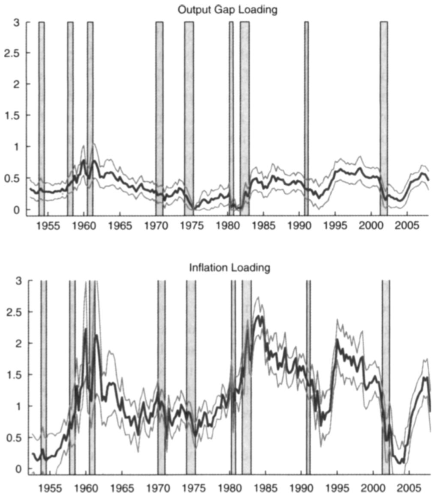

# The term structure or risk-free yields


<!-- ```{r extractECB, echo=TRUE, fig.cap="Simulation of a quadratic processes $x_t$.", fig.asp = .6, out.width = "95%", fig.align = 'left-aligned', message=FALSE} -->
<!-- library(ecb) -->
<!-- rates <- get_data( -->
<!--   #"YC.B.U2.EUR.4F.G_N_A.SV_C_YM.SR_10Y", -->
<!--   "FM.M.U2.EUR.4F.BB.R_U2_10Y.YLDA", -->
<!--   filter=list(startPeriod="1991-12")) -->
<!-- plot(as.Date(paste(rates$obstime,"-15",sep="")),rates$obsvalue,type="l") -->
<!-- spf <- get_data( -->
<!--   "SPF.Q.U2.HICP.POINT.LT.Q.AVG", -->
<!--   filter=list(startPeriod="1991-12")) -->
<!-- spf$obstime <- gsub("Q1", "02-15", spf$obstime) -->
<!-- spf$obstime <- gsub("Q2", "05-15", spf$obstime) -->
<!-- spf$obstime <- gsub("Q3", "08-15", spf$obstime) -->
<!-- spf$obstime <- gsub("Q4", "11-15", spf$obstime) -->
<!-- lines(as.Date(paste(spf$obstime,"-15",sep="")),spf$obsvalue,lty=3) -->
<!-- ``` -->


## Introduction {#RFIntroduction}

Risk-free yields are the yields-to-maturity associated with bonds that carry no default and/or liquidity risks. Bonds issued by sovereign entities with top credit quality are usually considered to be risk-free.

An important share of the term-structure literature pertains to the modelling of risk-free yields. Some models involve macro factors in $w_t$ [@Ang_Piazzesi_2003]; some do not [@Duffie_Singleton_1997]. The latter are sometimes called *yield-only* models.

The basic pricing formula of a risk-free zero coupon bond is (see Eq. \@ref(eq:stdbond) in Example \@ref(exm:nominalBth)):
\begin{eqnarray}
B(t,h) &=& \exp(-r_{t}) \mathbb{E}^{\mathbb{Q}}_t \exp(-r_{t+1}-\dots-r_{t+h-1})\\
R(t,h) &=& - \frac{1}{h} \log B(t,h). (\#eq:stdbondRFchapter)
\end{eqnarray}

Term structure models are often used to extract **term premiums** from observed yields-to-maturity. Term premiums are those components of yields that would not exist if investors were not risk-averse.

If agents were not risk averse, i.e., under the **Expectation Hypothesis (EH)**, we would have $\mathcal{M}_{t,t+1} = \exp(- r_t)$. We would then have ``$\mathbb{P} \equiv \mathbb{Q}$''  and $B(t,h)$ would become:
\begin{equation}
\exp(-r_{t}) \mathbb{E}_t \exp(-r_{t+1}-\dots-r_{t+h-1}).(\#eq:stdbondRFchapterP).
\end{equation}
And the maturity-$h$ yield-to-maturity would then be:
\begin{eqnarray}
R^{EH}(t,h) &=& -\frac{1}{h}\log \left( \mathbb{E}_t \exp(-r_t-\dots-r_{t+h-1})\right)\nonumber\\
&\approx& \frac{1}{h}\mathbb{E}_t(r_t + \dots + r_{t+h-1}).(\#eq:REH)
\end{eqnarray}

The term premium is given by:
\begin{eqnarray}
TP_{t,h} &=& \underbrace{- \frac{1}{h} \log  \mathbb{E}^{\mathbb{Q}}_t \exp(-r_{t+1}-\dots-r_{t+h-1})}_{=R(t,h)} - \nonumber \\
&& \underbrace{- \frac{1}{h}  \log  \mathbb{E}_t \exp(-r_{t+1}-\dots-r_{t+h-1}).}_{=R^{EH}(t,h)}(\#eq:TP)
\end{eqnarray}

What is the economic meaning of the term premium? Under EH, investors are willing to buy a maturity-$h$ bond as long as its expected return is---up to Jensen's inequality---equal to the average of future short-term rates. (Hence the definition of $R^{EH}(t,h)$, see Eq. \@ref(eq:REH).) When $TP_{t,h}>0$, investors are willing to buy the maturity-$h$ bond only if its return is, on average, higher than expected future short-term rates; this corresponds to a situation where investors consider that long-term bonds tend to lose value in *bad states of the world* (i.e., states of high marginal utility).


> **_Risk premium:_** According to Eq. \@ref(eq:Mbasicpricing), the price of any asset $j$ satisfies:
$$
p_{jt} = \mathbb{E}_t(\mathcal{M}_{t,t+1} p_{j,t+1}).
$$
The previous equation rewrites:
$$
p_{jt} =  \mathbb{C}ov_t(\mathcal{M}_{t,t+1}, p_{j,t+1}) + \mathbb{E}_t(\mathcal{M}_{t,t+1})\mathbb{E}_t( p_{j,t+1})
$$
or
\begin{equation}
p_{jt} = \underbrace{\exp(-r_t)\mathbb{E}_t( p_{j,t+1})}_{=p^{EH}_{jt}} + \underbrace{\mathbb{C}ov_t(\mathcal{M}_{t,t+1}, p_{j,t+1})}_{\mbox{Risk premium}}.(\#eq:CovRP)
\end{equation}
If investors were not risk-averse, then we would have $p_{jt} = p^{EH}_{jt}$. The S.D.F. is high (resp. low) in bad (resp. good) states of the world (states of high marginal utility in the equilibrium approach). Hence, we have $p_{jt}< p^{EH}_{jt}$ if asset $j$ tends to pay less in bad states of the world (i.e., if $\mathbb{C}ov_t(\mathcal{M}_{t,t+1}, p_{j,t+1})<0$).


## Swap rates and forward rates

### Swap rates

Bonds issued by top-rated (Aaa/AAA) countries are often considered to be risk-free. Because of call-margins mechanisms, swap rates are also used as risk-free benchmarks [@Duffie_Stein_2015].

:::{.definition #swap name="Interest Rate Swap (IRS)"}

In an Interest Rate Swap (IRS),  a *fixed-rate payer* agrees to provide the *fixed-rate receiver* with a sequence of cash flows that are determined at the negotiation date of the swap, and at predetermined dates. These cash flows constitute the *fixed leg* of the swap. Conversely, the fixed-rate receiver provides the fixed-rate payer with cash-flows that depend on future values of a reference rate; this is the  *floating rate* of the swap.

More precisely, the dates of payment are of the form $t+ \tau$, $t + 2\tau$, \dots, $t + n\tau$, where $\tau$ is a period expressed in years (typically 1/2 or 1/4) and $n$ is the number of payments. The maturity, or *tenor*, of the swap contract is $h = n \tau$.

The payoffs of the fixed leg are $\tau S$, where $S$ is the annualized payment (or *swap rate*). On date $t+j\tau$, the payoff of the floating leg is $\tau L(t+(j-1)\tau,\tau)$, where $L$, the annualized linear rate is given by:
$$
L(t+(j-1)\tau,\tau) = \frac{1 - B(t+(j-1)\tau,\tau)}{\tau B(t+(j-1)\tau,\tau)},
$$
where $B(t+(j-1)\tau,\tau)$ is the price, at date $t+(j-1)\tau$ of a bond of maturity $\tau$.

On the negotiation date, the values of the fixed and floating legs are identical, so that the value of the swap is zero.
:::

At $t$, the price of the fixed leg is:
$$
\sum_{j=1}^n \tau S B(t,j\tau).
$$
Let us turn to the price of the floating leg. The payoff at date $t+j\tau$, that is $\frac{1 - B(t+(j-1)\tau,\tau)}{B(t+(j-1)\tau,\tau)}$ is known on date $t+(j-1)\tau$, so its price at date $t+(j-1)\tau$ is $1 - B(t+(j-1)\tau,\tau)$, and its price at $t$ therefore is $B(t,(j-1)\tau) - B(t,j\tau)$. Summing over $j=1,\dots,n$, the date-$t$ price of the floating leg is $1 - B(t,n\tau)$ (independent of the payment dates).

Since the price of the contract is zero at date $t$ (by definition of the swap), we must have:
$$
\sum_{j=1}^n \tau S B(t,j\tau) = 1 - B(t,n\tau) \Rightarrow S = \frac{1 - B(t,n\tau)}{ \tau \sum_{j=1}^n  B(t,j\tau)},
$$
or
$$
\boxed{S(t,h) = \frac{1 - B(t,h)}{\tau \sum_{j=1}^{h/\tau}  B(t,j\tau)}.}
$$

Note that all the terms appearing in the previous formula are available in closed-form in the context of an affine model (see Example \@ref(exm:nominalBth)).

### Forward rates {#FWD}

:::{.definition #FWD name="Forward Rate Agreement (FRA)"}
An interest rate forward contract is a contract in which the rate to be paid or received on a specific obligation for a set period, beginning in the future, is set at contract initiation.
:::

Denote by $f(t,h_1,h_2)$ the forward interest rate, set on date $t$, for the period between $t+h_1$ and $t+h_2$. Let us relate $f(t,h_1,h_2)$ to bond rates. For that, consider two strategies (decided on date $t$):

1. Buy a zero-coupon bond of maturity $h_2$ (price $B(t,h_2)$) and sell zero-coupon bonds of maturity $h_1$ for the same amount (yielding a payoff of $B(t,h_2)/B(t,h_1)$ on date $t+h_1$).
2. Enter a forward rate agreement between dates $t+h_1$ and $t+h_2$, whereby you receive 1 on date $t+h_2$.

These two strategies deliver the same payoffs on date $t$ (the payoff is zero) and on date $t+h_2$ (the payoff is 1). By absence of arbitrage, the payoffs on date $t+h_1$ have to be the same. Therefore
\begin{eqnarray*}
\exp(-(h_2 - h_1)f(t,h_1,h_2)) &=& B(t,h_2)/B(t,h_1) \\
\Rightarrow f(t,h_1,h_2) &=& \frac{1}{h_2 - h_1}(\log[B(t,h_1)] - \log[B(t,h_2)]),
\end{eqnarray*}
which gives:
\begin{equation}
\boxed{f(t,h_1,h_2) = \frac{h_2 R(t,h_2) - h_1 R(t,h_1)}{h_2 - h_1}.}(\#eq:forward)
\end{equation}
In an affine model (where $R(t,h)$ is an affine function of the state vector $w_t$), forward rates are linear in the state vector $w_t$.


## The Affine Case {#RiskFreeAffine}

### Affine yields

In this subsection, we consider the case where the state vector $w_t$ is affine under both $\mathbb{P}$ and $\mathbb{Q}$. If the nominal short-term rate is affine in $w_t$, i.e., if $r_t = \omega_0 + \omega'_1 w_t$, then:
\begin{eqnarray*}
B(t,h) &=& \mathbb{E}^{\mathbb{Q}}_t \exp (-r_{t}-\dots-r_{t+h-1})\\
&=& \exp(-h\omega_0 - \omega'_1 w_t) \color{blue}{\mathbb{E}^{\mathbb{Q}}_t \exp (- \omega'_1 w_{t+1}-\dots- \omega'_1 w_{t+h-1})}.
\end{eqnarray*}
The (blue) expectation is easily computed using the recursive equations of Lemma \@ref(lem:MHLT) (see Example \@ref(exm:nominalBth)), leading to:
\begin{equation}
R(t,h)= -  \frac{1}{h}   \log   B(t,h) = A_h'w_t + B_h.(\#eq:RthAB)
\end{equation}
It is easily seen that we can also get:
\begin{equation}
R^{EH}(t,h) = {A^{EH}_h}'w_t + B^{EH}_h.(\#eq:RthABEH)
\end{equation}
Moreover, if inflation is also affine in $w_t$, i.e., if $\pi_{t} = \bar\omega_0 + \bar\omega'_1 w_t$, then real yields are given by:
\begin{eqnarray*}
\bar{B}(t,h) &=& \mathbb{E}^{\mathbb{Q}}_t \exp(-r_{t}-\dots-r_{t+h-1}+\pi_{t+1}+\dots+\pi_{t+h})
\end{eqnarray*}
(see Example \@ref(exm:realBth)) which also leads to:
\begin{equation}
\bar{R}(t,h) = -  \frac{1}{h}   \log   \bar{B}(t,h) = \bar{A}_h'w_t + \bar{B}_h.(\#eq:RbarthAB)
\end{equation}
Eqs. \@ref(eq:RthAB) and \@ref(eq:RthABEH) imply that term premiums are affine in $w_t$ (see Eq. \@ref(eq:TP)). Specifically:
$$
TP(t,h) = R(t,h) - E^{EH}(t,h) = B_h - B_h^{EH} + (A_h - A_h^{EH})'w_t.
$$
Expected excess returns resulting from holding zero-coupon bonds are also affine in $w_t$. Indeed, holding a maturity-$h$ zero-coupon bond for one period provides the following expected gross return:
$$
\mathbb{E}_t\left(\frac{B(t+1,h-1)}{B(t,h)}\right) = \mathbb{E}_t\left(\exp(B_{h-1} - B_h + A_{h-1}'w_{t+1} - A_h'w_{t})\right),
$$
which is clearly exponential affine in $w_t$ if $w_t$ is an affine process. Therefore, the expected excess return, that is:
$$
\log \mathbb{E}_t\left(\frac{B(t+1,h-1)}{B(t,h)}\right) - r_t
$$
is also affine in $w_t$ in this context. The fact that excess returns are affine in this context is exploited in the estimation approach proposed by @Adrian_Crump_Moench_2013.

Moreover, *conditional expectations* of future interest rates (real or nominal) and of term premiums are also affine in $w_t$. In particular:
\begin{equation}
\mathbb{E}_t[R(t+k,h)] = \mathbb{E}_t[{A_h}'w_{t+k} + B_h] = {A_h}'\mathbb{E}_t(w_{t+k}) + B_h,(\#eq:condmeanRth)
\end{equation}
and $\mathbb{E}_t(w_{t+k})$ is affine in $w_t$ (see Eq. \@ref(eq:condmean)). This can notably be used at the estimation stage, if one wants to fit survey data (see Section XXX).

Similarly, *conditional variances* of future interest rates (real or nominal) and of term premiums are affine in $w_t$. In particular:
\begin{equation}
\mathbb{V}ar_t[R(t+k,h)] = \mathbb{V}ar_t[{A_h}'w_{t+k} + B_h] = {A_h}'\mathbb{V}ar_t(w_{t+k})A_h,(\#eq:condvarRth)
\end{equation}
where the components of $\mathbb{V}ar_t(w_{t+k})$ (and therefore $\mathbb{V}ar_t[R(t+k,h)]$) is affine in $w_t$ (see Eq. \@ref(eq:condvar)). This can also be used at the estimation stage, if one wants to fit (proxies of) conditional variances [@zarg_2017].


### Maximum Sharpe ratio

In an affine model, the maximum Sharpe ratio is easily computed. This has been noted early by @Duffee_2010 for the Gaussian model; @Gourieroux_Monfort_Mouabbi_Renne_2021 and @Pallara_Renne_2023 use it in more sophisticated affine models.

Let us derive the maximum Sharpe ratio in the context of a genral affine framework. Eq. \@ref(eq:CovRP) implies that
$$
\mathbb{E}_t\underbrace{\left(\frac{p_{j,t+1}}{p_{j,t}} - \exp(r_t)\right)}_{=xs_{j,t+1},\mbox{ excess return}} =  - \exp(r_t) \mathbb{C}ov_t\left(\mathcal{M}_{t,t+1},\frac{p_{j,t+1}}{p_{j,t}}\right),
$$
and, using $|\mathbb{C}ov(X,Y)| \le \sqrt{\mathbb{V}ar(X)\mathbb{V}ar(Y)}$, we get the @Hansen_Jagannathan_1991 bound:
\begin{equation}
\underbrace{\frac{\mathbb{E}_t(xs_{j,t+1})}{\sqrt{\mathbb{V}ar_t(xs_{j,t+1})}}}_{\mbox{Sharpe ratio}} \le \underbrace{\frac{\sqrt{\mathbb{V}ar_t(\mathcal{M}_{t,t+1})}}{\mathbb{E}_t(\mathcal{M}_{t,t+1})}}_{\mbox{Maximum Sharpe ratio}}.
\end{equation}

If the S.D.F. is given by $\mathcal{M}_{t,t+1} = \exp[-r_{t}+\alpha'_tw_{t+1}-\psi_t(\alpha_t)]$ (Eq. \@ref(eq:keySDF)), and using that $\mathbb{E}_t(\mathcal{M}_{t,t+1}^2)=\exp(-2r_t+\psi_t(2\alpha_t)-2\psi_t(\alpha_t))$ we get:
$$
\mbox{Maximum Sharpe ratio} = \sqrt{\exp(\psi_t(2\alpha_t)-2\psi_t(\alpha_t)) - 1}.
$$


## Gaussian Affine Term Structure Model {#RiskFreeGaussian}

The Gaussian Affine Term Structure Model (GATSM) is a *Workhorse* model, widely used in academic and economic-policy circles. In a GATSM, $w_t$ follows a Gaussian vector autoregressive model, and is therefore affine under $\mathbb{P}$. The S.D.F. is exponential affine in $w_t$, which implies that it is also affine under $\mathbb{Q}$ (see Subsection XXX). Since the components of $w_t$ are valued in $\mathbb{R}$, one can easily introduce macro-factors among the state variables.

Let us be more specific. The state vector $w_t$ follows:
\begin{equation}
w_{t+1} = \mu + \Phi w_{t} + \Sigma^{1/2} \varepsilon_{t+1}, \mbox{ where } \varepsilon_{t} \sim  i.i.d. \mathcal{N}(0,Id).(\#eq:GaussianVAR1)
\end{equation}
(The fact that we consider a VAR(1) process is without loss of generality since a VAR(p) admits a VAR(1) companion representation.)

This implies the following Laplace transform for $w_t$ (see Example \@ref(exm:Gaussian)):
$$
\psi_t(u) = \log \mathbb{E}_t(\exp(u'w_{t+1})|\underline{w_t}) = \color{blue}{u'\mu + u'\Phi w_t + \frac{1}{2}u'\Sigma'u}.
$$
Using the notations of Eq. \@ref(eq:keySDF), the s.d.f. is defined as:
$$
\mathcal{M}_{t,t+1} = \exp(- r_t + \alpha_t'w_{t+1} - \psi_t(\alpha_t)), \mbox{ where } \alpha_t = \alpha_0 + \alpha_1'w_t.
$$

In that case, using Eq. \@ref(eq:transfoPQ), we get:
\begin{eqnarray*}
\psi_t^{\mathbb{Q}}(u) &=& \psi_t(u + \alpha_t) - \psi_t(\alpha_t)\\
&=& (u + \alpha_t)'\mu + (u + \alpha_t)'\Phi w_t + \frac{1}{2}(u + \alpha_t)'\Sigma(u + \alpha_t) \\
&& - \left(\alpha_t'\mu + \alpha_t'\Phi w_t + \frac{1}{2}\alpha_t'\Sigma\alpha_t\right) \\
&=& \color{blue}{u' \left(\mu + \Sigma \alpha_0 \right) + u'(\Phi + \Sigma \alpha_1')w_t  + \frac{1}{2}u'\Sigma'u}.
\end{eqnarray*}
The $\mathbb{Q}$-dynamics of $w_t$ is (from Example \@ref(exm:Gaussian)):
$$
w_{t+1} = \mu + \Sigma  \alpha_0 + (\Phi + \Sigma \alpha_1')  w_{t} + \Sigma^{1/2} \varepsilon^*_{t+1}, \mbox{ where } \varepsilon^*_{t} \sim  i.i.d. \mathcal{N}^{\mathbb{Q}}(0,Id).
$$
Hence, $w_t$ also follows a VAR process under $\mathbb{Q}$ since the previous equation rewrites:
$$
w_{t+1} = \mu^{\mathbb{Q}} + \Phi^{\mathbb{Q}} w_{t} + \Sigma^{1/2} \varepsilon^*_{t+1},
$$
where $\mu^{\mathbb{Q}} = \mu + \Sigma  \alpha_0$ and $\Phi^{\mathbb{Q}}=\Phi + \Sigma \alpha_1'$.

With affine specifications of the nominal short term rate ($r_{t} = \omega_0 + \omega'_1 w_t$) and of the inflation rate ($\pi_{t} = \bar\omega_0 + \bar\omega'_1 w_t$), we obtain affine formulas for nominal and real yields of any maturity (Eqs. \@ref(eq:RthAB) and \@ref(eq:RbarthAB)).


:::{.example #KimWright name="Kim and Wright (2005)"}
This model is a three-factor *yield-only model* (no macro variables, except inflation in one variant of the model), where the short-term rate reads $r_t = \omega_0 + \omega_{1,1} w_{1,t} +\omega_{1,2} w_{2,t} +\omega_{1,3} w_{3,t}$.

The model estimated by Kalman filter (see Subsection,\@ref(Estimation:KF); the state-space model (Def. \@ref(def:LSSM)) includes survey-based variables (see Subsection \@ref(EstimationPersistency)).

Outputs are [regularly updated by the Federal Reserve Board](https://www.federalreserve.gov/pubs/feds/2005/200533/200533abs.html).

Monthly data on the 6-month and 12-month-ahead forecasts of the three-month T-Bill yield from Blue Chip Financial Forecasts and semiannual data on the average expected three-month T-Bill yield from 6 to 11 years.

```{r fredKW, echo=FALSE, fig.cap="Kim and Wright (2005) outputs.", fig.asp = .6, out.width = "95%", fig.align = 'left-aligned', message=FALSE}
library(fredr)
fredr_set_key("df65e14c054697a52b4511e77fcfa1f3")
start_date <- as.Date("1990-01-01"); end_date <- as.Date("2022-01-01")
f <- function(ticker){
  fredr(series_id = ticker,
        observation_start = start_date,observation_end = end_date,
        frequency = "m",aggregation_method = "avg")
}
yd10 <- f("DGS10")
tp10 <- f("THREEFYTP10")

par(plt=c(.15,.95,.15,.95))
plot(yd10$date,yd10$value,type="l",ylim=c(-1,10),las=1,lwd=2,
     ylab="yield, in percent",xlab="")
lines(tp10$date,tp10$value,lty=2,col="dark grey",lwd=2)
abline(h=0,lty=3)
legend("topright", 
       c("10-year yield","10-year term premium"),
       #pt.bg = c("black","red","blue"),
       #lty=c(1,1), # gives the legend appropriate symbols (lines)       
       lwd=c(2), # line width
       lty=c(1,2),
       #pch=c(19,19,19),
       col=c("black","dark grey"), # gives the legend lines the correct color and width
       seg.len = 4,
       bg = "white"
)

```

:::


:::{.example #AngPiazzesi name="Ang and Piazzesi (2003)"}

@Ang_Piazzesi_2003 propose one of the first paper mixing latent and macrovariables. The set up is also of the form Eq. \@ref(eq:GaussianVAR1), except that the VAR features several lags.^[Note that a VAR with $p$ lags (i.e., a VAR($p$)) admits a VAR(1) companion form.] In their model, $w_t = [f^{o}_{1,t},f^{o}_{2,t},f^{u}_{1,t},f^{u}_{2,t},f^{u}_{3,t}]'$ where:

* $f^{o}_{1,t}$ is the first Principal Component of a set of 3 price indexes (growth rates)
* $f^{o}_{2,t}$ is the first Principal Component of a set of 4 real activity proxies (HELP,  EMPLOY, IP, UE).
* $f^{u}_{i,t}$ are unobserved, or latent, factors.

The nominal short-term rate follows a Taylor rule. And latent factors are estimated via *inversion techniques* (Subsection \@ref(EstimationInversion)).

```{r figAngPiazzesi, fig.align = 'center', out.width = "95%", fig.cap = "Source: Ang and Piazzesi (1998). Impulse response functions.", echo=FALSE}
knitr::include_graphics("figures/AngPiazzesi1.png")
```
:::


:::{.example #JPS name="Joslin, Priebsch and Singleton (2014)"}

@Joslin_Priebsch_Singleton_2014 first note that affine models stating that the short term rate is affine in macro factors imply that macro-factors are *spanned* by the yield curve: macro-factors should be perfectly explained by yields of different maturities. Further, they show that this is not the case in the data. (That is, regressing macro factors on yields provides $R^2$ that are far from one.)

They propose a model where macro factors are unspanned by the yield curve, but can still help predict yields. In their model, $w_t = [\mathcal{P}_t',M_t']'$, where $\mathcal{P}_t$ are yield factors ($\approx$ principal components) and $M_t$ are macro factors. The model is as follows:
\begin{eqnarray*}
r_t &=& \omega_{0} + \omega_{\mathcal{P}}'\mathcal{P}_t \\
\left[\begin{array}{c}\mathcal{P}_t \\ M_t \end{array}\right]
&=&
\left[\begin{array}{cc}\Phi_{\mathcal{P}\mathcal{P}}&\Phi_{\mathcal{P}M} \\
\Phi_{M\mathcal{P}}&\Phi_{MM} \end{array}\right]
\left[\begin{array}{c}\mathcal{P}_{t-1} \\ M_{t-1} \end{array}\right] + \Sigma \varepsilon_t \\
\left[\begin{array}{c}\mathcal{P}_t \\ M_t \end{array}\right] &=& \mu +
\left[\begin{array}{cc}\Phi^{\mathbb{Q}}_{\mathcal{P}\mathcal{P}}&{\color{red}0} \\
\Phi^{\mathbb{Q}}_{M\mathcal{P}}&\Phi^{\mathbb{Q}}_{MM} \end{array}\right]
\left[\begin{array}{c}\mathcal{P}_{t-1} \\ M_{t-1} \end{array}\right] + \Sigma \varepsilon^{\mathbb{Q}}_t,
\end{eqnarray*}
where $\varepsilon_t$ and $\varepsilon^{\mathbb{Q}}_t$ are $\mathcal{N}(0,Id)$ under $\mathbb{P}$ and $\mathbb{Q}$, respectively.

$M_t$ does  Granger-cause $\mathcal{P}_t$ under $\mathbb{Q}$ and $r_t$ is affine in $\mathcal{P}_t$ (only).

In this context, yields $R(t,h)$ are affine in $\mathcal{P}_t$ (only). However $M_t$ does Granger-cause $\mathcal{P}_t$ under $\mathbb{P}$, that is, macro-shocks affect the yield curve.

```{r JPSIRF, fig.align = 'center', out.width = "95%", fig.cap = "Source: Joslin, Priebsch, and Singleton (2014). Impulse response functions.", echo=FALSE}
knitr::include_graphics("figures/JPS_IRF.png")
```

:::


:::{.example #Angetal2011 name="Ang, Boivin, Dong and Loo-Kung (2011)"}

@Ang_Boivin_Dong_LooKung_2011 propose a macro-finance model based on a quadratic framework. The short-term rate follows a Taylor rule with time-varying parameters:
$$
r_t = \omega_0 + a_t g_t + b_t \pi_t,
$$
where $x_t=(g_t,\pi_t,a_t,b_t)'$ follows a Gaussian VAR. This is the context described in Example \@ref(exm:QGVAR1). The previous equation shows that $r_t$ is linear in $w_t = (x_t,vec(x_t x_t')')'$. Specifically:
$$
r_t = \omega_0 + \omega_1'w_t,
$$
with $\omega_1 = [v,vec(V)]'$, where
$$
v = \left[
\begin{array}{c}
0\\
0\\
0\\
0
\end{array}
\right] \quad \mbox{and} \quad V = \left[
\begin{array}{cccc}
0 & 0& 1/2&0\\
0& 0& 0&1/2\\
1/2& 0& 0&0\\
0&1/2 &0 &0
\end{array}
\right].
$$

```{r AngBoivin, fig.align = 'center', out.width = "70%", fig.cap = "Source: Ang, Boivin, Dong, Loo-Kung (2011). Estimated factor loadings ($a_t$ and $b_t$).", echo=FALSE}

```

:::


## Non-Negative Affine Term Structure Model {#RiskFreeNonNegative}

In the presence of physical currency, absence of arbitrage opportunity and of storing cost of cash, nominal interest rates should be nonnegative. Many standard models (e.g. Gaussian ATSM) are non consistent with non-negative nominal yields. The period of extremely low interest rates challenged these models. Against this backdrop, approaches have been developed to accommodate zero (or effective) lower bounds. We provide two examples; only the second is an affine model.

### The shadow-rate approach

The shadow-rate model is originally due to @Black_1995. In this model, the short term rate is given by:
\begin{equation}
r_t = \max(s_t,\underline{r}),(\#eq:SRSTR)
\end{equation}
where $s_t$ is the shadow short-term interest rate and $\underline{r}$ is the effective lower bound ($\le 0$). While $s_t$ can be real-valued, the short term rate is nonnegative under \@ref(eq:SRSTR). In shadow-rate models, the shadow rate $s_t$ is usually a linear combination of a vector $w_t$ that follows a Gaussian auto-regressive model. While $s_t$ is a linear combination of components of an affine process, this is not the case for $r_t$. As a result, pricing formula are not available in closed-form. Approximation formula have been proposed by, e.g., @Krippner_2013, @Priebsch_2013, @Wu_Xia_2016.

Let us describe the latter approach [@Wu_Xia_2016]. As in Subsection \@ref(RiskFreeGaussian), the S.D.F. is defined as:
$$
\mathcal{M}_{t,t+1} = \exp(- r_t + \alpha_t'w_{t+1} - \psi_t(\alpha_t)), \mbox{ where } \alpha_t = \alpha_0 + \alpha_1'w_t,
$$
(this is Eq. \@ref(eq:keySDF)), but the short-term rate $r_t$ is given by $r_t = \max(s_t,0)$, with
$$
s_t = \delta_0 + \delta_1' w_t.
$$

The approximation approach proposed by @Wu_Xia_2016 is based on an approximation to the conditional expectations of forward rates. Using the results of Subsection \@ref(FWD), we have (Eq. \@ref(eq:forward)):
$$
f_{n-1,n,t} = n R_{t,n} - (n-1) R_{t,n-1}.,
$$
for $n>0$ (and using $R_{t,0}=0$). This implies that:
$$
R_{t,h} =  \frac{1}{h}(f_{t,0,1}+f_{t,1,2}+\dots+f_{t,h-1,h}).
$$

The approximation of @Wu_Xia_2016 consists in finding approximations of the forward rates $f_{t,n-1,n}$ (denoted by $\tilde{f}_{t,n-1,n}$, say) and to use them in the previous equation to get:
\begin{equation}
\boxed{R_{t,h} \approx  \frac{1}{h}\left(\tilde{f}_{t,0,1}+\tilde{f}_{t,1,2}+\dots+\tilde{f}_{t,h-1,h}\right).}(\#eq:RapproxSR)
\end{equation}

Using that, for any random variable $Z$, we have $\log(\mathbb{E}[e^Z]) \approx \mathbb{E}[Z] + \frac{1}{2} \mathbb{V}ar[Z]$ (based on a second order Taylor expansion), @Wu_Xia_2016 further show that:
\begin{eqnarray}
f_{t,n,n+1} &=& -\log\left(\mathbb{E}_t^{\mathbb{Q}}\left(e^{-\sum_{j=0}^n r_{t+j}}\right)\right) + \log\left(\mathbb{E}_t^{\mathbb{Q}}\left(e^{-\sum_{j=0}^{n-1} r_{t+j}}\right)\right)\\
&\approx& \mathbb{E}_t^{\mathbb{Q}}[r_{t+n}] - \frac{1}{2}\left(\mathbb{V}ar_t^{\mathbb{Q}}\left(\sum_{j=0}^n r_{t+j}\right)-\mathbb{V}ar_t^{\mathbb{Q}}\left(\sum_{j=0}^{n-1} r_{t+j}\right)\right).
\end{eqnarray}

The expectation can be computed analytically:
$$
\mathbb{E}_t^{\mathbb{Q}}[r_{t+n}] = \underline{r} + \sigma_n^{\mathbb{Q}}g\left(\frac{\bar{a}_n + b_n'X_t - \underline{r}}{\sigma_n^{\mathbb{Q}}}\right),
$$
where $g(x)= x\Phi(x)-\phi(x)$, $\Phi$ and $\phi$ being the c.d.f. and p.d.f. of the standard normal distribution, respectively, and where
\begin{eqnarray*}
\bar{a}_n &=& \delta_0 + \delta_1'\left(\sum_{j=0}^{n-1} \left[\Phi^{\mathbb{Q}}\right]^j\right)\mu^{\mathbb{Q}}\\
b_n' &=& \delta_1'\left(\Phi^{\mathbb{Q}}\right)^n.
\end{eqnarray*}
They also show that
$$
\frac{1}{2}\left(\mathbb{V}ar_t^{\mathbb{Q}}\left(\sum_{j=0}^n r_{t+j}\right)-\mathbb{V}ar_t^{\mathbb{Q}}\left(\sum_{j=0}^{n-1} r_{t+j}\right)\right) \approx \Phi\left(\frac{\bar{a}_n + b_n'X_t - \underline{r}}{\sigma_n^{\mathbb{Q}}}\right)\times(\bar{a}_n - a_n),
$$
where
$$
a_n = \bar{a}_n - \frac{1}{2}\sigma_n^{\mathbb{Q}},
$$
with
$$
\sigma_n^{\mathbb{Q}} := \mathbb{V}ar^{\mathbb{Q}}_t\left(s_{t+n}\right)= \delta_1'\left(\sum_{j=0}^{n-1} \left[\Phi^{\mathbb{Q}}\right]^j\right)\Sigma \Sigma' \left(\sum_{j=0}^{n-1} \left[\Phi^{\mathbb{Q}}\right]^j\right)'\delta_1.
$$
They finally obtain:
$$
\boxed{f_{t,n,n+1} \approx \tilde{f}_{t,n,n+1} = \underline{r} + \sigma_n^{\mathbb{Q}}g\left(\frac{a_n + b_n'X_t - \underline{r}}{\sigma_n^{\mathbb{Q}}}\right),}
$$
which is used in \@ref(eq:RapproxSR) to obtain an approximation to $R_{t,h}$.


```{r WuXia, fig.align = 'center', out.width = "95%", fig.cap = "bla bla bla.",echo=TRUE}
library(TSModels)
# Specify model:
n <- 2 # number of factors
rho <- matrix(0,n,n)
diag(rho) <- .97
mu <- matrix(0,n,1)
Sigma <- diag(n)
delta.0 <- 0;delta.1 <- rep(.01,n)
r.bar <- 0 # r = max(s,r.bar) [i.e., r.bar=0 in standard model]
Model <- list(rho = rho,mu = mu,Sigma = Sigma,
  delta.0 = delta.0,delta.1 = delta.1,r.bar = r.bar)
# Simulate model and compute shadow rate:
X <- simul.var(Model,nb.sim = 200) # simulated path
s <- delta.0 + X %*% delta.1
# Compute yields:
res <- compute.price.WX(Model,X,max.H=100)
# Prepare plots:
par(plt=c(.1,.95,.2,.75))
par(mfrow=c(2,1))
plot(s,type="l",xlab="time",ylab="",lwd=2,main="(a) Shadow rate")
t <- 50 #t <- which(s==min(s))
abline(v=t,col="dark grey",lwd=2,lty=3)
plot(res$vec.f[t,],type="l",xlab="maturity",ylab="",
     lwd=2,main="(b) yields and forward rates")
lines(res$vec.y[t,],col="red",lwd=2)
legend("topright", 
       c("forward rates","yields to maturity"),lwd=c(2),lty=1,
       col=c("black","red"),bg = "white")
```


### The auto-regressive gamma approach

@zarg_2017 introduce an affine framework where the short-term rate can stay at zero for a prolonged period of time and with a stochastic lift-off probability.

Under $\mathbb{P}$ and $\mathbb{Q}$, the state vector $w_t$ follows a multi-variate auto-regressive gamma (VARG) process---a multivariate extension of Example \@ref(exm:ARG1). Conditionally on $\underline{w_t}$, the $n$ components of $w_{t+1}$ are independent and distributed as follows:
\begin{equation}
\frac{w_{i,t+1}}{\mu_i} \sim \gamma(\nu_i+z_{i,t}) \quad \mbox{where} \quad z_{i,t} \sim {\mathcal P} \left( \alpha_i + \beta_i' w_t \right).(\#eq:VARG)
\end{equation}
If $\mu = (\mu_1,\dots,\mu_n)'$, $\alpha = (\alpha_1,\dots,\alpha_n)'$, $\nu = (\nu_1,\dots,\nu_n)'$ and $\beta = (\beta_1,\dots,\beta_n)$, then
\begin{eqnarray*}
\varphi_t(u) &=& \exp\left[\left(\frac{u \odot \mu}{1 - u \odot \mu}\right)'\beta' w_t \right.\\
&& \left. + \alpha'\left(\frac{u \odot \mu}{1 - u \odot \mu}\right) - \nu'\log(1 - u \odot \mu)\right],
\end{eqnarray*}
where $\odot$ denotes the element-by-element multiplication and, where, with abuse of notation, the division and log operators work element-by-element when applied to vectors.

In their baseline model, @zarg_2017 use four factors. They set $\nu_1 = \nu_2 = 0$, implying that $w_{1,t}$ and $w_{2,t}$ can stay at zero (see Example \@ref(exm:ARG1)). The short-term rate $r_t$ is posited to be an affine combination of $w_{1,t}$ and $w_{2,t}$, that is:
$$
r_t = \omega'w_t = \omega_{1} w_{1,t} + \omega_{2} w_{2,t},
$$
hence, it can stay at zero.

Factors $w_{3,t}$ and $w_{4,t}$ Granger-cause $w_{1,t}$ and $w_{2,t}$, thereby causing $r_t$. As a result, for $h \ge 2$, $R(t,h)$ is a non-zero combination of the four components of $w_t$.

For the same reason, when $r_t=0$, the lift-off probability depends on $w_{3,t}$ and $w_{4,t}$. The framework offers closed-form solutions for lift-off probabilities. Indeed, using Lemma \@ref(lemma:mass):
$$
\mathbb{P}_t(\alpha'w_{t+h}=0) = \lim_{u \rightarrow -\infty} \varphi_{t,h}(0,\dots,0,u\alpha),
$$
where $\varphi_{t,h}$ is the multi-horizon Laplace transform defined in Eq. \@ref(eq:multiLT), which can be computed using Proposition \@ref(prp:reverseMLT). We have:
\begin{equation}
\left\{
\begin{array}{l}
\mathbb{P}_t(r_{t+h}>0) = 1 - \lim_{u \rightarrow -\infty} \varphi_{t,h}(0,\dots,0,u\omega) \\ \\
\mathbb{P}_t(r_{t+1}=0,\dots,r_{t+h}=0) = \lim_{u \rightarrow -\infty} \varphi_{t,h}(u\omega,\dots,u\omega,u\omega) \equiv p_{h}\\ \\
\mathbb{P}_t(r_{t+1}=0,\dots,r_{t+h-1}=0,r_{t+h}>0) = p_{h-1} - p_h.
\end{array}
\right.
\end{equation}
Other lift-off probabilities, of the type $\mathbb{P}_t[R(t+h,k)>threshold]$, can be derived from Eq. \@ref(eq:DPS).

@zarg_2017 esitmate this model by means of Kalman filtering techniques (see Subsection \@ref(EstimationKF)). Observed variables include (levels of) yields, as well as survey-based forecasts of yields (see Subsection \@ref(EstimationPersistency) and (e-GARCH-based) proxies of conditional variances (see Eq. \@ref(eq:condvar)).


```{r fitZarg, fig.align = 'center', out.width = "95%", fig.cap = "Source: Monfort et al. (2017). Model fit of conditional variances and surveys of professional forecasters.", echo=FALSE}
knitr::include_graphics("figures/Figure_fit_ZARG.png")
```

```{r liftOff, fig.align = 'center', out.width = "95%", fig.cap = "Source: Monfort et al. (2017). Lift-off probabilities.", echo=FALSE}
knitr::include_graphics("figures/Figure_LiftOff.png")
```

