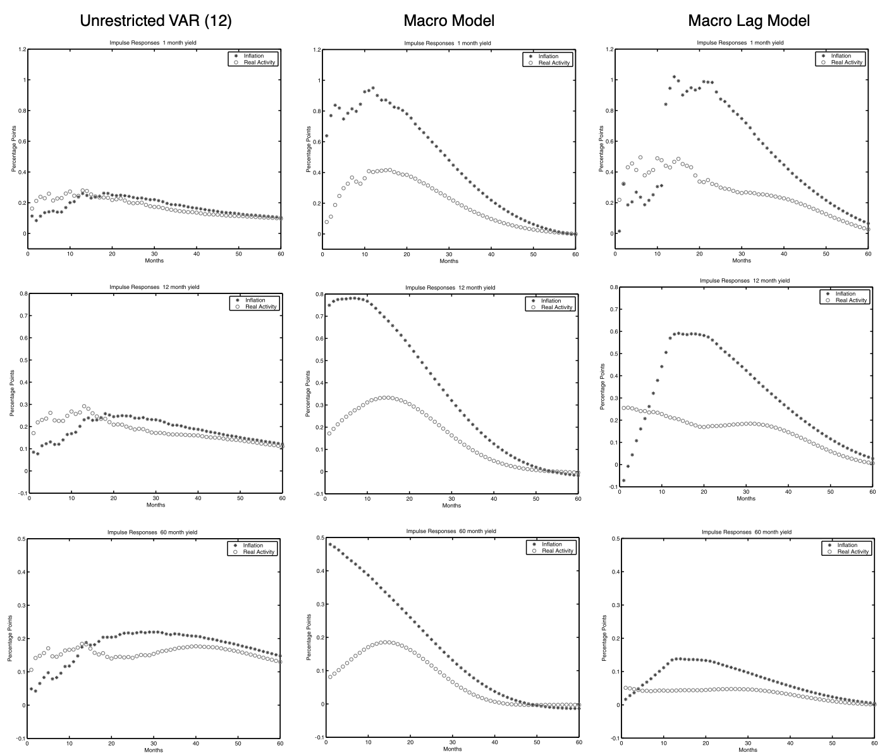
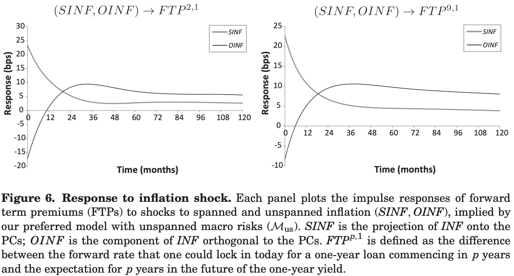
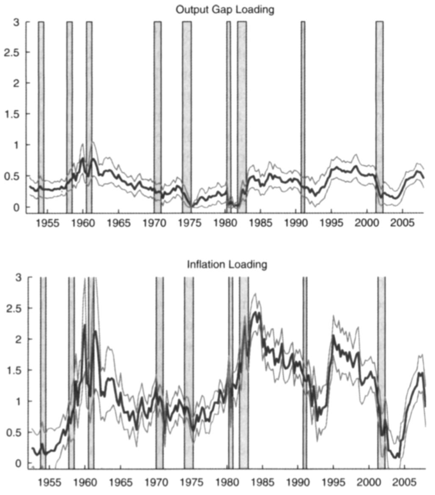
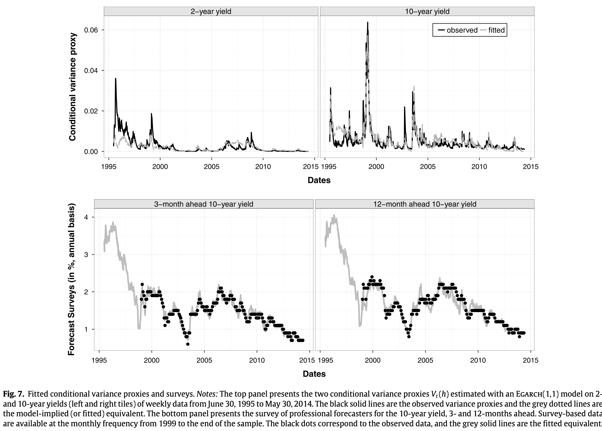
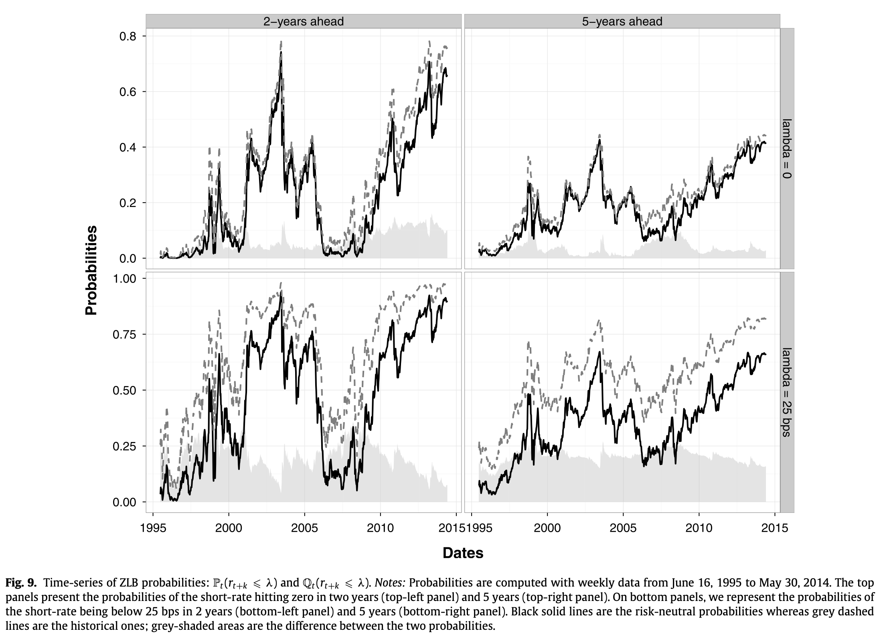
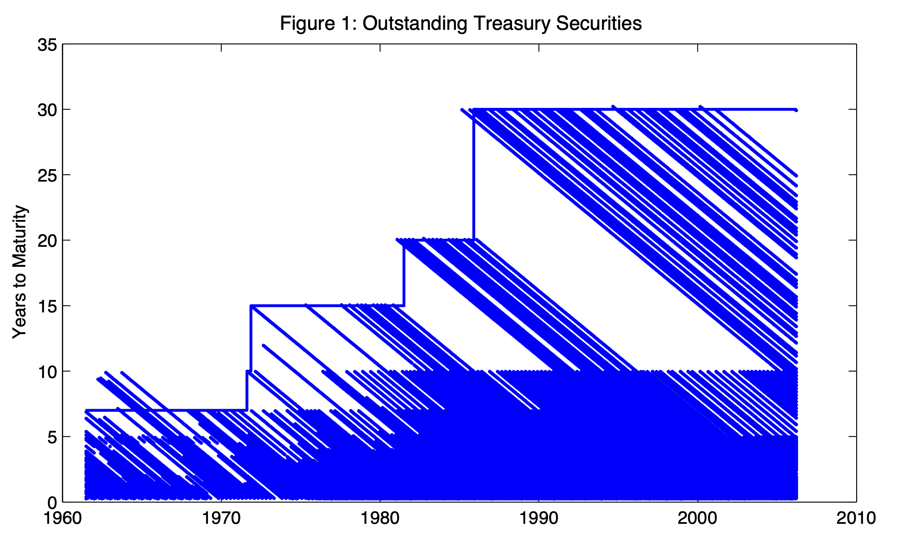
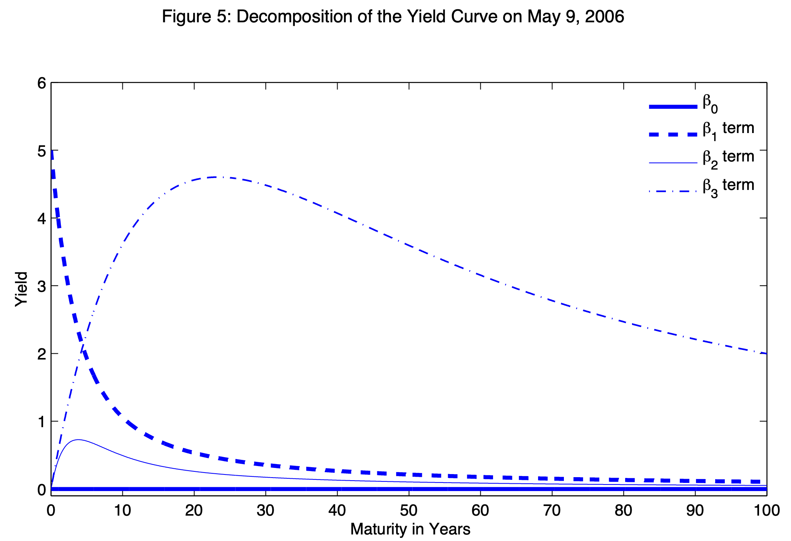
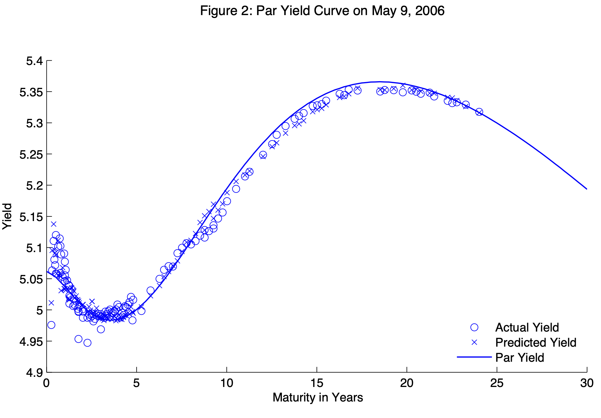

# No-arbitrage models of the term struture of risk-free yields {#TSModels}


<!-- ```{r extractECB, echo=TRUE, fig.cap="Simulation of a quadratic processes $x_t$.", fig.asp = .6, out.width = "95%", fig.align = 'left-aligned', message=FALSE} -->
<!-- library(ecb) -->
<!-- rates <- get_data( -->
<!--   #"YC.B.U2.EUR.4F.G_N_A.SV_C_YM.SR_10Y", -->
<!--   "FM.M.U2.EUR.4F.BB.R_U2_10Y.YLDA", -->
<!--   filter=list(startPeriod="1991-12")) -->
<!-- plot(as.Date(paste(rates$obstime,"-15",sep="")),rates$obsvalue,type="l") -->
<!-- spf <- get_data( -->
<!--   "SPF.Q.U2.HICP.POINT.LT.Q.AVG", -->
<!--   filter=list(startPeriod="1991-12")) -->
<!-- spf$obstime <- gsub("Q1", "02-15", spf$obstime) -->
<!-- spf$obstime <- gsub("Q2", "05-15", spf$obstime) -->
<!-- spf$obstime <- gsub("Q3", "08-15", spf$obstime) -->
<!-- spf$obstime <- gsub("Q4", "11-15", spf$obstime) -->
<!-- lines(as.Date(paste(spf$obstime,"-15",sep="")),spf$obsvalue,lty=3) -->
<!-- ``` -->


## Introduction {#RFIntroduction}

Risk-free yields are the yields-to-maturity associated with bonds that carry no default and/or liquidity risks. Bonds issued by sovereign entities with top credit quality are usually considered to be risk-free. Because of call-margins mechanisms, swap rates are also used as risk-free benchmarks [@Duffie_Stein_2015] (see Subsection \@ref(Swaps)). (Credit and liquidity risks are covered in Section \@ref(CreditLiRisks).)

An important share of the term-structure literature pertains to the modelling of risk-free yields. Some models explicitly involve macroeconomic factors; this can be done in a reduced-form way (e.g., @Ang_Piazzesi_2003) or in a more structural way, in the context of the equilibrium term-structure approaches (e.g., @Bansal_Shaliastovich_2013, see Example \@ref(exm:BS2013)) or even in the context of dynamic stochastic general equilibrium models (e.g., @Hordahl_Tristani_veston_2008, @DewBecker_2014). Many studies feature purely latent factors, with no explicit macroeconomic interpretation (e.g., @Duffie_Singleton_1997, @Joslin_Singleton_Zhu_2011). The latter are sometimes called *yield-only* models.

In this section, we consider term structure of zero-coupon yields, which are basic objects from which one can price any stream of fixed payoffs that will be settled at fixed future dates. These yields are usually not directly observed in the market. As a result, they have to be constructed in the first place; Appendix \@ref(constructing) briefly presents approaches used for that purpose.

Under regularity and no-arbitrage assumptions, the price of a risk-free zero coupon bond, and the associated yield-to-maturity, satisfy (see Eq. \@ref(eq:ihandM)):
\begin{eqnarray}
B_{t,h} &=& \mathbb{E}_t (\mathcal{M}_{t,t+h})\nonumber\\
&=& \mathbb{E}^{\mathbb{Q}}_t \exp(-i_t -i_{t+1}-\dots-i_{t+h-1})\nonumber\\
i_{t,h} &=& - \frac{1}{h} \log B_{t,h}, (\#eq:stdbondRFchapter)
\end{eqnarray}
where $\mathcal{M}_{t,t+h}$ is the (strictly positive) stochastic discount factor between dates $t$ and $t+h$, and where the risk neutral measure $\mathbb{Q}$ is defined with respect to the physical measure $\mathbb{P}$ by means of the Radon-Nikodym derivative $\mathcal{M}_{t,t+1}\big/\mathbb{E}_t(\mathcal{M}_{t,t+1})$.^[That is, for any random variable $X_{t+1}$:
$$
\mathbb{E}^{\mathbb{Q}}_t(X_{t+1})=\mathbb{E}_t\left(X_{t+1}\frac{\mathcal{M}_{t,t+1}}{\mathbb{E}_t(\mathcal{M}_{t,t+1})}\right).
$$]

Term structure models are often used to extract *term premiums* from observed yields-to-maturity. Term premiums are those components of yields that would not exist if investors were not risk-averse (see, e.g., Subsection \@ref(TSCCAPM)).

If agents were not risk averse, i.e., under the *Expectation Hypothesis (EH)*, we would have $\mathcal{M}_{t,t+1} = \exp(- i_t)$ and $\mathbb{P} \equiv \mathbb{Q}$; $B_{t,h}$ would then be equal to:
\begin{equation}
B^{EH}_{t,h} := \mathbb{E}_t \exp(-i_{t}-i_{t+1}-\dots-i_{t+h-1}).(\#eq:stdbondRFchapterP)
\end{equation}
The (counterfactual) maturity-$h$ yield-to-maturity would then be:
\begin{eqnarray}
i^{EH}_{t,h} &=& -\frac{1}{h}\log \left( \mathbb{E}_t \exp(-i_t-\dots-i_{t+h-1})\right)\nonumber\\
&\approx& \frac{1}{h}\mathbb{E}_t(i_t + \dots + i_{t+h-1}).(\#eq:REH)
\end{eqnarray}

Using the previous notations, the term premium is usually defined as:
\begin{eqnarray}
TP_{t,h} &=& \underbrace{- \frac{1}{h} \log  \mathbb{E}^{\mathbb{Q}}_t \exp(-i_{t+1}-\dots-i_{t+h-1})}_{=i_{t,h}} - \nonumber \\
&& \underbrace{- \frac{1}{h}  \log  \mathbb{E}_t \exp(-i_{t+1}-\dots-i_{t+h-1}).}_{=i^{EH}_{t,h}}(\#eq:TP)
\end{eqnarray}

A term premium is a specific type of risk premium (see Def. \@ref(def:RPremium)), in the sense that it reflects changes between the price of an asset (a bond here, $B_{t,h}$) and the counterfactual we would observe if agents were not risk averse ($B_{t,h}^{EH}$, here). 

Economically, what accounts for term premiums? To address this in a comprehensive way, one needs to resort to structural approaches (see Section \@ref(Structural)). A short reply is that a long-term bond is never "risk-free" as it is exposed to the interest-rate risk; and that investors are averse to this risk, hence the term premiums. Take a two-period bond; using \@ref(eq:basicAAA), we have:
\begin{equation}
B_{t,2} = \underbrace{\mathbb{E}_t(\exp(-i_t-i_{t+1}))}_{= B^{EH}_{t,2}} + \mathbb{C}ov_t(\mathcal{M}_{t,t+1},\underbrace{\exp(-i_{t+1})}_{=B_{t+1,1}}).(\#eq:Bt2)
\end{equation}
Therefore $B_{t,2} \ne B_{t,2}^{EH}$ as soon as $\mathcal{M}_{t,t+1}$ and $i_{t+1}$ are conditionally correlated, which is likely to be the case (see, e.g., the CCAPM case in Subsection \@ref(TSCCAPM)).

In the following subsections, we describe statistical approaches that have been used to estimate term premiums. These approaches are usually silent about the drivers of the term premiums. Eq \@ref(eq:Bt2) provides some insights regarding the sources of fluctuations of term premiums: interest rate volatility, SDF volatility (that may depend on risk aversion, see, e.g., the Epstein-Zin case in \@ref(eq:sdfAbc)), the correlation between interest rates and the SDF.

Under EH, investors are willing to buy a maturity-$h$ bond as long as its expected return is---up to Jensen's inequality---equal to the average of future short-term rates. (Hence the definition of $i^{EH}_{t,h}$, see Eq. \@ref(eq:REH).) The fact that $TP_{t,h}>0$ (say) means that investors are willing to buy the maturity-$h$ bond only if its return is, on average, higher than expected future short-term rates; it corresponds to a situation where investors consider that long-term bonds tend to lose value in *bad states of the world* (i.e., states of high marginal utility) and want to be compensated for that.


:::{.definition #RPremium name="Risk premium, in the general case"}

According to \@ref(eq:basic), under the absence of arbitrage opportunities, the price of any asset $j$ satisfies:
\begin{equation}
p_{jt} = \mathbb{E}_t(\mathcal{M}_{t,t+1} p_{j,t+1}),(\#eq:basicAAA)
\end{equation}
or, equivalently,
$$
p_{jt} = \exp(-i_t)\mathbb{E}^{\mathbb{Q}}_t(p_{j,t+1}),
$$
where the risk neutral measure $\mathbb{Q}$ is defined with respect to the physical measure $\mathbb{P}$ by means of the Radon-Nikodym derivative $\mathcal{M}_{t,t+1}\big/\mathbb{E}_t(\mathcal{M}_{t,t+1})$.^[That is, for any random variable $X_{t+1}$:
$$
\mathbb{E}^{\mathbb{Q}}_t(X_{t+1})=\mathbb{E}_t\left(X_{t+1}\frac{\mathcal{M}_{t,t+1}}{\mathbb{E}_t(\mathcal{M}_{t,t+1})}\right).
$$]

Eq. \@ref(eq:basicAAA) rewrites:
$$
p_{jt} =  \mathbb{C}ov_t(\mathcal{M}_{t,t+1}, p_{j,t+1}) + \mathbb{E}_t(\mathcal{M}_{t,t+1})\mathbb{E}_t( p_{j,t+1})
$$
or
\begin{equation}
p_{jt} = \underbrace{\exp(-i_t)\mathbb{E}_t( p_{j,t+1})}_{=p^{EH}_{jt}} + \underbrace{\mathbb{C}ov_t(\mathcal{M}_{t,t+1}, p_{j,t+1})}_{\mbox{Risk premium}}.(\#eq:CovRP)
\end{equation}
If investors were not risk-averse, then we would have $p_{jt} = p^{EH}_{jt}$. The SDF is high (resp. low) in bad (resp. good) states of the world (states of high marginal utility in the equilibrium approach). Hence, we have $p_{jt}< p^{EH}_{jt}$ if asset $j$ tends to pay less in bad states of the world (i.e., if $\mathbb{C}ov_t(\mathcal{M}_{t,t+1}, p_{j,t+1})<0$).
:::

:::{.example #TestingEH name="Testing the Expectation Hypothesis"}

Several studies have employed regression analysis to test the Expectation Hypothesis, e.g., @Campbell_Shiller_1991 and @Cochrane_Piazzesi_2005. Let us focus on the former study. @Campbell_Shiller_1991 note that, if agents were risk-neutral, we would have:
$$
B_{t,n} = \exp(-i_{t,m})\mathbb{E}_t(B_{t+m,n-m}).
$$
This would imply:
$$
-n i_{t,n} = -i_{t,m} + \log \mathbb{E}_t[\exp(-(n-m) i_{t+m,n-m})].
$$
Up to the Jensen inequality, and taking expectations on both sides, we get:
$$
-n i_{t,n} \approx \mathbb{E}_t(-i_{t,m} -(n-m) i_{t+m,n-m}).
$$
After having reorganized:
\begin{equation}
\mathbb{E}_t(i_{t+m,n-m}-i_{t,n}) \approx \frac{i_{t,n}-i_{t,m}}{n-m}.(\#eq:CStheo)
\end{equation}

@Campbell_Shiller_1991 have used the previous expression to test for the Expectation hypothesis. Formally, they run the following regressions for different values of $n$ and $m$:
$$
i_{t+m,n-m}-i_{t,n} = \phi_n\frac{i_{t,n}-i_{t,m}}{n-m} + \varepsilon_{t+m}.
$$

According to \@ref(eq:CStheo), under the Expectation Hypothesis, we should have $\phi_{n,m} \approx 1$. But they do find that the $\phi_{n,m}$ are statistically lower than one. Besides, they find that, for a given holding period $m$, the term structure of the $\phi_{n,m}$ decreases with the maturity $n$. Figure \@ref(fig:CSregressions) shows the results of such regressions on a more recent period. It appears that the original results of @Campbell_Shiller_1991 are still valid.


```{r CSregressions, echo=FALSE, fig.cap="Regressions as in Campbell and Shiller (1991). Data are at the monthly frequency; they are collected from the FRED database. The estimation period starts in 1990. The figure reports 90% confidence intervals of the $\\phi_{n,m}$ parameter estimates (Newey-West robust standard deviations).", fig.asp = .6, out.width = "95%", fig.align = 'left-aligned', message=FALSE}
library(sandwich)
lag <- function(X,n){
  X_lag <- 0*X
  N <- max(dim(t(X)))
  X_lag[1:n] <- X[1]
  X_lag[(n+1):N] <- X[1:(N-n)]
  return(X_lag)
}

# Load data in Fred:
library(fredr)
fredr_set_key("df65e14c054697a52b4511e77fcfa1f3")
start_date <- as.Date("1990-01-01"); end_date <- Sys.Date()
f <- function(ticker){
  fredr(series_id = ticker,
        observation_start = start_date,observation_end = end_date,
        frequency = "m",aggregation_method = "avg")
}

par(mfrow=c(1,2))
par(plt=c(.25,.95,.2,.85))

list.of.rates <- c("THREEFY2","THREEFY3","THREEFY5",
                   "THREEFY7","THREEFY10")

for(i in 1:2){
  
  if(i==1){
    lags    <- 3
    regress <- f("DTB3")
    main_title = "3-month holding period"      
  }
  if(i==2){
    lags    <- 6
    regress <- f("DTB6")  
    main_title = "6-month holding period"      
  }
  if(i==3){
    lags    <- 12
    regress <- f("THREEFY1")
    main_title = "12-month holding period"      
  }
  
  res <- matrix(0,5,3)
  res[,1] <- c(2,3,5,7,10)
  
  count <- 0
  for(j in 1:length(list.of.rates)){
    count <- count + 1
    yy <- f(list.of.rates[j])
    DATA <- merge(yy,regress,by="date")
    yn <- DATA$value.x
    y1 <- DATA$value.y
    eq <- lm((yn-lag(yn,lags))~(lag((yn-y1)/2/(12/lags),lags)))
    
    res[count,2] <- eq$coefficients[2]
    res[count,3] <- sqrt(diag(NeweyWest(eq,lag = lags, prewhite = FALSE)))[2]
  }
  
  plot(res[,1],res[,2],ylim=c(-1,1),pch=16,
       ylab=expression(paste("Parameter ",phi[n*','*m])),
       xlab=expression(paste("Maturity (in years)")),col="black",
       main=main_title,cex=1.5,cex.main=1)
  lines(res[,1],res[,2],lwd=3)
  lines(res[,1],res[,2]-1.64*res[,3],lty=1,col="red",lwd=3)
  lines(res[,1],res[,2]+1.64*res[,3],lty=1,col="red",lwd=3)
  lines(res[,1],0*res[,1],lty=3,lwd=2)
}
```
:::


Before turning to the no-arbitrage term structure models, note that \@ref(eq:TP) implies that term premium estimates are directly available if we have good approximations for the expected future short term rates (i.e., $i_{t,h}^{EH}$). Some surveys offer such proxies. It is for instance the case of the [Philadelphia Fed SPF](https://www.philadelphiafed.org/surveys-and-data/bill10), that provides expectations of the short-term rate over the next 10 years (see Figure \@ref(fig:modeFreeTP)). However, there is only one release per year for this survey.

```{r modeFreeTP, echo=FALSE, fig.cap="Sources: SPF Philadelphia for $i_{t,h}^{EH}$ (ticker BILL10) and FRED database for $i_{t,h}$ (ticker THREEFY10).", fig.asp = .6, out.width = "95%", fig.align = 'left-aligned', message=FALSE,warning = FALSE}
library(fredr)
fredr_set_key("df65e14c054697a52b4511e77fcfa1f3")
start_date <- as.Date("1959-01-01"); end_date <- Sys.Date()
f <- function(ticker){
  fredr(series_id = ticker,
        observation_start = start_date,observation_end = end_date,
        frequency = "m",aggregation_method = "eop")
}
y10 <- f("THREEFY10");y10$date <- as.Date(y10$date)

# Get SPFs:
download.file("https://www.philadelphiafed.org/-/media/frbp/assets/surveys-and-data/survey-of-professional-forecasters/data-files/files/mean_bill10_level.xlsx",
              "data/mean_bill10_level.xlsx")
SPF <- readxl::read_xlsx(path="data/mean_bill10_level.xlsx")
SPF$date <- as.Date(paste(SPF$YEAR,"-",1+3*(SPF$QUARTER-1),"-01",sep=""))
DATA <- merge(as.data.frame(y10),as.data.frame(SPF),by="date")
DATA$BILL10 <- as.double(DATA$BILL10)
par(plt=c(.15,.95,.1,.95))
plot(DATA$date,DATA$value,type="l",ylab="yields, in percent",xlab="",lwd=2)
points(DATA$date,DATA$BILL10,pch=19)
legend("topright", 
       c(expression(i[t*','*h]),expression({i[t*','*h]}^{EH})),
       #pt.bg = c("black","red","blue"),
       #lty=c(1,1), # gives the legend appropriate symbols (lines)       
       lwd=c(2), # line width
       lty=c(1,NaN),
       pch=c(NaN,19),
       col=c("black","black"), # gives the legend lines the correct color and width
       seg.len = 3,
       bg = "white"
)

```


In the same spirit, Figure \@ref(fig:modeFreeIRP) compares the 10-year breakeven rate of inflation ($i_{t,h}- r_{t,h}$), also called inflation compensation, with the expected annualized inflation over the  next 10 years. The difference between the line and the dots is the *inflation risk premium*, defined as:
$$
IRP_{t,h} = i_{t,h} - r_{t,h} - \mathbb{E}_t(\pi_{t,t+h}),
$$
where $\pi_{t,t+h}$ denotes the annualized inflation rate between dates $t$ and $t+h$.

Figure \@ref(fig:modeFreeIRP) shows that the inflation risk premium has often been negative in recent years, suggesting a perceived importance of demand shocks in the economy.

```{r modeFreeIRP, echo=FALSE, fig.cap="Sources: SPF Philadelphia for the 10-year inflation expectation (ticker CPI19) and FRED database for $i_{t,h}$ (ticker DGS10) and for $r_{t,h}$ (ticker DFII10).", fig.asp = .6, out.width = "95%", fig.align = 'left-aligned', message=FALSE,warning = FALSE}

library(tidyverse)
library(zoo)
library(Hmisc)
library(fredr)

# DAT <- csv.get(file = "data/feds200805.csv", skip = 18)
# DAT$Date <- as.Date(DAT$Date)
# DAT <- arrange(DAT,Date)
# DAT$qdate <- as.yearqtr(DAT$Date)
# DAT_qtrly <- DAT %>%
#   group_by(qdate) %>%
#   summarise_all(function(x){mean(x,na.rm=TRUE)})
# days <- as.numeric(format(DAT_qtrly$Date,"%d"))
# DAT_qtrly$Date <- as.Date(
#   paste(format(DAT_qtrly$Date,"%Y"),"-",
#         as.numeric(format(DAT_qtrly$Date,"%m"))-1,"-01",sep=""))
# DAT <- data.frame(date=DAT_qtrly$Date,
#                   TIPSY05=DAT_qtrly$TIPSY05,
#                   TIPSY10=DAT_qtrly$TIPSY10,
#                   BKEVEN10=DAT_qtrly$BKEVEN10)

fredr_set_key("df65e14c054697a52b4511e77fcfa1f3")
start_date <- as.Date("1959-01-01"); end_date <- Sys.Date()
f <- function(ticker){
  fredr(series_id = ticker,
        observation_start = start_date,observation_end = end_date,
        frequency = "m",aggregation_method = "eop")
}
r10 <- f("DFII10");r10$date <- as.Date(r10$date)
y10 <- f("DGS10"); y10$date <- as.Date(y10$date)
DAT <- merge(r10,y10,by="date")
DAT$BEER <- DAT$value.y - DAT$value.x

# Get SPFs:
download.file("https://www.philadelphiafed.org/-/media/frbp/assets/surveys-and-data/survey-of-professional-forecasters/data-files/files/mean_cpi10_level.xlsx",
              "data/mean_cpi10_level.xlsx")
SPF <- readxl::read_xlsx(path="data/mean_cpi10_level.xlsx")
SPF$date <- as.Date(paste(SPF$YEAR,"-",1+3*(SPF$QUARTER-1),"-01",sep=""))
SPF$CPI10 <- as.double(SPF$CPI10)
par(plt=c(.15,.95,.1,.95))
plot(DAT$date,DAT$BEER,type="l",ylab="yields, in percent",xlab="",lwd=1)
#plot(DAT$date,DAT$BKEVEN10,type="l",ylab="yields, in percent",xlab="",lwd=1)
points(SPF$date,SPF$CPI10,pch=19)
legend("bottomright",
       c("10-year breakeven inflation rate","10-year inflation expectation"),
       #pt.bg = c("black","red","blue"),
       #lty=c(1,1), # gives the legend appropriate symbols (lines)
       lwd=c(1), # line width
       lty=c(1,NaN),
       pch=c(NaN,19),
       col=c("black","black"), # gives the legend lines the correct color and width
       seg.len = 3,
       bg = "white"
)

```


## The Affine Case {#RiskFreeAffine}

### Affine yields {#AffineYields}

In this subsection, we consider the case where the state vector $w_t$ is affine under both $\mathbb{P}$ and $\mathbb{Q}$. If the nominal short-term rate is affine in $w_t$, i.e., if $i_t = \omega_0 + \omega'_1 w_t$, then (see \@ref(eq:ihandM)):
\begin{eqnarray*}
B_{t,h} &=& \mathbb{E}^{\mathbb{Q}}_t \exp (-i_{t}-\dots-i_{t+h-1})\\
&=& \exp(-h\omega_0 - \omega'_1 w_t) \color{blue}{\mathbb{E}^{\mathbb{Q}}_t \exp (- \omega'_1 w_{t+1}-\dots- \omega'_1 w_{t+h-1})}.
\end{eqnarray*}
The (blue) expectation is easily computed using the recursive equations of Proposition \@ref(prp:reverseMLT) (see Example \@ref(exm:nominalBth)), leading to:
\begin{equation}
i_{t,h}= -  \frac{1}{h}   \log   B_{t,h} = a_h'w_t + b_h.(\#eq:RthAB)
\end{equation}
It is easily seen that we can also get:
\begin{equation}
i^{EH}_{t,h} = {a^{EH}_h}'w_t + b^{EH}_h.(\#eq:RthABEH)
\end{equation}
Moreover, if inflation is also affine in $w_t$, i.e., if $\pi_{t} = \bar\omega_0 + \bar\omega'_1 w_t$, then real yields are given by:
\begin{eqnarray*}
\mathcal{B}_{t,h} &=& \mathbb{E}^{\mathbb{Q}}_t \exp(-i_{t}-\dots-i_{t+h-1}+\pi_{t+1}+\dots+\pi_{t+h})
\end{eqnarray*}
(see Example \@ref(exm:realBth)) which also leads to:
\begin{equation}
r_{t,h} = -  \frac{1}{h}   \log   \mathcal{B}_{t,h} = \bar{a}_h'w_t + \bar{b}_h.(\#eq:RbarthAB)
\end{equation}
Eqs. \@ref(eq:RthAB) and \@ref(eq:RthABEH) imply that term premiums are affine in $w_t$ (see Eq. \@ref(eq:TP)). Specifically:
$$
TP_{t,h} = i_{t,h} - i^{EH}_{t,h} = b_h - b_h^{EH} + (a_h - a_h^{EH})'w_t.
$$

> The same approach can be employed to compute real term premiums ($r_{t,h} - r^{EH}_{t,h}$), and inflation term premiums($(i_{t,h}-r_{t,h}) - (i^{EH}_{t,h}-r^{EH}_{t,h})$).

Expected excess returns resulting from holding zero-coupon bonds are also affine in $w_t$. Indeed, holding a maturity-$h$ zero-coupon bond for one period provides the following expected gross return:
$$
\mathbb{E}_t\left(\frac{B_{t+1,h-1}}{B_{t,h}}\right) = \mathbb{E}_t\left(\exp(b_{h-1} - b_h + a_{h-1}'w_{t+1} - a_h'w_{t})\right),
$$
which is clearly exponential affine in $w_t$ if $w_t$ is an affine process. Therefore, the log expected excess return, that is:
$$
\log \mathbb{E}_t\left(\frac{B_{t+1,h-1}}{B_{t,h}}\right) - i_t
$$
is also affine in $w_t$. This is exploited in the estimation approach proposed by @Adrian_Crump_Moench_2013.

Moreover, *conditional expectations* of future interest rates (real or nominal) and of term premiums are also affine in $w_t$. In particular:
\begin{equation}
\mathbb{E}_t[i_{t+k,h}] = \mathbb{E}_t[{a_h}'w_{t+k} + b_h] = {a_h}'\mathbb{E}_t(w_{t+k}) + b_h,(\#eq:condmeanRth)
\end{equation}
and $\mathbb{E}_t(w_{t+k})$ is affine in $w_t$ (see Eq. \@ref(eq:condmean)). This can notably be used at the estimation stage, if one wants to fit survey data (see Subsection \@ref(EstimationPersistency)).

Similarly, *conditional variances* of future interest rates (real or nominal) and of term premiums are affine in $w_t$. In particular:
\begin{equation}
\mathbb{V}ar_t[i_{t+k,h}] = \mathbb{V}ar_t[{a_h}'w_{t+k} + b_h] = {a_h}'\mathbb{V}ar_t(w_{t+k})a_h,(\#eq:condvarRth)
\end{equation}
where the components of $\mathbb{V}ar_t(w_{t+k})$ (and therefore $\mathbb{V}ar_t[i_{t+k,h}]$) is affine in $w_t$ (see Eq. \@ref(eq:condvar)). This can also be used at the estimation stage, if one wants to fit (proxies of) conditional variances [@zarg_2017].


### Maximum Sharpe ratio

In an affine model, the maximum Sharpe ratio is easily computed. This has been noted early by @Duffee_2010 for the Gaussian model; @Gourieroux_Monfort_Mouabbi_Renne_2021 and @Pallara_Renne_2023 use it in more sophisticated affine models.

Let us derive the maximum Sharpe ratio in the context of a genral affine framework. Eq. \@ref(eq:CovRP) implies that
$$
\mathbb{E}_t\underbrace{\left(\frac{p_{j,t+1}}{p_{j,t}} - \exp(i_t)\right)}_{=xs_{j,t+1},\mbox{ excess return}} =  - \exp(i_t) \mathbb{C}ov_t\left(\mathcal{M}_{t,t+1},\frac{p_{j,t+1}}{p_{j,t}}\right),
$$
and, using $|\mathbb{C}ov(X,Y)| \le \sqrt{\mathbb{V}ar(X)\mathbb{V}ar(Y)}$, we get the @Hansen_Jagannathan_1991 bound:
\begin{equation}
\underbrace{\frac{\mathbb{E}_t(xs_{j,t+1})}{\sqrt{\mathbb{V}ar_t(xs_{j,t+1})}}}_{\mbox{Sharpe ratio}} \le \underbrace{\frac{\sqrt{\mathbb{V}ar_t(\mathcal{M}_{t,t+1})}}{\mathbb{E}_t(\mathcal{M}_{t,t+1})}}_{\mbox{Maximum Sharpe ratio}}.
\end{equation}

If the SDF is given by $\mathcal{M}_{t,t+1} = \exp[-i_{t}+\alpha'_tw_{t+1}-\psi_t(\alpha_t)]$ (Eq. \@ref(eq:keySDF)), and using that $\mathbb{E}_t(\mathcal{M}_{t,t+1}^2)=\exp(-2i_t+\psi_t(2\alpha_t)-2\psi_t(\alpha_t))$ we get:
$$
\mbox{Maximum Sharpe ratio} = \sqrt{\exp(\psi_t(2\alpha_t)-2\psi_t(\alpha_t)) - 1}.
$$


## Gaussian Affine Term Structure Model {#RiskFreeGaussian}

The Gaussian Affine Term Structure Model (GATSM) is a *workhorse* model, widely used in academic and economic-policy circles. In a GATSM, $w_t$ follows a Gaussian vector autoregressive model, and is therefore affine under $\mathbb{P}$. The SDF is exponential affine in $w_t$, which implies that process $w_t$ is also affine under $\mathbb{Q}$ (shown below). Since the components of $w_t$ are valued in $\mathbb{R}$, one can easily introduce macro-factors among the state variables.

Let us be more specific. The state vector $w_t$ follows:
\begin{equation}
w_{t+1} = \mu + \Phi w_{t} + \Sigma^{1/2} \varepsilon_{t+1}, \mbox{ where } \varepsilon_{t} \sim  i.i.d. \mathcal{N}(0,Id).(\#eq:GaussianVAR1)
\end{equation}
(The fact that we consider a VAR(1) process is without loss of generality since a VAR(p) admits a VAR(1) companion representation.)

This implies the following log-Laplace transform for $w_t$ (see Example \@ref(exm:GVAR1)):
$$
\psi_t(u) = \log \mathbb{E}_t(\exp(u'w_{t+1})|\underline{w_t}) = \color{blue}{u'\mu + u'\Phi w_t + \frac{1}{2}u'\Sigma'u}.
$$
Using the notations of \@ref(eq:keySDF), the SDF is defined as:
$$
\mathcal{M}_{t,t+1} = \exp(- i_t + \alpha_t'w_{t+1} - \psi_t(\alpha_t)), \mbox{ where } \alpha_t = \alpha_0 + \alpha_1'w_t.
$$

In that case, using \@ref(eq:transfoPQ), we get:
\begin{eqnarray*}
\psi_t^{\mathbb{Q}}(u) &=& \psi_t(u + \alpha_t) - \psi_t(\alpha_t)\\
&=& (u + \alpha_t)'\mu + (u + \alpha_t)'\Phi w_t + \frac{1}{2}(u + \alpha_t)'\Sigma(u + \alpha_t) \\
&& - \left(\alpha_t'\mu + \alpha_t'\Phi w_t + \frac{1}{2}\alpha_t'\Sigma\alpha_t\right) \\
&=& \color{blue}{u' \left(\mu + \Sigma \alpha_0 \right) + u'(\Phi + \Sigma \alpha_1')w_t  + \frac{1}{2}u'\Sigma'u}.
\end{eqnarray*}
This is the Laplace tranform of a Gaussian VAR process (see Example \@ref(exm:GVAR1)); accordingly, the $\mathbb{Q}$-dynamics of $w_t$ is:
$$
w_{t+1} = \mu + \Sigma  \alpha_0 + (\Phi + \Sigma \alpha_1')  w_{t} + \Sigma^{1/2} \varepsilon^*_{t+1}, \mbox{ where } \varepsilon^*_{t} \sim  i.i.d. \mathcal{N}^{\mathbb{Q}}(0,Id).
$$
or
\begin{equation}
w_{t+1} = \mu^{\mathbb{Q}} + \Phi^{\mathbb{Q}} w_{t} + \Sigma^{1/2} \varepsilon^*_{t+1},(\#eq:GaussianQdyn)
\end{equation}
where 
$$
\boxed{\mu^{\mathbb{Q}} = \mu + \Sigma  \alpha_0,\quad \mbox{and} \quad\Phi^{\mathbb{Q}}=\Phi + \Sigma \alpha_1'.}
$$
With affine specifications of the nominal short term rate ($i_{t} = \omega_0 + \omega'_1 w_t$) and of the inflation rate ($\pi_{t} = \bar\omega_0 + \bar\omega'_1 w_t$), we obtain affine formulas for nominal and real yields of any maturity (Eqs. \@ref(eq:RthAB) and \@ref(eq:RbarthAB)).


:::{.example #KimWright name="Kim and Wright (2005)"}
This model is a three-factor *yield-only model* (no macro variables, except inflation in one variant of the model), where the short-term rate reads $i_t = \omega_0 + \omega_{1,1} w_{1,t} +\omega_{1,2} w_{2,t} +\omega_{1,3} w_{3,t}$.

The model estimated by Kalman filter (see Subsection \@ref(Estimation:KF); the state-space model (Def. \@ref(def:LSSM)) includes survey-based variables (see Subsection \@ref(EstimationPersistency)).

Outputs are [regularly updated by the Federal Reserve Board](https://www.federalreserve.gov/pubs/feds/2005/200533/200533abs.html).

Monthly data on the 6-month and 12-month-ahead forecasts of the three-month T-Bill yield from Blue Chip Financial Forecasts and semiannual data on the average expected three-month T-Bill yield from 6 to 11 years.

```{r fredKW, echo=FALSE, fig.cap="Kim and Wright (2005) outputs.", fig.asp = .6, out.width = "95%", fig.align = 'left-aligned', message=FALSE}
library(fredr)
fredr_set_key("df65e14c054697a52b4511e77fcfa1f3")
start_date <- as.Date("1990-01-01"); end_date <- as.Date("2022-01-01")
f <- function(ticker){
  fredr(series_id = ticker,
        observation_start = start_date,observation_end = end_date,
        frequency = "m",aggregation_method = "avg")
}
yd10 <- f("DGS10")
tp10 <- f("THREEFYTP10")

par(plt=c(.15,.95,.15,.95))
plot(yd10$date,yd10$value,type="l",ylim=c(-1,10),las=1,lwd=2,
     ylab="yield, in percent",xlab="")
lines(tp10$date,tp10$value,lty=2,col="dark grey",lwd=2)
abline(h=0,lty=3)
legend("topright", 
       c("10-year yield","10-year term premium"),
       #pt.bg = c("black","red","blue"),
       #lty=c(1,1), # gives the legend appropriate symbols (lines)       
       lwd=c(2), # line width
       lty=c(1,2),
       #pch=c(19,19,19),
       col=c("black","dark grey"), # gives the legend lines the correct color and width
       seg.len = 4,
       bg = "white"
)

```

:::


:::{.example #AngPiazzesi name="Ang and Piazzesi (2003)"}

@Ang_Piazzesi_2003 propose one of the first paper mixing latent and macrovariables. The set up is also of the form of \@ref(eq:GaussianVAR1), except that the VAR features several lags.^[Note that a VAR with $p$ lags (i.e., a VAR($p$)) admits a VAR(1) companion form.] In their model, $w_t = [f^{o}_{1,t},f^{o}_{2,t},f^{u}_{1,t},f^{u}_{2,t},f^{u}_{3,t}]'$ where:

* $f^{o}_{1,t}$ is the first Principal Component of a set of 3 price indexes (growth rates)
* $f^{o}_{2,t}$ is the first Principal Component of a set of 4 real activity proxies (HELP,  EMPLOY, IP, UE).
* $f^{u}_{i,t}$ are unobserved, or latent, factors.

The nominal short-term rate follows a Taylor rule. And latent factors are estimated via *inversion techniques* (Subsection \@ref(EstimationInversion)).

```{r figAngPiazzesi, fig.align = 'center', out.width = "95%", fig.cap = "Source: Ang and Piazzesi (1998). Impulse response functions.", echo=FALSE}

```
:::


:::{.example #JPS name="Joslin, Priebsch and Singleton (2014)"}

@Joslin_Priebsch_Singleton_2014 first note that affine models stating that the short term rate is affine in macro factors imply that macro-factors are *spanned* by the yield curve: macro-factors should be perfectly explained by yields of different maturities. Further, they show that this is not the case in the data. (That is, regressing macro factors on yields provides $R^2$ that are far from one.)

They propose a model where macro factors are unspanned by the yield curve, but can still help predict yields. In their model, $w_t = [\mathcal{P}_t',M_t']'$, where $\mathcal{P}_t$ are yield factors ($\approx$ principal components) and $M_t$ are macro factors. The model is as follows:
\begin{eqnarray*}
i_t &=& \omega_{0} + \omega_{\mathcal{P}}'\mathcal{P}_t \\
\left[\begin{array}{c}\mathcal{P}_t \\ M_t \end{array}\right]
&=&
\left[\begin{array}{cc}\Phi_{\mathcal{P}\mathcal{P}}&\Phi_{\mathcal{P}M} \\
\Phi_{M\mathcal{P}}&\Phi_{MM} \end{array}\right]
\left[\begin{array}{c}\mathcal{P}_{t-1} \\ M_{t-1} \end{array}\right] + \Sigma \varepsilon_t \\
\left[\begin{array}{c}\mathcal{P}_t \\ M_t \end{array}\right] &=& \mu +
\left[\begin{array}{cc}\Phi^{\mathbb{Q}}_{\mathcal{P}\mathcal{P}}&{\color{red}0} \\
\Phi^{\mathbb{Q}}_{M\mathcal{P}}&\Phi^{\mathbb{Q}}_{MM} \end{array}\right]
\left[\begin{array}{c}\mathcal{P}_{t-1} \\ M_{t-1} \end{array}\right] + \Sigma \varepsilon^{\mathbb{Q}}_t,
\end{eqnarray*}
where $\varepsilon_t$ and $\varepsilon^{\mathbb{Q}}_t$ are $\mathcal{N}(0,Id)$ under $\mathbb{P}$ and $\mathbb{Q}$, respectively.

$M_t$ does not Granger-cause $\mathcal{P}_t$ under $\mathbb{Q}$. In other words, $\mathcal{P}_t$ is exogenous under $\mathbb{Q}$. And since $i_t$ is affine in $\mathcal{P}_t$ only (the loadings on $M_t$ are null), it comes that the yield of any maturity $i_{t,h}$ is affine in $\mathcal{P}_t$ only (null loadings on $M_t$). However, since $M_t$ does Granger-cause $\mathcal{P}_t$ under $\mathbb{P}$, the macro-shocks have dynamic effects on the yield curve. In other words, this model reconciles the facts that: 

a. the level, slope and curvature explains the bulk of the variations of the yield curve,
b. macro factors affect yields,
c. the vectorial spaces spanned by yields on the one hand, and macroeconomic factors on the other hand do not coincide.

```{r JPSIRF, fig.align = 'center', out.width = "95%", fig.cap = "Source: Joslin, Priebsch, and Singleton (2014). Impulse response functions.", echo=FALSE}

```
:::


:::{.example #Angetal2011 name="Ang, Boivin, Dong and Loo-Kung (2011)"}

@Ang_Boivin_Dong_LooKung_2011 propose a macro-finance model based on a quadratic framework. The short-term rate follows a Taylor rule with time-varying parameters:
$$
i_t = \omega_0 + a_t g_t + b_t \pi_t,
$$
where $x_t=(g_t,\pi_t,a_t,b_t)'$ follows a Gaussian VAR. This is the context described in Example \@ref(exm:QGVAR1). The previous equation shows that $r_t$ is linear in $w_t = (x_t,vec(x_t x_t')')'$. Specifically:
$$
i_t = \omega_0 + \omega_1'w_t,
$$
with $\omega_1 = [v,vec(V)]'$, where
$$
v = \left[
\begin{array}{c}
0\\
0\\
0\\
0
\end{array}
\right] \quad \mbox{and} \quad V = \left[
\begin{array}{cccc}
0 & 0& 1/2&0\\
0& 0& 0&1/2\\
1/2& 0& 0&0\\
0&1/2 &0 &0
\end{array}
\right].
$$

```{r AngBoivin, fig.align = 'center', out.width = "70%", fig.cap = "Source: Ang, Boivin, Dong, Loo-Kung (2011). Estimated factor loadings ($a_t$ and $b_t$).", echo=FALSE}

```
:::


## Non-Negative Affine Term Structure Model {#RiskFreeNonNegative}

In the presence of physical currency, absence of arbitrage opportunity and of storing cost of cash, nominal interest rates should be nonnegative. Many standard models (e.g. Gaussian ATSM) are non consistent with non-negative nominal yields. The period of extremely low interest rates challenged these models. Against this backdrop, approaches have been developed to accommodate zero (or effective) lower bounds. We provide two examples; only the second is an affine model.

### The shadow-rate approach {#Shadowrate}

The shadow-rate model is originally due to @Black_1995. In this model, the short term rate is given by:
\begin{equation}
i_t = \max(s_t,\underline{i}) = \underline{i} + \max(s_t-\underline{i},0),(\#eq:SRSTR)
\end{equation}
where $s_t$ is the shadow short-term interest rate and $\underline{i}$ is the effective lower bound ($\le 0$). While $s_t$ can be real-valued, the short term rate is nonnegative under \@ref(eq:SRSTR). In shadow-rate models, the shadow rate $s_t$ is usually a linear combination of a vector $w_t$ that follows a Gaussian auto-regressive model. While $s_t$ is a linear combination of components of an affine process, this is not the case for $i_t$. As a result, pricing formula are not available in closed-form. Approximation formula have been proposed by, e.g., @Krippner_2013, @Priebsch_2013, @Wu_Xia_2016.

Let us describe the latter approach [@Wu_Xia_2016]. As in Subsection \@ref(RiskFreeGaussian), the SDF is defined as:
$$
\mathcal{M}_{t,t+1} = \exp(- i_t + \alpha_t'w_{t+1} - \psi_t(\alpha_t)), \mbox{ where } \alpha_t = \alpha_0 + \alpha_1'w_t,
$$
(this is Eq. \@ref(eq:keySDF)), but the short-term rate $i_t$ is given by $i_t = \max(s_t,0)$, with
$$
s_t = \delta_0 + \delta_1' w_t.
$$
The shadow rate $s_t$ is part of a state vector $w_t$ that follows a Gaussian VAR, as in \@ref(eq:GaussianVAR1) (or $s_t$ can be a linear combination of components of $w_t$). As before, the $\mathbb{Q}$-dynamics of $w_t$ is also a Gaussian VAR, as in \@ref(eq:GaussianQdyn). (Indeed, using the previous specification of the SDF, the non-linear $i_t$ term vanishes in the Radon-Nikodym derivatives; see Eq. \@ref(eq:RadonNikodym).)

The price of a nominal zero-coupon bond is still given by \@ref(eq:ihandM), that is:
$$
B_{t,h} = \mathbb{E}^{\mathbb{Q}}_t \exp(-i_t--i_{t+1}-\dots-i_{t+h-1});
$$
but this price is not exponential affine in $s_t$ because of the max operator relating $i_t$ to $s_t$ (see Eq. \@ref(eq:SRSTR)). As a result, we can no longer exploit the tractable calculation of the multi-horizon Laplace transform of $w_t$ to price this bond.

The approximation approach proposed by @Wu_Xia_2016 is based on an approximation to the conditional expectations of forward rates. Using the results of Subsection \@ref(FWD), we have (Eq. \@ref(eq:forward)):
$$
f_{n-1,n,t} = n i_{t,n} - (n-1) i_{t,n-1}.,
$$
for $n>0$ (and using $i_{t,0}=0$, i.e., $f_{0,1,t}=i_t$). Equivalently, for $h>0$:
$$
i_{t,h} =  \frac{1}{h}(f_{t,0,1}+f_{t,1,2}+\dots+f_{t,h-1,h}).
$$

The approximation of @Wu_Xia_2016 consists in finding approximations of the forward rates $f_{t,n-1,n}$ (denoted by $\tilde{f}_{t,n-1,n}$, say) and to use them in the previous equation to get:
\begin{equation}
i_{t,h} \approx  \frac{1}{h}\left(\tilde{f}_{t,0,1}+\tilde{f}_{t,1,2}+\dots+\tilde{f}_{t,h-1,h}\right).(\#eq:RapproxSR)
\end{equation}

Using that, for any random variable $Z$, we have $\log(\mathbb{E}[e^Z]) \approx \mathbb{E}[Z] + \frac{1}{2} \mathbb{V}ar[Z]$ (based on a second-order Taylor expansion of the log-Laplace transform), @Wu_Xia_2016 further show that:
\begin{eqnarray}
f_{t,n,n+1} &=& -\log\left(\mathbb{E}_t^{\mathbb{Q}}\left(e^{-\sum_{j=0}^n i_{t+j}}\right)\right) + \log\left(\mathbb{E}_t^{\mathbb{Q}}\left(e^{-\sum_{j=0}^{n-1} i_{t+j}}\right)\right)\\
&\approx& \mathbb{E}_t^{\mathbb{Q}}[i_{t+n}] - \frac{1}{2}\left(\mathbb{V}ar_t^{\mathbb{Q}}\left(\sum_{j=0}^n i_{t+j}\right)-\mathbb{V}ar_t^{\mathbb{Q}}\left(\sum_{j=0}^{n-1} i_{t+j}\right)\right).
\end{eqnarray}

The expectation can be computed analytically. Using \@ref(eq:SRSTR), it is indeed of the form $\underline{i} + \mathbb{E}_t^{\mathbb{Q}}[ \max(s_{t+n}-\underline{i},0)]$, where
$$
s_{t+n}-\underline{i}|\underline{w_t} \sim \mathcal{N}\left(\bar{a}_n+b_n'w_t- \underline{i},\sigma_n^{\mathbb{Q}}\right),
$$
with
$$
\bar{a}_n = \delta_0 + \delta_1'\left(\sum_{j=0}^{n-1} \left[\Phi^{\mathbb{Q}}\right]^j\right)\mu^{\mathbb{Q}}, \quad \mbox{and} \quad b_n' = \delta_1'\left(\Phi^{\mathbb{Q}}\right)^n,
$$
and
$$
\sigma_n^{\mathbb{Q}} := \mathbb{V}ar^{\mathbb{Q}}_t\left(s_{t+n}\right)= \delta_1'\left(\sum_{j=0}^{n-1} \left[\Phi^{\mathbb{Q}}\right]^j\right)\Sigma \Sigma' \left(\sum_{j=0}^{n-1} \left[\Phi^{\mathbb{Q}}\right]^j\right)'\delta_1.
$$

Hence, using standard results on the truncated normal distribution (see Figure \@ref(fig:Mills)),^[If $X\sim \mathcal{N}(\mu,\sigma^2)$, then $\mathbb{E}(\max(X,0))=\sigma g\left(\frac{\mu}{\sigma}\right)= \mu\Phi\left(\frac{\mu}{\sigma}\right)+\sigma\phi\left(\frac{\mu}{\sigma}\right)$.] they obtain:
$$
\mathbb{E}_t^{\mathbb{Q}}[i_{t+n}] = \underline{i} + \sigma_n^{\mathbb{Q}}g\left(\frac{\bar{a}_n + b_n'X_t - \underline{i}}{\sigma_n^{\mathbb{Q}}}\right),
$$
where $g(x)= x\Phi(x)+\phi(x)$, $\Phi$ and $\phi$ being the c.d.f. and p.d.f. of the standard normal distribution, respectively.

They also show that
$$
\frac{1}{2}\left(\mathbb{V}ar_t^{\mathbb{Q}}\left(\sum_{j=0}^n i_{t+j}\right)-\mathbb{V}ar_t^{\mathbb{Q}}\left(\sum_{j=0}^{n-1} i_{t+j}\right)\right) \approx \Phi\left(\frac{\bar{a}_n + b_n'X_t - \underline{i}}{\sigma_n^{\mathbb{Q}}}\right)\times(\bar{a}_n - a_n),
$$
where $a_n = \bar{a}_n - \frac{1}{2}\sigma_n^{\mathbb{Q}}$. They finally obtain:
$$
\boxed{f_{t,n,n+1} \approx \tilde{f}_{t,n,n+1} = \underline{i} + \sigma_n^{\mathbb{Q}}g\left(\frac{a_n + b_n'X_t - \underline{i}}{\sigma_n^{\mathbb{Q}}}\right),}
$$
which is used in \@ref(eq:RapproxSR) to obtain an approximation to $i_{t,h}$.


In the following code, we simulate a shadow-rate path and compute the term structure of the approximated forward rates $f_{t,n,n+1}$ and the resulting nominal rates $i_{t,h}$ for the date indicated by the vertical grey line in the upper plot.

```{r WuXia, fig.align = 'center', out.width = "95%", fig.cap = "The upper plot shows a simulated path of the shadow rate $s_t$. The bottom plot shows the approximated forward rate $f_{t,n,n+1}$ and the resulting nominal rates $i_{t,h}$ for the date indicated by the vertical grey line in the upper plot.",echo=TRUE}
library(TSModels)
# Specify model:
n <- 2 # number of factors
rho <- matrix(0,n,n)
diag(rho) <- .97
mu <- matrix(0,n,1)
Sigma <- diag(n)
delta.0 <- 0;delta.1 <- rep(.01,n)
r.bar <- 0 # r = max(s,r.bar) [i.e., r.bar=0 in standard model]
Model <- list(rho = rho,mu = mu,Sigma = Sigma,
              delta.0 = delta.0,delta.1 = delta.1,r.bar = r.bar)
# Simulate model and compute shadow rate:
X <- simul.var(Model,nb.sim = 200) # simulated path
s <- delta.0 + X %*% delta.1
# Compute yields:
res <- compute.price.WX(Model,X,max.H=100)
# Prepare plots:
par(plt=c(.1,.95,.2,.75))
par(mfrow=c(2,1))
plot(s,type="l",xlab="time",ylab="",lwd=2,main="(a) Shadow rate")
t <- 50 #t <- which(s==min(s))
abline(v=t,col="dark grey",lwd=2,lty=3)
plot(res$vec.f[t,],type="l",xlab="maturity",ylab="",
     lwd=2,main="(b) yields and forward rates")
lines(res$vec.y[t,],col="red",lwd=2)
legend("topright", 
       c("forward rates","yields to maturity"),lwd=c(2),lty=1,
       col=c("black","red"),bg = "white")
```


```{r Mills, fig.align = 'center', out.width = "95%", fig.cap = "This figure shows $\\mathbb{E}(\\max(0,X))$ for $X \\sim \\mathcal{N}(\\mu,1)$, as a function of $\\mu$. More generally, if $X\\sim \\mathcal{N}(\\mu,\\sigma^2)$, then $\\mathbb{E}(\\max(X,0))=\\sigma g\\left(\\frac{\\mu}{\\sigma}\\right)= \\mu\\Phi\\left(\\frac{\\mu}{\\sigma}\\right)+\\sigma\\phi\\left(\\frac{\\mu}{\\sigma}\\right)$, where $\\Phi$ and $\\phi$ are the c.d.f. and p.d.f. of the standard normal distirbution, respectively.",echo=FALSE}
x <- seq(-4,4,length.out=400)
y <- x * pnorm(x) + dnorm(x)
par(plt=c(.15,.95,.2,.95))
plot(x,y,type="l",lwd=2,xlab=expression(mu),ylab="E(max(0,X))")
lines(c(-10,10),c(-10,10),col="grey")
```


### The auto-regressive gamma approach

@zarg_2017 introduce an affine framework where the short-term rate can stay at zero for a prolonged period of time and with a stochastic lift-off probability.

Under $\mathbb{P}$ and $\mathbb{Q}$, the state vector $w_t$ follows a multi-variate auto-regressive gamma (VARG) process---a multivariate extension of Example \@ref(exm:ARG1). Conditionally on $\underline{w_t}$, the $n$ components of $w_{t+1}$ are independent and distributed as follows:
\begin{equation}
\frac{w_{i,t+1}}{\mu_i} \sim \gamma(\nu_i+z_{i,t}) \quad \mbox{where} \quad z_{i,t} \sim {\mathcal P} \left( \alpha_i + \beta_i' w_t \right).(\#eq:VARG)
\end{equation}
If $\mu = (\mu_1,\dots,\mu_n)'$, $\alpha = (\alpha_1,\dots,\alpha_n)'$, $\nu = (\nu_1,\dots,\nu_n)'$ and $\beta = (\beta_1,\dots,\beta_n)$, then
\begin{eqnarray*}
\varphi_t(u) &=& \exp\left[\left(\frac{u \odot \mu}{1 - u \odot \mu}\right)'\beta' w_t \right.\\
&& \left. + \alpha'\left(\frac{u \odot \mu}{1 - u \odot \mu}\right) - \nu'\log(1 - u \odot \mu)\right],
\end{eqnarray*}
where $\odot$ denotes the element-by-element multiplication and, where, with abuse of notation, the division and log operators work element-by-element when applied to vectors.

In their baseline model, @zarg_2017 use four factors. They set $\nu_1 = \nu_2 = 0$, implying that $w_{1,t}$ and $w_{2,t}$ can stay at zero (see Example \@ref(exm:ARG1)). The short-term rate $i_t$ is posited to be an affine combination of $w_{1,t}$ and $w_{2,t}$, that is:
$$
i_t = \omega'w_t = \omega_{1} w_{1,t} + \omega_{2} w_{2,t},
$$
hence, it can stay at zero.

Factors $w_{3,t}$ and $w_{4,t}$ Granger-cause $w_{1,t}$ and $w_{2,t}$, thereby causing $i_t$. As a result, for $h \ge 2$, $i_{t,h}$ is a non-zero combination of the four components of $w_t$.

For the same reason, when $i_t=0$, the lift-off probability depends on $w_{3,t}$ and $w_{4,t}$. The framework offers closed-form solutions for lift-off probabilities. Indeed, using Lemma \@ref(lem:lemPetitLemme):
$$
\mathbb{P}_t(\alpha'w_{t+h}=0) = \lim_{u \rightarrow -\infty} \varphi_{t,h}(0,\dots,0,u\alpha),
$$
where $\varphi_{t,h}$ is the multi-horizon Laplace transform defined in \@ref(eq:multiLT), which can be computed using Proposition \@ref(prp:reverseMLT). We have:
\begin{equation}
\left\{
\begin{array}{l}
\mathbb{P}_t(i_{t+h}>0) = 1 - \lim_{u \rightarrow -\infty} \varphi_{t,h}(0,\dots,0,u\omega) \\ \\
\mathbb{P}_t(i_{t+1}=0,\dots,i_{t+h}=0) = \lim_{u \rightarrow -\infty} \varphi_{t,h}(u\omega,\dots,u\omega,u\omega) \equiv p_{h}\\ \\
\mathbb{P}_t(i_{t+1}=0,\dots,i_{t+h-1}=0,i_{t+h}>0) = p_{h-1} - p_h.
\end{array}
\right.
\end{equation}
Other lift-off probabilities, of the type $\mathbb{P}_t[i_{t+h,k}>threshold]$, can be derived from \@ref(eq:DPS).

@zarg_2017 esitmate this model by means of Kalman filtering techniques (see Subsection \@ref(KalmanQML)). Observed variables include (levels of) yields, as well as survey-based forecasts of yields (see Subsection \@ref(EstimationPersistency) and (e-GARCH-based) proxies of conditional variances (see Eq. \@ref(eq:condvar)).

```{r fitZarg, fig.align = 'center', out.width = "95%", fig.cap = "Source: Monfort et al. (2017). Model fit of conditional variances and surveys of professional forecasters.", echo=FALSE}

```

```{r liftOff, fig.align = 'center', out.width = "95%", fig.cap = "Source: Monfort et al. (2017). Lift-off probabilities.", echo=FALSE}

```


## Appendix -- Constructing the yield curve {#constructing}

Interest rates are observed on financial markets. There are two broad categories of interest rate: those associate with bonds and those associated with derivatives (swaps, see Subsection \@ref(Swaps)). For each category, there are, in turn, different types of yield curves:

* **Bonds**: yields-to-maturity, par yields, zero-coupon yields. Besides, even for a given issuer, there may be different yield curves if this issuer has issued different types of bonds in the past (e.g., nominal, inflation-indexed, green).
* **Swaps**: there is one swap curve per reference rate. The spread between to swap rates with same maturity (tenor), but different reference rate (EONIA and EURIBOR3M, say) is called basis.


<!-- It is straightforward to derive term structures of swap rates -->

<!-- Financial data providers usually computes themselves  -->

### Bond-based yield curves

The basic yield curve is the *zero-coupon yield curve*. It is the one used in most formulas in this course (under the notations $i_{t,h}$ and $r_{t,h}$). It is also the most convenient because, with it at hand, we can easily price any stream of (fixed) payoff promised by the issuer. Consider, for instance, the following stream of payoffs: $\{W_{t+h_1},W_{t+h_2},\dots,W_{t+h_n}\}$ that will be paid on dates $h_1,\dots,h_n$ by a given issuer. If the (continuously-compounded) zero-coupon yields of this issuer are the $i_{t,h}$'s, then the price of this stream of payoffs is:
$$
P_t = \sum_{j=1}^n \exp(-h_j i_{t,h_j})W_{t+h_j}.
$$
By definition, the yield-to-maturity associated with this asset is the interest rate $\tilde{i}_{t}(W_{t+h_1},W_{t+h_2},\dots,W_{t+h_n})$ that satisfies:
$$
P_t = \sum_{j=1}^n \exp\left[-h_j \tilde{i}_{t}(W_{t+h_1},W_{t+h_2},\dots,W_{t+h_n})\right]W_{t+h_j}.
$$
Note that this yield to maturity is specific to the stream of payoffs (hence the notation $\tilde{i}_{t}(W_{t+h_1},W_{t+h_2},\dots,W_{t+h_n})$). A particular case  is that of coupon bonds, which is the most common type of bonds issued by debtors. Let us denote by $B_{t,h}(c)$ the date-$t$ price of a bond of maturity $h$ and that pays the coupon $c$ on each period (for simplicity). Considering a bond that would pay a coupon $c$ on each date for expositional simplicity, $B_{t,h}(c)$ should satisfy:
\begin{equation}
B_{t,h}(c) = \exp(-hi_{t,h}) + \sum_{j=1}^h \exp\left[-j i_{t,j}\right]c.(\#eq:couponBd)
\end{equation}
Denote by $\tilde{i}_{t,h}(c)$ its yield-to-maturity. We have:
$$
B_{t,h}(c) = \exp(-h\tilde{i}_{t,h}(c)) + \sum_{j=1}^h \exp\left[-j \tilde{i}_{t,h}(c)\right]c.
$$
Since most debtors issue coupon bonds, zero-coupon yields are not directly observed. Hence, before using the models presented above, one first need to compute zero-coupon yields based on the observed prices of coupon bonds. This is a non trivial task. Most researchers and analysts rely on zero-coupon yields computed by data providers or by other researchers (e.g., @GURKAYNAK20072291, see Example \@ref(exm:GSW1961)). To obtain these yields curves, one proceeds as follows, for each considered date $t$:

* Collect the prices of bonds traded on the market on this date: $B_{t,h_1}(c_1),\dots,B_{t,h_N}(c_N)$. According to \@ref(eq:couponBd), each of this price is a function of zero-coupon yields.
* Determine a parametric form of the zero coupon yield curve: $h \rightarrow f(\theta_t,h)$ (say), where $\theta_t$ is the vector of parameters that will characterize the zero-coupon yield curve on date $t$. This function can be, for instance, of the @Nelson_Siegel_1987's or @Svensson_1994's type.^[For instance, in @Nelson_Siegel_1987: $f(\theta,h) = \beta_0 + \beta_1\left(\frac{1 - \exp(-\lambda h)}{\lambda h}\right)+\beta_2\left(\frac{1 - \exp(-\lambda h)}{\lambda h}-\exp(-\lambda h)\right)$ and $\theta = [\beta_0,\beta_1,\beta_2,\tau]'$.]
* Look for the vector $\theta_t$ that minimizes a distance between observed and fitted prices. For instance, using squared pricing errors in the distance function:
$$
\theta_t = \underset{\theta}{\mbox{argmin}}\;  \sum_{j=1}^N w_j(h_j)\left(B_{t,h_j}(c_j) - \left[\exp(-h_j f(\theta,h_j)) + \sum_{k=1}^{h_j} \exp\left[-k f(\theta,k)\right]c_j\right]\right)^2,
$$
where the $w_j$ are weights (that may, e.g., depend on the maturities $h_j$).

:::{.example #GSW1961 name="Gurkaynak, Sack, and Wright (2007)"}

@GURKAYNAK20072291 develop a methodology to compute zero-coupon yield curves. Their estimation period starts in 1961. Their data base is updated and available on the [Federal Reserve Board website](https://www.federalreserve.gov/pubs/feds/2006/200628/200628abs.html). Figure \@ref(fig:BdPortfolio) represents the residual maturities of the bonds used for the estimation at the different dates of the sample. Figure \@ref(fig:FigNSS) shows the decomposition of the zero-coupon yield curve for a specific date, using the @Svensson_1994 parametric function. Figure \@ref(fig:Paryds) compares, for one date, fitted and observed yields. This figure also shows the par yield curve; par yields are defined as the coupon of a bond of maturity $h$ that would trade at par (i.e., with a price equal to 100\%). That is, the par yield of maturity $h$ ($i^p_{t,h}$, say) satisfies:
\begin{equation}
1 = \exp(-h i_{t,h}) + \sum_{j=1}^h \exp\left[-j i_{t,j}\right]i^p_{t,h}.(\#eq:paryields)
\end{equation}

```{r BdPortfolio, fig.align = 'center', out.width = "90%", fig.cap = "This figures displays the residual maturities of the bonds used for the estimation at the different dates of the sample. Source: Gurkaynak, Sack, and Wright (2007).", echo=FALSE}

```

```{r FigNSS, fig.align = 'center', out.width = "90%", fig.cap = "Example of yield curve decomposition using the Nelson-Siegel-Svensson parametric form. Source: Gurkaynak, Sack, and Wright (2007).", echo=FALSE}

```

```{r Paryds, fig.align = 'center', out.width = "90%", fig.cap = "This figure compares observed and fitted yields for a given date of the sample. Source: Gurkaynak, Sack, and Wright (2007).", echo=FALSE}

```

:::


### Swap-based yield curves

It is easy to obtain the maturity structure of swaps, since these instruments are "constant maturity" objects. In other words, every day, you can find a swap with a maturity of 1, 2,..., 10 years (exactly). This contrasts with bonds, whose residual maturity is rarely a whole number of years.

Note however that swap yields are usually not zero-coupon yields. They are, instead, homogeneous to par yields, as defined in \@ref(eq:paryields) (see also the remark at the end of Subsection \@ref(Swaps)). To obtain zero-coupon from the par yield curve, one can employ an approach called *bootstrapping*. To simplify the exposition, we consider the yearly frequency. The bootstrapping approach operates recursively across maturities, using \@ref(eq:paryields):

* Consider the one period maturity. We have:
$$
1 = \exp(-i_{t,1})(1 + i_{t,1}^p),
$$
which gives $i_{t,1} = \log(1+i_{t,1}^p)$.
* Next, for maturity 2, we have:
$$
1 = \exp(-2i_{t,2}) + \exp(-i_{t,1})i_{t,2}^p + \exp(-2i_{t,2})i_{t,2}^p,
$$
which gives $i_{t,2} = \frac{1}{2}\log\left(1 + i_{t,2}^p \big/ 1 -  \exp(-i_{t,1})i_{t,2}^p\right)$.
* Using \@ref(eq:paryields) for $h=3$ leads to a simple equation that can be solved to get $i_{t,2}$ as a function of $i_{t,3}^p$, $i_{t,1}$, and $i_{t,2}$. 
* idem for $h=4$...

