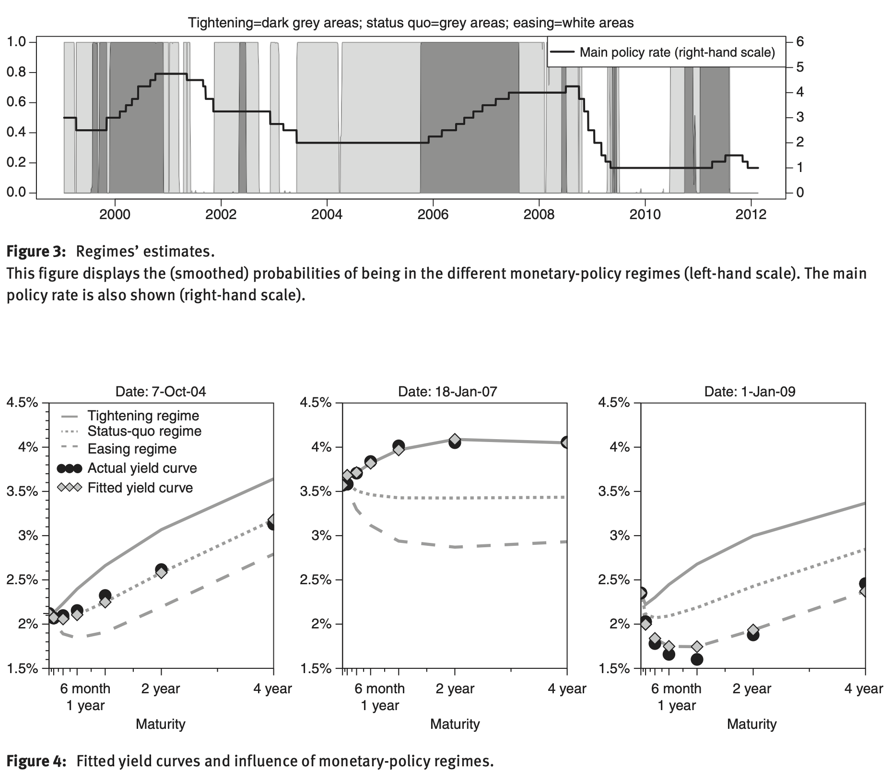

# Estimation of affine asset-pricing models {#Estimation}

## State-space model {#EstimationSSModel}

By nature, dynamic asset-pricing models are *state-space models*: The dynamics of all variables of interest, gathered in vector $y_t$ (yields, equity returns, macroeconomic variables, survey-based variables) are accounted for by state variables ($w_t$). The equations defining the relationship between the other variables and the state variables are called *measurement equations* (Eq. \@ref(eq:measeq)). The equations defining the dynamics of the state variables are called *transition equations* (Eq. \@ref(eq:transeq)).

In the case where $w_t$ is an affine process (see Definition \@ref(def:Car1)), the transition equations admit a VAR(1) representation (Proposition \@ref(prp:affineVAR)). In that case, the state-space model is said to be linear, as formalized by the following definition. This defintion introduces, in particular, the notion of *measurement errors*.


:::{.definition #LSSM name="Linear State-Space Model"}
A linear state-space model writes as follows:
\begin{eqnarray}
\underset{(m \times 1)}{y_t}  &=& A + Bw_t + \eta_t  \quad \mbox{with }  \eta_t \sim i.i.d. \mathcal{N}(0,\Omega) (\#eq:measeq) \\
\underset{(n \times 1)}{w_t} & =& \mu + \Phi w_{t-1} + \Sigma^{\frac{1}{2}}(w_{t-1}) \varepsilon_t,(\#eq:transeq)
\end{eqnarray}
where $\varepsilon_t$ is a martingale difference sequence satisfying  $\mathbb{V}ar_t(\varepsilon_{t+1}) = Id$. The components of $\eta_t$ are measurement errors.
:::

> **Note:** Eq. \@ref(eq:transeq) derives from Proposition \@ref(prp:affineVAR) (Eq. \@ref(eq:VARw)).


In practice, one can distinguish two situations: (a) all state variables (components of $w_t$) are observed and (b) some of these variables are latent. What do we mean by *model estimation* in case (b)? One can distinguish different situations:

* (b.i) We know the model parameters but we want to recover the latent factors---for instance to compute model-implied prices.
* (b.ii) We know neither the model parameters nor the latent variables, we want to estimate both of them.
* (b.iii) We know neither the model parameters nor the latent variables, we are just interested in the model parameters.

In case (a): One can resort to standard estimation techniques (GMM, Maximum Likelihood) to estimate model parameters. Take for instance the maximum-likelihood case, we have:
\begin{eqnarray*}
f(y_t,w_t|\underline{y_{t-1}},\underline{w_{t-1}}) &=& f(y_t|\underline{y_{t-1}},\underline{w_{t}}) \times \underbrace{f(w_t|\underline{y_{t-1}},\underline{w_{t-1}})}_{= f(w_t|\underline{w_{t-1}})}\\
&=& \bv{n}(y_t;A + Bw_t,\Omega) f(w_t|\underline{w_{t-1}}),
\end{eqnarray*}
where $\bv{n}(x;\mu,\Omega)$ denotes the evaluation, at vector $x$, of the p.d.f. of the multivariate normal distribution $\mathcal{N}(\mu,\Omega)$. That is, if $x$ is a $m$-dimensional vector:
\begin{equation}
\bv{n}(x;\mu,\Omega) = \frac{1}{\sqrt{(2 \pi)^{m}|\Omega|}} \exp\left(-\frac{1}{2}\{x - \mu\}'\Omega^{-1}\{x-\mu\}\right).(\#eq:varPHI)
\end{equation}
Once this conditional p.d.f. is known, the total likelihood is given by (conditional on $y_0$ and $w_0$):
$$
\prod_{t=1}^T f(y_t,w_t|\underline{y_{t-1}},\underline{w_{t-1}}).
$$
Of course, $f(w_t|\underline{w_{t-1}})$ depends on the process chosen for $w_t$. If it is  complicated to compute, one can employ Pseudo Maximum Likelihood (PML) [@Gourieroux_Monfort_Trognon_1984]. The p.d.f. may involve, for instance, an infinite sum, which is the case in the ARG case of Example \@ref(exm:ARG1). When $w_t$ is affine, the Pseudo Maximum Likelihood approach consists in replacing $f(w_t|\underline{w_{t-1}})$ by:
$$
\bv{n}(w_t;\mu + \Phi w_{t-1},\Sigma(w_t)),
$$
where $\mu$, $\Phi$ and $\Sigma(w_t)$ are defined in \@ref(eq:MUPHI) and \@ref(eq:SigmaWt) in Proposition \@ref(prp:affineVAR).

In case (b.iii), one can estimate the model by Generalized Method of Moments (GMM), fitting sample moments computed using observed variables (prices, yields, returns). In the context of affine processes, conditional and unconditional moments of the state vector $w_t$ are available in closed from, as shown by \@ref(eq:condmean), \@ref(eq:condvar) and \@ref(eq:uncondmeanvar). If the model-implied moments are not available in closed-form, one may have to to resort to the *Simulated Method of Moments (SMM)* (see, e.g., @GourMonf96 or @Duffie_Singleton_1993).

In cases (b.i) and (b.ii), one has to implement *filtering methods*, on which we focus on  in the following.


## Kalman-filter-based approach {#Estimation:KF}

### The Gaussian linear state-space case

Let us start with a particular case of state-space model (Def. \@ref(def:LSSM)) where $\varepsilon_t$ is Gaussian and where $\Sigma^{\frac{1}{2}}$ does not depend on $w_t$, i.e., with  a homoskedastic linear Gaussian state-space model.

Denote by $\theta$ the vector of parameters that defines the model. For a given $\theta$ and a sequence of observations $\{y_1,\dots,y_T\}$, the Kalman filter computes the distribution of $w_t$ given $\{y_1,\dots,y_t\}$ (see Def. \@ref(def:FiltvsSmooth)). This distribution is Gaussian, and obtained by a recursive algorithm. A byproduct of this algorithm is the likelihood function associated with $\theta$ and $\{y_1,\dots,y_T\}$. This opens the door to the estimation of $\theta$ by MLE, maximizing this function. In this sense, Kalman-filter techniques can address Objective (b.ii).

Let us first introduce the notion of *filtered* and *smoothed* estimates of a latent variable (or vector of variables) $w_t$:

:::{.definition #FiltvsSmooth name="Filtered versus smoothed estimates"}

The filtering and smoothing problems consist in computing the following conditional moments:
\begin{equation*}
\begin{array}{lccllllll}
\mbox{Filtering:} & w_{t|t} & = & \mathbb{E}(w_t|\underline{y_t}) & \mbox{and}  & P_{t|t} &=& \mathbb{V}ar(w_t|\underline{y_t})\\
\mbox{Smoothing:} & w_{t|T} & = & \mathbb{E}(w_t|\underline{y_T}) & \mbox{and} & P_{t|T} &=& \mathbb{V}ar(w_t|\underline{y_T}).
\end{array}
\end{equation*}
:::

The following proposition outlines the Kalman algorithm (see, e.g. @Kim_Nelson_1999).

:::{.proposition #KF name="Kalman filter and smoother"}
If $\varepsilon_t \sim  \mathcal{N}(0,I)$ in the state-space defined in Def. \@ref(def:LSSM), then we have (*filtering*):
$$
w_t|y_1,\dots,y_t \sim  \mathcal{N}(w_{t|t}|P_{t|t}),
$$
where $w_{t|t}$ and $P_{t|t}$ result from the following recursive equations:
$$
\boxed{
\begin{array}{ccl}
w_{t|t} &=& w_{t|t-1} + K_t \lambda_t\\
P_{t|t} &=& (I - K_t B)P_{t|t-1} \\ \\
\mbox{where (updating step)} \\
\lambda_t &=& y_t - A - Bw_{t|t-1}  \quad \mbox{(forecast error)}\\
S_{t|t-1} &=& \mathbb{V}ar(y_t|\underline{y_{t-1}}) = B P_{t|t-1} B' + \Omega\\
K_t &=& P_{t|t-1}B'S_{t|t-1}^{-1} \quad \mbox{(Kalman gain)} \\ \\
\mbox{and where (forecasting step)} \\
w_{t|t-1} &=& \mu + \Phi w_{t-1|t-1} \\
P_{t|t-1} &=& \Sigma + \Phi P_{t-1|t-1} \Phi' \quad (\Sigma = \Sigma^{\frac{1}{2}}{\Sigma^{\frac{1}{2}}}').
\end{array}
}
$$
The log likelihood is (recursively) computed as follows:
\begin{eqnarray}
\log \mathcal{L}(\theta;\underline{y_T}) &=& \frac{mT}{2}\log\left(2\pi\right) (\#eq:logLikKF)\\
&  & -\frac{1}{2}\sum_{t=1}^{T}\left(\log\left|S_{t | t-1}(\theta)\right|+\lambda'_{t}(\theta)S_{t\mid t-1}^{-1}(\theta)\lambda{}_{t}(\theta)\right). \nonumber
\end{eqnarray}

Moreover, we have (*smoothing*):
$$
w_t|y_1,\dots,y_T \sim  \mathcal{N}(w_{t|T}|P_{t|T}),
$$
where $w_{t|T}$ and $P_{t|T}$ result from the following recursive equations:
$$
\boxed{
\begin{array}{ccl}
w_{t|T} & = & w_{t|t}+F_{t}(w_{t+1|T}-w_{t+1|t})\\
P_{t|T} & = & P_{t|t}+F_{t}(P_{t+1|T}-P_{t+1|t})F'_{t}\\ \\
\mbox{where} \\
F_{t} &=& P_{t|t}\Phi'_{t+1}P_{t+1|t}^{-1}.
\end{array}
}
$$
:::

The following figure illustrates the updating step of the Kalman algorithm:

```{r illusKF, echo=FALSE, fig.cap="Updating in the Kalman filter.", fig.asp = .6, out.width = "95%", fig.align = 'left-aligned', message=FALSE}

rho <- .8
var <- .4
xhat <- NaN
sigma <- 2
Sigma <- sigma*matrix(c(1,rho,rho,1),2,2)

library(cluster)
x <- 2*rnorm(1000)
y <- rnorm(1000) + 2*x + 10
xy <- unname(cbind(x, y))
exy <- ellipsoidhull(xy)
# exy # >> calling print.ellipsoid()
# plot(xy)
# lines(predict(exy))
# points(rbind(exy$loc), col = "red", cex = 3, pch = 13)

rho  <- .85
coef <- .85
exy$loc <- c(2,2)

par(mfrow= c(2,1))
layout(matrix(c(1,2)), heights=c(2, 2))

par(plt=c(.15,.95,.1,.95))

x <- seq(-2,6,by=.05)

plot(0,0,col='white',
     xlim=c(-2,6),
     ylim=c(0,1.5),ylab="Density",xlab="",xaxt="n",yaxt="n")

# sigmax <- sqrt(var)
# Ex <- 1.5
# densx <- 1/sqrt(2*pi*sigmax^2)*exp(-.5*(x-Ex)^2/sigmax^2)
# lines(x,densx,col='forestgreen',lwd=2,lty=1)
# 
# arrows(-.5,.7,1,.5,length=.1,col="forestgreen")
# text(-.5,.85,expression(paste("density ",X[t-1]/Y[t-1],",",Y[t-2],",",...,sep="")))    

sigma <- 1
Sigma <- sigma*matrix(c(1,rho,rho,1),2,2)
sigmax <- sqrt(Sigma[1,1])
Ex <- 2
x <- seq(-2,6,by=.05)
densx <- 1/sqrt(2*pi*sigmax^2)*exp(-.5*(x-Ex)^2/sigmax^2)
lines(x,densx,col='black',lwd=2)
abline(v=exy$loc[2],lty=2)

arrows(1,1.17,1.5,.36,length=.1,col="black")
text(.5,1.3,expression(paste("density ",X[t]/Y[t-1],",",Y[t-2],",",...,sep="")))

abline(v=xhat,lty=2,col='red')

sigmax <- sqrt(var)
y <- 3.8
Ex <- 2 + coef * (y - 2)
x  <- seq(-2,6,by=.05)
densx <- 1/sqrt(2*pi*sigmax^2)*exp(-.5*(x-Ex)^2/sigmax^2)
lines(x,densx,lwd=2,col="red")

arrows(5,1,4.5,.2,length=.1,col="red")
text(5,1.1,expression(paste("density ",X[t]/Y[t],",",Y[t-1],",",...,sep="")))


par(plt=c(.15,.95,.17,.95))

x <- seq(-2,6,by=.05)

sigma0 <- .5
Sigma <- sigma*matrix(c(1,rho,rho,1),2,2)

plot(0,0,col="white",xlim=c(-2,6),ylim = c(-2,7),lwd=2,xlab="",
     ylab="",xaxt="n",yaxt="n")
mtext(expression(X[t]),side=1,line=1)
mtext(expression(Y[t]),side=2,line=1)

sigma <- 1
Sigma <- sigma*matrix(c(1,rho,rho,1),2,2)
exy$cov <- Sigma
lines(predict(exy),lwd=2)

abline(h=exy$loc[1],lty=2)
abline(v=exy$loc[2],lty=2)
sigma <- 2
Sigma <- sigma*matrix(c(1,rho,rho,1),2,2)
exy$cov <- Sigma
lines(predict(exy),type='l',lwd=2)
sigma <- 3.5
Sigma <- sigma*matrix(c(1,rho,rho,1),2,2)
exy$cov <- Sigma
lines(predict(exy),type='l',lwd=2)

arrows(0,5,1.2,3,length=.1)
text(-.7,6.7,"Contour (iso-density) of")
text(-.7,5.7,expression(paste("(",X[t],",",Y[t],")","/",Y[t-1],",",Y[t-2],",",...,sep="")))      

sigma <- 1
Sigma <- sigma*matrix(c(1,rho,rho,1),2,2)
coef <- Sigma[2,1]*(1/Sigma[1,1])
var <- Sigma[2,2] - Sigma[2,1]*(1/Sigma[1,1])*Sigma[1,2]

Y <- seq(-2,6,by=.05)

lines(2+coef*(Y-2),Y,col="blue",lwd=2)
arrows(5,1,5,5.5,length=.1,col="blue")
text(5,.8,expression(paste(E(X[t]/Y[t],Y[t-1],...),sep="")),pos=1,col="blue")        

y <- 3.8
abline(h=y,col="red",lwd=2)
text(-1,y+.5,expression(Y[t]==y),col='red')

xhat <- 2+coef*(y-2)
lines(c(xhat,xhat),c(y,7),col="red",lty=2)
arrows(xhat,6.8,xhat,7.2,col="red",length=.05)


```


The recursive equations of the Kalman filter need to be initialized. That is, one needs to provide initial values for $w_{0|0}$, $P_{0|0}$. Different possibilities have been proposed. One can for instance:

* Include the elements of($w_{0|0}$, $P_{0|0}$) among the parameters to estimate;
* Set $w_{0|0}$ and $P_{0|0}$ to their unconditional values (using, e.g., \@ref(eq:uncondmeanvar));
* Set $w_{0|0}$ to a prior value and take either an arbitrary large value for $P_{0\mid0}$ if the prior value is uncertain (which depicts a situation of  *diffuse prior*) or a small value for $P_{0\mid0}$ if we are confident in this prior value $w_{0|0}$.


:::{.example #RKalman name="Kalman filtering and smoothing"}

To illustrate, consider the following model:
\begin{eqnarray}
\left[\begin{array}{c}
y_{1,t}\\
y_{2,t}
\end{array}\right] & = &
\left[\begin{array}{cc}
\alpha_{1} & 0\\
0 & \alpha_{2}
\end{array}\right]
\left[\begin{array}{c}
y_{1,t-1}\\
y_{2,t-2}
\end{array}\right]+\left[\begin{array}{c}
\gamma_{1}\\
\gamma_{2}
\end{array}\right]w_{t}+ D\eta_t\label{eq_measur}\\
w_{t} & = & \phi w_{t-1}+\varepsilon_{t},\label{eq_trans}
\end{eqnarray}
where $\eta_t \sim \mathcal{N}(0,Id)$.

In the following lines, we specify one version of the previous model. We simulate trajectories of $y_{1,t}$, $y_{2,t}$ and $w_t$ over 100 periods (Figure \@ref(fig:Kalmansimul)) and we further call `Kalman_filter` and `Kalman_filter` (from the `TSModels` package) to compute the filtered and smoothed estimates of $w_t$ (Figure \@ref(fig:Kalman2)).

```{r Kalman1, echo=TRUE, fig.cap="XXXX.", fig.asp = .6, out.width = "95%", fig.align = 'left-aligned', message=FALSE}
library(TSModels) # Kalman filter procedure in there.
# Set model specifications:
alpha1 <- .5;alpha2 <- .95;Alpha <- diag(c(alpha1,alpha2))
d_11 <- 1;d_12 <- .5;d_21 <- .5;d_22 <- 2
D <- matrix(c(d_11,d_21,d_12,d_22),2,2)
gamma1 <- 1;gamma2 <- 2;Gamma <- matrix(c(gamma1,gamma2),2,1)
phi <- .8
# Simulate model:
T <- 100
Y <- NULL;X <- NULL
Alpha.Y_1 <- NULL
y <- c(0,0);x <- 0
for(i in 1:T){
  Alpha.Y_1 <- rbind(Alpha.Y_1,c(Alpha %*% y))
  y <- Alpha %*% y + Gamma * x + D %*% rnorm(2)
  x <- phi * x + rnorm(1)
  Y <- rbind(Y,t(y));X <- rbind(X,x)}
# Define matrices needed in the Kalman_filter procedures:
nu_t <- matrix(0,T,1)
H <- phi;G <- Gamma
mu_t <- Alpha.Y_1
N <- 1;M <- D
Sigma_0 <- 1/(1-phi^2) # unconditional variance of w
rho_0 <- 0 # unconditional mean of w
filter.res   <- Kalman_filter(Y,nu_t,H,N,mu_t,G,M,Sigma_0,rho_0)
smoother.res <- Kalman_smoother(Y,nu_t,H,N,mu_t,G,M,Sigma_0,rho_0)
```

```{r Kalmansimul, echo=FALSE, fig.cap="Simulated trajectories of $y_{1,t}$, $y_{2,t}$, and $w_t$.", fig.asp = .6, out.width = "95%", fig.align = 'left-aligned', message=FALSE}

par(mfrow=c(3,1))
par(plt=c(.1,.95,.2,.75))

par(mfrow=c(3,1))
plot(Y[,1],type="l",main=expression(Y[1*","*t]),lwd=2,xlab="",ylab="")
plot(Y[,2],type="l",main=expression(Y[2*","*t]),lwd=2,xlab="",ylab="")
plot(X,type="l",main=expression(X[t]),lwd=2,xlab="",ylab="")
```

```{r Kalman2, echo=FALSE, fig.cap="Filtered and smoothed estimates of $w_t$.", fig.asp = .6, out.width = "95%", fig.align = 'left-aligned', message=FALSE}

par(mfrow=c(2,1))
par(plt=c(.1,.95,.15,.99))

plot(X,type="l",lwd=2,xlab="",ylab="")
lines(filter.res$r,col="red",lwd=2)
lines(smoother.res$r,col="blue",lwd=2,lty=1)

legend("topright",
       c(expression(X[t]),
         expression(paste("Filtered values of ",X[t],sep="")),
         expression(paste("Smoothed values of ",X[t],sep=""))),
       lwd=c(2), # line width
       lty=c(1,1,1),
       col=c("black","red","blue"),
       seg.len = 4,
       bg = "white"
)

plot(sqrt(filter.res$Sigma_tt),type="l",main="",
     lwd=2,xlab="",ylab="",col="red",ylim=c(min(sqrt(smoother.res$S_smooth)),
                                            max(sqrt(filter.res$Sigma_tt))))
lines(sqrt(smoother.res$S_smooth),lwd=2,col="blue")

legend("topright",
       c(expression(paste("Filtering standard error ",sqrt(Var(X[t*"|"*t])),sep="")),
         expression(paste("Smoothing standard error ",sqrt(Var(X[t*"|"*T])),sep=""))),
       lwd=c(2), # line width
       lty=c(1,1,3),
       col=c("red","blue"),
       seg.len = 4,
       bg = "white"
)
```

:::

### Missing observations

In many application, one does not observe all the entries of $y_t$ at every date. This arises for instance in situations where (i) measurement variables feature different frequencies, (ii) we have unreliable data for some period (that we prefer not to include among observations), (iii) some of the measurement variables are observed over a shorter time span.

These situations are easily addressed by Kalman filtering/smoothing (e.g., @Chow_Lin_1971 or @Harvey_Pierse_1984). To accommodate missing observations in some of the $y_t$'s, one simply has to change the size of this vector (and of $\lambda_t$, $S_{t|t-1}$, $A$ and $B$) for the relevant dates. Of course, the accuracy of $w_{t|t}$ will tend to be lower during periods where one or several (or all) the entries of $y_t$ are unobserved. (This will be apparent in the resulting covariance matrix of $w_{t|t}$, namely $P_{t|t}$.) The log-likelihood computation of \@ref(eq:logLikKF) is still valid in this case; one simply has to adjust the number of observed variables at each iteration; that is, $m$ then depends on time.

:::{.example #RKalmanMissing name="Kalman filtering and smoothing"}

This example extends Example \@ref(exm:RKalmanMissing). We take the simulated path of the obeerved variables $y_{1,t}$ and $y_{2,t}$ and remove observations of $y_{1,t}$ (respectively of $y_{2,t}$) between periods $t=30$ and $t=50$ (resp. between periods $t=40$ and $t=70$), and then use the Kalman filter and smother to recover the states $w_t$ in this situation with  missing observations.

```{r Kalman4, echo=TRUE, fig.cap="XXXX.", fig.asp = .6, out.width = "95%", fig.align = 'left-aligned', message=FALSE}
Y.modif <- Y
Y.modif[30:50,1] <- NaN
Y.modif[40:70,2] <- NaN
# Call of Kalman filter and smoother:
filter.res   <- Kalman_filter(Y.modif,nu_t,H,N,mu_t,
                              G,M,Sigma_0,rho_0)
smoother.res <- Kalman_smoother(Y.modif,nu_t,H,N,mu_t,
                                G,M,Sigma_0,rho_0)
```

```{r Kalman5, echo=FALSE, fig.cap="Situation of missing observations.", fig.asp = .6, out.width = "95%", fig.align = 'left-aligned', message=FALSE}
par(mfrow=c(3,1))
par(plt=c(.15,.95,.3,.95))

par(mfrow=c(2,1))
plot(Y.modif[,1],type="l",main=expression(y[1*","*t]),lwd=2,xlab="",ylab=expression(y[1*","*t]))
plot(Y.modif[,2],type="l",main=expression(y[2*","*t]),lwd=2,xlab="",ylab=expression(y[2*","*t]))
```


```{r Kalman6, echo=FALSE, fig.cap="Filtered and smoothed estimates of $w_t$ in a situation of missing observations. The lower plot shows the standard errors associated with filtered and smoothed estimates. As expected, undertainty is larger for those dates where observations are missing.", fig.asp = .6, out.width = "95%", fig.align = 'left-aligned', message=FALSE}

par(mfrow=c(2,1))
par(plt=c(.1,.95,.2,.99))

plot(X,type="l",lwd=2,xlab="",ylab="",main="")
lines(filter.res$r,col="red",lwd=2)
lines(smoother.res$r,col="blue",lwd=2,lty=1)

legend("topright", 
       c(expression(w[t]),
         expression(paste("Filtered values of ",w[t],sep="")),
         expression(paste("Smoothed values of ",w[t],sep=""))),
       lwd=c(2), # line width
       lty=c(1,1,1),
       col=c("black","red","blue"), # gives the legend lines the correct color and width
       seg.len = 4,
       bg = "white"
)

plot(sqrt(filter.res$Sigma_tt),type="l",
     lwd=2,xlab="",ylab="",col="red",main="",
     ylim=c(min(sqrt(smoother.res$S_smooth)),1.4*max(sqrt(filter.res$Sigma_tt))))
lines(sqrt(smoother.res$S_smooth),lwd=2,col="blue")

legend("topleft", 
       c(expression(paste("Filtering standard error ",sqrt(Var(w[t*"|"*t])),sep="")),
         expression(paste("Smoothing standard error ",sqrt(Var(w[t*"|"*T])),sep=""))),
       lwd=c(2), # line width
       lty=c(1,1,3),
       col=c("red","blue"),
       seg.len = 4,
       bg = "white"
)


```


:::


<!-- \begin{center} -->
<!-- \includegraphics[width=.8\linewidth]{figures/Figure_Kalman3_new.pdf} -->
<!-- \end{center} -->

<!-- \begin{center} -->
<!-- \includegraphics[width=1\linewidth]{figures/Figure_Kalman4_new.pdf} -->
<!-- \end{center} -->


### About non-constant conditional matrix $\Sigma$ {#KalmanQML}

Proposition \@ref(prp:KF) is valid when $\varepsilon_t$ is Gaussian and when $\Sigma^{\frac{1}{2}}$ does not depend on $w_t$. However, in the general case (but when $w_t$ is an affine process), we have that $\Sigma(w_{t-1}) \equiv \mathbb{V}ar(w_{t+1}|\underline{w_t})$ is affine in $w_t$ (see Prop. \@ref(prp:affineVAR)). In order to deal with this, the Kalman filter algorithm can be modified. Specifically, in the prediction step (see Prop. \@ref(prp:KF)), $P_{t|t-1}$ can be approximated by:
$$
P_{t|t-1} = \Sigma\color{red}{(w_{t-1|t-1})} + \Phi P_{t-1|t-1} \Phi',
$$
i.e., we replace $\Sigma(w_{t-1})$ by $\Sigma(w_{t-1|t-1})$.

Although this approach is not optimal---in the sense that it does not deliver the conditional expectation of Def. \@ref(def:FiltvsSmooth)---it shows good empirical properties (@deJong_2000 or @Duan_Simonato_1999). In order to test for the validity of the approach in a specific context, one can resort to Monte-Carlo simulations [@zarg_2017].

### Non-linear models {#nonlinear}

As soon as $w_t$ follows an affine process, it admits the VAR dynamics presented in Prop. \@ref(prp:affineVAR), i.e., it features a linear transition equation. However, measurement equations may be non-linear (affine) functions of $w_t$. This is in particular the case if observed variables include Swaps rates (see Eq. \@ref(eq:swap) of Subsection \@ref(Swaps)), CDS rates (see Subsection \@ref(CreditCDS), in particular Eq. \@ref(eq:MCCDSformula1)) or prices of tranche products (see Example \@ref(exm:DD)).

In a context of non-linear measurement equations, one can for instance resort to the Extended Kalman Filter (linearizing the measurement equations) or, to higher-order Taylor. @Monfort_Renne_Roussellet_2015 develop a Quadratic Kalman Filter (QKF), where measurement equations are quadratic functions of the state vector.


## The inversion technique {#EstimationInversion}

The inversion technique has been introduced by @Chen_Scott_1993. It is used, e.g., by @Ang_Piazzesi_2003 and @Liu_longstaff_Mandell_2006. Contrary to Kalman-type approaches, this approach is not recursive. it can therefore be faster, especially for long sample.

This approach works under the assumption that some of the observed variables are *perfectly priced* (or modelled).(Recall that $y_t$ and $w_t$ are respectively of dimension $m$ and $n$, see \@ref(eq:measeq) and \@ref(eq:transeq) in Def. \@ref(def:LSSM).) Formally:


:::{.hypothesis #perfectlymodelled name="Perfectly-modelled variables"}

$n$ components of the $m$-dimensional vector $y_t$ (with $n \le m$) are perfectly modelled. That is, there is no measurement errors in associated measurement equations.

Without loss of generality, these perfectly-modelled variables are the first $n$ components of $y_t$, that is:
$$
y_t =
\left(\begin{array}{c}
\underbrace{y_{1,t}}_{(n \times 1)} \\
\underbrace{y_{2,t}}_{(m-n)\times1}
\end{array}\right).
$$
:::


Under Assumption \@ref(hyp:perfectlymodelled), the measurement equation \@ref(eq:measeq) becomes:
$$
\left[
\begin{array}{c}
y_{1,t}\\
y_{2,t}
\end{array}
\right]
=
\left[
\begin{array}{c}
A_{1}\\
A_{2}
\end{array}
\right]+
\left[
\begin{array}{c}
B_{1}\\
B_{2}
\end{array}
\right]w_t +
\left[
\begin{array}{c}
0\\
\eta_{2,t}
\end{array}
\right],
$$
where $\eta_{2,t} \sim  \mathcal{N}(0,\Omega_2)$ (say). This notably implies that
\begin{equation}
w_t = B_{1}^{-1}(y_{1,t} - A_1).(\#eq:wY1)
\end{equation}

Under this assumption, and if the conditional distribution of $w_t$ is available in closed form, then Proposition \@ref(prp:logLikinversion) shows that the (exact) likelihood of the model can then be computed. This proposition shows in particular that the conditional p.d.f.  $f_{Y_t|\underline{Y_{t-1}}}(y_t;\underline{y_{t-1}})$ involves three terms:

* The first term (in blue in \@ref(eq:inversionLogL)) stems from the conditional distribution $w_t|\underline{w_{t-1}}$.
* The second term (in red in \@ref(eq:inversionLogL)) is associated with the measurement errors pertaining to $y_{2,t}$, that are the components of $\eta_{2,t}$.
* The third term (in brown in \@ref(eq:inversionLogL)) is the determinant of the Jacobian matrix associated with the linear transformation \@ref(eq:wY1) between $w_t$ and $y_{1,t}$  , that is $|B_1|$.

Once one knows how to compute $f_{Y_t|\underline{Y_{t-1}}}(y_t;\underline{y_{t-1}})$, the total likelihood is easily obtained since:
$$
f_{Y_1,\dots,Y_T}(y_1,y_2,\dots,y_T) = f_{Y_1}(y_1) \prod_{t=2}^T f_{Y_t|\underline{Y_{t-1}}}(y_t;\underline{y_{t-1}}).
$$

:::{.proposition #logLikinversion name="Log-likelihood in the inversion context"}
In the context of a linear state-space model as defined in Def. \@ref(def:LSSM), under Assumption \@ref(hyp:perfectlymodelled), and if $w_t$ is a Markovian process, we have:
\begin{eqnarray}
f_{Y_t|\underline{Y_{t-1}}}(y_t;\underline{y_{t-1}}) &=& \color{blue}{f_{w_t|w_{t-1}}(w(y_{1,t});w(y_{t-1}))} \times \nonumber\\
&& \color{red}{\bv{n}(y_{2,t}; A_2 + B_2w(y_{1,t}),\Omega_2)} \times \color{brown}{|B_1|^{-1}}.(\#eq:inversionLogL)
\end{eqnarray}
where $w(y_{1,t}) = B_{1}^{-1}(y_{1,t} - A_1)$ and where $\bv{n}$ denotes the multivariate normal p.d.f. (Eq. \@ref(eq:varPHI)).
:::
:::{.proof}
Since $w_t$ is Markov, so is $y_{1,t}$ and since $y_{2,t} = A_2 + B_2 w(y_{1,t}) + \eta_{2,t}$, with $w(y_{1,t}) = B_{1}^{-1}(y_{1,t} - A_1)$, we have:
\begin{eqnarray*}
f(y_t|y_{t-1}) &=& f_1(y_{1,t}|y_{1,t-1}) f_2(y_{2,t}|y_{1,t}) \\
&=& |B_1|^{-1} f_w(w(y_{1,t})|w(y_{1,t-1})) \bv{n}(y_{2,t}; A_2 + B_2w(y_{1,t}),\Omega_2),
\end{eqnarray*}
where

* $f_1(y_{1,t}|y_{1,t-1})= |B_1|^{-1} f_w(w(y_{1,t})|w(y_{1,t-1}))$ comes from the fact that, if $U$ and $V$ are two random variables such that $V = g(U)$, where $g$ is a bijective and differentiable function, then $f_V(v)=\left|\frac{\partial g^{-1}(v)}{\partial v'}\right| f_U(g^{-1}(v))$,
* and $f_2(y_{2,t}|y_{1,t}) = \bv{n}(y_{2,t}; A_2 + B_2w(y_{1,t}),\Omega_2)$ comes from the fact that $y_{2,t}|y_{1,t} \sim \mathcal{N}(A_2 + B_2 w(y_{1,t}),\Omega_2)$.
:::


### Dealing with unobserved regimes {#EstimationRS}

Kalman and inversion techniques are not suited to the case where some of the components of $w_t$ are valued in a discrete set. This is typically the case if $w_t$ is of the form:
$$
w_t = \left(\begin{array}{c}
z_t \\
x_t
\end{array}\right),
$$
where $z_t$ is valued in $\{e_1,\dots,e_J\}$, $e_j$ being the $j^{th}$ column of $Id_J$, which is the case in the prsence of regime switching features (see Subsection \@ref(Markov)).

Assume that $z_t$ is an exogenous and homogenous Markov chain whose dynamics is defined by the $\pi(e_i,e_j)$'s that are such that:
\begin{equation}
\pi(e_i, e_j) = \mathbb{P}(z_{t+1}=e_j | z_t=e_i).(\#eq:transitproba)
\end{equation}
Denote by $\Pi$ the matrix of transition probabilities, i.e., the $(i,j)$ component of $\Pi$ is $\pi(e_i, e_j)$. Assume further that we have:
\begin{equation}
x_t = m(z_t,x_{t-1}) + \varepsilon_t,(\#eq:dynxRS)
\end{equation}
where $\mathbb{E}(\varepsilon_t|\underline{z_t},\underline{x_{t-1}})=0$.

We denote the conditional distribution of $\varepsilon_t$ w.r.t. $(z_t,x_{t-1})$ by $f_{\varepsilon}(.;z_t,x_{t-1})$.


:::{.hypothesis #RSmeasurement name="Measurement equations"}
The measurement equation is of the form:
\begin{equation}
y_t = A z_t + B x_t + \eta_t,  \quad \mbox{with }  \eta_t \sim i.i.d. \mathcal{N}(0,\Omega).(\#eq:RSmeasur)
\end{equation}
:::

:::{.example #GRSVAR name="Regime-Switching Gaussian VAR"}

Building on Example \@ref(exm:RSVAR), we know that if
\begin{equation}
x_t = \mu z_t + \Phi x_{t-1} +  \varepsilon_t,(\#eq:xRSVAR)
\end{equation}
where $\varepsilon_t|\underline{x_t},z_t \sim   \mathcal{N}(0,\Sigma(z_t))$ and if $z_t$ is an exogenous independent Markov chain, then $w_t = (x_t',z_t')'$ is affine. Using the notations of \@ref(eq:dynxRS), we have:
$$
m(z_t,x_{t-1}) = \mu z_t + \Phi x_{t-1}.
$$
If $r_t$ and the SDF are respectively affine and exponential in $w_t$, then, in particular, yields are also affine in $w_t$, i.e. of the form $i_{t,h}= A_h'z_t + B_{h}'x_t$, as in, e.g., \@ref(eq:RthAB). Therefore, if the components of $y_t$ are yields of different maturities, the measurement equations are consistent with Assumption \@ref(hyp:RSmeasurement).
:::


How to estimate such a model when the regimes $z_t$ are unobservable? We distinguish two distinct situations:

**Case 1. The $x_t$ factors are observable.** The probabilities of being in the different regimes on each date can be estimated by employing the Kitagawa-Hamilton filter, with (using the notations of Proposition \@ref(prp:KitagHamilton)): $F_t = (y_t',x_t')'$ and
\begin{eqnarray*}
f(F_t|z_t=e_j,\underline{F_{t-1}}) &=& f(y_t|x_t,z_t=e_j,\underline{F_{t-1}})f(x_t|z_t=e_j,\underline{F_{t-1}}) \\
&=& \bv{n}(y_t;A z_t + B x_t,\Omega) \times \\
&&f_{\varepsilon}(x_t - m(z_t,x_{t-1});z_t,x_{t-1}),
\end{eqnarray*}
where $\bv{n}(u;\mu,\Omega)$ denotes the evaluation, at vector $u$ of the p.d.f. of the multivariate normal distribution $\mathcal{N}(\mu,\Omega)$---see \@ref(eq:varPHI). A by-product of the Kitagawa-Hamilton filter is the likelihood function associated with the dataset. As a result, the model parameterization can be estimated by maximum llikelihood approach.

**Case 2. The $x_t$ factors are not observable.** There are two sub-cases:

* (2.i) the components of $y_t$ are not perfectly modelled (i.e. $\Omega \ne 0$, where $\Omega$ defined in \@ref(eq:RSmeasur). One has then to resort to filters dealing with two types of uncertainty: hidden discrete values ($z_t$) and continuously distributed latent variables ($x_t$). @Kim_1994's filter can be employed when the state-space model is of the form \@ref(eq:RSmeasur)-\@ref(eq:xRSVAR) (see, e.g., @Monfort_Renne_2014, detailed in Example \@ref(exm:SovereignSpreads)).
 * (2.ii) $n_x$ components of $y_t$ are perfectly modelled (where $n_x$ is the dimension of $x_t$). One can then resort to an inversion technique, complemented with the Kitagawa-Hamilton filter, to estimate the model (see @Monfort_Renne_2013 and @Renne_2017 for applications).


:::{.proposition #KitagHamilton name="Kitagawa-Hamilton filter"}
Consider a $q$-dimensional vector of variables $F_t$ and an exogenous homogenous Markov chain $z_t$. We make use of the following notations:

* $\eta_t$ is a $J$-dimensional vector whose $j^{th}$ component is the p.d.f. of $F_t$ conditional on $(z_t = e_j,\underline{F_{t-1}})$, i.e. $f(F_t|z_t=e_j,\underline{F_{t-1}})$
* $\xi_{t}$ is a $J$-dimensional vector whose $j^{th}$ component is $\mathbb{P}(z_t = e_j|\underline{F_t})$.

The sequence $\xi_{t}$ can then be computed recursively as follows:
\begin{equation}
\xi_t = \frac{(\Pi' \xi_{t-1}) \odot \eta_t}{\bv{1}'(\Pi' \xi_{t-1} \odot \eta_t)},(\#eq:KHfilter)
\end{equation}
where $\odot$ denotes the element-by-element (Hadamard) product and where $\bv{1}$ denotes a $J$-dimensional vector of ones.

Moreover, the previous formulas also show how to compute the likelihood of the model since:
\begin{equation}
f(F_t|\underline{F_{t-1}})=\bv{1}'(\Pi' \xi_{t-1} \odot \eta_t).(\#eq:KHlikelihood)
\end{equation}
:::


### Mixed use of Kitagawa-Hamilton and inversion techniques {#MixedKitagawaHamilton}

Without loss of generality, assume that the $n_x$ first components of $y_t$ are observed without error, i.e. Assumption \@ref(hyp:RSmeasurement) becomes
$$
\left[
\begin{array}{c}
y_{1,t}\\
y_{2,t}
\end{array}
\right]
=
\left[
\begin{array}{c}
A_{1}z_t\\
A_{2}z_t
\end{array}
\right]+
\left[
\begin{array}{c}
B_{1}\\
B_{2}
\end{array}
\right]x_t +
\left[
\begin{array}{c}
0\\
\eta_{2,t}
\end{array}
\right],
$$
where $\varepsilon_2 \sim \mathcal{N}(0,\Omega_2)$.


Since $y_{1,t} = A_1 z_t + B_1 x_t$, we then have:
\begin{equation}
x_t \equiv x(y_{t},z_t) = B_1^{-1}(y_{1,t} - A_1 z_t).(\#eq:xRS)
\end{equation}

In order to employ the Kitagawa-Hamilton filter (Proposition \@ref(prp:KitagHamilton)), one need to define the extended Markov chain:
$$
\mathcal{Z}_t = z_{t-1} \otimes z_t,
$$
whose matrix of transition probabilities is detailed in Proposition \@ref(prp:mixedKFinversion).


:::{.proposition #mixedKFinversion name="Kitagawa-Hamilton and inversion techniques"}

The matrix of transition probabilities of $\mathcal{Z}_t$ is of the form $\bv{1}_{n \times 1} \otimes \widetilde{\Pi}$, with
$$
\widetilde{\Pi} =
\left[
\begin{array}{ccccc}
\pi_{1,\bullet} & 0_{1 \times n} \dots & & & 0_{1 \times n} \\
0_{1 \times n} & \pi_{2,\bullet} & 0_{1 \times n} & \dots & 0_{1 \times n} \\
&& \ddots \\
& &  0_{1 \times n} & \pi_{n-1,\bullet} & 0_{1 \times n} \\
0_{1 \times n} &\dots && 0_{1 \times n} & \pi_{n,\bullet}
\end{array}
\right],
$$
where $\pi_{i,\bullet}$ denotes the $i^{th}$ row of $\Pi$ ($\Pi$ is defined on Slide XXX).

The last term appearing in Eq. \@ref(eq:conddistri4KHfilter) can be computed as follows:
\begin{eqnarray*}
&&f\left(\left[\begin{array}{c}x(y_t,z(\mathcal{Z}_t))\\y_{2,t}\end{array}\right]|\mathcal{Z}_t,\underline{y_{t-1}}\right) \\
&=& f\left(y_{2,t}|x_t=x(y_t,z(\mathcal{Z}_t)),\mathcal{Z}_t,\underline{y_{t-1}}\right) \times\\
&& f\left(x(y_t,z(\mathcal{Z}_t))|\mathcal{Z}_t,\underline{y_{t-1}}\right) \\
&=& \bv{n}(y_{2,t};A_2z_t + B_2x_t,\Omega_2) \times\\
&& f_\varepsilon\left(\varepsilon_t|z_t = z(\mathcal{Z}_t),x_{t-1}=x(y_{t-1},z_{-1}(y_{t-1},\mathcal{Z}_t))\right),
\end{eqnarray*}
where $\bv{n}$ is the p.d.f. of a multivariate normal distri, (Prop. \@ref(prp:logLikinversion), where $\varepsilon_t = x_t - m[z(\mathcal{Z}_t),x(y_{t-1},z_{-1}(y_{t-1},\mathcal{Z}_t))]$ ($m$ defined in Eq. \@ref(eq:dynxRS)).

:::


Note that we have:
$$
\left\{
\begin{array}{cclll}
z_t &\equiv& z(\mathcal{Z}_t) &=& (\bv{1}' \otimes Id_{n}) \mathcal{Z}_t \\
z_{t-1} &\equiv& z_{-1}(\mathcal{Z}_t) &=& (Id_{n} \otimes \bv{1}') \mathcal{Z}_t.
\end{array}
\right.
$$

The Kitagawa-Hamilton filter (Proposition \@ref(prp:KitagHamilton)) can then be employed, with $F_t = y_t$ and:
\begin{eqnarray}
f(y_t|\mathcal{Z}_t,\underline{y_{t-1}}) &=&|B_1^{-1}| \times \nonumber \\
&& f\left(\left[\begin{array}{c}x(y_t,z(\mathcal{Z}_t))\\ y_{2,t}\end{array}\right]|\mathcal{Z}_t,\underline{y_{t-1}}\right),(\#eq:conddistri4KHfilter)
\end{eqnarray}
where the computation of the last term is detailed in Proposition \@ref(prp:mixedKFinversion).


:::{.example #RSMP name="Interest-rate model with monetary policy-related regimes"}

@Renne_2017 porposes a model where regimes have monetary-policy interpretations. The model is estimated on daily data. The short-term rate is the euro-area overnight interbank rate (EONIA). It is modeled as follows:
\begin{equation}
\boxed{r_{t}=\underset{\mbox{Target}}{\underbrace{\bar{r}_{t}}}+\underset{\mbox{EONIA spread}}{\underbrace{x_{t}}}.}
\end{equation}
The target rate $\bar{r}_{t}$ has a step-like path $\bar{r}_{t}=\Delta'z_{r,t}$,
where

* $\Delta=[\begin{array}{ccccc}
0 & 0.25 & 0.50 & \ldots & \bar{r}_{max}\end{array}]'$ and
* $z_{r,t}=[\begin{array}{ccccccc}
0 & \ldots & 0 & 1 & 0 & \ldots & 0\end{array}]'$
* EONIA spread ($x_t$) persistent and mean-reverting fluctuations (AR process).
* $z_t = z_{r,t}\otimes z_{m,t}$ where $z_{m,t}$ is the monetary-policy regime:
* Easing  ($z_{m,t}=[\begin{array}{ccc}
1 & 0 & 0\end{array}]$),
* Status Quo ($z_{m,t}=[\begin{array}{ccc}
0 & 1 & 0\end{array}]$),
* Tightening ($z_{m,t}=[\begin{array}{ccc}
0 & 0 & 1\end{array}]$).

One can simulate this model by using this [web-interface](https://fixed-income.shinyapps.io/NLIR/).

In terms of observability, $z_{r,t}$ is observed (since the policy rate is osberved), but not $z_{m,t}$. Hence, a filtering procedure is needed. @Renne_2017 adapts the approach presented in Subsection \@ref(MixedKitagawaHamilton) to the case where $z_{t}$ is partially observed.

In this model, the results of Example \@ref(exm:GRSVAR) imply that we have:
$$
R(t,h) = A_h' z_t + B_h x_t.
$$
Denote by $\mathcal{A}_h$ the $(3 \times n_r)$ matrix such that $A_h = vec(\mathcal{A}_h)$. We then have $A_h' z_t = (\mathcal{A}_h z_{r,t})' z_{m,t}$ and, therefore:
$$
R(t,h) = A_{t,h}' z_t + B_h x_t, \quad \mbox{where $A_{t,h} = \mathcal{A}_h z_{r,t}$.}
$$
The model is estimated by a combination of Kitagawa-Hamilton and inversion techniques, assuming that a linear combination of yields is modeled without errors (which gives $x_t = x(y_t,z_{m,t},z_{r,t})$).

```{r figRenne2017, fig.align = 'center', out.width = "95%", fig.cap = "Source: Renne (2017).", echo=FALSE}

```
:::


## A typical small-sample issue {#EstimationPersistency}

Interest rates are particularly persistent variables. Since affine models eventually lead to linear relationships between state variables and interest rates (see Eq. \@ref(eq:RthAB)), some state variables are also necessarily highly persistent. Accordingly, in small sample, maximum-likelihood estimates of the model parameters are likely to suffer from a downward bias (see, e.g., @Bauer_Rudebusch_Wu_2012 or @Jardet_Monfort_Pegoraro_2013). This relates to a well-known econometric problem  illustrated by Figure \@ref(fig:persist1).

```{r persist1, echo=FALSE, fig.cap="1000 random walk samples of size $T$ ($T=50$ for the left plot and $T=400$ for the right plot) have been simulated. For each sample, we run the OLS regression $y_t = \\phi y_{t-1} + \\varepsilon_t$ to estimate $\\phi$ (whose true value is 1). The plots show the distributions (kernel-based estimation) of the estimated $\\phi$. The vertical red bar indicate the means of the distributions; the vertical blue line shows the usual bias approximation ($1-5.3/T$).", fig.asp = .6, out.width = "95%", fig.align = 'left-aligned', message=FALSE}

library(AEC)
y.0 <- c(0)
c <- 0
nb.sim <- 2000
theta <- c(1)
phi <- c(1)
sigma <- 1

vec.T <- c(50,400)

par(mfrow=c(1,2))
par(plt=c(.2,.9,.2,.85))

for(T in vec.T){
  y.sim <- sim.arma(c,phi,theta,sigma,T,y.0,nb.sim)
  Y   = y.sim[2:T,]
  Y_1 = y.sim[1:(T-1),]
  vec.rho.hat = apply(Y*Y_1,2,sum) / apply(Y_1^2,2,sum)
  dens <- density(vec.rho.hat)

  main.t <- paste("T =",toString(T))

  mean.rho.hat <- sum(dens$x*dens$y)/sum(dens$y)
  plot(dens,xlab=expression(paste("OLS-estimated ",phi,sep="")),ylab="",
       main=main.t)
  abline(v=mean.rho.hat,col="red")
  abline(v=1-5.3/T,lty=3,lwd=2,col="blue")
}
```


This small-sample downward bias has dramatic consequences in terms of term premium estimates. For the sake of illustration, consider the following process for the short-term interest rate under the physical measure (monthly frequency):
$$
i_{t+1} = \bar{i} + \phi (i_{t}-\bar{i}) + \sigma \varepsilon_{t+1}, \quad \varepsilon_t \sim \mathcal{N}(0,1).
$$
and the following under the risk-neutral measure:
$$
i_{t+1} = \bar{i}^* + \phi^* (i_{t}-\bar{i}^*) + \sigma \varepsilon^{\mathbb{Q}}_{t+1}, \quad \varepsilon^{\mathbb{Q}}_t \sim \mathcal{N}(0,1).
$$
with $\bar{i} = 3\%/12$, $\bar{i}^* = 5\%/12$, $\phi = 0.98$, $\phi^*=0.99$, $\sigma = 0.2\%$.
Assume the estimate of $\phi$ is downward biased ($\hat\phi=0.9$). The influence of that bias on the 10-year term premium is illustrated by Figure \@ref(fig:persist2).


```{r persist2, echo=FALSE, fig.cap="This figure illustrates the influence of the downward bias on on estimated term premiums, see the text for more details.", fig.asp = .6, out.width = "95%", fig.align = 'left-aligned', message=FALSE}

compute.ab <- function(Model,h){
  phi <- Model$phi
  mu <- Model$mu
  Sigma <- Model$Sigma
  delta.0 <- Model$delta.0
  delta.1 <- Model$delta.1

  A.n.bar <- - delta.0
  B.n.bar <- - delta.1
  all.A <- - A.n.bar
  all.B <- - B.n.bar
  for(n in 2:h){
    A.n.bar <- -delta.0 + A.n.bar + t(B.n.bar) %*% mu +
      .5 * t(B.n.bar) %*% Sigma %*% t(Sigma) %*% B.n.bar
    B.n.bar <- t(- t(delta.1) + t(B.n.bar) %*% phi)
    all.A <- c(all.A,- A.n.bar/n)
    all.B <- cbind(all.B,- B.n.bar/n)
  }
  return(list(
    all.A = all.A,
    all.B = all.B
  ))
}

r.bar <- .03
sigma.bar <- .012

phi <- .98
mu <- r.bar * (1-phi)
sigma2 <- sigma.bar^2 * (1 - phi^2)

X.bar <- mu/(1-phi) # unconditionla mean of the interest rate

Model         <- list()
Model$phi     <- phi
Model$mu      <- mu
Model$Sigma   <- sqrt(sigma2)/12
Model$delta.0 <- 0
Model$delta.1 <- 1/12

h <- 120
loadings <- compute.ab(Model,h)
all.A.H <- loadings$all.A
all.B.H <- loadings$all.B

# Risk-neutral model:
Model.star     <- Model
Model.star$phi <- .99
Model.star$mu  <- .05 * (1 - Model.star$phi)
loadings <- compute.ab(Model.star,h)
all.A <- loadings$all.A
all.B <- loadings$all.B

# Biased Model:
Model.biased <- Model
Model.biased$phi <- .9
Model.biased$mu <- X.bar * (1 - Model.biased$phi)
loadings <- compute.ab(Model.biased,h)
all.A.biased <- loadings$all.A
all.B.biased <- loadings$all.B

T <- 200
nb.sim <- 1
x.sim <- sim.arma(mu,phi,theta=c(1),sqrt(sigma2),T,X.bar,nb.sim)
i.t <- 12*(Model$delta.0 + Model$delta.1 * x.sim)

matur <- 120
i.h <- 12*( all.A[matur]+all.B[matur]*x.sim)
i.h.H <- 12*(all.A.H[matur]+all.B.H[matur]*x.sim)
i.h.H.biased <- 12*(all.A.biased[matur]+all.B.biased[matur]*x.sim)

par(mfrow=c(2,1))
par(plt=c(.15,.95,.2,.98))

plot(i.t,type="l",lwd=2,
     ylim=c(min(i.t,i.h,i.h.H),max(i.t,i.h,i.h.H)+.02),
     xlab="",ylab="",las=1)
lines(i.h, col="red",lwd=2)
lines(i.h.H, col="blue",lwd=2)
lines(i.h.H.biased, col="dark grey",lwd=2,lty=2)
abline(h=X.bar,col="grey")

legend("topright",
       c("Short-term rate",
         "10-year rate",
         "10-year rate under EH",
         "10-year rate under EH, biased"),
       lwd=c(2), # line width
       lty=c(1,1,1,2),
       #pch=c(19,19,19),
       col=c("black","red","blue","dark grey"),
       seg.len = 4,
       bg = "white",
       cex=.8)


plot(i.h - i.h.H,col="blue",type="l",
     ylim=c(min(i.h - i.h.H,i.h - i.h.H.biased),max(i.h - i.h.H,i.h - i.h.H.biased)),lwd=2,
     xlab="",ylab="",las=1)
lines(i.h - i.h.H.biased,col="dark grey",lwd=2,lty=2)

legend("topright",
       c("10-year term-premium ('True')",
         "10-year term-premium, biased"),
       lwd=c(2), # line width
       lty=c(1,2),
       col=c("blue","dark grey"), # gives the legend lines the correct color and width
       seg.len = 4,
       bg = "white",
       cex=.8)
```


@Kim_Orphanides_2005 have proposed a simple approach to deal with this problem. Their approach consists in adding measurement equations to impose that the model-implied forecasts are---up to some measurement errors---equal to survey-based ones. In their empirical exercise, they use the [Blue Chip Financial Forecasts](https://lrus.wolterskluwer.com/store/products/blue-chip-financial-forecasts-prod-ss07418345/paperback-item-1-ss07418345). Alternative (publicly available) surveys are: [the Philly Fed Survey of Professional Forecasters](https://www.philadelphiafed.org/research-and-data/real-time-center/survey-of-professional-forecasters) and [the ECB SPF](https://www.ecb.europa.eu/stats/ecb_surveys/survey_of_professional_forecasters/html/index.en.html).

@Kim_Orphanides_2005 exploit the fact that, in the context of affine models, model-implied forecasts of yields are affine in the state vector (see  see Eq. \@ref(eq:condmeanRth)); this implies that their mesurement equations are affine in the state vector, which facilitates the estimation of the latent factors. As shown by Figure \@ref(fig:figKimOrph), their model is able to satisfyingly fit both survey-based forecasts and market yields.

```{r figKimOrph, fig.align = 'center', out.width = "95%", fig.cap = "Source: Kim and Orphanides (2005).", echo=FALSE}

```


