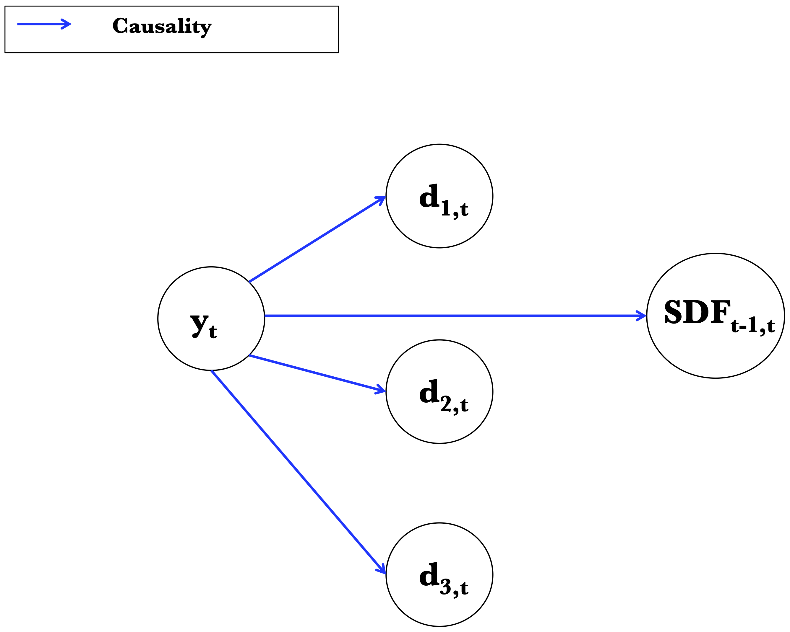
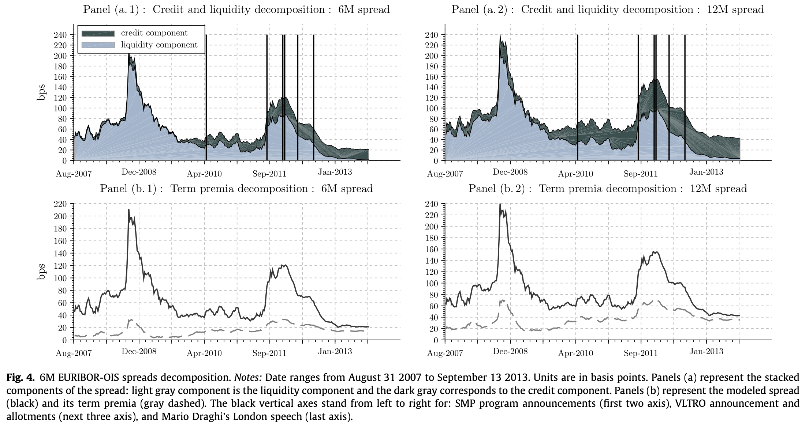
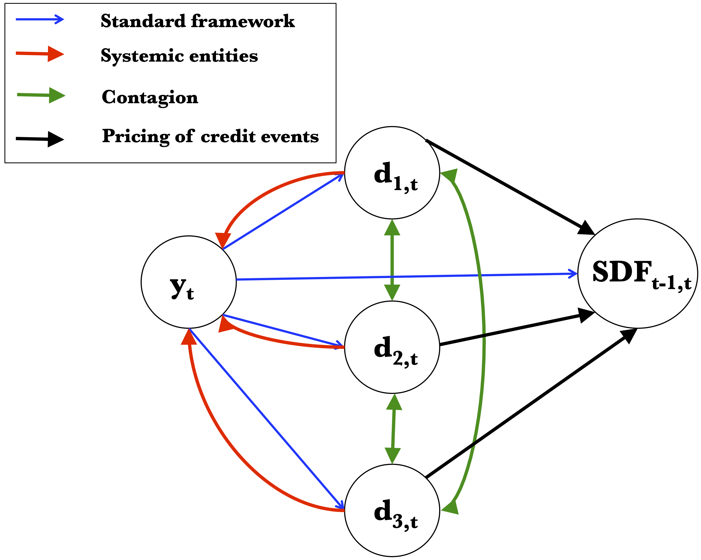
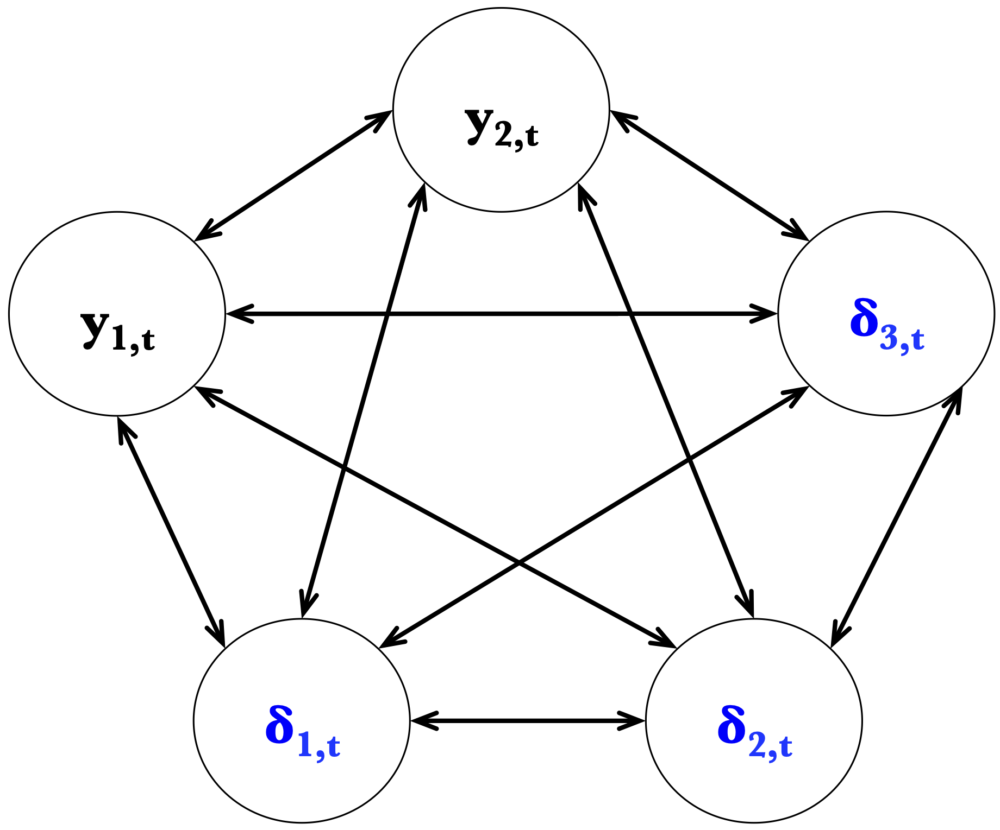
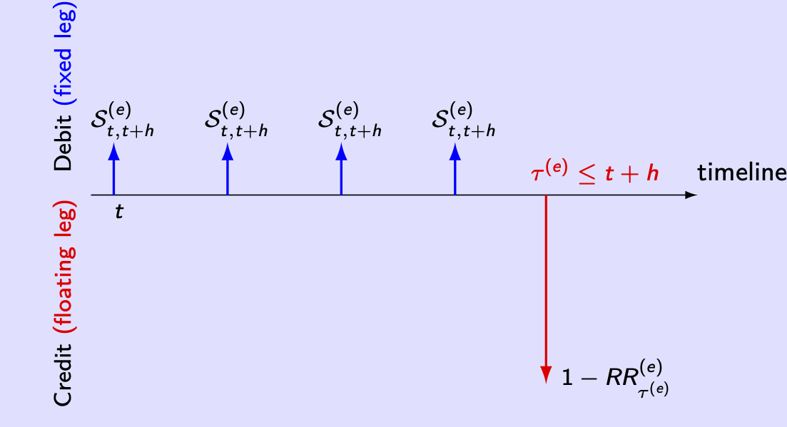
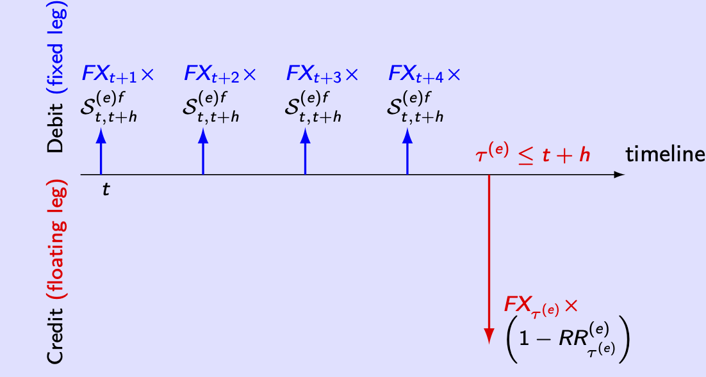
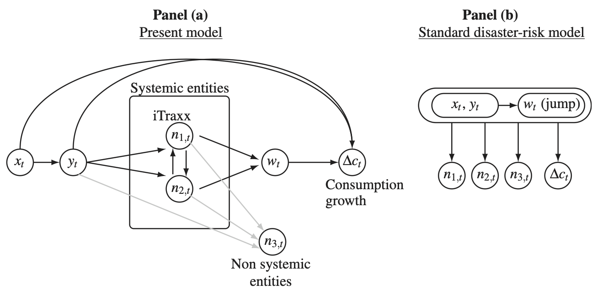

# Credit and liquidity risks

<!-- The modeling of credit and liquidity is  -->
<!-- ## Dynamic credit risk models: Why? -->

<!-- * Compute Values-at-Risk of portfolios of credit-sensitive instruments. -->
<!-- * Extract term structures of default probabilities from credit spreads (CDS). -->
<!-- * Compute expected excess returns of defaultable bonds. -->
<!-- * Price exotic credit derivatives. -->
<!-- * Academic perspective: Understanding the pricing of credit risk. -->

## Notations {#CreditNotations}

The information of the investor at date $t$ is still denoted by $\underline{w_t} = (w_t',w_{t-1}',\dots, w_1 ') '$, but $w_t$ now comprises a new subsector, namely $d_t$, that keeps track of the "default" status of some creditors. Formally, $w_t = (y_t',d_t')'$, where $y_t$ is a $n_y$-dimensional vector of common factors, and $d_t = (d_{1, t} , \dots, d_{E, t}) '$ a $E$-dimensional  vector of binary variables representing the possible default of entities $e \in \{1, \dots,E\}$. Vector $w_t$ is $K$-dimensional, that is $K = n_y + E$.

By convention:

* $d_{e, t} = 1$ if entity $e$ is in default status at time $t$,
* $d_{e, t} = 0$ if entity $e$ is not in default status at time $t$.

We assume that the process $\{w_t\}$ is Markov. Formally, its historical ($\mathbb{P}$) dynamics is defined by the conditional densities:
$$
f (y_t  |  w_{t-1}) \mbox{ and }p ( d_t  |  y_t, w_{t-1} ).
$$

In what follows, we assume that the default state is absorbing:

:::{.hypothesis #A4 name="absorbing defaults"}
The default event is an absorbing state. Formally: $p_e ( 0  |  y_t, w_{t-1}, d_{e,t-1}=1 ) = 0$.
:::

The *survival probability* is defined as follows:
\begin{equation}
p_e ( 0  |  y_t, w_{t-1}, d_{e,t-1}=0 ) = \exp[-\underbrace{\lambda_e ( y_t, w_{t-1})}_{\color{blue}{\mbox{default intensity}}}].(\#eq:survival)
\end{equation}

It is easily checked that $\lambda_e ( y_t, w_{t-1})$ is close to the conditional probability of default when it is small.

## Pricing under standard assumptions {#CreditStandard}

To start with, we will consider the pricing of defaultable bonds under assumptions that are standard in the literature, a framework that we call the *classical credit-risk framework*. These assumptions---namely \@ref(hyp:A1) and \@ref(hyp:A3)---lead to simple formulas. We will investigate further what happens when these assumptions are relaxed (Subsection \@ref(Creditrelaxing)).

:::{.hypothesis #A1 name="Non-systemic entity"}
$\{d_t\}$ does not Granger-cause $\{y_t\}$, in the sense that:
$$
f(y_t|w_{t-1}) = f(y_t|y_{t-1}).
$$
:::

In other words, under Hypothesis \@ref(hyp:A1), $y_t$ is exogenous to $d_t$.

:::{.hypothesis #A3 name="Unpriced credit events"}
The default events (or credit events) are not priced, in the sense that:
\begin{equation*}
\mathcal{M}_{t-1, t}( w_t, w_{t-1}) = \mathcal{M}_{t-1, t}( y_t, y_{t-1}) .
\end{equation*}
:::

In other words, under Hypothesis \@ref(hyp:A3), defaults do not affect the SDF (conditionally on $\underline{y_t}$).

Hypothesis \@ref(hyp:A3) also implies that the short-term risk-free rate $r_t$ ($=-\log\mathbb{E}_t(\mathcal{M}_{t,t+1})$) depends on $\underline{y_t}$ (but not on $d_t$).

Figure \@ref(fig:classical) provides a graphical representation of the causality scheme in the classical credit-risk framework. 

```{r classical, fig.align = 'center', out.width = "80%", fig.cap = "Graphical representation of the causality scheme in the classical credit-risk framework.", echo=FALSE}

```


:::{.proposition #exogdunderQ name="Risk-neutral exogeneity of factors"}
Under Hypotheses \@ref(hyp:A1) and \@ref(hyp:A3), we have:
$$
f^{\mathbb{Q}}(y_t|w_{t-1}) = f^{\mathbb{Q}}(y_t|y_{t-1}),
$$
that is, $\{d_t\}$ does not Granger-cause $\{y_t\}$ under the risk-neutral measure.
:::
:::{.proof}
We have:
\begin{eqnarray}
f^{\mathbb{Q}}(y_t|w_{t-1}) &=& f(y_t|w_{t-1})\mathcal{M}_{t-1,t}\exp(r_{t-1})\\
&=& f(y_t|y_{t-1})\mathcal{M}_{t-1,t}\exp(r_{t-1}),
\end{eqnarray}
which gives the results, using that $\mathcal{M}_{t-1,t}$ and $\exp(r_{t-1})$ depend on $y_{t-1}$ only (and not on $d_t$).
:::

<!-- Proposition \@ref(prp:exogdunderQ) shows that, under Hypotheses \@ref(hyp:A1) and \@ref(hyp:A3), $d_t$ does not Granger-cause $y_t$ under the risk-neutral measure. -->

To simplify, let us focus on a single entity ($d_t \equiv d_{1,t}$), alive on date $t$ ($d_t=0$). Consider the date-$t$ price of a bond issued by the defaultable entity. The residual maturity of this bond is denoted by $h$, and we consider a zero recovery rate (in case of default, the pyoff is zero). The price of this bond writes:
$$
B(t,h) = \mathbb{E}_t^{\mathbb{Q}}[\exp(-r_t-\dots-r_{t+h-1})(1-d_{t+h})].
$$

The following proposition is at the core of the *classical credit-risk framework* [@Duffie_Singleton_1999]:

:::{.proposition #defaultBondclassical name="Defaultabe zero-coupon bond pricing in the classical credit-risk framework"}
Under Hypotheses \@ref(hyp:A1) and \@ref(hyp:A3), and with a default intensity defined---as in \@ref(eq:survival)---through:
\begin{equation}
\exp[-\lambda_t^{\mathbb{P}}]:=\mathbb{P} ( d_t=0  |  \underline{y_{t}}, d_{t-1}=0 ),
\end{equation}
we have:
\begin{equation}
\lambda_t^{\mathbb{Q}} = \lambda_t^{\mathbb{P}}\;(=\lambda_t),(\#eq:lambdaPQ)
\end{equation}
and
\begin{equation}
\boxed{B(t,h) = \mathbb{E}_t^{\mathbb{Q}}\left[\exp\left(-r_t-\dots-r_{t+h-1}- \lambda_{t+1} - \dots - \lambda_{t+h}\right)\right].}(\#eq:standardPriceCredit2)
\end{equation}
which rewrites, using $\tilde{r}_t = r_t + \lambda_{t+1}$:
\begin{equation}
B(t,h) = \mathbb{E}_t^{\mathbb{Q}}\left[\exp\left(-\tilde{r}_t-\dots-\tilde{r}_{t+h-1}\right)\right],(\#eq:standardPriceCredit3)
\end{equation}
:::
:::{.proof}
We have (Eq. \@ref(eq:fQfP)):
\begin{equation}
f^{\mathbb{Q}}(d_t,y_t|d_{t-1},y_{t-1}) = \exp(r_{t-1})\mathcal{M}_{t-1,t} f^{\mathbb{P}}(d_t,y_t|d_{t-1},y_{t-1}).(\#eq:aaq1)
\end{equation}
Using Hypothesis \@ref(hyp:A3), we obtain, by integrating both sides w.r.t. $d_t$:
\begin{eqnarray}
f^{\mathbb{Q}}(y_t|d_{t-1},y_{t-1}) &=& \exp(r_{t-1})\mathcal{M}_{t-1,t} f^{\mathbb{P}}(y_t|d_{t-1},y_{t-1})\nonumber\\
&=& \exp(r_{t-1})\mathcal{M}_{t-1,t} \underbrace{f^{\mathbb{P}}(y_t|y_{t-1})}_{\mbox{by hypothesis}}. (\#eq:aaq2)
\end{eqnarray}
By Bayes, we have:
$$
f^{\mathbb{Q}}(d_t|d_{t-1},y_t,y_{t-1}) = \frac{f^{\mathbb{Q}}(d_t,y_t|d_{t-1},y_{t-1})}{f^{\mathbb{Q}}(y_t|d_{t-1},y_{t-1})}.
$$
Using Eq. \@ref(eq:aaq1) (numerator) and Eq. \@ref(eq:aaq2) (denominator), we get:
\begin{eqnarray*}
&& f^{\mathbb{Q}}(d_t|d_{t-1},y_t,y_{t-1}) = f^{\mathbb{P}}(d_t|d_{t-1},y_t,y_{t-1}),
\end{eqnarray*}
which gives \@ref(eq:lambdaPQ).

Conditioning w.r.t. $\underline{y_{t+h}}$, the bond price is given by:
\begin{eqnarray*}
&& \mathbb{E}_t^{\mathbb{Q}}[\mathbb{E}_t^{\mathbb{Q}}\{\exp(-r_t-\dots-r_{t+h-1})(1-d_{t+h})|\underline{y_{t+h}}\}]\\
&=& \mathbb{E}_t^{\mathbb{Q}}[\exp(-r_t-\dots-r_{t+h-1})\mathbb{E}_t^{\mathbb{Q}}\{(1-d_{t+h})|\underline{y_{t+h}}\}]\\
&=& \mathbb{E}_t^{\mathbb{Q}}[\exp(-r_t-\dots-r_{t+h-1})\mathbb{Q}\{d_{t+h}=0|\underline{y_{t+h}}\}]\\
&=& \mathbb{E}_t^{\mathbb{Q}}\left[\exp(-r_t-\dots-r_{t+h-1})\prod_{j=1}^h\mathbb{Q}\{d_{t+j}=0|d_{t+j-1}=0,\underline{y_{t+h}}\}\right],
\end{eqnarray*}
Because Granger and Sims non-causalities are equivalent, and since $d_t$ does not Granger-cause $y_t$ under the risk-neutral measure (see Proposition \@ref(prp:exogdunderQ)), we have:
$$
\mathbb{Q}\{d_{t+j}=0|d_{t+j-1}=0,\underline{y_{t+{\color{red}h}}}\} = \underbrace{\mathbb{Q}\{d_{t+j}=0|d_{t+j-1}=0,\underline{y_{t+{\color{red}j}}}\}}_{=\exp(-\lambda_{t+j}^{\mathbb{Q}})}.
$$
As a result:
\begin{equation}
B(t,h) = \mathbb{E}_t^{\mathbb{Q}}\left[\exp\left(-r_t-\dots-r_{t+h-1}- \lambda_{t+1}^{\mathbb{Q}} - \dots - \lambda_{t+h}^{\mathbb{Q}}\right)\right].(\#eq:standardPriceCredit)
\end{equation}
Using \@ref(eq:lambdaPQ) in \@ref(eq:standardPriceCredit), we obtain \@ref(eq:standardPriceCredit2).
::::


> Although $\mathbb{P}$ and $\mathbb{Q}$ intensities are the same functions of $y_t$ and $y_{t-1}$, their historical and risk-neutral dynamics are in general different since $y_t$'s $\mathbb{P}$ and $\mathbb{Q}$ dynamics are different.

> Eq. \@ref(eq:standardPriceCredit3) is reminiscent of Eq. \@ref(eq:stdbond), where the risk-free short-term rate $r_t$ is replaced by the *credit-adjusted short-term rate* $\tilde{r}_t$.

Importantly, if both $r_t$ and $\lambda_t$ are affine in $y_t$, where the latter is an affine process, then bond prices are easily computed by means of recursive formulas (as was the case in the context of Eq. \@ref(eq:stdbond), see Example \@ref(exm:nominalBth).

In this case, $B(t,h)$ is exponential affine in $y_t$, that is, it is of the form:
\begin{equation}
B(t,h) = \exp({A^d_h}'y_t + B^d_h)\quad (say).(\#eq:standardPriceCredit4)
\end{equation}


The previous framework can be adapted in order to accommodate non-zero recovery rates. In this framework, the default intensity will be replaced by a *pseudo*, or *recovery-adjusted default intensity* denoted by $\tilde\lambda_t$. To go further, we need to specifiy the payoff taking place upon default. There exist different modelling conventions for that; one is the so-called *Recovery of Market Value (RMV)* [@Duffie_Singleton_1999]. Loosely speaking, under the RMV, the recovery payoff is a fraction $\zeta \in [0,1]$, called *Recovery Rate (RR)* of the price that would have prevailed, absent the default. Proposition \@ref(prp:RMVclassical) makes this definition more precise and gives the bond price stemming from it.


<!-- \begin{block}{Payoffs of a zero-coupon issued by $e$ (when no default)} -->

<!-- \begin{figure}[h] \label{Option2} -->
<!-- 		\caption{At $t$, investor buys a bond issued by $e$, maturity date $t+h$} -->
<!-- \begin{center} -->
<!-- %\begin{large} -->
<!-- \fbox{ -->
<!-- 	\begin{picture}(100,55) \label{fig:tltros} -->
<!-- 		\linethickness{.5 mm} -->

<!-- 		\thinlines -->
<!-- 		\put(10,30){\vector(1,0){80}} -->
<!-- 		\put(90,32){\footnotesize{timeline}} -->

<!-- 		\put(5,40){\rotatebox{90}{Debit}} -->
<!-- 		\put(5,10){\rotatebox{90}{Credit}} -->

<!-- 		\thicklines -->
<!-- 		\put(13,27){$t$} -->
<!-- 		\put(13,30){\vector(0,1){20}} -->
<!-- 		%\put(13,40){$P^{(j)}_{t,h}=\exp(-h \times i^{(j)}_{t,h})$} -->
<!-- 		\put(15,40){$B(t,h)$} -->
<!-- 		\put(78,32){$t+h$} -->
<!-- 		\put(80,30){\vector(0,-1){20}} -->
<!-- 		\put(82,10){$1$} -->
<!-- 		\thinlines -->


<!-- 		\put(60,140){{\color{red} Nothing happens between $t$ and $t+h$.}} -->

<!-- 	\end{picture} -->
<!-- 	} -->

<!-- %\end{large} -->
<!-- \end{center} -->
<!-- 		%{\footnotesize -->
<!-- 		%\textbf{Notes}: XXX} -->
<!-- \end{figure} -->

<!-- \end{block} -->


<!-- %		\put(130,70){\color{red} \vector(0,-1){30}} -->


<!-- \begin{block}{Payoffs of a zero-coupon issued by $e$ (default on $t+i$, RMV convention)} -->

<!-- \begin{figure}[h] \label{Option2} -->
<!-- 		\caption{At $t$, investor buys a bond issued by $e$, maturity date $t+h$} -->
<!-- \begin{center} -->
<!-- %\begin{large} -->
<!-- \fbox{ -->
<!-- 	\begin{picture}(100,55) \label{fig:tltros} -->
<!-- 		\linethickness{.5 mm} -->

<!-- 		\thinlines -->
<!-- 		\put(10,30){\vector(1,0){80}} -->
<!-- 		\put(90,32){\footnotesize{timeline}} -->

<!-- 		\put(5,40){\rotatebox{90}{Debit}} -->
<!-- 		\put(5,10){\rotatebox{90}{Credit}} -->

<!-- 		\thicklines -->
<!-- 		\put(13,27){$t$} -->
<!-- 		\put(13,30){\vector(0,1){20}} -->
<!-- 		%\put(13,40){$P^{(j)}_{t,h}=\exp(-h \times i^{(j)}_{t,h})$} -->
<!-- 		\put(15,40){$B(t,h)$} -->
<!-- 		\put(48,32){\color{red}{$t+i < t+h$}} -->
<!-- 		\put(50,30){\color{red}{\vector(0,-1){10}}} -->
<!-- 		\put(52,20){\color{red}{$\zeta B(t+i, h-i)$}} -->
<!-- 		\put(52,25){\color{red}{Recovery payoff:}} -->
<!-- 		\put(52,15){\color{red}{($\zeta < 1$)}} -->
<!-- 		\thinlines -->


<!-- 		\put(60,140){{\color{red} Nothing happens between $t$ and $t+h$.}} -->

<!-- 	\end{picture} -->
<!-- 	} -->

<!-- %\end{large} -->
<!-- \end{center} -->
<!-- 		%{\footnotesize -->
<!-- 		%\textbf{Notes}: XXX} -->
<!-- \end{figure} -->
<!-- \end{block} -->


:::{.proposition #RMVclassical name="Bond pricing in the RMV classical framework"}
Under Hypotheses \@ref(hyp:A1) and \@ref(hyp:A3), and if, in case of default on date $t+i$, the recovery payment is $\zeta \widetilde{B}(t+i,h-i)$, with $\zeta \in [0,1]$, then
\begin{equation}
B(t,h) =  (1-d_t)\widetilde{B}(t,h),(\#eq:BBcredit)
\end{equation}
where $\widetilde{B}(t,h)$ is a *pseudo-price* given by:
\begin{equation}
\widetilde{B}(t,h) = \mathbb{E}_t^{\mathbb{Q}} [\exp(-r_{t}-\tilde\lambda_{t+1}-\dots -r_{t+h-1}-\tilde\lambda_{t+h}],(\#eq:BtildeCredit)
\end{equation}
where the pseudo-intensity $\tilde\lambda_{t}$ is defined by:
\begin{eqnarray}
\exp(-\tilde\lambda_{t+1}) &=&  \mathbb{E} [\{1 - d_{t+1} (1-\zeta)\}|\underline{y_{t+1}},d_t=0] \nonumber\\
&=&  1 - (1-\zeta) (1-\exp(-\lambda_{t+1})).(\#eq:pseudodefintens)
\end{eqnarray}
:::
:::{.proof}
Relation \@ref(eq:BBcredit) is true for $B(t+h, 0)$ since $\widetilde{B}(t+h, 0) = 1$ and $B(t+h, 0) = 1 - d_{t+h}$.
Assuming that $B(t+i+1, h-i-1) = (1 - d_{t+i+1} ) \widetilde{B}(t+i+1, h-i-1)$ (which is valid for $i=h-1$), we get:
\begin{eqnarray*}
B(t+i, h-i) &=& \left(1 - d_{t+i} \right)  \mathbb{E}_{t+i}^{\mathbb{Q}} \left\{ \exp(- r_{t+i})   \left[ \left(1 - d_{t+i+1} \right) \widetilde{B}(t+i+1, h-i-1) \right. \right. \\
&& \left. \left. +  d_{t+i+1}\zeta\widetilde{B}(t+i+1, h-i-1) \right] \right\},
\end{eqnarray*}
since, in case of no default at date $t+i$, the value of the bond at date $t+i+1$ is either $\zeta B(t+i+1, h-i-1) = \zeta \widetilde{B}(t+i+1, h-i-1)$ if default happens, and $B(t+i+1, h-i-1) = \widetilde{B}(t+i+1, h-i-1)$ otherwise. Hypotheses \@ref(hyp:A1) and \@ref(hyp:A3) imply that $\widetilde{B}(t+i+1, h-i-1)$ does not depend on $d_{t+i+1}$ and taking first the conditional expectation given $w_{t+i}$ and $y_{t+i+1}$ we obtain:
\begin{equation}
\begin{array}{lll}
B(t+i, h-i) &=& \left(1 - d_{t+i} \right) \mathbb{E}_{t+i}^{\mathbb{Q}} \left\{ \exp(- r_{t+i})  \widetilde{B}(t+i+1, h-i-1) \times \right. \\
&& \quad\left. \mathbb{E}^{\mathbb{Q}} \left[ \left(1 - d_{t+i+1} \right) +  \zeta d_{t+i+1}  | y_{t+i+1}, w_{t+i} \right] \right\} .
\end{array}(\#eq:Prop21demo)
\end{equation}
Using  the definition of $\widetilde{\lambda}_{t}$ (Eq. \@ref(eq:pseudodefintens)) we get:
\begin{equation*}
\begin{array}{lll}
B(t+i, h-i) &=& \left(1 - d_{t+i} \right)  \mathbb{E}_{t+i}^{\mathbb{Q}} \left\{ \exp \left( - r_{t+i} - \widetilde{\lambda}_{t+i+1} \right)  \widetilde{B}(t+i+1, h-i-1) \right\}\\
&=& \left(1 - d_{t+i} \right)   \widetilde{B}(t+i, h-i) .
\end{array}
\end{equation*}
Therefore it is also true for $i=0$.
:::


<!-- * Sketch if the proof of Eq. \@ref(eq:BtildeCredit) -->
<!-- * If $d_t=0$ (entity alive on date $t$), we then have: -->
<!-- \begin{eqnarray*} -->
<!-- B(t,h) &=& \exp(-r_t)\mathbb{E}_t^{\mathbb{Q}} [ d_{t+1} \zeta B(t+1,h-1) + (1-d_{t+1})B(t+1,h-1)]\\ -->
<!-- &=& \exp(-r_t)\mathbb{E}_t^{\mathbb{Q}} [\{1 - d_{t+1} (1-\zeta)\} B(t+1,h-1) ]. -->
<!-- \end{eqnarray*} -->
<!-- * Defining the *recovery-adjusted default intensity* $\tilde\lambda_{t+1}$ through -->
<!-- \begin{eqnarray} -->
<!-- \exp(-\tilde\lambda_{t+1}) &=&  \mathbb{E} [\{1 - d_{t+1} (1-\zeta)\}|\underline{y_{t+1}},d_t=0] \nonumber\\ -->
<!-- &=&  1 - (1-\zeta) (1-\exp(-\lambda_{t+1})),(\#eq:pseudodefintens) -->
<!-- \end{eqnarray} -->
<!-- one obtains: -->
<!-- \begin{eqnarray*} -->
<!-- B(t,h) &=& \mathbb{E}_t^{\mathbb{Q}} [\exp(-r_t-\tilde\lambda_{t+1}) B(t+1,h-1) ], -->
<!-- \end{eqnarray*} -->
<!-- and, by recursion, we get \@ref(eq:BtildeCredit). -->


Again, if $r_t$ and $\tilde\lambda_t$ are affine combinations of an affine process $y_t$, then (exponential affine) bond prices are easily computed by means of recursive formulas. This is formalized below.

:::{.hypothesis #A6 name="Affine process"}
The process $\{ y_t \}$ is affine under the $\mathbb{Q}$ measure:
\begin{equation}
\begin{array}{lll}
\varphi^{\mathbb{Q}}_{y, t-1} (u_y) = \mathbb{E}^{\mathbb{Q}} \left[\exp( u_y ' y_t )   |   \underline{y_{t-1}} \right]
= \exp \left[ a^{\mathbb{Q}}_{y} (u_{y}) ' y_{t-1} + b^{\mathbb{Q}}_{y} (u_{y}) \right],
\end{array}(\#eq:affineyPcLT)
\end{equation}
and $r_t$ and $\widetilde{\lambda}_{e, t}$ are affine in $(y_t, y_{t-1})$, that is (say):
\begin{eqnarray}
r_{t} &=& \omega_0 + \omega_{1} ' y_{t} \\
\widetilde{\lambda}_{e, t} &=& \kappa_{0} + \kappa_{1}' y_t.
\end{eqnarray}
:::

:::{.proposition #standardCreditFormula name="Standard affine bond pricing, under RMV convention"}
Under the Assumptions of Proposition \@ref(prp:RMVclassical) and under Hypothesis \@ref(hyp:A6), we have, for $h \ge 1$:
\begin{equation}
B(t, h) = \left(1 - d_{t} \right)\exp(- h[\omega_0 + \kappa_{0}] - \omega_{1} ' y_{t} + A_h'y_t + B_h),(\#eq:standardAffineCredit)
\end{equation}
where $A_h$ and $B_h$ are given by the following recursive equations:
\begin{equation}
\left\{
\begin{array}{ccl}
A_{h} &=& a(u_{h} + A_{h-1}), \\
B_{h} &=& b(u_{h} + A_{h-1}) + B_{h-1}, \\
A_{0} &=& 0,\quad  B_{0} = 0,
\end{array}
\right.(\#eq:auxRecursiveStandardCredit)
\end{equation}
with $u_1 = -\kappa_{1}$ and $u_i = -(\kappa_{1} + \omega_{1})$ for $i>1$.
:::
:::{.proof}
The results directly follows from Proposition \@ref(prp:RMVclassical).
:::


What precedes has been estiablished under the assumption that the state vector $w_t$ comprises a single defaultable entity ($E=1$). What about when different entities are considered ($E = 2$)? We can demonstrate that similar pricing formulas are obtained under the assumption of no-contagion (Hypothesis \@ref(hyp:A2)):

:::{.hypothesis #A2 name="no contagion"}
There is no instantaneous or lagged contagion between entities, i.e.:
\begin{equation*}
p ( d_t  |  y_t, w_{t-1} ) = p_1 ( d_{1, t}  |  y_t, y_{t-1}, d_{1, t-1})   \times   p_2 ( d_{2, t}  |  y_t, y_{t-1}, d_{2, t-1}) .
\end{equation*}
:::

If Hypothesis \@ref(hyp:A2) is not satisfied, for instance, if we have contagion effect from $e = 1$ towards $e = 2$:
\begin{eqnarray*}
p(d_t|y_t, w_{t-1} ) &=& p_1 ( d_{1, t}  |  y_t, y_{t-1}, d_{1, t-1}) \times \\
&&  p_2 ( d_{2, t}  |  y_t, y_{t-1}, \color{blue}{d_{1, t}}, \color{blue}{d_{1, t-1}}, d_{2, t-1}),
\end{eqnarray*}
then:

1. Proposition \@ref(prp:RMVclassical) is still valid for both entities;
2. In an affine framework, the computation of $\widetilde{B}_1 (t, h)$ (and $B_1 (t, h)$) is straightforward;
3. but formulas for $\widetilde{B}_2 (t, h)$ and $B_2 (t, h)$ are not explicit anymore even if $\widetilde{\lambda}_{2, t}$ is affine in $(y_t, y_{t-1}, d_{1, t}, d_{1, t-1})$.


<!-- \begin{figure} -->
<!-- \caption{Causality scheme in the classical credit-risk framework} -->
<!-- \label{fig:classicalcredit} -->
<!-- \includegraphics[width=.8\linewidth]{figures/Schema0.pdf} -->
<!-- \end{figure} -->


:::{.proposition #defBondAffine name="Absence of contagion"}
Under Hypotheses \@ref(hyp:A4), \@ref(hyp:A1), \@ref(hyp:A3) and \@ref(hyp:A2), the risk-neutral ($\mathbb{Q}$) dynamics is such that:
$$
f^{\mathbb{Q}} ( y_t  |  w_{t-1}) = f^{\mathbb{Q}} ( y_t  |  y_{t-1}) \propto \mathcal{M}_{t-1, t}( y_t, y_{t-1}) f (y_t  |  y_{t-1})
$$
(*exogeneity of $y_t$ preserved under $\mathbb{Q}$*) and

$$
p_t^{\mathbb{Q}} ( d_{t}  |  y_t, w_{t-1} ) = p_1 ( d_{1, t}  |  y_t, y_{t-1}, d_{1, t-1} )   \times   p_2 ( d_{2, t}  |  y_t, y_{t-1}, d_{2, t-1}),
$$
(*absence of contagion preserved under $\mathbb{Q}$*).

Denoting by $\lambda^{\mathbb{Q}}_e \left( y_t, y_{t-1} \right) \equiv - \log \left[ p_e^{\mathbb{Q}} ( 0  |  y_t, y_{t-1}, 0 ) \right]$ the *risk-neutral default intensity* of entity
$e$, it comes that:
$$
\lambda^{\mathbb{Q}}_e \left( y_t, y_{t-1} \right) = \lambda_e \left( y_t, y_{t-1} \right)
$$
(*default intensities are the same under $\mathbb{P}$ and $\mathbb{Q}$*).
:::
:::{.proof}
The $\mathbb{Q}$ conditional density of $w_t$ given $w_{t-1}$, namely $f^{\mathbb{Q}} (y_t  |  w_{t-1})
p^{\mathbb{Q}} ( d_t  |  y_t, w_{t-1} )$, is proportional to $\mathcal{M}_{t-1, t}( w_t, w_{t-1}) f (y_t  |  w_{t-1}) p ( d_t  |  y_t, w_{t-1} )$, and thus proportional to $\mathcal{M}_{t-1, t}( y_t, y_{t-1}) f (y_t  |  y_{t-1})  p_1 ( d_{1, t}  |  y_t, y_{t-1}, d_{1, t-1}) p_2 ( d_{2, t}  |  y_t, y_{t-1}, d_{2, t-1})$. The result follows immediately.
:::


## Pricing illiquid bonds {#CreditIlliq}

This subsection shows that a similar approach can be used to price illiquid assets. The idea consists in replacing the Loss Given Default ($LGD = 1-RR^{(e)}$) by a Loss Given Liquidity Shock ($1-\theta_\ell^{(e)}$). A structural interpretation of this approach is provided by @Ericsson_Renault_2006 (see Example \@ref(exm:illiqLGD)).

Let us introduce a novel binary variable: $\ell_t$, that represents a *liquidity shocks*. When a bondholder is hit by the liquidity shock, she needs to liquidate her portfolio (reflecting cash constraints or needs to rebalance portfolio). But in such distressed conditions, she will sell her bonds at a discount (and will therefore face losses, akin to credit losses). Formally: $\ell_{t}=1$ when the bondholder is hit, and $\ell_{t}=0$ otherwise.

The *liquidity-shock intensity* $\lambda_\ell(y_t)$---that defines the probability of occurence of liquidity shocks---is defined through:
$$
\underbrace{1- \exp[-\lambda_\ell(y_t)]}_{\approx \lambda_\ell(y_t)\mbox{ if small}} = \mathbb{P}(\ell_t = 1|\underline{w_{t-1}},y_t).
$$
The binary variable $\ell_t$ is assumed not to Granger-cause $y_t$ (as in Hypothesis \@ref(hyp:A1)) and not to be priced (as in Hypothesis \@ref(hyp:A3)). As in Proposition \@ref(prp:defaultBondclassical) (and more precisely Eq. \@ref(eq:lambdaPQ)), this implies that
$$
\lambda_\ell^{\mathbb{Q}}(y_t) = \lambda_\ell(y_t),
$$
where
$$
1- \exp[-\lambda^{\mathbb{Q}}_\ell(y_t)] = \mathbb{Q}(\ell_t = 1|\underline{w_{t-1}},y_t).
$$

Upon the arrival of the liquidity shock ($\ell_{t}=1$), the investor has to exit by selling her bond holdings. She is then limited in the number of traders she can call and, as a result, get only a fraction ($\theta_\ell^{(e)}$, say) of the price she would get in normal-liquidity times, i.e., when $\ell_{t}=0$ (see the structural interpretation in Example \@ref(exm:illiqLGD)).

In that context, following the approach used in Proposition \@ref(prp:RMVclassical), one can define a *pseudo-illiquidity intensity* as follows (mimicking Eq. \@ref(eq:pseudodefintens)):
\begin{eqnarray}
\widetilde{\lambda}_{e,\ell, t} \left( y_t, y_{t-1} \right) &=& - \log \left\{ \exp \Big[ -
\lambda_{e,\ell} \left( y_t\right) \Big] \right. + (\#eq:pseudoilliqintensity)\\
&& \left. \Big( 1 - \exp \Big[ - \lambda_{e,\ell} \left( y_t \right) \Big]
\Big) \theta_\ell^{(e)}  \right\} \nonumber
\end{eqnarray}

Still consiering credit risk (on top of liquidity risk), we then have the following payoff on date $t$ (assuming no default on date $t-1$):
\begin{equation}
\widetilde{B}_e (t, h) = \mathbb{E}^{\mathbb{Q}}_t \left\{ \exp \left[ - \sum_{i=1}^{h} \left( r_{t+i-1} + \widetilde{\lambda}_{e,c, t+i} + \widetilde{\lambda}_{e,\ell, t+i} \right) \right] \right\}.(\#eq:pseudopriceilliq)
\end{equation}


:::{.example #illiqLGD name="Structural interpretation of the illiquidity intensity"}

This structural interpretation of the illiquidity intensity is due to @Ericsson_Renault_2006.

When hit by a liquidity shock, a bondholder has to liquidate her bond in a small amount of time (between $t$ and $t+\varepsilon$, with $\varepsilon \ll 1$). She collects offers on the market; each offer is a random fraction $\omega_{i}$ ($i\in\{1,\ldots,\kappa\}$) of $\widetilde{B}_e (t, h)$ (see Eq. \@ref(eq:pseudopriceilliq)), where the $\omega_{i}$'s are uniformly distributed in $[0,1]$.

At $t+\varepsilon$, the bond is sold to the trader that has offered the highest price. Formally, when $\ell_{t}=1$, the selling price is:
$$
\left(\max_{i\in\{1,\ldots,\kappa\}}\omega_{i}\right)\tilde{P}_{t,h}^{(e)}.
$$
Conditional on $\kappa$, the expectation of $\max_{i}(\omega_{i})$ is $\kappa/(\kappa+1)$. (Because the $\omega_{i}$ are i.i.d., the c.d.f. of $\max(\omega_{1},\ldots,\omega_{\kappa})$ is $x\mapsto F(x)^{\kappa}$, where $F$ is the c.d.f. of $\omega_{i}$.)
Hence, $\theta_\ell^{(e)}$---the unconditional expectation of $\max_{i}(\omega_{i})$---is given by:
\begin{eqnarray*}
\sum_{k=1}^{\infty}\frac{e^{-\varepsilon\gamma^{(e)}}k}{k+1}\frac{\left(\varepsilon\gamma^{(e)}\right)^{k}}{k!} & = & \left[\left(1-e^{-\varepsilon\gamma^{(e)}}\right)\frac{\varepsilon\gamma^{(e)}-1}{\varepsilon\gamma^{(e)}}+e^{-\varepsilon\gamma^{(e)}}\right]\\
& = & g(\varepsilon\gamma^{(e)})\qquad\mbox{(say).}
\end{eqnarray*}
Function $g$ is increasing and valued in $[0,1]$. In addition $\lim_{x\rightarrow\infty}g(x)\rightarrow1$.
:::


<!-- \begin{block}{Payoffs of an illiquid bond (occurence of liquidity shock)} -->
<!-- \begin{figure}[h] \label{Option2} -->
<!-- 		\caption{At date $t+s$, the bondholder is hit by a liquidity shock} -->
<!-- \begin{center} -->
<!-- %\begin{large} -->
<!-- \fbox{ -->
<!-- 	\begin{picture}(250,150) \label{fig:tltros} -->
<!-- 		\linethickness{.5 mm} -->

<!-- 		\thinlines -->
<!-- 		\put(20,70){\vector(1,0){200}} -->
<!-- 		\put(220,63){\footnotesize{timeline}} -->

<!-- 		\put(30,80){\rotatebox{90}{Debit}} -->
<!-- 		\put(30,30){\rotatebox{90}{Credit}} -->

<!-- 		\thicklines -->
<!-- 		\put(58,60){$t$} -->
<!-- 		\put(60,70){\vector(0,1){40}} -->
<!-- 		\put(40,120){$B_e (t, h) = \widetilde{B}_e (t, h)$} -->

<!-- 		\put(98,75){$t+s$} -->
<!-- 		\put(98,95){$\ell_{t+s} = 1$} -->
<!-- 		\put(110,70){\color{blue} \vector(0,-1){30}} -->
<!-- 		\put(107,20){$\theta_{\ell} \widetilde{B}_e (t+s, h-s)$} -->
<!-- 		\put(105,5){\footnotesize{(haircut: $\theta_\ell < 1$)}} -->

<!-- 		\thinlines -->

<!-- 	\end{picture} -->
<!-- 	} -->
<!-- \end{center} -->
<!-- \end{figure} -->
<!-- \end{block} -->


:::{.example #SovereignSpreads name="Euro area sovereign credit spreads"}

@Monfort_Renne_NER2011 and @Monfort_Renne_2014 propose credit/liquidity decompositions of euro-area sovereign spreads. They emply different estimation approaches: @Kim_1994's filter for MR2014, and Kitagawa-Hamilton filter for @Monfort_Renne_NER2011 (see Subsection \@ref(EstimationRS)).

In both papers, the $y_t$ part of the state vector $w_t$ is of the form $y_t = (x_t',z_t')'$; it follows a Regime-Switching Gaussian VAR (see Example \@ref(exm:GRSVAR)). The time-homogenous Markov chain $z_t$ tracks the *crisis status* (crisis versus normal times).

The total intensity is of the form:
$$
\widetilde{\lambda}_{e,t} = \underbrace{\alpha_{e,c}'z_t + \beta_{e,c}'y_t}_{\mbox{credit intensity $\widetilde{\lambda}_{e,c,t}$}} + \underbrace{\alpha_{e,\ell}'z_t + \beta_{e,\ell}'y_t.}_{\mbox{liquidity intensity $\widetilde{\lambda}_{e,\ell,t}$}}
$$
In both papers, the identification of credit versus liquidity components is based on:
$$
\mbox{KfW-Bund spreads} =  \mbox{liquidity spreads}.
$$
KfW (*Kreditanstalt für Wiederaufbau*) is a German agency whose bonds are guaranteed by the Federal Republic of Germany. Therefore, they benefit from the same credit quality than their sovereign counterparts---the Bunds---but are less liquid; accordingly, the KfW-Bund spread should beessentially liquidity-driven.

In @Monfort_Renne_2014, we have
$$
\widetilde{\lambda}_{e,t} = \underbrace{x_{e,t}}_{=\widetilde{\lambda}_{e,c,t}} + \underbrace{(1-\theta^{(e)}_\ell)x_{E+1,t}}_{=\widetilde{\lambda}_{e,\ell,t}},
$$
hence $x_t$ of dimension $E+1 = 12$ (11 countries are involved).

There are 9 Markovian regimes: $z_t = z_{c,t} \otimes z_{\ell,t}$, where $z_{i,t}$ ($i \in \{c,\ell\}$) is 3-dimensional:

* $z_{i,t}=[1,0,0]'$: low stress,
* $z_{i,t}=[0,1,0]'$: medium stress,
* $z_{i,t}=[0,0,1]'$: high stress.
* $z_{c,t}$ and $z_{\ell,t}$ are not independent: for instance, the probability to transit from the low-credit-stress regime to the medium/high-credit-stress regimes depends on the liquidity-stress regime.

For each intensity $x_{i,t}$ (simulation below XXX):
$$
x_{i,t} = \mu_i'z_t + \phi x_{i,t-1} + \sigma_i \varepsilon_{i,t},
$$
with $\varepsilon_{t} \sim i.i.d. \mathcal{N}(0,\Sigma)$, where $\Sigma$ is diagonal, and $\mu_{i,1} < \mu_{i,2} < \mu_{i,3}$.
The Markov chain $z_t$ is the only source of correlation across the $x_{i,t}$'s.

Figure \@ref(fig:MRintensity) shows a simulation of such a process, with:
$$
\mu=\left[\begin{array}{c}
0.01 \\ 0.03 \\ 0.10\end{array}\right],\quad \phi=.8 ,\quad P=\left[\begin{array}{ccc}
0.98 & 0.02 & 0\\
0.05 & 0.90 & 0.05\\
0 & 0.20 & 0.80
\end{array}\right],\quad \sigma = 0.002.
$$

The SDF exponential affine in $(z_t',x_t')'$. We have the same type of dynamics under $\mathbb{Q}$ (with risk-asjusted parameters, in particular risk-adjusted transition probabilities).

```{r MRintensity, echo=FALSE, fig.cap="Simulation of an process following $x_{t} = \\mu'z_t + \\phi x_{t-1} + \\sigma \\varepsilon_{t}$, where $z_t$ follows a three-state time-homogenous Markov process. See the text for the exact parameterization. The light-grey shaded area corresponds to the second regime ($z_t = [0,1,0]'$); the dark-grey shaded area corresponds to the third regime ($z_t = [0,0,1]'$)", fig.asp = .6, out.width = "95%", fig.align = 'left-aligned', message=FALSE}

s <- 1
P <- matrix(c(.98,.05,0,.02,.9,.2,0,.05,.8),3,3)
phi <- .8
mu <- c(.01,.02,.05)
sigma <- .002
T <- 500
all.x <- matrix(0,T,1)
all.s <- matrix(0,T,1)
x <- .05
for(t in 1:T){
  u <- runif(1)
  probas <- cumsum(P[s,])
  if(u < probas[1]){s <- 1}else if(u < probas[2]){s <- 2}else{s <- 3}
  x <- mu[s] + phi*x + sigma * rnorm(1)
  all.x[t] <- x
  all.s[t] <- s
}
par(mfrow=c(1,1))
par(plt=c(.1,.95,.1,.95))
plot(all.x,type="l",xlab="",ylab="",las=1)

reg2 <- 1*(all.s==2)
polygon(c(1:T,rev(1:T)),
        c(reg2,0*rev(reg2)),
        col=rgb(.1,.1,.1,.2),border = NA)
reg3 <- 1*(all.s==3)
polygon(c(1:T,rev(1:T)),
        c(reg3,0*rev(reg3)),
        col=rgb(.1,.1,.1,.5),border = NaN)
lines(all.x,lwd=2)

#plot(all.s,type="l")
```


:::

<!-- \begin{center} -->
<!-- \includegraphics[width=1.0\linewidth]{figures/Figure_process.pdf} -->
<!-- \par\end{center} -->
<!-- \begin{center} -->
<!-- {\tiny{}Light grey: crisis regime ($z_{t}=[0,1,0]'$), Dark -->
<!-- grey: severe crisis regime ($z_{t}=[0,0,1]'$)} -->
<!-- \par\end{center}{\tiny \par} -->

<!-- \begin{figure} -->
<!-- \caption{5-year Probabilities of Default} -->
<!-- \includegraphics[width=.7\linewidth]{figures/MR2014_PDs.pdf} -->
<!-- \end{figure} -->

<!-- \begin{center} -->
<!-- Source: \href{https://academic.oup.com/rof/article-abstract/18/6/2103/1661774?redirectedFrom=fulltext}{Monfort and Renne (2014)}. -->
<!-- \end{center} -->

:::{.example #IBOROIS name="IBOR-OIS spreads"}

@DUBECQ201629 decompose the EURIBOR versus Overnight Index Swap (OIS) spreads into a credit and a liquidity component. (See Subsection \@ref(Swap) for the definition of a swap contract.)

From the point of view of bank $j$, the EURIBOR rate is the rate of an unsecured loan to one bank ($e$, say) of the panel. Assume that the panel of the $N$ constituting the EURIBOR are homogenous. We have:
\begin{equation}
R^{IBOR}_{t,h} = - \frac{1}{h} \log \mathbb{E}^{\mathbb{Q}}_t \left\{ \exp \left[ - \sum_{i=1}^{h} \left( r_{t+i-1} + \widetilde{\lambda}_{e,c, t+i} + \widetilde{\lambda}_{j,\ell, t+i} \right) \right] \right\}.(\#eq:EURIBOR)
\end{equation}
Note that the liquidity intensity refers to the lending bank ($j$) and the default intensity relates to the borrowing bank ($e$).


By constrast, the Overnight-Index Swap (OIS) rate satisfies:^[The OIS is an interest-rate swap where the floating rate is an overnight-rate reference (EONIA in the euro area). At maturity, the payoff received by the fixed-rate payer is the difference between: (a) the notional ($W$, say) inflated with the date-$t$ OIS (fixed) rate (i.e. $W\exp\{h R_{t,h}^{OIS}\}$) and (b) the same notional capitalized with the realized short-term rates (i.e. $W\exp\{r_{t} + \ldots + r_{t+h-1}\}$).]
\begin{equation}
R^{OIS}_{t,h} = - \frac{1}{h} \log \mathbb{E}^{\mathbb{Q}}_t \left\{ \exp \left( - \sum_{i=1}^{h}  r_{t+i-1} \right) \right\}.(\#eq:OIS)
\end{equation}

Assuming that $r_t$, the short-term risk-free rate (i.e., the reference rate of the OIS, EONIA here) is independent from the intensities and under the homogeneity assumption, we obtain:^[It is assumed here that the overnight interbank market preserves the lending bank from (i) liquidity and (ii) credit risk. The rationale behind that is twofold: (a) By rolling its cash on the overnight market (at the EONIA rate), a bank is not exposed to the risk of having to liquidate longer-term investments upon the realization of the liquidity shock; (b) while the EONIA is an unsecured-transaction rate, the extremely-short maturity of these transactions substantially reduces the credit-risk exposure of the lending bank.]
$$
R^{IBOR}_{t,h} - R^{OIS}_{t,h} = - \frac{1}{h} \log \mathbb{E}^{\mathbb{Q}}_t \left\{ \exp \left[ - \sum_{i=1}^{h} \left( \widetilde{\lambda}_{c, t+i} + \widetilde{\lambda}_{\ell, t+i} \right) \right] \right\}.
$$

@DUBECQ201629 employ a quadratic specification for $\widetilde{\lambda}_{c, t}$ and $\widetilde{\lambda}_{\ell, t}$:
$$
\widetilde{\lambda}_{c, t} = x_{c,t}^2 \quad \mbox{and} \quad  \widetilde{\lambda}_{\ell, t} = x_{\ell,t}^2,
$$
where $X_t = (x_{c,t},x_{\ell,t})'$ follows a Gaussian VAR(1) process. (This is the quandratic Gaussian framework presented in Example \@ref(exm:QGVAR1).)

The state vector $X_t$ is latent. The estimation involves the Quadratic Kalman Filter [@Monfort_Renne_Roussellet_2015]. The measurement equations include equations stating that observed proxies of credit and liquidity risks relate to quadratic functions of $x_{c,t}$ and $x_{\ell,t}$, respectively.

```{r IBOROIS, fig.align = 'center', out.width = "95%", fig.cap = "Source: Dubecq et al. (2016).", echo=FALSE}

```
:::


## Relaxing the classical framework assumptions {#Creditrelaxing}

Formula \@ref(eq:standardAffineCredit) and its tractability is a key feature of numerous credit-risk term-structure models, e.g., @Duffie_Singleton_2003, @Pan_Singleton_2008, and @Longstaff_Pan_Pedersen_Singleton_2011 among many others. This formula is valid under Assumptions \@ref(hyp:A1) of non-systemic entities, also called *no-jump condition*, \@ref(hyp:A3) of unpriced credit risk events, and  \@ref(hyp:A2) absence of contagion. These hypotheses define what we have called the *classical credit-risk models*. We lose the high degree of tractability of Formula \@ref(eq:standardAffineCredit) when some of the previous assumptions are relaxed:

* If $f (y_t  |  w_{t-1}) = f (y_t  |  y_{t-1} , d_{1, t-1})$ (entity $e = 1$ is *systemic*) then:

    * The pseudo-price $\widetilde{B}_e (t, h)$ now depends on $y_t$ and $d_{1, t}$;
    * Eq. \@ref(eq:standardPriceCredit2) is valid for entity $e = 2$ only;
    * The computation of $\widetilde{B}_2 (t, h)$ is not straightforward: $\{ y_t \}$
is not autonomous and the autonomous process $\{ y_t, d_{1,t} \}$ is not affine.
* If there is a contagion effect from $e = 1$ towards $e = 2$, i.e., if
\begin{eqnarray*}
p ( d_t  |  y_t, w_{t-1} ) &=& p_1 ( d_{1, t}  |  y_t, y_{t-1}, d_{1, t-1}) \\
&&  p_2 ( d_{2, t}  |  y_t, y_{t-1}, d_{1, t}, d_{1, t-1}, d_{2, t-1}),
\end{eqnarray*}
then:

    * Eq. \@ref(eq:standardPriceCredit2) is still valid for both entities;
    * In an affine framework, the computation of $\widetilde{B}_1 (t, h)$ (and $B_1 (t, h)$) is straightforward; but formulas for $\widetilde{B}_2 (t, h)$ and $B_2 (t, h)$ are not explicit anymore even if $\widetilde{\lambda}_{2, t}$ is affine in $(y_t, y_{t-1}, d_{1, t}, d_{1, t-1})$.

* If the default event of the first entity only ($d_{1,t}$) is a source of risk that is priced: $\mathcal{M}_{t-1, t}( w_t, w_{t-1}) = \mathcal{M}_{t-1, t}( y_t, y_{t-1}, d_{1, t}, d_{1, t-1})$, then

    * $\lambda^{\mathbb{Q}}_{1, t} \neq \lambda_{1, t}$ and $\lambda^{\mathbb{Q}}_{2, t} = \lambda_{2, t}$;
    * the exogeneity of $\{ y_t \}$ is  no longer preserved under $\mathbb{Q}$;
    * Eq. \@ref(eq:standardPriceCredit2) is no longer valid for entity $e = 1$. It remains valid for $e=2$ but the computation of $\widetilde{B}_{2} (t, h)$ is not straightforward: even if $y_t$ is $\mathbb{P}$-autonomous, this is not true under $\mathbb{Q}$.


### General affine credit-risk framework {#CreditGeneral}


Exploiting Vector Auto-Regressive Gamma (VARG) processes, @Monfort_Pegoraro_Renne_Roussellet_2021 propose a general affine credit-risk pricing model jointly allowing for:

1. *systemic entities* (breaking down the no-jump condition; see @CollinDufresne_Goldstein_Hugonnier_2004);
2. *contagion effects between entities* (economic/financial linkages; see @AITSAHALIA2014151);
3. *pricing of credit events* (credit spread puzzle; see @Gourieroux_Monfort_Renne_2014);
4. and *stochastic recovery rates (RR)* [@Altman_Brady_Resti_Sironi_2005].

In this general framework, the state vector $w_t$ is of the form $[y_t',\delta_t']'$, where $\delta_t$ is a $E$-dimensional vector of *credit-event variables* (see Hypothesis \@ref(hyp:H1)).


```{r Genemework, fig.align = 'center', out.width = "80%", fig.cap = "Schematic comparison of the classical and general credit-risk frameworks.", echo=FALSE}

```


:::{.hypothesis #H1 name="Credit events"}
The default date $\tau^{(e)}$ (say) of any entity $e$ is defined as:
\begin{equation}
\tau^{(e)} = \inf \left\{ t > 0 : \delta^{(e)}_t > 0 \right\},(\#eq:defaulttime)
\end{equation}
where $\delta^{(e)}_t$ is a non-negative variable called *credit-event variable*. The default indicator function can be equivalently written as $d^{(e)}_t = \textbf{1}_{ \{ \tau^{(e)} \leq t  \} }$ or $d^{(e)}_t = 1 - \textbf{1}_{ \{
\underline{\delta^{(e)}_t} ' {\bf 1} = 0 \} }$, with $\underline{\delta^{(e)}_t} = (\delta^{(e)}_t, \ldots, \delta^{(e)}_1)$ and
where ${\bf 1} = (1, \ldots, 1)'$ with conformable dimension.
:::

:::{.hypothesis #H2 name="State-vector dynamics"}
The stochastic process $\{w_t\}$ is affine under the historical probability measure $\mathbb{P}$. The historical Laplace transform of $w_t$, conditional $\underline{w}_{t-1}$, is denoted by:
\begin{eqnarray}
\varphi^{\mathbb{P}}_{w, t-1} (u_w) &=& \mathbb{E} \left[\exp( u_w ' w_t )   |   \underline{w_{t-1}} \right] \nonumber \\
&=& \exp \left[ a_{w} (u_{w}) ' w_{t-1} + b_{w} (u_{w}) \right],(\#eq:affinePcLT)
\end{eqnarray}
with $u_w = (u_y ', u_{\delta} ')'$.
:::


:::{.example #exDefaultVARG name="Vector Autoregressive Gamma process"}

In @Monfort_Pegoraro_Renne_Roussellet_2021, $w_t$ follows a VARG (positive affine) process, which satisfies Hypthesis \@ref(hyp:H2) (Example \@ref(exm:ARG1) presents the univariate version of this process.):
\begin{equation}
\begin{array}{lll}
y_{t}  |  \underline{w_{t-1}}  &\overset{\mathbb{P}}{\sim}&   \otimes_{j=1}^{N_y}   \gamma_{\nu_{j}^{(y)}}
\left( \alpha_{j}^{(y)} + \overbrace{\beta_{j, y}^{(y)}   y_{t-1}}^{\mbox{factors}}     +  \underbrace{ \overbrace{\color{blue}{ \beta^{(y)}_{j, \delta} \delta_{t-1}}}^{\begin{array}{c}\mbox{credit-event}\\\mbox{variables}\end{array}}}_{\begin{array}{c}\color{red}{\mbox{kills no-jump}}\\\color{red}{\mbox{condit.}}\end{array}} , \mu_j^{(y)} \right) \\
\delta_t  |  y_t, \underline{w_{t-1}}  &\overset{\mathbb{P}}{\sim}&  \otimes_{e = 1}^{E}  \gamma_{0}
\left( \alpha_e^{(\delta)} + \color{blue}{\beta^{(\delta)}_{e, y}  y_{t}} +  \underbrace{\color{blue}{\beta^{(\delta)}_{e, \delta}   \delta_{t-1}}}_{\color{red}{\mbox{contagion}}},
\mu_e^{(\delta)} \right) ,
\end{array}(\#eq:EARGs)
\end{equation}
where $\delta_t = (\delta^{(1)}_t, \ldots, \delta^{(E)}_t)'$ and $\gamma_{\nu} \left(\lambda, \mu \right)$: non-central Gamma distribution.

```{r VARGschema, fig.align = 'center', out.width = "70%", fig.cap = "A potential causality scheme in Monfort et al. (2021).", echo=FALSE}

```
:::


:::{.hypothesis #H4 name="Stochastic discount factor"}
The one-period positive SDF $\mathcal{M}_{t-1, t}$ is given by (this is Eq. \@ref(eq:keySDF), with $\alpha_t \equiv \alpha_w$):
\begin{equation}
\mathcal{M}_{t,t+1} = exp[-r_{t}+\alpha'_w w_{t+1}-\psi_t(\alpha_w)],
\end{equation}
and the risk-free short rate (between $t$ and $t+1$) is given by the following affine function of the factors:
\begin{equation}(\#eq:short_rate)
\begin{array}{lll}
r_{t}(\underline{w_{t}}) = \xi_0 + \xi_1 ' w_{t}.
\end{array}
\end{equation}
$\alpha_w = (\alpha_y ' , \alpha_x ' , \alpha_{\delta} ') '$ is the vector of *prices of risk*.
:::


Under Hypotheses \@ref(hyp:H2) and \@ref(hyp:H4), it comes that:
\begin{eqnarray}
\varphi^{\mathbb{Q}}_{w, t-1} (u_w) &=& \mathbb{E}^{\mathbb{Q}} \left[\exp( u_w ' w_t )   |   \underline{w_{t-1}} \right] \nonumber \\
&=& \exp \left[ a^{\mathbb{Q}}_{w} (u_{w}) ' w_{t-1} + b^{\mathbb{Q}}_{w} (u_{w}) \right],(\#eq:affineQcLT)
\end{eqnarray}
where, using Eq. \@ref(eq:transfoPQ):
\begin{equation}
\left\{
\begin{array}{ccl}
a^{\mathbb{Q}}_{w} (u_{w}) &=& a_{w} (u_{w} + \alpha_w) - a_{w} (\alpha_w) \\
b^{\mathbb{Q}}_{w} (u_{w}) &=& b_{w} (u_{w} + \alpha_w) - b_{w} (\alpha_w).
\end{array}
\right.(\#eq:aQbQ)
\end{equation}


:::{.hypothesis #RRvalue name="General recovery payment"}
The *Recovery Payment*of a defaultable ZCB, in the case of default at date $t+i = \tau^{(e)}$, is given by:
\begin{equation}
\begin{array}{lll}
RR^{(e)}_{t+i}   \times   \mathcal{V}^{(e)}_{t+i, h-i}
\end{array}(\#eq:recoverypaym)
\end{equation}
where the *Recovery Rate* $RR^{(e)}_{t+i}$ is
\begin{equation}
RR^{(e)}_{t+i} = \exp \left( - a_{e} - a_{w, e} '   w_{t+i} \right),(\#eq:recoveryrate2)
\end{equation}
and where $\mathcal{V}^{(e)}_{t+i, h-i}$ denotes the *Recovery Value* (Exposure-at-Default) at $t+i$}.
:::


The general framework allows for flexible specifications of the recovery payment. It can be:

* the fraction of the pre-default value of the claim (Recovery of Market Value, or RMV) [see Prop. \@ref(prp:generalRMV)];
* the fraction of par (Recovery of Face Value, or RFV) [see Proposition \@ref(prp:generalRFV)];
* the fraction of a no-default version of the same claim (Recovery of Treasury, or RT). In that case, the recovery payment is a fraction of the (risk-free) present value of the principal.


:::{.proposition #generalRFV name="General pricing under the RFV convention"}

The price, at date $t < \tau^{(e)}$, of a ZCB issued by entity $e$  and maturing in $h$ periods is given by:
\begin{equation}
\begin{array}{lll}
\boxed{B_{e} (t, h) = \sum_{i = 1}^{h} \left( \Lambda^{\mathbb{Q}}_{(1, t, i)} - \Lambda^{\mathbb{Q}}_{(2, t, i)} \right) + \Lambda^{\mathbb{Q}}_{(3, t, h)} ,}
\end{array}(\#eq:ZCBRFV1)
\end{equation}
where:
\begin{equation}
\begin{array}{lll}
\Lambda_{(1,t,i)}^{\mathbb{Q}} &:=& \underset{u \rightarrow - \infty}{\lim} \Psi^{\mathbb{Q}}_{(t, i)} (a_e , u \widetilde{e}_\delta - \xi_1, - a_{w,e}) \\
\Lambda_{(2,t,i)}^{\mathbb{Q}} &:=& \underset{u \rightarrow - \infty}{\lim} \Psi^{\mathbb{Q}}_{(t, i)} (a_e , u \widetilde{e}_\delta - \xi_1,u \widetilde{e}_\delta - a_{w,e} ) \\
\Lambda_{(3,t,i)}^{\mathbb{Q}} &:=& \underset{u \rightarrow - \infty}{\lim} \Psi^{\mathbb{Q}}_{(t, i)} (0 , u \widetilde{e}_\delta - \xi_1,u \widetilde{e}_\delta)
\end{array}(\#eq:ZCBRFV2)
\end{equation}
with $u \in \mathbb{R}$ and where [denoting $\varphi^{\mathbb{Q}}_{w, t, i} \left(u_2, \ldots, u_2 , u_1 \right) =
\varphi^{\mathbb{Q}}_{w, t, i} \left( u_2 , u_1 \right)$]:
\begin{equation}
\begin{array}{lll}
\Psi^{\mathbb{Q}}_{(t, i)} (\kappa , u_1, u_2) &:=& \exp \left[ -i \xi_0 + \kappa + u_2 ' w_t \right]   \varphi_{w,t,i}^{\mathbb{Q}}(u_2, u_1)
\end{array}(\#eq:ZCBRFV3)
\end{equation}
:::
:::{.proof}
See @Monfort_Pegoraro_Renne_Roussellet_2021.
:::


:::{.proposition #generalRMV name="General pricing under the RMV convention"}

If the recovery value at date $t+i$ (defined in \@ref(hyp:RRvalue)) is of the form:
\begin{equation}
\mathcal{V}^{(e)}_{t+i, h-i} =
\mathbb{E}^{\mathbb{Q}} \left\{ \exp \left[ - \sum_{j = i}^{h-1} \left(r_{t+j} + \delta^{(e)}_{t+j+1} \right) \right]  \Big|  \underline{w_{t+i}} \right\},(\#eq:ZCBRMV1)
\end{equation}
with $RR_t^{(e)} = \exp(-\delta_t^{(e)})$, and under Hypothesis \@ref(hyp:H1) to \@ref(hyp:H4), the price $B_{e} (t, h)$ at date $t < \tau^{(e)}$ is given by:
\begin{equation}
B_{e} (t, h) = \mathcal{V}^{(e)}_{t, h},(\#eq:ZCBRMV2)
\end{equation}
where
\begin{equation}
\begin{array}{lll}
\mathcal{V}^{(e)}_{t, h} = \exp \left[ \left( \mathcal{A}_h - \xi_1 \right) ' w_t + \left( \mathcal{B}_h - h   \xi_0 \right) \right].
\end{array}(\#eq:ZCBRMVformula)
\end{equation}
where $\mathcal{A}_h$ and $\mathcal{B}_h$ are obtained recursively by employing Eqs. \@ref(eq:auxLemmareverseMLT) of Proposition \@ref(prp:reverseMLT), replacing functions $a$ and $b$ with $a^{\mathbb{Q}}$ and  $b^{\mathbb{Q}}$ (see Eq. \@ref(eq:aQbQ))  with $u_{1} = - \widetilde{e}_{\delta}$ and, for $i>1$, $u_i = - (\widetilde{e}_{\delta} + \xi_1)$ where $\widetilde{e}_{\delta} =
(0',e_{\delta}')'$ is a $N$-dimensional vector, and where $e_{\delta}$ is the $e^{th}$ column of the $(N_{\delta}, N_{\delta})$-dimensional identity matrix.
:::
:::{.proof}
See Appendix A.4 of @Monfort_Pegoraro_Renne_Roussellet_2021.
:::

Eq. \@ref(eq:ZCBRMV2) is a key result. It reads:
\begin{equation}
\boxed{B_{e} (t, h) = \mathbb{E}^{\mathbb{Q}} \left\{ \exp \left[ -  \left( \sum_{i = 1}^{h}{\color{red}r_{t+i-1} + \delta^{(e)}_{t+i}} \right) \right]  \Big|  \underline{w_{t}} \right\}.}(\#eq:ZCBRMVformula2)
\end{equation}
It is reminiscent of Eq. \@ref(eq:standardPriceCredit2), with $\lambda$ (default intensity) replaced with $\delta$ (credit-event variable). However, contrary to the classical framework, credit events are priced sources of risk, the no-jump condition is relaxed, contagion is allowed, and the recovery rate is stochastic. This formula can therefore be seen as a generalization of the setting of @Duffie_Singleton_1999.


### CDS pricing in the general framework {#CreditCDS}

This subsection shows how CDS can be priced in the context of the general credit-risk model. We consider two types of CDS. The first is the standard one; the second is a CDS whose payoffs are expressed in a foreign currency (which is typical to sovereign CDSs). Figures \@ref(fig:CDS) and \@ref(fig:CDSFX) show the payoffs associated with these two types of CDSs.

```{r CDS, fig.align = 'center', out.width = "70%", fig.cap = "CDS payoffs.", echo=FALSE}

```

```{r CDSFX, fig.align = 'center', out.width = "70%", fig.cap = "CDS payoffs when the payoffs are expressed in a foreign currency.", echo=FALSE}

```


Since the domestic-currency case is a special case of the multi-currency one, we focus on the latter case in the following.

Pricing a CDS amounts to determining $\mathcal{S}_{t,t+h}^{(e)}$, that is the *CDS spread*, for $t < \tau^{(e)}$. The spread $\mathcal{S}_{t,t+h}^{(e)}$ is such that the date-$t$ value of the *fixed leg*'s payoffs is equal to the date-$t$ value of the *floating leg*'s payoffs. The payoffs of the assets issued by the reference entity are assumed to be expressed in the domestic currency.

The (logarithmic) exchange rate is denoted by $s_t = \ln ( FX_t )$. By convention, an increase in $s_t$ corresponds to a depreciation of the domestic currency. (In other words, $FX_t$ is the value of one unit of foreign currency expressed in the domestic currency.) We consider a CDS whose notional is equal to one unit of the foreign currency
(i.e. to $\exp (s_t)$ units of the domestic currency).

Let us determine the value of the *fixed leg*. If entity $e$ has not defaulted at date $t+i$ ($\le t+h$), the cash flow on this date, expressed in the domestic currency, is:
\begin{equation*}
\begin{array}{lll}
\mathcal{S}^{(e) f}_{t,t+h} \exp(s_{t+i}).
\end{array}
\end{equation*}
Hence, the present values of the fixed-leg payments, expressed in the domestic currency are:
\begin{equation*}
\begin{array}{lll}
\mathcal{S}^{(e) f}_{t, t+h}  \sum_{i=1}^{h}   \mathbb{E}^{\mathbb{Q}}
\left[\exp \left( s_{t+i} - \sum_{j = 1}^{i} r_{t + j - 1} \right) \textbf{1}_{\{ \delta^{(e) '}_{t : t+i} {\bf 1} = 0 \} }
\Big|  \underline{w_t} \right],
\end{array}
\end{equation*}

Let us turn to the *floating leg*. Under the RFV convention, the protection seller will make a payment of $(1 - RR^{(e)}_{t+i})  \exp(s_{t+i})$ (this is the loss-given-default. LGD) at date $t+i$  in case of default over the time interval $] t + i - 1, t+i ]$. The present values of the floating leg, expressed in the domestic currency, is:
\begin{equation*}
\begin{array}{lll}
&& \sum_{i=1}^{h}   \mathbb{E}^{\mathbb{Q}} \left[ \exp \left( s_{t+i} - \sum_{j = 1}^{i} r_{t + j - 1}
\right)   (1 - RR^{(e)}_{t+i})\right. \\ \\
&& \hspace{7em} \left.   \left( \textbf{1}_{\{ \delta^{(e) '}_{t : t+i-1} {\bf 1} = 0 \} } - \textbf{1}_{\{ \delta^{(e) '}_{t : t+i}
{\bf 1} = 0 \} } \right)  \Big|  \underline{w_t}   \right],(\#eq:MCCDSPS)
\end{array}
\end{equation*}

We assume that $RR^{(e)}_{t} = \exp \left( - a_{e} - a_{w, e} '   w_t \right)$  and that $s_t = \chi + u_s ' w_t$.

:::{.proposition #multicurrencyCDS name="Price of a multi-currency CDS"}
In the context described above, we have:
\begin{equation}
\boxed{\mathcal{S}^{(e) f}_{t, t+h} = \frac{\sum_{i=1}^{h} \Lambda^{\mathbb{Q}}_{(t, i)} }{\sum_{i=1}^{h} \lim_{u \to - \infty} \Psi^{\mathbb{Q}}_{(t, i)} \left( \chi, u \tilde{e}_{\delta} - \xi_1 , u \tilde{e}_{\delta} + u_s \right)},}(\#eq:MCCDSformula1)
\end{equation}
where:
\begin{eqnarray*}
\Lambda^{\mathbb{Q}}_{(t, i)} & = & \underset{u \to - \infty}{\lim} \Big[ \Psi^{\mathbb{Q}}_{(t, i)} \left( \chi , u \widetilde{e}_{\delta} - \xi_1 , u_s \right) -
\Psi^{\mathbb{Q}}_{(t, i)} \left( \chi , u \widetilde{e}_{\delta} - \xi_1 , u \widetilde{e}_{\delta} + u_s \right) \\
&& \hspace{7em} - \Psi^{\mathbb{Q}}_{(t, i)} \left(\chi - a_e, u \widetilde{e}_{\delta} - \xi_1 , u_s - a_w \right) \\
&& \hspace{7em} + \Psi^{\mathbb{Q}}_{(t, i)} \left(\chi - a_e, u \widetilde{e}_{\delta} - \xi_1 , u \widetilde{e}_{\delta} + u_s - a_w \right) \Big] ,
\end{eqnarray*}
and where $\Psi^{\mathbb{Q}}_{(t, i)} \left(\kappa, u_2 , u_1 \right)$ is given in Eq. \@ref(eq:ZCBRFV3).
:::
:::{.proof}
See Online Appendix A.4 of @Monfort_Pegoraro_Renne_Roussellet_2021. The proof notably makes use of Lemma \@ref(lemma:petitlemme) (Subsection \@ref(AffineLaplace)).
:::


To price a standard CDS (with payments in domestic currency), one simply has to set $\chi=0$ and $u_s=0$, which gives $s_t=0$ (since $s_t = \chi + u_s ' w_t$).

@Monfort_Pegoraro_Renne_Roussellet_2021 exploit these formulas to model quanto CDSs in the euro area. Quanto CDSs are spread differentials between the two types of CDS. They exploit this framework to estimate "depreciations upon default". Indeed, in their model, $s_t$ (the log EURUSD exchange rate) is affected by the credit event variables $\delta_t$.

## Top-down approach {#CreditDD}

* Relaxing the assumptions underlying the classical framework can also be done in the context of *top-down* approaches. Top-down models focus on default counting (or loss) processes (see, e.g., @AZIZPOUR20111340 and @Giesecke_Goldberg_Ding_2011), contrary to the (*bottom-up*) approaches presented above. The latter consider default processes of individual firms as the model primitives (e.g., @Lando_1998, @Duffie_Singleton_1999, @Duffie_Garleanu_2001).

The top-down approach has been shown to satisfactorily capture the existence of default clustering (e.g., @Brigo_et_al_2007, @Errais_Giesecke_Goldberg_2010).

Building on @Gourieroux_Monfort_Renne_2014, @Gourieroux_Monfort_Mouabbi_Renne_2021 propose an affine top-down model consistent with: the presence of systemic entities, contagion, and the pricing of default events (see Example \@ref(exm:DD)).


:::{.example #DD name="Disastrous Defaults"}

@Gourieroux_Monfort_Mouabbi_Renne_2021 porpose an equilibrium model where different credit derivatives, including CDSs and tranch products (iTraxx), can be priced. In their framework, the default of large firms (those included in the iTraxx index) can have systemic consequences in the sense that: (a) they result in decrease in consumption and (b) they increase the probability of default of the other systemic firms.

Let $n^s_{t}$ denote the number of systemic defaults on date $t$, and let $N^s_{t}$ denote number of systemic entities in default at date $t$ ($N^s_{t}=n^s_{t} + N^s_{t-1}$).

The conditional distribution of the number of systemic defaults is given by:
\begin{eqnarray}
n^s_{t+1}| \underline{x_{t+1}}, \underline{y_{t+1}}, \underline{N^s_{t}}  &\sim& \mathcal{P}oisson(\beta y_{t+1}+c n^s_{t}),(\#eq:ndistrinew)
\end{eqnarray}
where $y_t$ is a nonnegative factor fluctuating around a low-frequency component $x_t$. Vector $(y_t,x_t)'$ follows a VARG dynamics (Eq. \@ref(eq:VARG)) that admits the following VAR representation (using Prop. \@ref(prp:affineVAR)):
\begin{equation}
\left\{
\begin{array}{ccl}
y_t - x_t &=& \rho_y (y_{t-1} - x_{t-1}) + \sigma_{y,t}\varepsilon_{y,t}\\
x_t - \mu_x  &=& \rho_x (x_{t-1} - \mu_x) + \sigma_{x,t}\varepsilon_{x,t},
\end{array}
\right.(\#eq:systemF12)
\end{equation}
with $0<\rho_y<\rho_x<1$.

If $c>0$, defaults on date $t$ increases the conditional probability of having additional defaults on the next date $\Rightarrow$ Systemic defaults are infectious [@Davis_Lo_2001}], or contagious. 

The log growth rate of per capita consumption ($\Delta c_t = \log(C_t/C_{t-1})$) is given by:
\begin{equation}
\Delta c_t = \mu_{c,0} + \mu_{c,x} x_t + \mu_{c,y} y_t + {\mu_{c,z}} z_{t},(\#eq:Deltacrewritten)
\end{equation}
where  $z_t$ depends on systemic defaults:
\begin{equation}
z_t|  \underline{x_{t}}, \underline{y_{t}}, \underline{N^s_{t}}  \sim \gamma_0(\xi_{z}n^s_{t-1},\mu_z).(\#eq:Zdistrinew)
\end{equation}
$\gamma_0$ being a distribution featuring a point mass at zero (see Eq. \@ref(eq:ARG0) in Example \@ref(exm:ARG1)). In that context, the conditional probability that $z_t=0$ is $\exp(-\xi_{z}n^s_{t-1})$. $z_{t}=0$ as long as there has been no systemic defaults in the previous period, which is rather frequent.

If $\mu_{c,z}<0$ and $|\mu_{c,z}|$ is large or if $c$ (contamination) is large, then systemic defaults can give rise to disastrous decreases in $C_t$.

@Gourieroux_Monfort_Mouabbi_Renne_2021 consider agents featuring Epstein-Zin preferences, with a unit elasticity of intertemporal substitution (EIS). In that context, the SDF is exponential affine (as in Eq. \@ref(eq:keySDF)), and $w_t = (x_t,y_t,z_t,n^{s}_t)'$ is affine under $\mathbb{P}$ and $\mathbb{Q}$.

```{r SchemaDD, fig.align = 'center', out.width = "90%", fig.cap = "Causality scheme in Gourieroux et al. (2021).", echo=FALSE}

```

In this context, a wide range of credit derivatives can be priced. In particular those whose payoffs depend on the default status of the constituents of a reference portfolio: Credit Index swaps (CIS) and synthetic CDO.

* CDS: protection payoff $>0$, when the entity on which the CDS is written defaults.
* CIS: protection payoff $>0$, when one entity of the underlying portfolio defaults.
* CDO: protection payoff $>0$, when one entity of the underlying portfolio defaults, given that losses are in a given interval $[a,b]$ (e.g. $[a,b]=[3\%,6\%]$). See Figure \@ref(fig:CDO).

Typical credit indices are the iTraxx (Europe) and CDX (U.S.); these indices track the default status of 125 large firms.

The pricing CDO formula make an intensive use of the truncated Laplace transform (see Eq. \@ref(eq:DPS), @Duffie_Pan_Singleton_2000). The model estimation would be infeasible without the tractability provided by affine processes.

<!-- * Estimation based (in particular) on iTraxx Europe main index; CDOs: maturities of 3, 5 and 7 years and, for each maturity, 5 tranches: 0\%-3\%, 3\%-6\%, 6\%-9\%, 9\%-12\% and 12\%-22\%. -->
<!-- * Fit of tranche prices shown on Figure \@ref(fig:fittranche). -->

:::


<!-- \setlength{\unitlength}{.95mm} -->


<!-- [plain] -->
<!-- \advance\textwidth2cm -->
<!-- \hsize\textwidth -->
<!-- \columnwidth\textwidth -->
<!-- %{Synthetic Collateralised Debt Obligations (CDOs)}\label{slide:CDOs} -->

<!-- % \hyperlink{slide:pricing}{\beamergotobutton{back}} -->

<!-- \begin{figure} -->
<!-- \caption{Synthetic Collateralised Debt Obligations (CDOs)} -->
<!-- 	\begin{picture}(120,90) \label{fig:CDO} -->

<!-- 		\linethickness{.1 mm} -->
<!-- 		\put(41,35){\line(0,1){40}} -->
<!-- 		\put(45,35){\line(0,1){40}} -->
<!-- 		\put(53,35){\line(0,1){40}} -->
<!-- 		\put(69,35){\line(0,1){40}} -->
<!-- 		\put(89,35){\line(0,1){40}} -->

<!-- 		\linethickness{.3 mm} -->

<!-- 		\put(94,35){Premium leg} -->
<!-- 		\put(94,25){Protection leg} -->

<!-- 		\put(10,50){\vector(1,0){100}} -->
<!-- 		\put(10,50){\vector(0,1){30}} -->


<!-- 		\put(10,59){\line(1,0){1}} -->
<!-- 		\put(5,58){3\%} -->
<!-- 		{\color{beaublue} -->
<!-- 		\put(10,59){\line(1,0){100}}} -->
<!-- 		\put(10,68){\line(1,0){1}} -->
<!-- 		\put(5,67){6\%} -->
<!-- 		{\color{beaublue} -->
<!-- 		\put(10,68){\line(1,0){100}}} -->

<!-- 		{\color{red} -->

<!-- 		\put(8,82){Losses} -->

<!-- 		\put(10,50){\line(1,0){30}} -->
<!-- 		\put(40,50){\line(0,1){3}} % 1st default -->
<!-- 		\put(40,53){\line(1,0){4}} -->
<!-- 		\put(44,53){\line(0,1){3}} % 2nd default -->
<!-- 		\put(44,56){\line(1,0){8}} -->
<!-- 		\put(52,56){\line(0,1){3}} % 3rd default -->
<!-- 		\put(52,59){\line(1,0){16}} -->
<!-- 		\put(68,59){\line(0,1){3}} % 4th default -->
<!-- 		\put(68,62){\line(1,0){20}} -->
<!-- 		\put(88,62){\line(0,1){3}} % 5th default -->
<!-- 		\put(88,65){\line(1,0){20}} -->
<!-- 		} -->

<!-- 		\put(10,30){\vector(1,0){100}} -->
<!-- 		\put(10,10){\vector(0,1){35}} -->
<!-- 		%\put(8,82){Losses} -->

<!-- 		\put(16,33){\oval[0](1,6)} -->
<!-- 		\put(20,33){\oval[0](1,6)} -->
<!-- 		\put(24,33){\oval[0](1,6)} -->
<!-- 		\put(28,33){\oval[0](1,6)} -->
<!-- 		\put(32,33){\oval[0](1,6)} -->
<!-- 		\put(36,33){\oval[0](1,6)} -->
<!-- 		\put(40,32){\oval[0](1,4)} -->
<!-- 		\put(40,20){\oval[0](1,20)} % first default -->
<!-- 		\put(44,31){\oval[0](1,2)} -->
<!-- 		\put(44,20){\oval[0](1,20)} % second default -->
<!-- 		\put(48,31){\oval[0](1,2)} -->
<!-- 		\put(52,20){\oval[0](1,20)} % third default -->

<!-- 		\put(13,20){\oval[0](1,1)} -->

<!-- 		\put(15,19){0\%-3\% Tranche} -->
<!-- 		\put(15,16){3\%-6\% Tranche} -->

<!-- 		{\color{tranche36} -->
<!-- 		\put(13,17){\oval[0](1,1)} -->


<!-- 		\put(17.4,32.25){\oval[0](1,4.5)} -->
<!-- 		\put(21.4,32.25){\oval[0](1,4.5)} -->
<!-- 		\put(25.4,32.25){\oval[0](1,4.5)} -->
<!-- 		\put(29.4,32.25){\oval[0](1,4.5)} -->
<!-- 		\put(33.4,32.25){\oval[0](1,4.5)} -->
<!-- 		\put(37.4,32.25){\oval[0](1,4.5)} -->
<!-- 		\put(41.4,32.25){\oval[0](1,4.5)} -->
<!-- 		\put(45.4,32.25){\oval[0](1,4.5)} -->
<!-- 		\put(49.4,32.25){\oval[0](1,4.5)} -->
<!-- 		\put(53.4,32.25){\oval[0](1,4.5)} -->
<!-- 		\put(57.4,32.25){\oval[0](1,4.5)} -->
<!-- 		\put(61.4,32.25){\oval[0](1,4.5)} -->
<!-- 		\put(65.4,32.25){\oval[0](1,4.5)} -->
<!-- 		\put(69.4,31.5){\oval[0](1,3)} -->
<!-- 		\put(69.4,20){\oval[0](1,20)} % 4th default -->
<!-- 		\put(73.4,31.5){\oval[0](1,3)} -->
<!-- 		\put(77.4,31.5){\oval[0](1,3)} -->
<!-- 		\put(81.4,31.5){\oval[0](1,3)} -->
<!-- 		\put(85.4,31.5){\oval[0](1,3)} -->
<!-- 		\put(89.4,30.75){\oval[0](1,1.5)} -->
<!-- 		\put(89.4,20){\oval[0](1,20)} % 5th default -->
<!-- 		\put(93.4,30.75){\oval[0](1,1.5)} -->
<!-- 		\put(97.4,30.75){\oval[0](1,1.5)} -->
<!-- 		\put(101.4,30.75){\oval[0](1,1.5)} -->
<!-- 		\put(105.4,30.75){\oval[0](1,1.5)} -->
<!-- 		} -->

<!-- 	\end{picture} -->

<!-- \end{figure} -->


<!-- [plain] -->
<!-- \advance\textwidth2cm -->
<!-- \hsize\textwidth -->
<!-- \columnwidth\textwidth -->
<!-- \begin{figure} -->
<!-- \caption{Fit of iTraxx tranches (grey:fitted, dashed: without risk premiums))} -->
<!-- \label{fig:fittranche} -->
<!-- 	\includegraphics[width=1.17\linewidth]{figures/Figure_fit_tranche.pdf} -->
<!-- 	%\includegraphics[width=1.03\linewidth]{figures/Figure_fit_tranche.pdf} -->
<!-- \end{figure} -->


